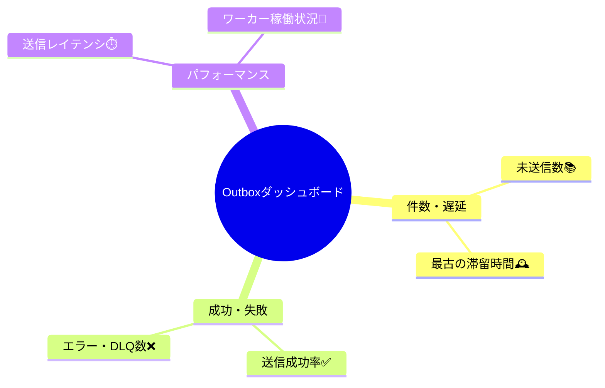

# 第21章：観測できるOutbox（ログ・メトリクス・追跡）🔍📊✨

## この章のゴール🎯

Outboxは「非同期であとから送る」ぶん、**失敗や遅延が表に出にくい**んだよね🥹
だからこの章では、困ったときに **原因へ最短でたどり着ける**ように、最初から観測を仕込むよ〜！🧯✨

---

## 21-1. Outboxで起きがちな“静かな事故”😱📦


次のどれか、経験したら観測の大切さが刺さるやつ👇

* Publisherが落ちてるのに誰も気づかず、**未送信が積み上がる**📚📈
* 送信は動いてるけど遅くて、**通知が数十分遅延**⏳💦
* リトライが暴走して、**同じ失敗を連打**🔁🔁🔁
* DLQに落ちまくってるのに、**アラートが無い**📮😢
* たまに二重送信が起きるけど、**追跡できない**🌀

これを防ぐのが、ログ📝・メトリクス📈・トレース🧵の三点セットだよ✨

---

## 21-2. 観測の“三種の神器”🧰✨


## ① ログ（Logs）📝

* 「何が起きた？」を文章＋構造（JSON）で残す📄
* **eventId / eventType / attempt / 失敗理由**が命🔑

## ② メトリクス（Metrics）📈

* 「どれくらい起きてる？」を数字で見る👀
* 例：未送信件数、最古の滞留時間、失敗率、リトライ回数…

## ③ トレース（Traces）🧵

* 「どこが遅い？どこで詰まる？」を処理の流れで見る🧭
* Outboxは **API → DB → Publisher → 送信先** とまたぐから特に効くよ〜

この考え方は OpenTelemetry の公式ドキュメントでも、まずトレース＆メトリクスから始める流れになってるよ。([OpenTelemetry][1])

---

## 21-3. “追跡できる”ためのID設計🔗🆔✨


Outbox観測でよく使うIDはこれ👇

* **eventId**：OutboxレコードのID（冪等キーにもなりがち）🆔
* **correlationId**：業務リクエスト単位の追跡ID（注文確定1回＝1つ）🧵
* **traceId / spanId**：分散トレースのID（ログとつなぐ）🔍

ポイントはこれ！👇
✅ **Outboxテーブルに correlationId を必ず持たせる**
（できれば traceparent も持たせると、非同期の“橋渡し”ができて強い🔥）

---

## 21-4. ログ設計📝✨（まずは“構造化ログ”が最優先！）

## 21-4-1. ログはJSONで出そう📄✨

“あとで検索・集計・追跡できる”形が大事だよ〜！
おすすめは **Pino** みたいなJSONロガー🧃（もちろんWinstonでもOK）
PinoはOpenTelemetry連携（trace_id / span_id の注入）もしやすい流れがあるよ。([dash0.com][2])

## 21-4-2. ログに必ず入れたい項目✅


最低限このへん入ってると、調査が爆速になるよ⚡

* correlationId 🧵
* eventId / eventType 🆔🏷️
* status（pending/processing/sent/failed…）🚦
* attempt（何回目？）🔁
* nextRetryAt（次いつ？）🕒
* errorCode / errorMessage（分類と要約）🧱
* durationMs（処理時間）⏱️
* （できれば）traceId / spanId 🔍

---

## 21-4-3. 例：AsyncLocalStorageでcorrelationIdを全ログに混ぜる🧵📝

```ts
// src/observability/logger.ts
import pino from "pino";
import { AsyncLocalStorage } from "node:async_hooks";
import { context, trace } from "@opentelemetry/api";

type RequestContext = { correlationId: string };

const als = new AsyncLocalStorage<RequestContext>();

export function runWithContext<T>(ctx: RequestContext, fn: () => T): T {
  return als.run(ctx, fn);
}
export function getContext(): RequestContext | undefined {
  return als.getStore();
}

export const logger = pino({
  level: process.env.LOG_LEVEL ?? "info",
  timestamp: pino.stdTimeFunctions.isoTime,
  base: null,
  mixin() {
    const rc = getContext();
    const span = trace.getSpan(context.active());
    const sc = span?.spanContext();
    return {
      correlationId: rc?.correlationId,
      traceId: sc?.traceId,
      spanId: sc?.spanId,
    };
  },
});
```

> これで、`logger.info()`したログ全部に correlationId（＋traceId/spanId）が乗るよ〜！🎉

---

## 21-4-4. Outboxで“出すべきログポイント”📍📝

実装ではこのタイミングでログを置くのが王道👇

1. **Outbox書き込み成功**（業務更新と同トランザクション後）✅
2. **Publisherがレコード確保**（processingへ遷移した瞬間）🧲
3. **送信成功**（sentへ）📤✅
4. **送信失敗**（failed / retry予定）📤❌
5. **DLQ落ち**（deadletterへ）📮😢

---

## 21-5. メトリクス設計📊✨（“詰まり”を数字で即発見！）

## 21-5-1. Outboxで“最重要”のメトリクスはこれ🥇


まずはこの4つが最強セット💪✨

1. **未送信件数（backlog）**📚
2. **最古の滞留時間（oldest age）**🕰️
3. **成功/失敗/リトライ回数**✅❌🔁
4. **送信処理のレイテンシ（publish latency）**⏱️

## 21-5-2. Prometheus向けメトリクスを最短で出す（prom-client）📈

Nodeのメトリクスは `prom-client` が定番で、`registry.metrics()` を返せばScrapeできるよ。([GitHub][3])

```ts
// src/observability/metrics.ts
import client from "prom-client";

export const registry = new client.Registry();
client.collectDefaultMetrics({ register: registry });

export const outboxBacklog = new client.Gauge({
  name: "outbox_backlog_total",
  help: "Outbox backlog by status",
  labelNames: ["status"] as const,
  registers: [registry],
});

export const outboxOldestAge = new client.Gauge({
  name: "outbox_oldest_age_seconds",
  help: "Age in seconds of the oldest pending outbox record",
  registers: [registry],
});

export const publishTotal = new client.Counter({
  name: "outbox_publish_total",
  help: "Outbox publish attempts",
  labelNames: ["result", "eventType"] as const,
  registers: [registry],
});

export const publishLatency = new client.Histogram({
  name: "outbox_publish_latency_seconds",
  help: "Publish latency in seconds",
  buckets: [0.01, 0.05, 0.1, 0.25, 0.5, 1, 2, 5, 10],
  labelNames: ["result", "eventType"] as const,
  registers: [registry],
});
```

/metrics を生やす（最小：NodeのhttpでOK）👇

```ts
// src/observability/metricsServer.ts
import http from "node:http";
import { registry } from "./metrics";
import { logger } from "./logger";

export function startMetricsServer(port = 9091) {
  const server = http.createServer(async (req, res) => {
    if (req.url === "/metrics") {
      res.statusCode = 200;
      res.setHeader("Content-Type", registry.contentType);
      res.end(await registry.metrics());
      return;
    }
    res.statusCode = 404;
    res.end("not found");
  });

  server.listen(port, () => logger.info({ port }, "metrics server started"));
}
```

---

## 21-5-3. メトリクス更新のコツ🧠✨

* backlog/oldestAgeは **一定間隔でDBを見て更新**（例：10秒ごと）⏱️
* publishTotal/publishLatencyは **送信のたびに更新**📤
* ラベル（eventTypeなど）を増やしすぎると集計が重くなるから注意⚠️（最初は eventType くらいで十分）

---

## 21-6. トレース導入🧵🔍（Publisherの“どこが遅い？”が見える！）

## 21-6-1. いまのOpenTelemetry（Node/TS）事情ざっくり🧠

* 公式Getting Startedでも **トレース＆メトリクス** をまず扱うよ。([OpenTelemetry][1])
* 公式には「Nodeのログ機能は開発中で、例は載せてないよ」って明記されてるの。なのでログはロガー（Pino等）＋トレース相関が現実的だよ。([OpenTelemetry][1])
* JS SDK 2.0以降はサポートNode/TS条件が上がってる（Node 18.19+ / TS 5.0.4+ など）。([OpenTelemetry][4])

---

## 21-6-2. 自動計測（auto-instrumentations-node）で“まず見える化”✨

`@opentelemetry/auto-instrumentations-node` は、よくあるライブラリ群をまとめて計測してくれるメタパッケージだよ。([GitHub][5])
（HTTPやDBクライアントなど、基礎が勝手に取れるの嬉しい🥳）

```ts
// src/observability/otel.ts
import { NodeSDK } from "@opentelemetry/sdk-node";
import { getNodeAutoInstrumentations } from "@opentelemetry/auto-instrumentations-node";
import { ConsoleSpanExporter } from "@opentelemetry/sdk-trace-base";
import { PeriodicExportingMetricReader, ConsoleMetricExporter } from "@opentelemetry/sdk-metrics";

const sdk = new NodeSDK({
  traceExporter: new ConsoleSpanExporter(),
  metricReader: new PeriodicExportingMetricReader({
    exporter: new ConsoleMetricExporter(),
  }),
  instrumentations: [getNodeAutoInstrumentations()],
});

export async function startOtel() {
  await sdk.start();
  process.on("SIGTERM", async () => {
    await sdk.shutdown();
    process.exit(0);
  });
}
```

📌重要：**otel初期化は“できるだけ最初”**にやろうね！（http/DBを読み込んだ後だと自動計測が効かないことがあるよ）💡

---

## 21-6-3. Publisherの“自前Span”を入れる（ここが超効く🔥）


```ts
// src/publisher/publishOne.ts
import { SpanStatusCode, trace } from "@opentelemetry/api";
import { logger } from "../observability/logger";
import { publishLatency, publishTotal } from "../observability/metrics";

const tracer = trace.getTracer("outbox-publisher");

type OutboxRow = {
  id: string;
  eventType: string;
  attempt: number;
  correlationId: string;
};

export async function publishOne(row: OutboxRow, send: () => Promise<void>) {
  return tracer.startActiveSpan(
    "outbox.publish",
    { attributes: { "outbox.id": row.id, "outbox.event_type": row.eventType, "outbox.attempt": row.attempt } },
    async (span) => {
      const t0 = Date.now();
      try {
        logger.info({ eventId: row.id, eventType: row.eventType, attempt: row.attempt }, "publish start");

        await send();

        publishTotal.inc({ result: "success", eventType: row.eventType });
        publishLatency.observe(
          { result: "success", eventType: row.eventType },
          (Date.now() - t0) / 1000
        );

        span.setStatus({ code: SpanStatusCode.OK });
        logger.info({ eventId: row.id, eventType: row.eventType }, "publish success");
      } catch (e) {
        publishTotal.inc({ result: "failed", eventType: row.eventType });
        publishLatency.observe(
          { result: "failed", eventType: row.eventType },
          (Date.now() - t0) / 1000
        );

        span.recordException(e as Error);
        span.setStatus({ code: SpanStatusCode.ERROR });

        logger.error({ eventId: row.id, eventType: row.eventType, err: e }, "publish failed");
        throw e;
      } finally {
        span.end();
      }
    }
  );
}
```

これでトレースを見ると、Publisher内の遅いポイントが一発でわかるよ〜！🔍✨

---

## 21-7. ログ×トレース相関（“この失敗、どの処理の途中？”が即わかる）🔗🧵

PinoやWinstonにトレースIDを混ぜる仕組み（ログ相関）が整ってきてて、trace_id/span_id をログに注入できるよ。([dash0.com][2])
だから現実的にはこうするのが強い👇

* **ログはPino（JSON）で出す**📝
* **トレースはOpenTelemetryで出す**🧵
* ログに **traceId/spanId** が入るようにする（さっきの logger.ts のmixin）🔗

すると…
📌ログで error を見つける → traceId でトレースに飛ぶ → 遅い/詰まりを見る
ができる！最高〜！🎉

---

## 21-8. ダッシュボード（画面）で見るべきもの📺📊✨

最初のダッシュボードは、これだけで“勝てる”よ💪

## パネルおすすめ構成🧩




* backlog（pending/processing/failed）📚🚦
* oldest age（秒）🕰️
* publish success / failed（分あたり）✅❌
* publish latency（p95/p99）⏱️
* retry回数（分あたり）🔁
* DLQ増加（分あたり）📮😢
* worker heartbeat（一定時間で処理が進んでる？）💓

---

## 21-9. アラート設計（“気づけるOutbox”へ）🚨✨


最初はこの3つをアラートにすると安心度が跳ねるよ🫶

1. **oldest age が閾値超え**（例：300秒以上が10分続く）⏳🚨
2. **failed が増え続ける**（失敗率が一定以上）📈❌
3. **成功が止まった**（publish成功が0の状態が続く）🛑

“backlogが増えてる”だけだと、夜間バッチでも増えるからね💡
**oldest age** がいちばん素直な危険信号になりやすいよ🕰️✨

---

## 21-10. 事故ったときの調査ルート（ランブック）🧯🗺️

## ケースA：backlogが増えてる📚📈

1. oldest age を見る（積み上がりが“古い”か確認）🕰️
2. Publisherログで `publish failed` の増加を見る📝
3. トレースで `outbox.publish` を探して、遅い場所を特定🧵🔍
4. 一時障害ならリトライ設定（バックオフ）を確認🔁⏳

## ケースB：DLQが増えてる📮😢

1. DLQの理由（errorCode）で分類🧱
2. payloadのバージョンや必須項目の欠損を疑う🧬
3. “直して再投入”の導線（運用手順）を確認🔧

---

## 21-11. “観測もテストする”🧪✅（地味だけど超効く）

Outboxは観測が命だから、ここも軽くテストしておくと強いよ✨

* 送信成功したら `publishTotal{result="success"}` が増える✅📈
* 送信失敗したら `publishTotal{result="failed"}` が増える❌📈
* ログに `eventId / correlationId / attempt` が入ってる📝🔎
* `publishLatency` が観測されてる⏱️

「観測が壊れてたせいで、障害時に何も分からない」って事故、ほんとあるあるだからね🥹

---

## 21-12. AI活用ミニ型🤖✨（観測の抜け漏れチェックに超便利！）

## ① ログ項目チェック✅

* 「Outboxのトラブルシュートで必要なログ項目、足りてないのある？」📝

## ② メトリクス設計レビュー📊

* 「このOutboxのメトリクスで、詰まり/遅延/失敗を早期検知できる？改善案ある？」📈

## ③ アラート閾値案🚨

* 「oldest age と失敗率のアラート閾値、最初の安全な設定案を出して」🕰️

---

## まとめ🎀

この章でやったことはこれ👇✨

* **ログ**：eventId/correlationId/attempt/理由を残す📝
* **メトリクス**：backlog・oldest age・失敗率・レイテンシを見る📊
* **トレース**：Publisherの遅いポイントをspanで掴む🧵
* **運用**：ダッシュボードとアラートで“気づけるOutbox”へ🚨

OpenTelemetryの公式Getting Startedでも「まずトレース＆メトリクス」＋「ログはまだ発展途上」という前提が書かれてるので、いまの現実解としてこの構成がいちばん戦えるよ💪✨([OpenTelemetry][1])

[1]: https://opentelemetry.io/docs/languages/js/getting-started/nodejs/ "Node.js | OpenTelemetry"
[2]: https://www.dash0.com/guides/nodejs-logging-libraries?utm_source=chatgpt.com "The Top 7 Node.js Logging Libraries Compared"
[3]: https://github.com/siimon/prom-client "GitHub - siimon/prom-client: Prometheus client for node.js"
[4]: https://opentelemetry.io/blog/2025/otel-js-sdk-2-0/ "Announcing the OpenTelemetry JavaScript SDK 2.0 | OpenTelemetry"
[5]: https://github.com/open-telemetry/opentelemetry-js?utm_source=chatgpt.com "open-telemetry/opentelemetry-js"
