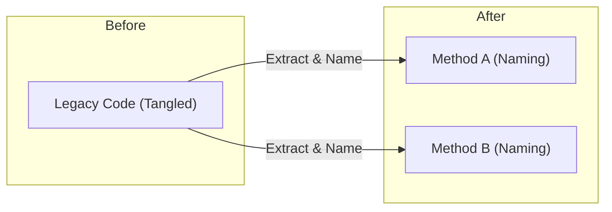

# 第01章：リファクタリングって何？（修正・改修との違い）🔧✨

## この章のゴール🎯

この章が終わる頃には、次の3つがスッと言えるようになります😊💡

* **リファクタリング＝「動作を変えずに、中身を良くする」**こと✨
* **修正（バグ直し）**・**改修（機能変更）**とは目的が違う🧭
* 「これはリファクタ？それとも改修？」を**自分で判断**できる✅

---

## まずは一言で！リファクタリングとは？📌✨

リファクタリング（refactoring）は、ざっくり言うと…

> **外から見た動作（結果）を変えずに、コードの中身を整えること**🧹✨

Martin Fowler の定義でも「観測できる振る舞いを変えずに、内部構造を良くする」とされています。([martinfowler.com][1])

### 「動作を変えない」ってどこまで？👀

ここでいう「動作」は、たとえばこんなものです👇

* 返ってくる値（出力）🔢
* 画面に表示される内容🖥️
* ファイルに保存される内容📁
* DBに書かれるデータ💾
* 例外が起きるかどうか💥（起きるなら種類やメッセージも）

つまり、**利用者（ユーザー・他のコード）が見て気づくもの**は基本そのままにします🙂✨

---

## 「修正」「改修」「リファクタ」どう違うの？🧭✨


同じ“コードを触る”でも、目的が違います🙌
混ざると事故りやすいので、最初に整理しちゃいましょう💡

| 種類                | 目的               |    “動作”は変わる？ | 例            |
| ----------------- | ---------------- | -----------: | ------------ |
| **修正（バグ修正）** 🐛🔧 | 間違いを直す           | ✅ 変わる（正しくなる） | 計算ミスを直す      |
| **改修（機能変更）** 🧩✨  | 仕様を変える / 機能追加    | ✅ 変わる（新しくなる） | 新ルール対応、UI追加  |
| **リファクタリング** 🧹✨  | 中身を良くして、変更しやすくする |       ❌ 変えない | 名前整理、分割、重複削除 |

### よくある混ざり方（注意！）⚠️

* 「ついでに読みやすく…」のつもりが、**いつの間にか仕様も変えてた**😵‍💫
* 「バグ修正しながら、ついでに構造も変更」→ **原因が追いにくい**💦

コツはシンプルで、**“動作を変える変更”と“整える変更”を分ける**ことです✅✨
（安全な進め方は第2章でガッツリやります🛡️🔁）

---

## なぜリファクタリングするの？（放置すると何が困る？）🏚️➡️🏡✨


### コードが読みにくいと…😵

* 変更が怖くて触れない😨
* 直したはずなのに別の場所が壊れる💥
* 「これ何してるの？」の調査に時間が溶ける⌛💦
* 同じような処理が増えて、修正漏れが起きる🌀

### 技術的負債（Technical Debt）って？💳🏗️

“とりあえず動く”を積み上げると、あとで利息のようにコストが増える…という考え方です💡
リファクタリングは、その利息を減らして、**未来の自分を助ける行動**になります🥹✨

---

## 超ミニ例：「動作は同じ、でも読みやすい」👀✨


同じ結果でも、読みやすさが全然違う例を見てみます🙂🌸
（ここでは“考え方”が目的なので、難しい構文は使いません）

### Before：動くけど、読むのがしんどい😵‍💫


```csharp
public static string GetFeeLabel(int age, bool member)
{
    if (age < 0) return "error";
    if (age < 6) return "free";
    if (age >= 6 && age <= 12)
    {
        if (member) return "child (member)";
        return "child";
    }
    if (member) return "adult (member)";
    return "adult";
}
```

### After：動作は同じ、でも意図が見える😊✨

```csharp
public static string GetFeeLabel(int age, bool member)
{
    if (age < 0) return "error";
    if (IsFree(age)) return "free";
    if (IsChild(age)) return member ? "child (member)" : "child";
    return member ? "adult (member)" : "adult";
}

private static bool IsFree(int age) => age < 6;
private static bool IsChild(int age) => age is >= 6 and <= 12;
```

ポイントはこれ👇✨

* 条件の意味を **名前（IsFree / IsChild）にして外に出した**🏷️
* 長い条件を見なくても読める👀
* 返す文字列（結果）は変わってない✅

これがリファクタリングの基本の空気感です🧹✨



---

## リファクタリングの“いい匂い”チェック👃✨（判断のコツ）


「これはリファクタ？」って迷ったら、ここをチェックします✅

### ✅ リファクタリングっぽい

* 名前を変えた（Rename）🏷️
* メソッドを分割した（Extract Method）✂️
* 重複をまとめた（重複排除）🧩
* ネストを減らした（ガード節など）🚪
* マジックナンバーを定数化した🔢

### ❌ 改修・修正っぽい（動作が変わりやすい）

* 条件の意味を変えた（境界値を変えた）⚠️
* 返す値の種類・タイミングを変えた🔁
* 例外の出方が変わった💥
* DB保存の内容が変わった💾

※「速くしたい（最適化）」も、体感が変わるなら“動作が変わる”扱いになりやすいです🏎️💨
最初は **“動作は完全に据え置き”** を強めに意識すると安全です🛡️✨

---

## Diff（差分）を読む練習📌👀✨（超重要！）


リファクタリングは「動作を変えない」が命なので、**差分（Diff）を読む力**がめちゃ大事です💪✨

### Diffで見るべきポイント✅

* **条件式や計算式が変わってない？**（`<` が `<=` になってない？など）🔍
* **returnする値が変わってない？**🔁
* **例外の種類やメッセージが変わってない？**💥
* **副作用（保存・送信・ログ）が増減してない？**📁📨🧾

### “良いリファクタ”のDiffの特徴✨

* 変更が小さい（読みやすい）🧩
* 名前や位置が変わってるだけの行が多い🏷️
* ロジック（条件や計算）がそのまま👀

Visual Studio の差分表示（Git Changes / Diff）で、**「何が変わったか」を目で確認**する習慣をここで付けます📌✨
（Visual Studio 2026 のリリースノートも継続的に更新されています🆕([Microsoft Learn][2])）

---

## AI（Copilot / Codex系）を使うときの基本ルール🤖🛡️✨


AIはリファクタと相性がいいです💡
でも、**採用の判断は人間がやる**のが超大事🙂✨

### いい頼み方（例）💬✨

* 「このメソッドを**動作を変えずに**読みやすくしたい。まずは Extract Method の候補を3つ」🤖
* 「変数名を意図が伝わる名前にしたい。候補を5個」🏷️🤖
* 「この変更が動作を変えていないか、Diff観点で注意点を挙げて」👀🤖

### 絶対やること✅

* AIの提案は **Diffで確認**📌
* 実行して確認（次章以降でテストも導入）✅
* 1回の変更は **小さく**（「1コミット分」くらい）🧩

---

## ミニ演習📝✨（読むだけでOK → できたら手を動かす）

### 演習1：これはリファクタ？改修？判定ゲーム🎮✨

次の変更はどれ？（答えは下にあるよ👇）

1. メソッド名 `Calc` を `CalculateTotalPrice` に変えた🏷️
2. `if (age < 12)` を `if (age <= 12)` に変えた🔁
3. 100 という数字を `const int MaxItems = 100;` にした🔢
4. 新しい割引ルール（会員は常に5%OFF）を追加した💸✨

**答え✅**
1 = リファクタ🧹✨ / 2 = 改修 or バグ修正（動作変化しやすい）⚠️ / 3 = リファクタ🧹✨ / 4 = 改修🧩✨

---

### 演習2：Before/Afterで「動作が変わってない」を探す👀🔍

次の2つのコード、出力は同じ？違う？を考えてみよう🧠✨

A：

```csharp
public static bool IsAdult(int age)
{
    return age >= 20;
}
```

B：

```csharp
public static bool IsAdult(int age)
{
    if (age > 19) return true;
    return false;
}
```

✅ 結果：**同じ**（`age >= 20` と `age > 19` は同じ判定）
ただし、Aの方がスッキリで読みやすい✨ → **こういうのがリファクタの入り口**です🧹🌸

---

## まとめ💎✨（この章で覚える1フレーズ）

リファクタリングは…

* **動作を変えずに、中身を良くする**🧹✨
* 修正（バグ）・改修（仕様変更）と **目的が違う**🧭
* **Diffで確認**して「本当に動作が変わってない？」を守る📌👀

この定義は、C# 14 / .NET 10 の“今どき”環境でもまったく同じ価値で効きます🌟([Microsoft Learn][3])
（.NET は年1回のリリース方針とサポート形態が整理されていて、LTS/STSの考え方も押さえておくと安心です📅✨([dotnet.microsoft.com][4])）

[1]: https://martinfowler.com/bliki/DefinitionOfRefactoring.html?utm_source=chatgpt.com "Definition Of Refactoring"
[2]: https://learn.microsoft.com/en-us/visualstudio/releases/2026/release-notes?utm_source=chatgpt.com "Visual Studio 2026 Release Notes"
[3]: https://learn.microsoft.com/en-us/dotnet/csharp/whats-new/csharp-14?utm_source=chatgpt.com "What's new in C# 14"
[4]: https://dotnet.microsoft.com/en-us/platform/support/policy?utm_source=chatgpt.com "The official .NET support policy"
