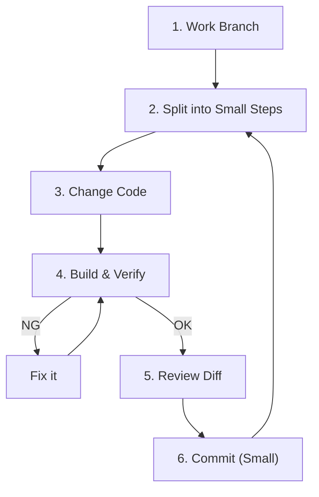

# 第02章：安全に進める“4つの基本”（小さく・頻繁に・確認・戻せる）🛡️🔁

リファクタリングは「コードをきれいにする作業」…なんだけど、やり方を間違えると **バグを混ぜたり、差分が大きすぎて戻れなくなったり** します😱💦
この章では、リファクタ初心者さんでも事故らないための **“安全の型”** を最初に体へ入れます💪✨

---

## この章でできるようになること🎯✨

* どんなリファクタでも使える「安全な進め方」を覚える🧠✅
* 変更を **小さく割る**（=怖さが激減）✂️🙂
* **動く状態をキープ**しながら進める🔁🏃‍♀️
* 毎回 **確認**して「壊してない」を積み上げる👀✅
* Gitで **いつでも戻せる** 状態を作る🌿🧷

---

## 安全の“4つの基本”🧩🛡️

この4つはワンセットです✨
どれか1つ欠けると、急に事故りやすくなります⚠️

1. **小さく**（Small steps）✂️
2. **頻繁に**（Frequently / Always working）🔁
3. **確認**（Verify）✅
4. **戻せる**（Reversible）↩️

---

## 1) 小さく（Small steps）✂️🙂


## 何をするの？🧠

**1回の変更を“最小の一手”まで分割**します。
目安：差分が小さくて、説明が一言で言えること💬✨
例）

* 「変数名を1つだけ直す」
* 「この if のネストを1段だけ減らす」
* 「同じ式を中間変数に置くだけ」

## ありがち事故😵

* 一気に直しすぎて、どこで壊れたかわからない
* 差分が大きくてレビューできない
* “直した気”になって仕様まで変えてしまう

## コツ🎀

* **“動作を変えない”を守るために、1手を小さく**
* 「やりたいこと」を **分解してToDo化** してから触る📝
* 迷ったら、さらに半分にする✂️✂️

---

## 2) 頻繁に（Frequently / Always working）🔁🏃‍♀️

## 何をするの？🧠

**常に“動く状態”を保つ**のがルールです✅

* ビルドが通る
* 実行できる
* （できれば）テストも通る

> ここでのポイントは「完成してから確認」じゃなくて、**途中の小さい段階でも確認**すること🙂✨
> （テストは後の章で強化するよ🧪）

## ありがち事故😵

* 途中でビルドが壊れて、そのまま修復地獄
* “仮の状態”が増えて混乱
* どこまで戻ればいいか不明

## コツ🎀

* 変更したらすぐ **Ctrl+Shift+B（ビルド）** 🧱
* 動作確認も“1分で終わる最小”にする（後で自動化していく）⏱️
* 「今日はここまで」が **動く状態で終われる** 👑

---

## 3) 確認（Verify）✅🔍

## 何を確認するの？🧠

リファクタは **“動作を変えない”** が大前提なので、毎回これを確認します✅

* ✅ **コンパイルOK**（ビルド通る）
* ✅ **実行OK**（最低限の動作）
* ✅ **差分レビュー**（意図通りの変更だけか）
* ✅ （あれば）**テストOK** 🧪

### “差分レビュー”は超大事👀📌

Gitの差分を見ると、

* 余計な変更（空白/整形/別の修正）が混ざってないか
* 仕様変更が紛れてないか
  がすぐ見つかります✨

---

## 4) 戻せる（Reversible）↩️🌿

## 何をするの？🧠

**いつでも戻れる状態**を作るのが目的です🧷

* 変更は **コミット** に積む
* 1コミットは小さく（上の「小さく」とセット）
* ブランチで作業する（安全な遊び場）🌱

.NET まわりは年次で更新され、.NET 10 は LTS として提供されます（長期サポート）📅✨  ([Microsoft][1])
だからこそ、コード改善は“継続的に積む”のが強いです💪（そのためにも Git で戻せるのが命🌿）

---

## 安全に進める「1サイクル」テンプレ🧁✨

作業するときは、毎回これで回します🔁💕

## ✅ サイクル手順（コピペOK）

1. **作業ブランチを作る** 🌿
2. **現状の動作を軽く確認**（“今こう動く”を把握）👀
3. **やることを1手に分割**（いまやるのは1つだけ）✂️
4. 変更する
5. **ビルド**（通らなかったら直す）🧱
6. **動作確認**（最小でOK）✅
7. **差分を見る**（余計な変更がないか）👀
8. **コミット**（メッセージは一言で）📝
9. 次の1手へ🔁



---

## Visual Studioでの実践ポイント💻✨

## 差分（Diff）の見方👀📌

* Git Changes でファイルを選んで **変更点を確認**
* 「意図した行だけ変わってる？」をチェック
* もし整形が混ざりすぎるなら、整形は別コミットにする🧼✨

## こまめなコミットの作り方🌿📝

* 「Rename だけ」「Extract だけ」みたいに **目的が1つのコミット**にする
* コミットメッセージ例：

  * `Rename: total to totalPrice`
  * `Refactor: extract validation`
  * `Cleanup: remove unused using`

---

## AI（Copilot / Codex系）を安全に使うコツ🤖🛡️

AIは便利だけど、**提案が大きくなりがち**です😵‍💫
だからルールを先に決めておくと安全です✨

GitHub Copilot Chat は IDE 内で、コード説明・修正提案・テスト雛形などを依頼できます🧠🤖  ([GitHub Docs][2])

## ✅ AI依頼のテンプレ（超おすすめ）📌

**ポイント：1コミット分に制限すること！**

* 「動作は変えずに」
* 「変更は◯行以内」
* 「手順を2〜3ステップで」
* 「差分が小さくなるように」

例（そのまま貼ってOK）👇

```text
このメソッドを読みやすくリファクタしたいです。
✅動作は絶対に変えないでください
✅変更は“1コミット分”に収まる小ささにしてください（できれば20行以内）
✅提案は「ステップ1/2/3」みたいに分割して出してください
✅最後に、確認方法（ビルド/実行で見るポイント）も書いてください
```

## ⚠️ AIの提案は“採用前チェック”が必須✅

* 差分が大きい → **却下して「半分にして」** と言う✂️
* 仕様っぽい変更が混ざる → **「仕様変更は禁止」** をもう一度
* コンパイル通らない → **その変更は採用しない**（まず通る状態へ）🧱

---

## ミニ演習📝：「1回の変更」をさらに半分に分割しよう✂️✨

## お題：一気にやると危ない例😵

次のコード、読みづらいけど動いてる…とします🙂
（ここでは“リファクタの手順分割”が目的！）

```csharp
public static decimal CalcFinalPrice(decimal price, bool isMember, int quantity)
{
    if (price <= 0) return 0;

    decimal total = price * quantity;

    if (isMember)
    {
        if (total >= 5000)
        {
            total = total * 0.9m;
        }
        else
        {
            total = total * 0.95m;
        }
    }

    if (quantity >= 10)
    {
        total = total - 300;
    }

    return total;
}
```

## ❌ ありがちな“まとめて改修”例（やらない）😱

* 変数名も変える
* ロジックも整理する
* 定数化もする
* メソッド抽出もする
  → 差分がでかすぎて、壊れても原因不明💥

---

## ✅ 目標：同じ作業を「小さく割る」🧁✨

### ステップ0：現状の出力を控える📸

“今の挙動”をメモするよ📝（テストがまだならメモでもOK！）

例：

* price=1000, isMember=false, quantity=1 → ?
* price=1000, isMember=true, quantity=1 → ?
* price=1000, isMember=true, quantity=10 → ?

（ここは実際にデバッグ実行して値を見るのがおすすめ🔍）

---

### ステップ1（コミット1）：変数名を1つだけ直す🏷️✨

* `total` → `totalPrice` だけ
* ロジックは触らない
* ビルド✅ 実行✅ 差分👀 コミット🌿

---

### ステップ2（コミット2）：式を中間変数にする（意味付け）🧠✨

* `price * quantity` を `subtotal` にする
* ロジックは同じ
* ビルド✅ 実行✅ 差分👀 コミット🌿

---

### ステップ3（コミット3）：if の入れ子を“1段だけ”減らす🚪🌟

* 例：`isMember` の判定を先にして、ネストを浅くする
* まだ抽出はしない（やるなら次コミット）
* ビルド✅ 実行✅ 差分👀 コミット🌿

---

## ✅ チェックポイント（提出物のイメージ）📌

* コミットが **3つ以上** に分かれている
* それぞれのコミットが **一言で説明できる**
* 各コミットで **ビルドと動作確認** をしている

---

## まとめ🌈✨

* リファクタは **技術** だけじゃなくて、まず **作法** が大事🧠🛡️
* **小さく** ✂️ → **頻繁に** 🔁 → **確認** ✅ → **戻せる** ↩️
* AIは強いけど、**“1コミット分に制限”** すると一気に安全になる🤖📌

---

## 次の章につながる話（ちら見せ）👀✨

この章の型ができたら、次は環境（プロジェクト作成・デバッグ・Git操作）を迷わない状態に整えます🧰💻
C# 14 は .NET 10 SDK / Visual Studio 2026 で試せる新機能が整理されているので、最新版の言語環境でもこの“安全の型”はそのまま通用します😊✨  ([Microsoft Learn][3])

[1]: https://dotnet.microsoft.com/en-us/platform/support/policy?utm_source=chatgpt.com "The official .NET support policy"
[2]: https://docs.github.com/ja/copilot/how-tos/chat-with-copilot/chat-in-ide?utm_source=chatgpt.com "IDE で GitHub Copilot に質問する"
[3]: https://learn.microsoft.com/en-us/dotnet/csharp/whats-new/csharp-14?utm_source=chatgpt.com "What's new in C# 14"
