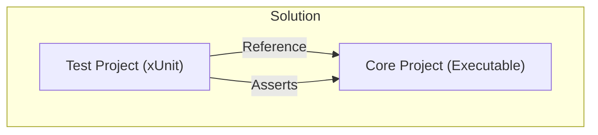

# 第03章：開発環境セットアップ（VS中心・VS Code補助）🧰💻

## この章のゴール🎯✨

この章が終わると、次の状態になります👇💕

* C#（.NET 10 / C# 14）で **新規プロジェクトを作って実行できる** ✅
* **デバッグ（ブレークポイント）できる** 🐞🔍
* **テストを作って、IDEから実行できる** 🧪✅
* **Gitで「小さくコミット」できる** 🌿📌
* **Copilot などAI拡張を IDE 内で使える** 🤖✨
* “リファクタリングしやすい下地”がそろう 🧼🏗️

※ .NET 10 は LTS（3年サポート）で、2028年11月10日までサポートされます📅✨ ([Microsoft for Developers][1])

---

## 1) Visual Studio 2026 を入れる🧩💻


### 1-1. インストーラーを入れる⬇️✨

1. Visual Studio の公式ダウンロードページから **Visual Studio 2026** を選んでインストーラーを入れます🪟💡 ([Visual Studio][2])
2. インストーラーを起動したら、次の「ワークロード」を選びます✅

### 1-2. まず入れるワークロード（迷ったらコレ）✅🌸

リファクタ教材で困りにくい “鉄板セット” はこれ👇

* **.NET Desktop Development**（コンソール、WPF/WinForms など）🖥️
* **ASP.NET and Web Development**（Webも触るなら）🌐

あとから追加・削除もできます（Visual Studio Installer で変更OK）🔁 ([Microsoft Learn][3])

### 1-3. すでにVSがある人向け：設定の引き継ぎ🧳✨

Visual Studio 2026 以降は、インストール時に **以前のVS環境から構成を移行**したり、`.vsconfig` を取り込んで “チームで同じ環境” に揃えやすいです🫶📦 ([Microsoft Learn][4])

---

## 2) .NET SDK（.NET 10）が入ってるか確認する🔎⚙️

### 2-1. まずは `dotnet --info` で確認🧪

PowerShell を開いて👇

```powershell
dotnet --info
```

* `SDK` に **10.0.xxx** が見えたらOK🎉
* もし無ければ、.NET 10 SDK を入れます（次へ）⬇️

### 2-2. SDK を入れる（必要なときだけ）⬇️📦

.NET 10 のダウンロードページから **SDK** を入れられます。Visual Studio 2026 には .NET 10 が同梱される構成もあります（例：VS 2026 v18.x）。 ([Microsoft][5])

---

## 3) “リファクタ練習用” ソリューションを作る📁🗺️

### 3-1. 形はこれが楽ちん✨

ソリューション構成は、最初はシンプルが正義👑💕

* `src/` ……アプリ本体
* `tests/` ……テスト
* ルートに `.editorconfig`（あとで入れる）

### 3-2. Visual Studio で作る（おすすめ）💻💖

1. **新しいプロジェクトの作成** → `Console App` を選ぶ🧁
2. プロジェクト名例：`RefactoringPlayground`
3. 作成したら **まず実行** ▶️（F5 または Ctrl+F5）

> 「Hello, World!」が出たら勝ち🎉✨

---

## 4) デバッグできる状態にする🐞🔍✨

### 4-1. ブレークポイントを置く🎯

`Program.cs` の行番号の左をクリック → 赤い丸🔴が付けばOK！

### 4-2. F5でデバッグ実行▶️

* 変数にマウスを乗せると中身が見える👀✨
* ステップ実行（F10/F11）で “コードを読む力” が爆上がりします📈💕

---

## 5) テストを回せる状態にする🧪✅

### 5-1. テストプロジェクトを追加📦

Visual Studio で👇

* ソリューション右クリック → **追加** → **新しいプロジェクト**
* `xUnit Test Project`（または MSTest/NUnit）を作成🧁

### 5-2. “本体プロジェクト” を参照する🔗

テスト側プロジェクト右クリック → **参照の追加** → 本体プロジェクトにチェック✅



---
### 5-3. 例：超ミニテストを書いて動かす🐣

本体に、まずは小さな関数を作ります👇

```csharp
public static class PriceCalculator
{
    public static int AddTax(int price, int ratePercent)
        => price + (price * ratePercent / 100);
}
```

テスト側（xUnit）👇

```csharp
using Xunit;

public class PriceCalculatorTests
{
    [Fact]
    public void AddTax_10Percent()
    {
        var result = PriceCalculator.AddTax(1000, 10);
        Assert.Equal(1100, result);
    }
}
```

### 5-4. Test Explorer で実行🏃‍♀️💨

Visual Studio の **Test Explorer** から、テストを実行できます✅
フィルタしたり、デバッグ実行もできます🐞✨ ([Microsoft Learn][6])

---

## 6) コード整形（フォーマット）を “自動で揃う” ようにする🧼📏✨

リファクタは「差分が読みやすい」が命です💘
そこで **EditorConfig + Code Cleanup** を入れます！

### 6-1. `.editorconfig` を置く📄✨

ソリューション直下に `.editorconfig` を追加すると、スタイルをコードベースに持ち運べます🧳
Visual Studio は EditorConfig をサポートしていて、チームでも揃えやすいです🤝💖 ([Microsoft Learn][7])

最小サンプル（まずはこれでOK）👇

```ini
root = true

[*.cs]
charset = utf-8
end_of_line = crlf
indent_style = space
indent_size = 4
insert_final_newline = true
dotnet_sort_system_directives_first = true
```

> ここは“正解が1つ”じゃないので、最初は **小さく** 入れて、章が進むにつれて強化していきます🌱✨

### 6-2. Code Cleanup（お掃除ボタン）を使えるようにする🧹✨

Visual Studio には、整形や簡単な改善をまとめて適用する **Code Cleanup** があります🪄
EditorConfig の設定がある場合、それが優先されます✅ ([Microsoft Learn][8])

おすすめ運用👇

* リファクタの前後で **Code Cleanup** を実行🧼
* “意味のある差分”が見やすくなる👀✨

---

## 7) Git を使える状態にする🌿📌

リファクタは「戻せる」が最強の安心材料🛡️✨
Visual Studio は GitHub アカウント連携もできます🐙💕

### 7-1. GitHubアカウントを Visual Studio に追加🔑

Visual Studio に GitHub アカウントを追加しておくと、Copilot や GitHub リポジトリ操作がスムーズになります🤖🌿 ([Microsoft Learn][9])

---

## 8) AI拡張（Copilot）を IDE 内で使えるようにする🤖💬✨

### 8-1. Visual Studio 側：Copilot の状態を確認👀

Visual Studio には Copilot の状態（Active/Inactive など）を示すアイコンがあり、そこからサインインや設定に行けます🧭✨ ([Microsoft Learn][10])

### 8-2. Copilot Chat を開く💬

Visual Studio のメニューから👇

* **View → GitHub Copilot Chat**

チャットで「このファイル何してる？」みたいな質問もできます📚✨ ([GitHub Docs][11])

### 8-3. AIの使い方（リファクタ向け・安全運転）🛡️🤖

Copilot にお願いするときは、**1コミットに収まる小ささ**がコツです🎀

お願い例（安全）👇

* 「このメソッドを “段落ごと” に Extract Method して。動作は変えないで」✂️
* 「この条件式を Explain Condition で読みやすく。テストは通る前提で」🧩
* 「差分だけ提示して。理由も一言で」📌

やっちゃダメ寄り（事故りやすい）😵‍💫

* 「全体を綺麗に設計し直して」💥（変更が大きくなりがち）

---

## 9) VS Code は “補助” として使えるようにする🧰🧡

Visual Studio がメインでも、VS Code は便利な場面が多いです✨

* ちょい編集（README、設定ファイル）📝
* さっと検索🔎
* 軽い確認👀

VS Code で .NET 開発するなら **C# Dev Kit** が推奨されています📦✨ ([code.visualstudio.com][12])
Copilot も VS Code のステータスバーからセットアップできます🤖✨ ([code.visualstudio.com][13])

---

## 10) ミニ演習📝：新規ソリューション作成 → 実行 → デバッグ → テスト✅

### ステップ🎀

1. Console アプリを作る（`RefactoringPlayground`）🧁
2. F5 で実行して動くのを確認▶️
3. ブレークポイントを置いて、変数の中身を見る🔴👀
4. xUnit テストプロジェクトを追加🧪
5. テストを1本書いて、Test Explorer から実行✅ ([Microsoft Learn][6])
6. `.editorconfig` を追加して、整形が揃う状態にする🧼 ([Microsoft Learn][7])
7. Git に最初のコミットを作る🌿📌

### できていれば合格🎉

* “動くもの” がある
* “止めて観察できる”
* “テストで守れる”
* “戻せる”
* “AIに聞ける”

---

## 11) つまずきやすいポイント集🧯💡

### Q1. `dotnet` が見つからない😢

* .NET SDK が入ってない / PATH が通ってない可能性
* Visual Studio Installer の **Individual components** で .NET を追加できる場合もあります🧩 ([Microsoft Learn][14])

### Q2. テストが Test Explorer に出ない🫥

* テストプロジェクトのテンプレや参照がずれてることが多いです
* Test Explorer は “対応するテストプロジェクト” を前提に動きます🧪 ([Microsoft Learn][6])

### Q3. Copilot が Inactive のまま😵‍💫

* GitHub でサインインできてないことが多いです
* Copilot の状態アイコンからサインイン/設定へ進めます🔑 ([Microsoft Learn][10])

---

## 12) この章のチェックリスト✅📌

* [ ] Visual Studio 2026 をインストールした💻 ([Visual Studio][2])
* [ ] `.NET Desktop Development` を入れた🖥️ ([Microsoft Learn][14])
* [ ] `dotnet --info` で 10.0.x が確認できた⚙️ ([Microsoft][5])
* [ ] 新規プロジェクトが実行できた▶️
* [ ] ブレークポイントで止められた🔴
* [ ] テストを1本作って Test Explorer から通した🧪 ([Microsoft Learn][6])
* [ ] `.editorconfig` を置いた🧼 ([Microsoft Learn][7])
* [ ] GitHub サインイン（VS）できた🔑 ([Microsoft Learn][15])
* [ ] Copilot Chat を開けた🤖💬 ([GitHub Docs][11])

---

次章では、この環境を使って「ソリューションとプロジェクトの地図」を読み、怖さを消していきます📁🗺️💕

[1]: https://devblogs.microsoft.com/dotnet/announcing-dotnet-10/ "Announcing .NET 10 - .NET Blog"
[2]: https://visualstudio.microsoft.com/downloads/?utm_source=chatgpt.com "Visual Studio & VS Code Downloads for Windows, Mac, Linux"
[3]: https://learn.microsoft.com/en-us/visualstudio/install/modify-visual-studio?view=visualstudio&utm_source=chatgpt.com "Modify Visual Studio Workloads and Components"
[4]: https://learn.microsoft.com/ja-jp/visualstudio/install/install-visual-studio?view=visualstudio&utm_source=chatgpt.com "Visual Studio をインストールし、お好みの機能を選択する"
[5]: https://dotnet.microsoft.com/en-US/download/dotnet/10.0 "Download .NET 10.0 (Linux, macOS, and Windows) | .NET"
[6]: https://learn.microsoft.com/en-us/visualstudio/test/run-unit-tests-with-test-explorer?view=visualstudio "Run Unit Tests with Test Explorer - Visual Studio (Windows) | Microsoft Learn"
[7]: https://learn.microsoft.com/en-us/visualstudio/ide/create-portable-custom-editor-options?view=visualstudio "Define Consistent Coding Styles with EditorConfig - Visual Studio (Windows) | Microsoft Learn"
[8]: https://learn.microsoft.com/en-us/visualstudio/ide/code-styles-and-code-cleanup?view=visualstudio "Code Style Options and Code Cleanup - Visual Studio (Windows) | Microsoft Learn"
[9]: https://learn.microsoft.com/en-us/visualstudio/ide/work-with-github-accounts?view=visualstudio "Add GitHub accounts to your keychain - Visual Studio (Windows) | Microsoft Learn"
[10]: https://learn.microsoft.com/en-us/visualstudio/ide/visual-studio-github-copilot-install-and-states?view=visualstudio&utm_source=chatgpt.com "Manage GitHub Copilot installation and state"
[11]: https://docs.github.com/copilot/get-started/quickstart "Quickstart for GitHub Copilot - GitHub Docs"
[12]: https://code.visualstudio.com/docs/languages/dotnet "Using .NET in Visual Studio Code"
[13]: https://code.visualstudio.com/docs/copilot/setup-simplified?utm_source=chatgpt.com "Set up Visual Studio Code with Copilot"
[14]: https://learn.microsoft.com/en-us/dotnet/core/install/windows "Install .NET on Windows - .NET | Microsoft Learn"
[15]: https://learn.microsoft.com/en-us/visualstudio/ide/signing-in-to-visual-studio?view=visualstudio "Sign in or switch Visual Studio accounts | Microsoft Learn"
