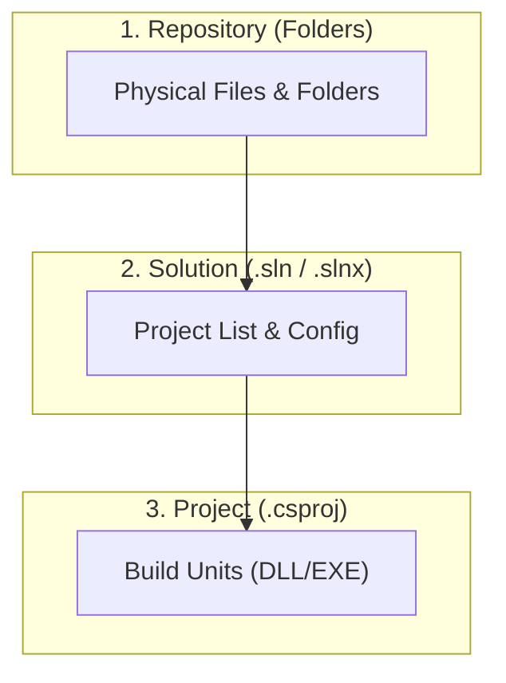
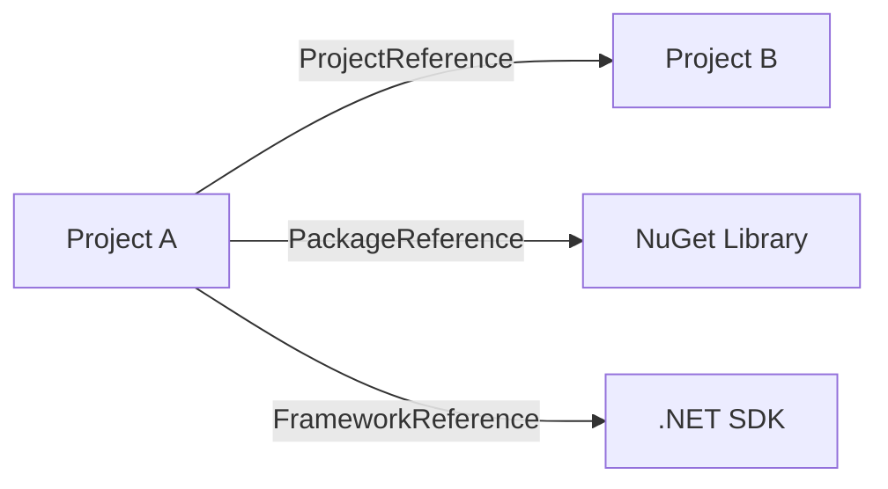

# 第04章：ソリューションとプロジェクトの“地図”を読む📁🗺️

ソリューションって、最初は「フォルダいっぱいあって怖い…😵‍💫」ってなりがち。
でも大丈夫っ✨ ここは **“地図の読み方”** を覚える章だよ〜😊🗺️

---

## この章のゴール🎯✨

この章を終えると、次のことができるようになるよ💪🌸

* ソリューションの中に **何のプロジェクトがあるか** を説明できる🗣️✨
* **どのプロジェクトがどれに依存してるか** をざっくり図にできる✍️🧩
* 「NuGetどこ？参照どこ？設定どこ？」で迷子にならない🧭🙂
* AI（Copilot等）に **“地図を説明させる質問”** ができる🤖🗺️

---

## まずは“地図の3階建て”を覚えよう🏢🗺️

ソリューションまわりは、だいたい **3階建て** でできてるよ✨

1. **リポジトリ（フォルダの世界）** 📁

   * `src/` や `tests/` などの物理的な配置（実際のフォルダ）
2. **ソリューション（全体の目次）** 🗂️

   * 「この作業台に、どのプロジェクトを並べる？」っていう一覧
   * `.sln` / `.slnx` / `.slnf` がここ
3. **プロジェクト（ビルドの単位）** 🧱

   * `.csproj` が中心
   * 参照（ProjectReference / PackageReference など）やターゲットもここ

この3つを分けて考えるだけで、混乱が激減するよ〜😌🌿



---

## 4-1. ソリューションって何？🗂️✨


### ソリューション＝「プロジェクト一覧＋構成」📋

ソリューションは **“作業台”** みたいなものだよ🧰
「このアプリを作るために必要なプロジェクトを、まとめて扱う」ための単位✨

### 代表的なソリューションファイル3種📄

#### ✅ `.sln`（昔からある定番）

* テキスト形式で、ツール互換性が高い

#### ✅ `.slnx`（新しい、読みやすい形式✨）

* XMLベースで、人間にも読みやすく
* 差分（Gitのdiff）も比較的きれいになりやすい💡
* Visual Studio側でも「新しいソリューション形式」として紹介されてるよ🧾✨ ([Microsoft for Developers][1])
* `dotnet sln` コマンド側でも `.slnx` への移行が案内されてるよ🧰 ([Microsoft Learn][2])

#### ✅ `.slnf`（Solution Filter：巨大ソリューションの“抜粋版”）

* 「全部は重いから、今日はこのへんだけ開きたい🥺」ができる
* 大きい現場ほど役立つやつ✨ ([Microsoft Learn][3])

---

## 4-2. プロジェクトって何？🧱✨（`.csproj` が本体！）

プロジェクトは **ビルドと配布の単位**だよ📦
ざっくり言うと「1つの成果物（DLL/EXE）を作るための設定」って感じ✨

`.csproj` の中には、だいたいこんな情報が入ってるよ👇

* どの .NET をターゲットにする？（例：`net10.0`）
* Nullable（null安全）どうする？
* NuGet パッケージ何を使う？
* 他のプロジェクト参照してる？
* ビルド設定（最適化、警告、アナライザー）など

ちなみに .NET 10 は 2025/11/11 にリリースされた LTS だよ📅✨（サポート表に明記あり） ([Microsoft][4])
C# 14 も .NET 10 の “新機能” として整理されているよ🌟 ([Microsoft Learn][5])

---

## 4-3. “参照”の種類を3つに分けよう🧩🔗

「参照」って言葉が一番ややこしい！😵‍💫
でも、**3種類に分ける**とスッキリするよ✨

### ① ProjectReference（プロジェクト参照）🏗️

* 例：`App` が `Core` を参照する、みたいな
* 同じソリューション内のプロジェクト同士でよく使う

### ② PackageReference（NuGet参照）📦

* 例：`Serilog`、`Dapper`、`xunit` など
* “外部ライブラリ”を取り込む

### ③ FrameworkReference / SDKに含まれる参照🧩

* .NETに最初から含まれてるもの（追加インストール不要なことが多い）

Visual Studio の Solution Explorer では、参照はだいたい **Dependencies ノード**にまとまって見えるよ👀✨ ([Microsoft Learn][6])



---

## 4-4. NuGet（外部ライブラリ）の“迷子あるある”を潰す📦🧭

### NuGetパッケージは「プロジェクトに入る」✨

基本は `.csproj` にこういうのがある👇

```xml
<ItemGroup>
  <PackageReference Include="Dapper" Version="2.1.0" />
</ItemGroup>
```

でも最近は、**バージョンだけ中央管理**することも多いよ🎀

### Central Package Management（CPM）ってなに？👑📦

複数プロジェクトのパッケージ版数を、1か所で管理する仕組み✨
その中心が **`Directory.Packages.props`** だよ🧾

公式にも `global.json` の探し方や SDK 選択ルールが説明されてるのと同じノリで、**“上の階層のファイルが効く”** 文化があるんだ〜🙂🪄 ([Microsoft Learn][7])

例：

```xml
<!-- Directory.Packages.props -->
<Project>
  <ItemGroup>
    <PackageVersion Include="Dapper" Version="2.1.0" />
  </ItemGroup>
</Project>
```

そして `.csproj` 側は “使う宣言だけ” にしてスッキリ✨

```xml
<ItemGroup>
  <PackageReference Include="Dapper" />
</ItemGroup>
```

「バージョンどこ？？」って迷ったら、まずは **`Directory.Packages.props` があるか** を探すのがコツだよ🔎✨

---

## 4-5. “ソリューション全体に効く設定ファイル”を知ろう🧷🧾

大きめの現場だと、`.csproj` だけじゃなくて **共通設定ファイル**がよく出てくるよ〜！

### ✅ `global.json`（使う .NET SDK を固定する）📌

* 「このリポジトリは、このSDKでビルドしてね」っていう合図
* `dotnet` が上の階層に向かって探して最初に見つけたものを使う、って動きが公式に書かれてるよ🧭 ([Microsoft Learn][7])

### ✅ `Directory.Build.props` / `Directory.Build.targets`（MSBuildの共通設定）🪄

* “このフォルダ以下のプロジェクト全部に効く設定”
* たとえば Nullable や Analyzer の設定をまとめたりする
* MSBuildの拡張ポイントとして公式に説明があるよ🧰✨ ([Microsoft Learn][8])

---

## 4-6. フォルダ設計の“よくある形”📁🌿（迷子予防の王道）

よくある構成例はこんな感じ👇

* `src/`：アプリ本体のプロジェクトたち🏠
* `tests/`：テストプロジェクトたち🧪
* `docs/`：設計メモや仕様📚
* `build/`：ビルド用スクリプトやCI設定🛠️

ポイントはこれ💡
**「何をどこに置くか」より先に、まずは“役割で分ける”**のが大事だよ🙂✨

---

## 4-7. Visual Studioで“地図”を読む手順👀🗺️

### Step 1：Solution Explorer を開いて「登場人物」を数える👩‍🎓✨

Solution Explorer には、ソリューション・プロジェクト・依存関係が並ぶよ📌
Dependencies ノードの説明も公式にあるよ🧭 ([Microsoft Learn][6])

見るポイントはこれ👇

* プロジェクト数はいくつ？
* 名前から役割が想像できる？（例：`Core`, `Infrastructure`, `Web`, `Tests`）
* 各プロジェクトの Dependencies の中身は？

---

### Step 2：依存関係を見る（Dependencies / 参照）🧩🔗

プロジェクトを右クリックして参照を追加・管理できるよ📌 ([Microsoft Learn][9])

見るポイント👇

* ProjectReference が多い → “内部の分割が進んでる”
* PackageReference が多い → “外部ライブラリが多い”
* 依存がぐちゃぐちゃ → “設計改善の伸びしろ”😏✨

---

### Step 3：Project Dependencies（ビルド順）を確認する🏗️➡️🏗️

「どれがどれより先にビルドされる？」が見える画面だよ✨
手順は公式にまとまってるよ🧾 ([Microsoft Learn][10])

---

## 4-8. VS Code＋dotnet CLIで“地図”を読む（補助）⌨️🧭

「UIじゃなくてコマンドで確認したい」派はこれが便利だよ✨

### ✅ ソリューション内のプロジェクト一覧を見る

```bash
dotnet sln list
```

### ✅ あるプロジェクトが参照してる NuGet を見る

```bash
dotnet list path/to/YourProject.csproj package
```

### ✅ あるプロジェクトが参照してるプロジェクトを見る

```bash
dotnet list path/to/YourProject.csproj reference
```

`dotnet sln` は `.slnx` の話（移行や扱い）も含めて公式で整理されてるよ🧰✨ ([Microsoft Learn][2])

---

## ミニ演習📝✨：5分で“地図メモ”を作ろう

### 演習1：プロジェクトを「役割ラベル」で分類🏷️

Solution Explorer を見て、プロジェクト名の横にメモするよ✍️✨

* UI（画面/API）っぽい？🪟🌐
* ドメイン（ルール/計算）っぽい？🧠
* インフラ（DB/HTTP/ファイル）っぽい？🔌
* テスト？🧪

例：

* `MyApp.Web` → UI🌐
* `MyApp.Core` → ルール🧠
* `MyApp.Infrastructure` → 外部🔌
* `MyApp.Tests` → テスト🧪

---

### 演習2：依存関係を“矢印3本”で描く➡️➡️➡️

紙でもメモ帳でもOK😊
次の形で 3本だけ矢印を書いてみて✨

* `Web → Core`
* `Infrastructure → Core`
* `Tests → Core`

矢印が増えていったら「中心（Core）がしっかりしてるか」見るヒントになるよ🌟

---

### 演習3：「NuGetのバージョンはどこ？」探しゲーム🔎📦

以下を順に探してみよう✨

1. `.csproj` に `PackageReference Version="..."` がある？
2. ないなら、ルート付近に `Directory.Packages.props` がある？（CPM）
3. それでも無いなら、どこか別の props/targets で管理してない？

---

### 演習4：「この設定、どこで決めてる？」ゲーム🧷

Nullable や LangVersion みたいな設定が、どこにあるか探すよ🙂

* `.csproj` の `<PropertyGroup>`
* `Directory.Build.props`
* IDE側の設定（EditorConfigなど）

---

### 演習5：AIに“地図を説明”させる🤖🗺️（聞き方テンプレ）

Copilot Chat などに、こう聞くと強いよ✨

* 「このソリューションの各プロジェクトの役割を、1行ずつで説明して」
* 「依存関係が強そうなプロジェクトを推測して、その理由も教えて」
* 「`Directory.Packages.props` / `Directory.Build.props` がある場合、どんな影響がある？」

※返ってきた答えは **必ず自分の目で Dependencies とファイルを確認**してね👀✅
“地図読み”は、最後は自分が強くなる分野だよ💪🌸

---

## よくある迷子ポイント🧭😵‍💫（ここだけ覚えとくと安心✨）

### 🌀「参照が見つからない／Dependenciesが壊れてる」

* NuGet の復元（restore）が失敗してることが多い
* まず `dotnet restore` か、IDEの復元を試す🙂🔧

### 🌀「同じパッケージなのにバージョンが違う…」

* CPM（`Directory.Packages.props`）が無い場合、プロジェクトごとにバージョンがバラけやすい
* “中央管理されてるか” を疑うのがコツ✨

### 🌀「この設定、どこで効いてるの？」

* `.csproj` だけじゃなく、`Directory.Build.props` / `global.json` もチェック🧾
* `dotnet` は `global.json` を上へ探すルールが公式で説明されてるよ🧭 ([Microsoft Learn][7])

---

## まとめ✅✨（この章で覚えた“地図の読み方”）

* **3階建て（フォルダ／ソリューション／プロジェクト）**で考える🏢🗺️
* 参照は **ProjectReference / PackageReference / Framework系**に分ける🧩
* NuGetの版数は **.csproj 直書き or `Directory.Packages.props`（CPM）** を疑う📦
* 共通設定は **global.json / Directory.Build.props** が出やすい🧾
* `.sln` だけじゃなく、`.slnx` や `.slnf` も知っておくと強い✨ ([Microsoft for Developers][1])

---

## 次章へ行く前のチェックリスト☑️💖

* [ ] プロジェクトを役割ラベル（UI/ルール/外部/テスト）で説明できる
* [ ] 主要な依存関係を矢印3本で描ける
* [ ] NuGetのバージョン管理場所（csproj or Directory.Packages.props）を特定できる
* [ ] global.json / Directory.Build.props の存在を確認できる

---

[1]: https://devblogs.microsoft.com/visualstudio/new-simpler-solution-file-format/?utm_source=chatgpt.com "New, Simpler Solution File Format - Visual Studio Blog"
[2]: https://learn.microsoft.com/en-us/dotnet/core/tools/dotnet-sln?utm_source=chatgpt.com "dotnet sln command - .NET CLI"
[3]: https://learn.microsoft.com/en-us/visualstudio/ide/filtered-solutions?view=visualstudio&utm_source=chatgpt.com "Filtered solutions in Visual Studio"
[4]: https://dotnet.microsoft.com/ja-jp/platform/support/policy "公式の .NET サポート ポリシー | .NET"
[5]: https://learn.microsoft.com/en-us/dotnet/core/whats-new/dotnet-10/overview "What's new in .NET 10 | Microsoft Learn"
[6]: https://learn.microsoft.com/en-us/visualstudio/ide/use-solution-explorer?view=visualstudio&utm_source=chatgpt.com "Learn about Solution Explorer - Visual Studio (Windows)"
[7]: https://learn.microsoft.com/en-us/dotnet/core/versions/selection?utm_source=chatgpt.com "Select which .NET version to use"
[8]: https://learn.microsoft.com/en-us/visualstudio/msbuild/customize-your-build?view=visualstudio&utm_source=chatgpt.com "Customize your build with extensibility hooks - MSBuild"
[9]: https://learn.microsoft.com/en-us/visualstudio/ide/managing-references-in-a-project?view=visualstudio&utm_source=chatgpt.com "Manage references in a project - Visual Studio (Windows)"
[10]: https://learn.microsoft.com/en-us/visualstudio/ide/how-to-create-and-remove-project-dependencies?view=visualstudio&utm_source=chatgpt.com "Create and remove project dependencies - Visual Studio ..."
