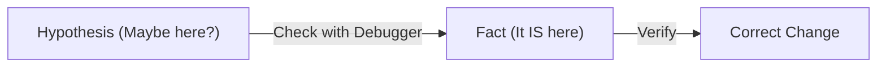
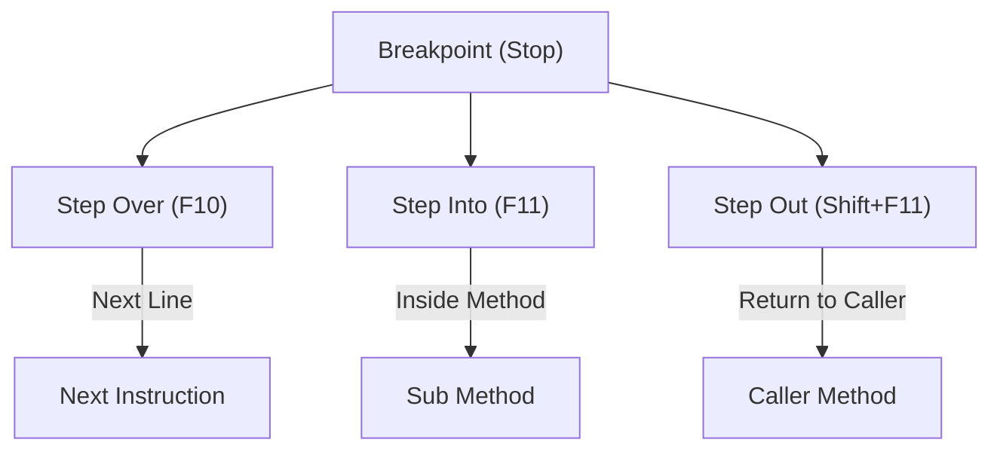

# 第05章：デバッガ基礎（読む力＝最強）🔍🧠

リファクタリングって、いきなりコードを整える前に「**今のコードが“実際に何をしてるか”を正しく理解する**」のが超だいじです💎
その最強ツールが **デバッガ** だよ〜！🌟

この章では「止める→一歩ずつ進める→値を見る→例外で止める」を、手を動かしながら身につけます🧤✨

---

## この章のゴール🎯✨

読み終わったら、次のことができるようになります💪😊

* ブレークポイントで **ピタッと止められる** 🛑
* ステップ実行で **処理の順番を追える** 👣
* Locals/Watch で **値の変化を見張れる** 👀
* 例外で止めて **「どこで壊れた？」を特定できる** 💥🔎
* AI（Copilotなど）を **“仮説づくり担当”として安全に使える** 🤖✅

---

## デバッガの基本イメージ🧠🍰


デバッグはこの2つを分けるのがコツだよ✨

* **事実（Facts）**：デバッガで見える「本当に起きてること」🔍
* **仮説（Hypothesis）**：AIや自分が考える「たぶんここが怪しい…」🤔

👉 **仮説は何個でもOK**。でも採用するのは **デバッガで事実を見てから**✅



---

## 0. デバッグを開始する（まずここ）▶️🐣

### 実行の2種類（よく使う！）

* **デバッグ実行**：F5
  → ブレークポイントで止まる／変数が見える／例外で止められる🌟
* **デバッグなし実行**：Ctrl + F5
  → 速度は近いけど、止めたり覗いたりはできない🙅‍♀️

Visual Studioのデバッグは「デバッガを付けて実行」するのが基本だよ。 ([Microsoft Learn][1])

---

## 1. ブレークポイント（止める場所を決める）🛑🔴

### 1-1. まずは“赤い丸”を置く🔴

止めたい行の左端（余白）をクリック、または **F9**（Toggle Breakpoint）で置けます✨ ([Microsoft Learn][2])

**止まるタイミング**：その行が実行される「直前」だよ👀

---

### 1-2. 便利なブレークポイント管理（Breakpointsウィンドウ）🗂️

ブレークポイントが増えてきたら、まとめて管理できる画面が超便利！

* 検索🔎
* 一時的に無効化（消さずにOFF）🧯
* 条件付き（Condition）🧩
* ヒット回数（Hit Count）🔢
* アクション（Action）＝ログだけ出す（Tracepoint）🧾

このへんは **Breakpointsウィンドウ**から触れるよ。 ([Microsoft Learn][3])

---

### 1-3. 条件付きブレークポイント（“この時だけ止めたい”）🧩🛑

たとえば「ループが100回回る」みたいな時、毎回止まるとつらいよね🥲

✅ こんなときに使う：

* `i == 50` のときだけ止めたい
* `total > 10000` のときだけ止めたい

Visual Studioは条件付きや一時的、関数ブレークポイントなども用意してるよ。 ([Microsoft Learn][4])

---

### 1-4. Tracepoint（止まらずにログだけ出す）🧾✨

「止めたくないけど値を見たい」なら Tracepoint が気持ちいい！

* コードに `Console.WriteLine` を入れずに済む🎀
* Outputウィンドウへログを出せる📤

Tracepointは「ブレークせずにログを出す」機能だよ。 ([Microsoft Learn][5])

---

## 2. ステップ実行（少しずつ進める）👣✨

止まったら、次は「1歩ずつ」進めるよ〜😊
よく使うキーはこの4つ！

* **Continue（次のブレークポイントまで進む）**：F5
* **Step Over（次の行へ。呼び出し先には入らない）**：F10
* **Step Into（呼び出し先の中に入る）**：F11
* **Step Out（今のメソッドを抜ける）**：Shift + F11

このショートカットは公式の一覧に載ってるよ。 ([Microsoft Learn][6])



---

### 2-1. Run to Cursor（カーソル位置まで一気に進む）🏃‍♀️💨

「そこまで飛ばしたい！」ってときは **Run to Cursor** が便利✨
ショートカットは **Ctrl + F10**。 ([Microsoft Learn][6])

---

### 2-2. “どの順で呼ばれた？”は Call Stack で見る🪜👀

「このメソッド、誰に呼ばれたの？」って迷子になることあるよね😵‍💫
そんな時は **Call Stack**（呼び出し履歴）を見ると一発で整理できます✨

デバッグ中は Debug > Windows から各種ウィンドウを開けます。 ([Microsoft Learn][7])

---

## 3. 変数を見る（値が分かれば半分勝ち）👀💎

### 3-1. まずは DataTip（ホバーで見る）🫧

止まってる状態で変数にマウスを乗せると、値が出ます✨
「今この値なんだ！」が一瞬で分かるよ😊

---

### 3-2. Locals / Autos / Watch（定番3兄弟）🧑‍🤝‍🧑✨

* **Locals**：今のスコープの変数が一覧で見える📋
* **Autos**：今の行の前後で使ってる変数が自動で出る🪄
* **Watch**：自分で“監視したい式”を登録する👁️‍🗨️

Visual Studioにはこれらのウィンドウで値を確認する機能があるよ。 ([Microsoft Learn][8])

---

### 3-3. QuickWatch（その場で式を評価）⚡

「この式って今いくつ？」を素早く見たいときに便利✨
ショートカット例として QuickWatch も用意されています。 ([Microsoft Learn][6])

---

## 4. 例外で止める（“壊れた瞬間”を捕まえる）💥🧤

「動かしたら落ちた🥲」のとき、**例外で止める**設定が本当に強い！

### 4-1. Exception Settings を開く🧯

Visual Studioでは **Debug > Windows > Exception Settings** から設定できます。 ([Microsoft Learn][9])

---

### 4-2. “Thrown” と “User-unhandled” の違い🧠

例外には「止まるタイミング」があります（ここが超重要！）✨

* **Thrown（スローされた瞬間）**：`throw` した行で止まる🛑
  → 原因の特定に強い（ただし止まりすぎることもある）
* **User-unhandled（ユーザーコードで未処理）**：自分のコード側で処理されてない時に止まる🧩
  → “関係ない内部例外”で止まりにくい

例外のどこで止めるかは、Exception Settingsで指定できるよ。 ([Microsoft Learn][9])

---

## 5. ミニ演習：分岐の“実際の値”を追いかける👀🧁

### お題：会員ランクで割引が変わる🎟️✨

「思った割引にならない…」をデバッガで追いかけます🔍

#### サンプルコード（Console）🍵

```csharp
using System;

public static class Program
{
    public static void Main()
    {
        Console.Write("会員ランク（Bronze/Silver/Gold）: ");
        var rank = Console.ReadLine();

        Console.Write("購入金額: ");
        var priceText = Console.ReadLine();

        if (!int.TryParse(priceText, out var price))
        {
            Console.WriteLine("金額が不正です");
            return;
        }

        var discountRate = GetDiscountRate(rank, price);
        var discounted = price - (int)(price * discountRate);

        Console.WriteLine($"割引率: {discountRate:P0}");
        Console.WriteLine($"割引後: {discounted} 円");
    }

    private static decimal GetDiscountRate(string? rank, int price)
    {
        // バグっぽいポイントが混ざってるよ👀（わざと）
        if (rank == "Gold")
        {
            if (price >= 10000) return 0.15m;
            return 0.10m;
        }
        else if (rank == "Silver")
        {
            if (price >= 10000) return 0.10m;
            return 0.05m;
        }
        else
        {
            // Bronzeのつもりだけど…？
            if (price >= 10000) return 0.05m;
            return 0.03m;
        }
    }
}
```

---

### 手順📝✨

#### ① ブレークポイントを2つ置く🔴

* `var discountRate = GetDiscountRate(rank, price);`
* `private static decimal GetDiscountRate...` の最初の `if (rank == "Gold")`

F9で置けます。 ([Microsoft Learn][2])

---

#### ② デバッグ実行（F5）▶️

入力例（わざと“揺らす”）：

* rank：`gold`（小文字）
* price：`12000`

---

#### ③ Step Into（F11）で GetDiscountRate の中へ👣

「rank が本当に "Gold" になってる？」を確認！

---

#### ④ Locals と Watch を開いて値を見る👀

見るポイント：

* `rank` の中身（大小文字・空白）
* `price` の値
* どの `return` を通るか（分岐の“事実”）

Locals/Watch などで値を見られます。 ([Microsoft Learn][8])

---

### 観察して気づいてほしいこと💡

* 入力が `gold`（小文字）だと `rank == "Gold"` に一致しない😵‍💫
* すると Bronze 扱いになってしまう…！🍂

✅ つまり「割引がおかしい」の原因は
**ロジックが動いてない**んじゃなくて、**比較条件が想定とズレてる**可能性が高い、って分かるよ🔍✨

---

### おまけ修正案（1行で直すパターン）🛠️

```csharp
rank = rank?.Trim();
```

さらに頑丈にするなら「大文字小文字を無視して比較」もアリだよ（次の章以降で“読みやすい書き方”に整える練習につながる🌸）

---

## 6. よくある「止まらない」「追えない」あるある😭➡️🙂

### 6-1. ブレークポイントがヒットしない🫠

ありがちな原因：

* そもそもその行が通ってない（分岐が違う）
* デバッグ実行してない（Ctrl+F5で起動してる）
* ブレークポイントが無効化されてる

👉 まずは「その行を通る入力か？」を疑うのが最短だよ🔍

---

### 6-2. Step Into したら知らないコードに入っちゃう😵‍💫

フレームワーク内部に入って迷子になりがち…！

* “自分のコードだけ追いたい”設定（Just My Code）を使うと楽になることが多いです🧭
  例外の止まり方にも関係します。 ([Microsoft Learn][9])

---

## 7. AI（Copilotなど）の安全な使い方：仮説づくり専用🤖🧠✅

Visual StudioではCopilot体験が統合されてきて、IDE内で使いやすくなっています。 ([Microsoft Learn][10])

でも、デバッグで大事なのはこれ👇

* **AI：推理係（仮説）** 🤖
* **デバッガ：実況係（事実）** 🔍

### 使えるAIプロンプト例💬✨

* 「このメソッドが“何をしようとしているか”を3行で説明して」🧾
* 「この条件分岐で、どんな入力で else に落ちる？」🧩
* 「怪しい変数と、Watchに入れると良さそうな式を提案して」👀
* 「例外が出るとしたら、どの行が原因候補？」💥

✅ そのあと必ず
**提案された“怪しい場所”にブレークポイントを置いて、事実確認**しようね。 ([Microsoft Learn][3])

---

## 8. まとめ🌟

* ブレークポイントで **止める** 🛑
* ステップ実行で **追う** 👣
* Locals/Watchで **見る** 👀
* 例外設定で **壊れた瞬間を捕まえる** 💥
* AIは **仮説づくり担当**、採用は **デバッガで事実確認** 🤖✅

次のリファクタ練習（Rename / Extract Method など）も、結局ぜんぶこの「読む力」が土台になるよ〜！📚✨

[1]: https://learn.microsoft.com/en-us/visualstudio/debugger/debugger-feature-tour?view=visualstudio&utm_source=chatgpt.com "Overview of the debugger - Visual Studio (Windows)"
[2]: https://learn.microsoft.com/en-us/visualstudio/debugger/navigating-through-code-with-the-debugger?view=visualstudio&utm_source=chatgpt.com "Navigate through code by using the Visual Studio debugger"
[3]: https://learn.microsoft.com/en-us/visualstudio/debugger/get-started-with-breakpoints?view=visualstudio&utm_source=chatgpt.com "Get started with breakpoints in the Visual Studio debugger"
[4]: https://learn.microsoft.com/en-us/visualstudio/debugger/using-breakpoints?view=visualstudio&utm_source=chatgpt.com "Use the right type of breakpoint - Visual Studio (Windows)"
[5]: https://learn.microsoft.com/en-us/visualstudio/debugger/using-tracepoints?view=visualstudio&utm_source=chatgpt.com "Log info with tracepoints - Visual Studio (Windows)"
[6]: https://learn.microsoft.com/en-us/visualstudio/ide/default-keyboard-shortcuts-in-visual-studio?view=visualstudio&utm_source=chatgpt.com "Keyboard shortcuts - Visual Studio (Windows)"
[7]: https://learn.microsoft.com/en-us/visualstudio/debugger/debugger-windows?view=visualstudio&utm_source=chatgpt.com "Inspect data using debugger windows in Visual Studio"
[8]: https://learn.microsoft.com/en-us/visualstudio/debugger/autos-and-locals-windows?view=visualstudio&utm_source=chatgpt.com "Visual Studio debugger - Inspect variables"
[9]: https://learn.microsoft.com/en-us/visualstudio/debugger/managing-exceptions-with-the-debugger?view=visualstudio&utm_source=chatgpt.com "Manage exceptions with the debugger in Visual Studio"
[10]: https://learn.microsoft.com/en-us/visualstudio/releases/2022/release-notes-v17.10?utm_source=chatgpt.com "Visual Studio 2022 version 17.10 Release Notes"
