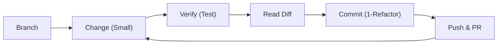

# 第06章：Gitの基本（リファクタはGitが命）🌿📌

## この章のゴール🎯

この章を終えると、次のことが“自然に”できるようになります🙂✨

* リファクタを **安全に小さく進める「型」** が身につく🧩
* **差分（Diff）を読んでからコミット** できる👀✅
* **「1リファクタ＝1コミット」** を体験できる🔁🌟
* うっかりミスしても、**戻せる手段** を知って怖くなくなる🛟💕

---

## 6-1. なんでGitが“命”なの？🫀🌿

リファクタって、「動作を変えずに内部を整える」作業だよね✂️✨
でも実際は、

* ちょっとした移動でバグが混ざる😵‍💫
* 直したはずが戻せなくなる😭
* 何をしたか説明できない💦

が起きがち…。

そこでGitがあると、

* **どこまで触ったかが差分で見える**👀
* **失敗しても戻せる**🛟
* **レビューしてもらえる**👩‍🏫
* **履歴が残る＝自分の成長ログになる**📈✨

だから、リファクタはGitとセットで考えるのが最強です💪🌟

---

## 6-2. まずは超重要ワードだけ覚えよう📚✨

### ✅ リポジトリ（repo）📦

コードと履歴が入ってる箱。ローカルにもGitHubにもあるよ🧰

### ✅ コミット（commit）📌

「ここまでOK！」っていう **セーブポイント** 🎮✨
リファクタでは **小さく・頻繁に** が大事🔁

### ✅ 差分（diff）👀

変更点の見える化。コミット前に必ず読むのが安全✅

### ✅ ステージ（stage）🧺

「このファイルだけコミットに入れる」って選別する場所。
ステージを使うと **コミットが小さくまとまる** よ🙂

### ✅ ブランチ（branch）🌿

作業用の分岐。メインを汚さずに試せるから安心🛡️

### ✅ push / pull 🔁

* push：ローカル→GitHubへアップロード⬆️
* pull：GitHub→ローカルへ取り込み⬇️

### ✅ PR（Pull Request）📮

「この変更どう？」って提出する箱📦
小さく出すとレビューが爆速になるよ⚡

---

## 6-3. リファクタ用の“鉄板ルーティン”🔁🌟（これだけで事故が激減）


リファクタは、いつもこの順番で進めると安全です🛡️✨

1. **ブランチを切る**🌿
2. **小さく1つだけ改善**✂️
3. **動作確認（できればテスト）**✅
4. **差分（Diff）を読む**👀
5. **コミット（1リファクタ＝1コミット）**📌
6. **push**⬆️
7. **PR作成→レビュー**📮

Visual Studio 2026 だと、8. push後にそのままPR作成に進める導線が用意されています✨（Git Changesにバナーが出てPR作成へ進める） ([Microsoft for Developers][1])



---

## 6-4. Visual StudioでやるGit操作（超実践）💻✨

### 6-4-1. 変更を“入れる/入れない”を選ぶ（ステージ）🧺

リファクタで大事なのは **変更を混ぜない** こと🙂
だから、基本はこう👇

* ✅ コミットに入れたいファイルだけ **Stage**
* ❌ まだ途中のファイルは **Stageしない**（次のコミットへ）

Visual Studioでは、ファイル単位でステージ/アンステージができるし、ステージをスキップして全部コミットすることもできます（でも“全部コミット”は差分が大きくなりがちなので注意⚠️） ([Microsoft Learn][2])

---

### 6-4-2. コミットする📌（メッセージが超大事）

コミットメッセージは「未来の自分への説明書」📖✨
Visual Studioのコミット操作は、Git Changes から行えます。 ([Microsoft Learn][2])

#### ✨ AIでコミットメッセージを作る（使ってOK！）🤖📝

Visual Studioは、Copilot Chat（など）を使って **コミットメッセージを生成** できます。 ([Microsoft Learn][3])

ただしルールはこれだけ守ると安全👇

* 🤖が作った文を **そのまま採用しない**（必ず目で読む👀）
* **Diffを見て、内容と合ってるか照合**✅
* 「何をしたか」だけじゃなく、できれば「なぜ」も少し入れる💡

---

### 6-4-3. push → PRを作る📮✨

pushした後、Visual Studio 2026 では Git Changes に **PR作成へ進めるバナー** が出て、そのままPull Request作成に進めます。 ([Microsoft for Developers][1])

> リファクタPRのコツは「小さく」「説明できる」📌
> それだけでレビューがめちゃ早くなります⚡🙂

---

## 6-5. VS Codeを“補助”で使うときの最低限🧩💡

VS Codeでも、Source Control から stage/commit/push ができます🌿
さらに、うっかり最後のコミットを取り消したいときは **Git: Undo Last Commit** が用意されています（変更は作業ツリーに戻るイメージ）🛟 ([Visual Studio Code][4])

※ Visual Studio中心でOKだけど、「軽く直してすぐコミット」みたいな場面ではVS Codeも便利🙂✨

---

## 6-6. コミットメッセージの基本（テンプレでOK）📝✨

### ✅ まずはこの型だけでOK🌟

* 1行目：**何をした？**（短く）
* 2行目以降（任意）：**なぜ？**（必要なら）

例👇

* `refactor: 注文合計計算をメソッド抽出` ✂️
* `refactor: nullチェックをガード節に変更` 🚪
* `refactor: 変数名を意図が伝わる形に統一` 🏷️

#### 💡「なぜ？」が必要な例

* 仕様っぽく見えるけど“動作は変えてない”ことを強調したい
* 将来、「なんでこの形？」って迷いそう

---

## 6-7. Diff（差分）の読み方：コミット前にここを見る👀✅


コミット前にDiffを見て、これだけチェックすると事故が減るよ🛡️✨

* ✅ **関係ない変更が混ざってない？**（整形だけ大量、など）🧼
* ✅ **動作が変わってない？**（条件式の意味が変わってない？）🧠
* ✅ **ファイルが多すぎない？**（多い＝コミットを割るサイン）✂️
* ✅ **名前変更（Rename）は意図が伝わる？**🏷️

---

## 6-8. “戻す”の基本：これを知ってるだけで強い🛟✨

### 6-8-1. まだコミットしてない変更を捨てたい（戻したい）🧹

Visual Studioでは、変更を元に戻す（Undo Changes）操作ができます。
ステージ済みなら先にアンステージしてから、変更を元に戻す流れです🧺➡️🧹 ([Microsoft Learn][5])

---

### 6-8-2. もうpushしちゃったコミットを取り消したい😱

この場合は **revert（打ち消しコミット）** が安全🛡️✨
revertは履歴を書き換えず、打ち消すための新しいコミットを作るので、共同作業でも事故りにくいです。 ([Microsoft Learn][6])

---

### 6-8-3. push前のコミットを「やっぱり直したい」✍️

push前なら調整しやすいけど、やり方がいくつかあるので超ざっくりだけ👇

* ✅ メッセージだけ直したい → amend（※push後は注意⚠️）
* ✅ コミット自体をなかったことにしたい → reset（※履歴を書き換える）
* ✅ 共有済みなら revert が安全🛡️（resetより） ([Atlassian][7])

> まずは「push後はrevertが安全」だけ覚えればOK🙂🌟

---

## 6-9. ミニ演習：「1リファクタ＝1コミット」を体験しよう🔁💖

### 🎀 お題：小さな計算コードを“読みやすく”する（動作は同じ）

#### ① 小さなサンプルを用意（ConsoleでもOK）

下みたいなコードを用意する（プロジェクトは何でもOK）👇

```csharp
public static decimal CalcTotal(decimal price, int qty, bool isMember)
{
    if (qty <= 0) return 0;

    var total = price * qty;

    if (isMember)
    {
        total = total * 0.9m;
    }

    return total;
}
```

---

### ② ブランチを切る🌿

名前は例でOK👇

* `refactor/calc-total-cleanup`

---

### ③ リファクタ①：名前を改善（Rename）🏷️✨

例：

* `qty` → `quantity`
* `isMember` → `isMemberDiscountEligible`（など）

✅ **動作は変えない**（意味だけわかりやすく）
✅ Diffを読む👀
✅ コミット📌（これが1リファクタ＝1コミット！）

コミットメッセージ例：

* `refactor: 変数名を読みやすく整理`

---

### ④ リファクタ②：割引計算を“意味のある塊”にする（Extract Method）✂️📦

例：

```csharp
public static decimal CalcTotal(decimal price, int quantity, bool isMemberDiscountEligible)
{
    if (quantity <= 0) return 0;

    var total = price * quantity;
    return ApplyMemberDiscount(total, isMemberDiscountEligible);
}

private static decimal ApplyMemberDiscount(decimal total, bool isEligible)
{
    if (!isEligible) return total;
    return total * 0.9m;
}
```

✅ Diffを見る👀
✅ コミット📌

コミットメッセージ例：

* `refactor: 割引計算をメソッド抽出`

---

### ⑤ pushしてPRを作る📮✨

push後、Visual Studio 2026なら Git Changes からそのままPR作成へ進めます。 ([Microsoft for Developers][1])

PR説明（短くてOK）例👇

* 何をした：変数名整理、割引計算の抽出
* 影響：動作変更なし（リファクタのみ）
* 確認：手動実行 or テストOK

---

## 6-10. よくある失敗あるある（回避ワザ付き）😵‍💫➡️🙂✨

* **コミットがでかい**📦💥
  → ステージで“入れるもの”を選ぶ🧺
  → 途中ならコミットを割る✂️

* **関係ない整形が混ざる**🧼
  → フォーマットは「別コミット」にするか、最初から保存時整形で差分を小さく📌

* **push後に“やっぱ直したい”**😱
  → 共有済みならrevertが安全🛡️ ([Microsoft Learn][6])

---

## まとめ🌈✨

* リファクタは **「小さく」「差分を読んで」「戻せる」** が正義🛡️
* 進め方の型は **ブランチ→小さく変更→Diff→コミット→push→PR** 🔁
* Visual Studio 2026は **push後にPR作成へ直行** できて流れが作りやすい📮✨ ([Microsoft for Developers][1])
* AIでコミットメッセージ生成は便利だけど、**Diff確認が本体**👀✅ ([Microsoft Learn][3])

次の章では、この「安全に進める」をさらに強化するために、**テスト**を最小から入れていきます🧪💖

[1]: https://devblogs.microsoft.com/visualstudio/streamlining-your-git-workflow-with-visual-studio-2026/?utm_source=chatgpt.com "Streamlining your Git workflow with Visual Studio 2026"
[2]: https://learn.microsoft.com/ja-jp/visualstudio/version-control/git-make-commit?view=visualstudio&utm_source=chatgpt.com "Visual Studio で Git コミットを行う"
[3]: https://learn.microsoft.com/en-us/visualstudio/version-control/git-make-commit?view=visualstudio&utm_source=chatgpt.com "Make a Git commit in Visual Studio"
[4]: https://code.visualstudio.com/docs/sourcecontrol/faq?utm_source=chatgpt.com "Source Control FAQ"
[5]: https://learn.microsoft.com/en-us/azure/devops/repos/git/undo?view=azure-devops&utm_source=chatgpt.com "Undo changes in your Git repo - Azure DevOps"
[6]: https://learn.microsoft.com/en-us/visualstudio/version-control/git-manage-repository?view=visualstudio&utm_source=chatgpt.com "Manage Git repositories in Visual Studio"
[7]: https://www.atlassian.com/git/tutorials/resetting-checking-out-and-reverting?utm_source=chatgpt.com "Resetting, Checking Out & Reverting | Atlassian Git Tutorial"
