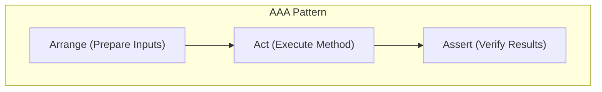

# 第07章：テスト超入門（“壊してない”を機械で確認）✅🧪

リファクタリングって「動作は変えない」って言うけど、手で全部確認するのはムリ…！😵‍💫
そこで **テスト** が“保険”になります🛡️✨
コードを直したらボタン1つで「壊れてないよね？」を機械が確認してくれる感じです✅

---

## 7-0 この章でできるようになること 🎯✨


この章が終わると、こんなことができるようになります💪💕

* ユニットテストの役割がわかる👀
* **AAA（Arrange-Act-Assert）** でテストが書ける🧩
* Visual Studio の Test Explorer で **テスト実行→失敗→原因特定** ができる🔍
* AI（Copilot / Codex系）に **雛形を作らせて、期待値は自分で決める** ができる🤖✅

---

## 7-1 テストって何？（リファクタの最強お守り）🧿✨

ユニットテストは一言でいうと：

> **「小さな部品（関数/メソッド）が正しく動くか」を自動で確認するコード** ✅🧪

リファクタでは中身をどんどん触るので、テストがあると安心感が段違いです😌🌸
特に「ちょっと整えただけ」のつもりが、条件分岐がズレてバグる…みたいなのを防げます🚧💥

---

## 7-2 最初に覚える用語だけ💡（これだけでOK）🧠✨


* **ユニットテスト**：小さな単位（関数/メソッド）をテストする🧪
* **テストケース**：入力と期待結果のセット📦
* **テストが通る（Green）**：期待どおり✅


* **テストが落ちる（Red）**：期待と違う❌（バグ or テストの期待値が違う）
* **回帰（Regression）**：前は動いたのに、変更で壊れたやつ😭

---

## 7-3 AAA（Arrange-Act-Assert）を覚えると一気に書ける✨🧩


テストは基本この形です👇

1. **Arrange**（準備）🧺：入力データを用意する
2. **Act**（実行）🏃‍♀️：テスト対象メソッドを呼ぶ
3. **Assert**（確認）🔎：結果が期待どおりか比べる

AAAを守ると、テストが「読み物」になってわかりやすいです📖💕



---

## 7-4 まず“テストしやすい形”を知っておく🍰✨


テスト初心者が最初にハマるのはここです😵‍💫

### ✅ テストしやすい（最高）

* 引数を入れたら、戻り値が返る（副作用少なめ）🎁
* 同じ入力なら、いつも同じ結果（決定的）🎯

### ❌ テストしにくい（あとで改善する）

* `DateTime.Now` / `Random` で結果が変わる⏰🎲
* ファイル/DB/HTTP を直接触る📁🌐
* `Console.ReadLine()` みたいに入力待ちする⌨️💦

この章では、まず **“テストしやすい小さな関数”** を作ってテストします✅
（テストしにくい部分は後半の章で上手にほどいていくよ🧩✨）

---

## 7-5 ハンズオン：小さな関数にテスト1本🎀🧪

ここから手を動かすパートです🖐️✨
題材は「割引つき合計金額」を計算する関数💰🧾

### ① プロジェクトを作る📁✨


Visual Studio で新規作成：

* **Class Library**（例：`Shop.Core`）
* **xUnit Test Project**（例：`Shop.Core.Tests`）

`.NET SDK` にはユニットテスト用テンプレートが用意されていて（`dotnet new` にもあるよ）、VSのテンプレートからすぐ作れます📦✨ ([Microsoft Learn][1])
xUnit は現在 v3 系が継続的に更新されてます（v3 のリリース一覧がまとまってる）📈 ([xunit.net][2])

> 🔗 参照追加：`Shop.Core.Tests` から `Shop.Core` を参照（プロジェクト参照）するのを忘れずに✅

---

### ② まずは“テスト対象”を書く（Core側）🧱✨

`Shop.Core` に `PriceCalculator.cs` を作って👇

```csharp
namespace Shop.Core;

public static class PriceCalculator
{
    // unitPrice: 単価（円）
    // quantity : 個数
    // discountRate: 割引率（0.0〜1.0）
    public static decimal CalcTotal(decimal unitPrice, int quantity, decimal discountRate)
    {
        if (unitPrice < 0) throw new ArgumentOutOfRangeException(nameof(unitPrice));
        if (quantity < 0) throw new ArgumentOutOfRangeException(nameof(quantity));
        if (discountRate < 0 || discountRate > 1) throw new ArgumentOutOfRangeException(nameof(discountRate));

        var subtotal = unitPrice * quantity;
        var discounted = subtotal * (1 - discountRate);

        // 金額は小数を扱いたいので decimal、端数は四捨五入（例）
        return decimal.Round(discounted, 0, MidpointRounding.AwayFromZero);
    }
}
```

ポイント💡

* 余計なI/Oがないのでテストしやすい🎯
* 「おかしな入力」は例外で止める🚧（この後テストで確認できる！）

---

### ③ テストを書く（Tests側）🧪✨

`Shop.Core.Tests` に `PriceCalculatorTests.cs` を作るよ👇
（AAAをコメントで見える化するのおすすめ💖）

```csharp
using Shop.Core;

namespace Shop.Core.Tests;

public class PriceCalculatorTests
{
    [Theory]
    [InlineData(100, 2, 0.0, 200)]   // 割引なし
    [InlineData(100, 2, 0.1, 180)]   // 10%割引
    [InlineData(333, 3, 0.0, 999)]   // 端数なし例
    public void CalcTotal_ValidInputs_ReturnsExpectedTotal(
        decimal unitPrice, int quantity, decimal discountRate, decimal expected)
    {
        // Arrange 🧺
        // （InlineDataが入力なので、ここは特に準備なしでもOK）

        // Act 🏃‍♀️
        var actual = PriceCalculator.CalcTotal(unitPrice, quantity, discountRate);

        // Assert 🔎
        Assert.Equal(expected, actual);
    }

    [Fact]
    public void CalcTotal_UnitPriceIsNegative_Throws()
    {
        // Arrange 🧺
        var unitPrice = -1m;

        // Act + Assert 🔥（例外はこの形が読みやすい）
        Assert.Throws<ArgumentOutOfRangeException>(() =>
            PriceCalculator.CalcTotal(unitPrice, quantity: 1, discountRate: 0m));
    }
}
```

ここで覚えるのはこの3つだけでOKです✨

* `[Fact]`：1ケースのテスト🧪
* `[Theory] + [InlineData]`：同じ形のテストを複数ケースまわす🎡
* `Assert.Equal` / `Assert.Throws`：結果チェックと例外チェック✅💥

---

### ④ テストを実行する（Test Explorer）▶️🧪

Visual Studio の **Test Explorer** で

* **Run All**（全部実行）▶️
* もしくはテスト名を右クリックして **Run**（1本だけ）🎯

テストの結果は、成功が✅、失敗が❌で出ます。失敗したらそのテストをクリックすると、エラー理由とスタックトレースが見えます🔍
（VSのテスト実行〜結果確認の流れはMicrosoft公式の手順でもまとまってます） ([Microsoft Learn][3])

---

## 7-6 テストの“粒度”ってなに？（小さく攻める🧁✨）


粒度は「どれくらいの範囲を確認するか」だよ📏

### 🧪 ユニットテスト（この章の主役）

* 小さい：関数1個〜数個
* 速い：秒で回る⚡
* 壊れた場所が特定しやすい🔎

### 🌐 結合/統合テスト（もう少し後で）

* DB/HTTP/ファイルなども含む
* 遅い：準備も大変💦
* でも「全体として動く」を確認できる✅

リファクタの最初の安全ネットとしては **ユニットテストが最強** です🛡️✨

---

## 7-7 “良いテスト”のコツ5つ🌟（超重要）

1. **1テストで確認することは1つ** 🎯
   （落ちた理由がすぐ分かる✨）

2. **期待値（expected）は自分で決める** 🧠✅
   AIが作った期待値をそのまま信じるのは危険⚠️

3. **テスト名は「何を保証してるか」** 🏷️
   例：`CalcTotal_UnitPriceIsNegative_Throws` みたいに読むだけで分かるのが◎

4. **テストは“未来の自分”への説明書** 📖💕


   テストが読みやすい＝保守がラク！

5. **テストが通ってからリファクタ** 🔁✅
   まずGreenにして、そこから安心して整える🌿

---

## 7-8 ありがち事故あるある😇💥（先に回避しよ）

### 🌀 あるある①：テストが不安定（たまに落ちる）

原因になりがち👇

* `DateTime.Now` や `Random` をそのまま使ってる⏰🎲

対策👇

* 今は「そういう値を使う関数はテストしにくい」と覚えるだけでOK🙆‍♀️
* 後半の章で **差し替え可能にする**（DI / Wrapper）をやるよ🧤🔌

### 🧩 あるある②：1テストが長すぎて読めない

対策👇

* AAAを守って、Arrangeを最小限に🧺✨
* “準備コード”が増えたら、テスト用ヘルパーを作る（でも最初はやりすぎない）🎀

### 🧨 あるある③：Assertがいっぱいで、どこが悪いか分からない

対策👇

* まずは **Assertは1つ** を基本に🎯
* 複数確認したいならテストを分ける✂️

---

## 7-9 AI活用（雛形を作らせて、判断は人間👩‍🎓🤖）

AIはテストと相性いいです✨
ただしコツは **「雛形はAI、期待値は自分」** ✅

### ✅ よく使うお願いテンプレ（コピペOK）📝

* 「このメソッドのユニットテストを **AAA形式** で3ケース作って。`Theory + InlineData` で」🤖🧪
* 「境界値（0、1、最大、最小、null相当）を洗い出して」🔎📋
* 「このテストが落ちた理由を、スタックトレースから1行で説明して」🧯
* 「例外テスト（`Assert.Throws`）の書き方だけ雛形ちょうだい」💥🧩

### ⚠️ AIに任せないこと（超大事）🚧

* 期待値の正しさ（仕様）🧠
* “何を保証したいか” の意図🎯
* テストケースの優先順位（どれが重要？）⭐

---

## 7-10 ミニ演習📝✨（10〜15分）

### 演習A：ケース追加🎡

`CalcTotal_ValidInputs_ReturnsExpectedTotal` に次を追加してみてね👇

* `unitPrice=0` のとき
* `quantity=0` のとき
* `discountRate=1.0` のとき（全部無料のはず？😳）

### 演習B：例外テスト追加💥

* `discountRate=1.5` で例外になるテストを1本追加

---

## 7-11 章末チェック✅🌸（できたら合格！）

* [ ] AAAでテストが書ける🧩
* [ ] `Fact` と `Theory` の違いがなんとなく分かる🎡
* [ ] Test Explorer で実行して、落ちたら理由を見られる🔍
* [ ] AIで雛形を作っても、期待値は自分で決められる🧠✅

---

### 参考（最新環境の根拠）📌✨

* .NET 10 はLTSとして発表されているよ📣 ([Microsoft for Developers][4])
* C# 14 の新機能は Microsoft Learn にまとまってる📚 ([Microsoft Learn][5])
* xUnit.net v3 は .NET 8+ をサポート（v3系として継続更新）🧪 ([xunit.net][6])

[1]: https://learn.microsoft.com/en-us/dotnet/core/tools/dotnet-new-sdk-templates?utm_source=chatgpt.com "NET default templates for 'dotnet new' - .NET CLI"
[2]: https://xunit.net/releases/?utm_source=chatgpt.com "Release Notes"
[3]: https://learn.microsoft.com/en-us/visualstudio/test/walkthrough-creating-and-running-unit-tests-for-managed-code?view=visualstudio&utm_source=chatgpt.com "Create, run, and customize C# unit tests - Visual Studio ..."
[4]: https://devblogs.microsoft.com/dotnet/announcing-dotnet-10/?utm_source=chatgpt.com "Announcing .NET 10"
[5]: https://learn.microsoft.com/en-us/dotnet/csharp/whats-new/csharp-14?utm_source=chatgpt.com "What's new in C# 14"
[6]: https://xunit.net/?utm_source=chatgpt.com "xUnit.net: Home"
