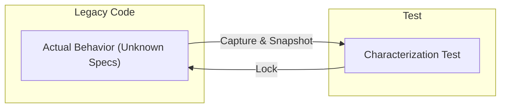

# 第08章：テストが無いコードの始め方（Characterization Test）🕵️‍♀️📸

## この章のゴール🎯

* **テストが無い既存コード**に対して、いきなりリファクタせずに
  ✅ **「今の挙動」をテストで固定（保存）**できるようになる📌
* 「正しい仕様かどうか」より先に、
  ✅ **壊してないことを機械で確認できる状態**を作る🛡️
* 副作用（時間・乱数・ファイル・DB・HTTPなど）があっても、
  ✅ **“観測ポイント”を見つけて写し取る**練習ができる👀✨

---

## 1. Characterization Testってなに？🤔📸


Characterization Test（キャラクタリゼーションテスト）は、ざっくり言うと…

> **「このコード、いま実際に何をしてるの？」をテストで“撮影”して、後から勝手に変わってないか見張る方法**📸🕵️‍♀️

ポイントはここ👇

* **望ましい動作**をチェックするテスト（仕様テスト）ではなく
* **実際の動作**をドキュメント化して守るテスト✅

Michael Feathers は「Characterization testing の目的は、こうなって欲しい挙動ではなく“実際の挙動”を記録すること」と説明しています。([michaelfeathers.silvrback.com][1])
また、Characterization test は Golden Master / Snapshot / Approval testing などと呼ばれることもあります。([ウィキペディア][2])



---

## 2. どうして“最初に写す”の？🛡️✨

テストが無いコードをそのまま触ると、こうなりがち💥

* 「動いてたはずなのに壊れた😱」
* 「どこが変わったのか分からない😵‍💫」
* 「直したいけど怖くて触れない…」

Characterization Test を作ると👇

* ✅ **リファクタ後も同じ挙動か**を自動で確認できる
* ✅ “今の仕様”が分からなくても、まず触れるようになる
* ✅ 既存バグっぽい動作も含めて、**意図せず変える事故**を防げる

この章は「安全ネット（テスト）」パートのど真ん中🧪🛡️
まず“安全に触れる地面”を作る回だよ🌱

---

## 3. 全体の進め方（最短ルート）🗺️✨

Characterization Test は、だいたいこの順番で作るとスムーズ👇

### Step 0：触る範囲を決める🎯

* いきなり全部は無理🙅‍♀️
* **これから変更したい場所の周辺だけ**でOK✨
  （例：バグ修正予定のメソッド／機能追加予定のクラス）

### Step 1：“観測できる結果”を探す👀

観測ポイント例👇

* 戻り値（いちばん楽✨）
* 例外（種類・メッセージ）💥
* 出力（Console出力、ログ、ファイル内容など）🧾
* DB更新やHTTP送信などの**外部I/O**🌐（これは工夫が必要）

### Step 2：入力ケースを集める📥🧺

* “よく使う入力”
* “境界値”（0、1、最大、空文字、nullなど）📏
* “怪しい入力”（過去に不具合が出たやつ）⚠️

### Step 3：一度動かして、結果を“保存”する📸

* まずは **今の結果を観測**して
* その結果を **Assert に貼り付ける**（これが“写す”）📌

### Step 4：テストが安定して回るようにする🔁

* 毎回結果が変わる（時間・乱数など）とテストがフラつく😵
* そういう時は **観測方法を変える**か、**最小の“縫い目（Seam）”**を入れる🪡✨

---

## 4. 例題：ぐちゃっとした割引計算を“写す”📸🧾

ここからは、**「戻り値」と「Console出力」**を写す例だよ😊

### 4.1 レガシー側のコード（触りたくなるやつ）😇

```csharp
public static class LegacyBilling
{
    // 仕様が不明…でも動いてる
    public static decimal CalcTotal(string customerType, int quantity, decimal unitPrice)
    {
        if (string.IsNullOrWhiteSpace(customerType))
        {
            Console.WriteLine("customerType is empty");
            return 0;
        }

        decimal total = quantity * unitPrice;

        // 謎ルール：VIPは10%引き、ただし数量が10以上ならさらに5%引き
        if (customerType == "VIP")
        {
            total *= 0.9m;
            if (quantity >= 10)
                total *= 0.95m;
        }

        // 謎ルール：端数処理（切り上げ…？）
        total = Math.Ceiling(total);

        Console.WriteLine($"total={total}");
        return total;
    }
}
```

---

### 4.2 テストプロジェクトを作る🧪✨

Visual Studio なら、ソリューションに **xUnit / NUnit / MSTest** のテストプロジェクトを追加してOK🙆‍♀️
（どれでも良いけど、チームでは MSTest や xUnit が多いよ）

* xUnit v3 は **.NET 8 以降**をサポートしてるので、.NET 10 でも問題なく使えるよ✅([xunit.net][3])
* .NET 10 と C# 14 は Visual Studio 2026 で試せる構成になってるよ🌟([Microsoft Learn][4])

---

### 4.3 Characterization Test（戻り値）📸

最初は “写す” ので、期待値は **正しさ**じゃなくて **現状**だよ📌

```csharp
using Xunit;

public class LegacyBillingCharacterizationTests
{
    [Theory]
    [InlineData("", 1, 100, 0)]
    [InlineData("REGULAR", 2, 120.2, 241)]
    [InlineData("VIP", 1, 100, 90)]
    [InlineData("VIP", 10, 100, 855)]
    public void CalcTotal_current_behavior_is_locked(
        string customerType, int quantity, decimal unitPrice, decimal expected)
    {
        // Act
        var actual = LegacyBilling.CalcTotal(customerType, quantity, unitPrice);

        // Assert（“いまの挙動”を固定する📸）
        Assert.Equal(expected, actual);
    }
}
```

💡コツ

* 最初の expected は、**一回実行して結果を見て貼り付ける**のが普通だよ📌
* 「え、この値おかしくない？」と思っても、まずは固定しよう✅
  （後で仕様整理して、**“あるべきテスト”に置き換える**✨）

---

### 4.4 Characterization Test（Console出力も写す🧾）

Console に出るものも“挙動”だから、必要なら固定できるよ📸

```csharp
using System.IO;
using Xunit;

public class LegacyBillingConsoleCharacterizationTests
{
    [Fact]
    public void CalcTotal_console_output_is_locked()
    {
        var original = Console.Out;
        try
        {
            using var sw = new StringWriter();
            Console.SetOut(sw);

            // Act
            _ = LegacyBilling.CalcTotal("VIP", 1, 100);

            // Assert
            var output = sw.ToString().Replace("\r\n", "\n");
            Assert.Contains("total=90", output);
        }
        finally
        {
            Console.SetOut(original);
        }
    }
}
```

✅ これで「Console出力が変わった！」も検知できる✨
（ただし、ログ系は変わりやすいので、**固定しすぎ注意**⚠️）

---

## 5. “毎回結果が変わる”ときの対処法（時間・乱数など）⏰🎲

Characterization Test の敵は **不安定さ（flaky）**😵‍💫
代表例👇

* `DateTime.Now` / `DateTimeOffset.Now`
* 乱数 `Random`
* 外部I/O（ファイル、DB、HTTP）

### 5.1 対処の考え方（順番が大事）🧠✨

1. **観測を変える**（安定する観測点にする）👀
2. **入力を固定できる形に寄せる**（最小のSeam）🪡
3. **外部を差し替える**（Fake/Stub/Adapter）🧤

---

### 5.2 時間依存は TimeProvider を使うと安定しやすい⏰✨

.NET には `TimeProvider` という「時間の入口」を差し替える仕組みがあり、テストでは `FakeTimeProvider` が使えるよ🧪
`FakeTimeProvider` はテストを決定的にするための合成時間プロバイダーとして提供されてるよ。([Microsoft Learn][5])

💡ここは“最小のリファクタ”が入るけど、**挙動を変えない**ようにやればOK（安全ネット作りのため）🪡✨

例（時間を注入できる形にする）👇

```csharp
public sealed class BillingWithTime
{
    private readonly TimeProvider _time;

    public BillingWithTime(TimeProvider time) => _time = time;

    public bool IsCampaignNow()
    {
        // 例：金曜だけキャンペーン
        var now = _time.GetLocalNow();
        return now.DayOfWeek == DayOfWeek.Friday;
    }
}
```

テストでは FakeTimeProvider で“金曜”を作れるよ👇

```csharp
using Microsoft.Extensions.Time.Testing;
using Xunit;

public class BillingWithTimeTests
{
    [Fact]
    public void IsCampaignNow_is_deterministic()
    {
        var fake = new FakeTimeProvider();
        fake.SetLocalTimeZone(TimeZoneInfo.Local);
        fake.SetLocalNow(new DateTimeOffset(2026, 1, 23, 12, 0, 0, TimeSpan.FromHours(9))); // Fri

        var sut = new BillingWithTime(fake);
        Assert.True(sut.IsCampaignNow());
    }
}
```

---

## 6. dotnet test の“最近の流れ”も軽く押さえる🧪🖥️

.NET 10 世代では、`dotnet test` は **Microsoft Testing Platform（MTP）** という仕組みも扱うようになってきてるよ🧰✨([Microsoft Learn][6])
MTP では TRX レポート出力が `--report-trx` になったり、`dotnet test -- --report-trx` のように追加の `--` が必要だったりするよ📌([Microsoft Learn][7])

とはいえ、この章の段階ではまず👇で十分✨

* Visual Studio の **Test Explorer** で実行▶️
* もしくはターミナルで `dotnet test` 🔁

---

## 7. AI拡張（Copilot / Codex系）で爆速にするコツ🤖⚡

Characterization Test は「ケース作り」と「観測点探し」がしんどい😵
ここにAIを使うとめちゃ楽になるよ✨

### 7.1 AIに頼むと強いこと💪

* 分岐が多いメソッドに対して
  ✅ **入力ケース案を出してもらう**📥
* Console/ログ/戻り値/例外など
  ✅ **観測ポイント候補を列挙してもらう**👀
* xUnit/MSTest の
  ✅ **テスト雛形を生成してもらう**🧪

### 7.2 コピペで使える依頼文（そのまま投げてOK）🪄

* 「このメソッドの分岐を網羅するための入力ケースを10個提案して。境界値も混ぜて」🧺📏
* 「このメソッドで“外から観測できる結果”は何？戻り値・例外・ログ・副作用に分けて箇条書きで」👀🧾
* 「xUnit の Theory + InlineData で Characterization Test の雛形を作って」🧪✨
* 「このコード、テストが不安定になりそうな要因（時間・乱数・静的状態）を指摘して」⚠️🔎

🛡️安全ルール（超大事）

* AIの提案は **1コミット分**に小さくする🌿
* 必ず **差分レビュー（Diff）**する👀
* テストが落ちたら採用しない🙅‍♀️
* “何を仕様として守るか”は人が決める🧠✨

Visual Studio 2026 は Copilot 連携も強化されているよ。([Visual Studio][8])

---

## 8. よくある落とし穴😱🕳️（ここだけは回避しよう）

### 落とし穴1：テストが毎回落ちる（flaky）😵‍💫

* 原因：時間・乱数・並列実行・共有ファイル…
* 対処：観測点の見直し👀 / TimeProvider等で固定⏰ / 外部I/Oを隔離🧤

### 落とし穴2：固定しすぎて、変更が一切できない🧊

* ログ全文・巨大JSON全文などを丸ごと固定すると、ちょっとした改善で崩壊しがち💥
* “守りたい最小限”に絞るのがコツ✂️✨

  * 例：全文一致じゃなく、重要キーだけを見る🔑
  * 例：Console出力は `Contains` で要点だけ固定📌

### 落とし穴3：最初から「正しい期待値」を悩みすぎる🌀

* この章は「仕様を作る回」じゃなくて「安全ネットを張る回」🛡️
* “いまの挙動”を写して、次の章以降で少しずつ整えていこう🌱

---

## 9. ミニ演習📝✨（手を動かすと一気に理解できるよ）

### 演習A：戻り値の Characterization Test を3本作る📸

1. 既存メソッドを1つ選ぶ🎯
2. 入力ケースを3つ決める📥（普通ケース／境界／怪しいやつ）
3. 1回実行して結果をメモ📝
4. `Assert.Equal(メモした値, 実行結果)` にして固定📌

### 演習B：例外も“挙動”として固定する💥📌

* “この入力だと落ちる”が仕様になってる場合もあるよ😇
* `Assert.Throws<...>(() => ...)` で写せる✨

---

## まとめ🌸✨

* Characterization Test は **「いまの挙動」を固定するテスト**📸
* 目的は **正しさ**より先に、**安全に触れる状態**を作ること🛡️
* 不安定要因（時間・乱数・I/O）は
  👉 観測点の工夫 or 最小Seam（TimeProviderなど）で安定化⏰🧤
* AI拡張は「ケース案」と「雛形生成」に最強🤖⚡（でも最終判断は人🧠）

.NET 10 は 2025年11月11日に開始された LTS として提供されているよ。([Microsoft Learn][9])

[1]: https://michaelfeathers.silvrback.com/characterization-testing?utm_source=chatgpt.com "Characterization Testing - Michael Feathers - Silvrback"
[2]: https://en.wikipedia.org/wiki/Characterization_test?utm_source=chatgpt.com "Characterization test"
[3]: https://xunit.net/?utm_source=chatgpt.com "xUnit.net: Home"
[4]: https://learn.microsoft.com/en-us/dotnet/csharp/whats-new/csharp-14?utm_source=chatgpt.com "What's new in C# 14"
[5]: https://learn.microsoft.com/en-us/dotnet/standard/datetime/timeprovider-overview?utm_source=chatgpt.com "What is the TimeProvider class - .NET"
[6]: https://learn.microsoft.com/ja-jp/dotnet/core/tools/dotnet-test-mtp?utm_source=chatgpt.com "Microsoft.Testing.Platform (MTP) を使用した dotnet テスト"
[7]: https://learn.microsoft.com/ja-jp/dotnet/core/testing/migrating-vstest-microsoft-testing-platform?utm_source=chatgpt.com "VSTest から Microsoft.Testing.Platform への移行ガイド - .NET"
[8]: https://visualstudio.microsoft.com/insiders/?utm_source=chatgpt.com "Visual Studio 2026 Insiders - Faster, smarter IDE - Microsoft"
[9]: https://learn.microsoft.com/ja-jp/lifecycle/products/microsoft-net-and-net-core?utm_source=chatgpt.com "Microsoft .NET および .NET Core - Microsoft Lifecycle"
