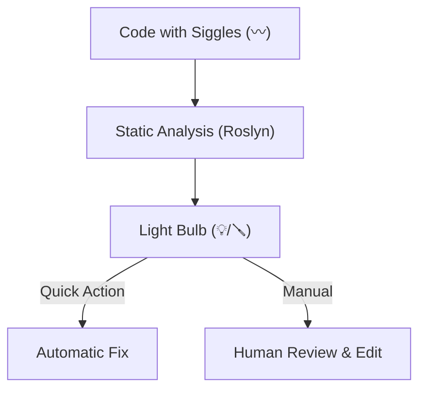

# 第09章：静的解析＆警告の読み方（まずQuick Actions）🚦✨

## この章でできるようになること🎯

* 警告や提案を見たときに「何が起きてるか」を落ち着いて判断できる🙂🧠
* Visual Studioの **Quick Actions（電球💡）** で、安全に修正できる✅
* 「直す・後回し・設定で調整」の線引きができるようになる🧭✨

---

## 1) 静的解析ってなに？🕵️‍♀️📌


**静的解析（Static Analysis）**は、プログラムを実行しなくても「怪しいところ」を見つけてくれる仕組みだよ🔎✨
C#だと、コンパイラやアナライザーが「バグになりそう」「読みづらい」「危ない書き方」を教えてくれる！

特に .NET では Roslyn アナライザーがコード品質やスタイルをチェックして、違反を **提案・警告・エラー** として出してくれるよ。さらに、違反は **CA****（品質系）** や **IDE****（スタイル/IDE系）** のIDで出るのが特徴！ ([Microsoft Learn][1])

---

## 2) メッセージの種類を“3つ”に分けよう🧩✨


### A. コンパイラ エラー（止まる）🛑

* 例：`CS1002` みたいな **CS****
* ビルドが通らないので **最優先で直す** ✅

### B. コンパイラ 警告（動くけど危ない）⚠️

* 例：使ってない変数、nullの可能性、到達しないコードなど
* 「今すぐバグにならない」こともあるけど、放置すると地味に効いてくる💦

### C. アナライザーの指摘（品質/スタイル）🧠🧹

* `CA****`：セキュリティ・性能・設計など（コード品質）
* `IDE****`：スタイル・読みやすさ・IDEのリファクタ提案など
* .NET SDKに含まれていて、.NET 5以降をターゲットにしてると **既定で有効** になってるよ。 ([Microsoft Learn][1])

---

## 3) Visual Studioで“読む場所”はここだけ押さえればOK👀🗺️

### ① エラー一覧（Error List）📋


* **Error / Warning / Message** でフィルタできる
* **説明文 + ID（CS/CA/IDE）** が出る
* まずは「どのファイルの何行？」を押さえる🧷

### ② エディタ上の波線（赤/緑/青）〰️

* 波線の場所が「今ここがポイント！」の目印✨
* 左側の余白に電球💡や工具🪛が出てたら、そこから直せる



---

## 4) Quick Actions（電球💡）が最強な理由⚡✨


Quick Actions は「その場で」コード修正・リファクタ・抑制・設定変更までできる仕組みだよ🛠️
右クリックから開けるし、**`Ctrl + .`** でも開ける！ ([Microsoft Learn][2])

### 電球アイコンの意味もザックリ覚えよう💡🪛


* 🪛：改善の提案（やると読みやすい/良くなる）
* 💡：非クリティカルな問題の修正候補
* 🚨💡：重大（エラーや重要な修正）
  こういう分類になってるよ。 ([Microsoft Learn][2])

### Quick Actionsでできること（この章の主役）🌟

* アナライザー違反の **修正（Code fix）**
* 違反の **抑制（Suppress）** や **重大度の設定変更**
* いろんなリファクタ（Extract/Inlineなど） ([Microsoft Learn][2])

---

## 5) “直す優先度”の決め方🧭✨（迷わないルール）


### 最優先：バグになりやすい系🧨

* null警告（`CS8602` など）
* 未初期化、例外になりそう、条件ミス
  → **リファクタ前の安全ネット**として、ここは早めに潰すのが◎✅

### 次点：CA系（品質・安全・性能）🛡️🚀

* セキュリティ・例外処理・互換性・パフォーマンス
  → “動くけど危ない”が多いから、可能なら直す✨ ([Microsoft Learn][1])

### 後回しOK：IDE系の“好み”に近いスタイル🧼

* `var` にする？しない？みたいなもの
  → チームのルールが決まるまでは **ケンカの火種**になりがち🔥
  この章では「意味があるものだけ直す」でOK🙂

---

## 6) ミニ演習：警告を3つ減らそう🔧✨（Quick Actions練習）

### まずはこのコードを用意🧪

以下を貼ってビルドしてみよう（警告がいくつか出るはず！）👇

```csharp
#nullable enable
using System;
using System.Linq;

public class WarningPlayground
{
    public static void Main()
    {
        int unused = 42;

        string? name = GetNameFromUser();
        Console.WriteLine(name.Length);

        Console.WriteLine("done");
    }

    private static string? GetNameFromUser() => null;
}
```

---

### ✅ 目標1：不要な `using` を消す（IDE系）🧼

1. `using System.Linq;` にカーソルを置く
2. **`Ctrl + .`** を押す
3. 「不要な using を削除」系を選ぶ（文言は少し違ってもOK）

→ `System.Linq` が使われてないので、整理できる✨

---

### ✅ 目標2：使ってない変数 `unused` を消す（コンパイラ警告になりやすい）🗑️

1. `unused` の行にカーソル
2. **`Ctrl + .`**
3. 「未使用の変数を削除」などを選ぶ

→ “読む側のノイズ”が減るよ👀✨

---

### ✅ 目標3：nullの可能性を安全に直す（超重要）🧷🛡️

`name` は `null` かもしれないのに `name.Length` を呼ぶと、実行時に落ちる可能性がある💥
Quick Actions で候補が出たら、**安全寄り**に直そう。

#### よくある安全な直し方①：nullなら表示を変える🙂

```csharp
var length = name?.Length ?? 0;
Console.WriteLine(length);
```

#### よくある安全な直し方②：nullなら早めに抜ける🚪

```csharp
if (name is null)
{
    Console.WriteLine("name is null");
    return;
}
Console.WriteLine(name.Length);
```

#### ⚠️注意：`name!.Length` は“黙らせるだけ”になりやすい🙅‍♀️

`!` は「絶対nullじゃないって約束！」の記号だけど、約束が破れると普通に落ちる💥
本当に保証できるときだけにしよう。

---

### 🎉 ゴール確認

* ビルドし直して、警告が減ったか Error List で確認📋✅
* 直した内容が「動作を変えない範囲」かも軽く確認（ここ大事！）🔁✨

---

## 7) “抑制（Suppress）”は最後の手段🙈🧯


Quick Actions には「抑制」もあるけど、基本は

* 直せるなら直す✅
* 直せない/意味がないなら **ルール設定で調整**（次章で扱う）📏

がキレイだよ。Quick Actionsから **抑制や重大度設定**もできる仕様になってる。 ([Microsoft Learn][2])

---

## 8) AI活用：警告の意味→修正案→差分レビュー🤖🔎

Quick Actions のメニューから **Copilotで修正**みたいな導線が用意されているよ（電球メニュー内から使える）。 ([Microsoft Learn][2])
さらに Visual Studio 2026 では AI 統合が強化されている流れも公式のリリースノートに出てるよ。 ([Microsoft Learn][3])

### 使い方のコツ（事故らない）🛡️✨

AIに投げるときは、**“最小差分”**と**“理由”**をセットで出させるのがコツ！

**おすすめプロンプト例📝**

* 「`CS8602` の意味を1文で説明して。起きる不具合も教えて」
* 「この警告を消す修正案を“3パターン”出して。メリデメ付きで」
* 「変更は1コミットに収まる量で。差分が小さい順に並べて」

👉 出てきた案は、必ず **自分の目で差分確認**してから採用ね✅👀

---

## 9) 発展：警告を“エラー扱い”にする話（チーム運用向け）🚦➡️🛑


慣れてきたら「警告が出たらビルド失敗」にすると、品質がめちゃ安定する✨
C# には **TreatWarningsAsErrors**（全部エラー扱い）や、特定だけエラー扱いにする設定があるよ。 ([Microsoft Learn][4])

ただし最初からやると苦しくなりやすいので、

1. まずは“危険系（nullなど）”だけ真面目に潰す
2. 次にCA系
3. 最後にスタイル
   の順がオススメ🙂📈

---

## まとめ💎✨

* 警告は **CS / CA / IDE** に分けると落ち着く🧠
* 直す基本動作は **Error List → 波線 → `Ctrl + .`（Quick Actions）** 💡
* null系は特に優先して直す🧷🛡️
* AIは「意味の説明」「修正案の複数提示」「最小差分」に使うと安全🤖✅

---

### ✅ 章末チェック（3問）📝💖

1. `CA****` と `IDE****` は何が違う？
2. Quick Actions を開くショートカットは？
3. `name!.Length` が危ないのはなぜ？

（次章は、スタイルを自動で揃える `.editorconfig` とフォーマットの話だよ🧼📏✨）

[1]: https://learn.microsoft.com/en-us/dotnet/fundamentals/code-analysis/overview "Code analysis in .NET | Microsoft Learn"
[2]: https://learn.microsoft.com/en-us/visualstudio/ide/quick-actions?view=visualstudio "Quick Actions, light bulbs, and screwdrivers - Visual Studio (Windows) | Microsoft Learn"
[3]: https://learn.microsoft.com/en-us/visualstudio/releases/2026/release-notes "Visual Studio 2026 Release Notes | Microsoft Learn"
[4]: https://learn.microsoft.com/en-us/dotnet/csharp/language-reference/compiler-options/errors-warnings?utm_source=chatgpt.com "C# Compiler Options to report errors and warnings"
