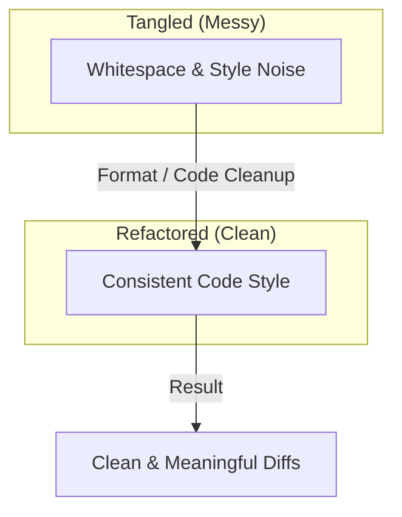

# 第10章：フォーマットとEditorConfig（読みやすさの土台）🧼📏

## この章のゴール🎯✨

* コードを **いつでも同じ見た目** に整えられる（読みやすさUP📖✨）
* チームや未来の自分と **ケンカしない差分** を作れる（Gitが平和🕊️🌿）
* AI提案のコードも **統一ルールで吸収** できる（雑さを減らす🤖🧹）

---

## 1. なんで「フォーマット」がそんなに大事？🧠💡


フォーマット（整形）は、見た目の好みじゃなくて **実務の安全装置** です🛡️✨

* **読むスピードが上がる**：目が迷子になりにくい👀➡️📌
* **差分が小さくなる**：本質（仕様・ロジックの変更）だけが見える🔎✨
* **AI提案の“クセ”を消せる**：一発で同じスタイルに揃えられる🤖➡️🧼
* **レビューが楽**：指摘が「中身」に集中できる🗣️💬



---

## 2. まずはIDEの整形を使いこなす🧰✨

### 2.1 Format Document / Format Selection（基本の基本）🧽📝


* **Format Document**：ファイル全体を整形🧼
* **Format Selection**：選んだ範囲だけ整形✂️

Visual Studioでは **Format Document** が `Ctrl+K, Ctrl+D`。さらに、EditorConfig の空白ルール（インデントや改行など）を既存行にも反映できます。([Microsoft Learn][1])

✅ 使いどころ

* ちょっと直した後に「見た目を整える」
* AIが出したコードを貼った後に「統一する」

⚠️ 注意

* いきなりファイル全体を整形すると、差分が増えることがある📈💦
  → **「触った範囲だけ」整形** or **整形だけのコミット** に分けるのがコツ🌿✨

---

## 3. Code Cleanup（おそうじボタン）🧹✨

### 3.1 Code Cleanupってなに？🧼🧠


Code Cleanupは、フォーマットだけじゃなく **コードスタイルの改善（並べ替え、不要using削除など）** をまとめて適用できる“おそうじ”です🧹✨

* 実行ショートカット：`Ctrl+K, Ctrl+E`
* **EditorConfigがある場合は、EditorConfigが最優先**（個人設定より強い）([Microsoft Learn][2])
* 「Refactoring Only」のルールはCode Cleanupの対象外（個別のQuick Actionsで適用）([Microsoft Learn][2])

### 3.2 Code Cleanupのおすすめ運用🌿📌

* **普段**：触ったファイルだけ Code Cleanup
* **PR前**：変更範囲に対して Code Cleanup して差分を整える✅
* **大掃除**：最初に「整形だけのコミット」を作ってから、機能修正を始める🧹➡️🔧

---

## 4. EditorConfig（.editorconfig）って何？📄✨


EditorConfigは、プロジェクトに置く **“見た目とスタイルのルールブック”** です📚✨
Visual Studioを含む多くのエディタが対応していて、**コードベースと一緒にルールが持ち運べる** のが強みです🚚💨([Microsoft Learn][1])

### 4.1 重要ポイント3つ🌟

* **プロジェクトのルールが個人設定に勝つ**（チームでブレない）([Microsoft Learn][1])
* **階層で効く**：フォルダに置くと、その配下に適用📁⬇️


([Microsoft Learn][1])
* **複数置ける**：一部フォルダだけ別ルールにもできる🧩([Microsoft Learn][1])

---

## 5. .editorconfig を作る方法🛠️✨

### 5.1 Visual Studioで追加する（いちばん簡単）🪄

Visual Studioでは、`.editorconfig` を追加するテンプレートが用意されていて、**空のもの** か **.NET向けの既定入り** を選べます。([Microsoft Learn][1])
さらに、Visual Studioのコードスタイル設定から **.editorconfig を自動生成** もできます（Tools > Options の Code Style から生成）。([Microsoft Learn][1])

### 5.2 CLIで作る（dotnet new）⌨️✨

`.NET 10` では `dotnet new editorconfig` テンプレートがあり、`--empty` で空ファイルも作れます。([Microsoft Learn][3])

### 5.3 VS Codeで使う場合🧩🧷

C# Dev Kit 環境では、EditorConfigは **VS CodeのEditorConfig拡張** でサポートされます。([Visual Studio Code][4])

---

## 6. まず入れる「最小のおすすめ .editorconfig」🌱✨

📌 目的：

* 余計な差分（行末スペース・改行なし）を消す🧼
* インデント・改行を固定して読みやすくする📏
* using を整えてファイル冒頭をスッキリ🧹

以下は“スタート用”の例です👇（プロジェクトの既存ルールがある場合は、それに寄せて調整OK🙆‍♀️）

```ini
root = true

## ----------------------------
## 全ファイル共通（まずはここだけでも十分）🧼
## ----------------------------
[*]
charset = utf-8
end_of_line = lf
insert_final_newline = true
trim_trailing_whitespace = true

## ----------------------------
## C# / VB 共通の .NET 整形ルール 🧩
## ----------------------------
[*.{cs,vb}]
indent_style = space
indent_size = 4

## using の並び＆グループ化（System を先頭に）📌
dotnet_sort_system_directives_first = true
dotnet_separate_import_directive_groups = true

## ----------------------------
## C# の見た目（ブレースや改行）🧱✨
## ----------------------------
[*.cs]
## 波かっこをどこで改行するか（Allman か K&R か）🧱
csharp_new_line_before_open_brace = all

## else / catch / finally の改行（読みやすさ優先）📖
csharp_new_line_before_else = true
csharp_new_line_before_catch = true
csharp_new_line_before_finally = true
```

* `end_of_line = lf` は、GitHubなどの混在環境でも差分が安定しやすい定番💡
* `dotnet_sort_system_directives_first` と `dotnet_separate_import_directive_groups` は using の整理に効きます🧹([Microsoft Learn][5])
* `csharp_new_line_before_open_brace` などのC#整形オプションは公式に整理されています。([Microsoft Learn][6])

---

## 7. “見た目の方針”を決めるコツ🧭✨

### 7.1 ブレース（{）は「全員が見慣れてる形」にする🧱👀


C#では **Allmanスタイル（{ を次行）** が多いです。`csharp_new_line_before_open_brace` で `all` / `none` を選べます。([Microsoft Learn][6])

* **all**：C#っぽい、縦に揃って見やすい📖
* **none**：横に詰まるけどコンパクト📦

迷ったら「既存コードに合わせる」→ これが最強🫶✨

### 7.2 using は「自動整理できる状態」を作る📌🧹

* System系を先頭に並べる
* グループを分ける（空行）
  この2点だけでも、ファイルの頭が読みやすくなります🧠✨([Microsoft Learn][5])

---

## 8. 仕上げ：dotnet format で全員の最終一致を取る✅🧰


IDEで整形しても、環境差で微妙にズレることがあります💦
そこで **最終チェック役** になるのが `dotnet format` です✨

* `.editorconfig` を読んで整形する（無ければ既定ルール）([Microsoft Learn][7])
* `--verify-no-changes` で「整形ズレがないか」検査できる（CIにも便利）([Microsoft Learn][7])
* `whitespace / style / analyzers` のサブコマンドもある([Microsoft Learn][7])

例👇

```bash
dotnet format
```

```bash
dotnet format --verify-no-changes
```

```bash
dotnet format whitespace
```

---

## 9. ミニ演習📝✨（この章の手を動かすパート）

### 演習A：保存時に差分が“きれい”になる体験🧼💖

1. `.editorconfig` をソリューション直下に追加📄
2. 1ファイルだけ、わざと行末スペースやインデント崩れを入れる😈
3. **Format Document**（`Ctrl+K, Ctrl+D`）で整形🧽
4. Git差分を見て「見た目のノイズが消える」ことを確認🔎✨([Microsoft Learn][1])

### 演習B：Code Cleanup で“おそうじ一括”🧹🌟

1. 既存のファイルを開く
2. **Code Cleanup**（`Ctrl+K, Ctrl+E`）を実行🧹
3. 差分を見て、EditorConfigが効いているかチェック✅([Microsoft Learn][2])

### 演習C：dotnet format で“最後の一致”🤝✨

1. ターミナルで `dotnet format` を実行
2. 変更が出たら、整形コミットとして分ける🌿
3. `dotnet format --verify-no-changes` でゼロになるまで調整✅([Microsoft Learn][7])

---

## 10. AI活用コーナー🤖✨（フォーマットを味方にする）

AIは速いけど、出力の癖がバラつきがちです💦
そこで「AI → 整形 → 差分レビュー」を固定すると超安全🛡️✨

おすすめの流れ👇

1. AIに「このメソッドを読みやすくして」など小さく依頼🤖
2. 貼り付け or 適用
3. **Format / Code Cleanup** で統一🧼
4. テスト & 差分レビュー✅🔎

Visual Studio 2026 は .NET 10 / C# 14 をサポートし、AI統合も強化されています。([Microsoft Learn][8])

---

## 11. よくあるハマりどころ😵‍💫➡️😌

### 11.1 「.editorconfig 置いたのに効かない」🌀

* 置き場所が深すぎて、対象ファイルがスコープ外のことがある📁
* EditorConfigは **フォルダ階層で適用** されるので、ソリューション直下に置くのが安全。([Microsoft Learn][1])

### 11.2 「既存コードが自動で全部変わらない」🤔

EditorConfigを追加しても、**新しく書いた行だけ** に適用されがち。
既存行を揃えるには **Format Document** や **Code Cleanup** が必要です🧽🧹([Microsoft Learn][1])

### 11.3 「改行コード地獄で差分が爆発」💣

* 最初に一度だけ、整形コミットでまとめて揃える🧹➡️🌿
* その後は“触った範囲だけ”整形で差分を小さく保つ📌

---

## まとめ🎀✨

* フォーマットは「読みやすさ」＋「差分の平和」＋「AIのブレ吸収」🧼🕊️🤖
* **EditorConfig** でルールをコードベースに固定📄✨([Microsoft Learn][1])
* **Code Cleanup** と **dotnet format** を組み合わせると、実務で強い✅🧹([Microsoft Learn][2])

---

（第11章は「ログの基礎」🧾🔍：不具合調査の“足跡”を作る話に続くよ✨）

[1]: https://learn.microsoft.com/en-us/visualstudio/ide/create-portable-custom-editor-options?view=visualstudio "Define Consistent Coding Styles with EditorConfig - Visual Studio (Windows) | Microsoft Learn"
[2]: https://learn.microsoft.com/en-us/visualstudio/ide/code-styles-and-code-cleanup?view=visualstudio "Code Style Options and Code Cleanup - Visual Studio (Windows) | Microsoft Learn"
[3]: https://learn.microsoft.com/en-us/dotnet/core/tools/dotnet-new-sdk-templates ".NET default templates for 'dotnet new' - .NET CLI | Microsoft Learn"
[4]: https://code.visualstudio.com/docs/csharp/formatting-linting "Formatting and Linting"
[5]: https://learn.microsoft.com/en-us/dotnet/fundamentals/code-analysis/style-rules/dotnet-formatting-options?utm_source=chatgpt.com "NET formatting options"
[6]: https://learn.microsoft.com/en-us/dotnet/fundamentals/code-analysis/style-rules/csharp-formatting-options "C# formatting options - .NET | Microsoft Learn"
[7]: https://learn.microsoft.com/en-us/dotnet/core/tools/dotnet-format "dotnet format command - .NET CLI | Microsoft Learn"
[8]: https://learn.microsoft.com/en-us/visualstudio/releases/2026/release-notes "Visual Studio 2026 Release Notes | Microsoft Learn"
