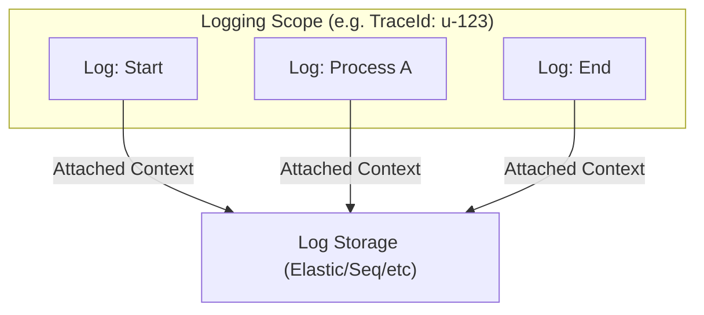

# 第11章：ログの基礎（困った時に追えるように）🧾🔍

## この章のゴール🎯

ログを「なんとなく出す」から卒業して、**原因にたどり着けるログ**を作れるようになります💪💖
リファクタ中に「あれ、動き変わってない…？」って不安になった時も、ログがあると安心です🙂🛡️

---

## 1. ログって結局なに？🤔📝


ログは、アプリの動きをあとから追いかけるための「足あと」👣✨
特に、次みたいなときに強い味方になります💡

* 失敗したのは **どこ**？（どの処理の途中？）🔎
* 何が **原因**？（入力？外部API？DB？）🧩
* 再現しない不具合が **本番だけ** で起きる…😱（←ログがないと詰みがち）

.NET のログは `ILogger` を中心に「高性能・構造化ログ」を前提に作られています📦✨ ([Microsoft Learn][1])

---

## 2. ログレベル（重要度）を使い分けよう🚦✨


ログは「重要度」で分類します。これを **ログレベル** と呼びます🙂

* **Trace**：いちばん細かい（情報量が多すぎ注意）🧠💥
  ※機密情報が混ざりやすいので、本番では基本ONにしない想定です⚠️ ([Microsoft Learn][2])
* **Debug**：開発中の調査向け🔧
* **Information**：通常の流れを追うための記録📍
* **Warning**：変だけど致命的ではない（例：リトライした、想定外入力だけど処理継続）🟡
* **Error**：処理が失敗した（ただしアプリ全体が落ちたとは限らない）🔴
* **Critical**：致命的（サービス継続が難しい）💣

このレベル分けがあるから、**必要なログだけを出す**（ノイズを減らす）ことができます✨ ([Microsoft Learn][1])

---

## 3. 「ログは文章じゃなくデータ」ってどういうこと？📦🪄

C# の `ILogger` は「構造化ログ」が基本です。
ポイントは **メッセージテンプレート**（`{}` のプレースホルダー）🧩✨

たとえば、こう👇

```csharp
logger.LogInformation("Payment started. UserId={UserId} Amount={Amount}", userId, amount);
```

この `{UserId}` や `{Amount}` は、ただの文字埋め込みじゃなくて
**“フィールド（検索できるデータ）” として扱える**設計です📌✨ ([Microsoft Learn][1])

### 文字列補間（$"..."）はなるべく避けよう🙅‍♀️⚡


ログで `$"UserId={userId}"` みたいな文字列補間を多用すると、性能面で不利になることがあります⚠️
Microsoft のドキュメントでも「多くの場合テンプレート形式を推奨」とされています✨ ([Microsoft Learn][1])

---

## 4. “1行の情報量”の作り方📏🧾✨


読みやすいログは、**1行で状況が分かる**のが理想です🌟

最低限おすすめはこのセット👇（全部を毎回入れる必要はないよ🙂）

* 何が起きた？（短い動詞で）📝
* どの対象？（例：注文ID、ユーザーID、ファイル名）🏷️
* 結果は？（成功/失敗、件数、ステータス）✅❌
* 失敗なら例外も（`ex` を渡す）💥
* 追跡用ID（あとで追える）🧵✨（後で出てくる Scope が便利！）

---

## 5. どこにログが出るの？（代表）🪟🔍


.NET のログは「プロバイダー」を追加して、出力先を決めます📮✨
標準で使える代表例はこんな感じ👇

* **Console**：コンソール出力🖥️
* **Debug**：デバッグ出力（Visual Studio の Output ウィンドウなど）🧠
* **EventSource**：イベントトレース系（Windows なら ETW と関係）📡
* **EventLog（Windows）**：Windowsイベントログ📘

テンプレート（Worker系など）では `CreateApplicationBuilder` がこれらを追加するのが一般的です🧰✨ ([Microsoft Learn][3])

### ファイルに出したいときは？📄

ここ、超大事ポイント⚠️
**ASP.NET Core には “ファイルへ書く標準プロバイダー” は含まれていません。**
ファイル出力したいなら **サードパーティ（例：Serilog）** を使うのが定番です📌 ([Microsoft Learn][4])

---

## 6. 実装：最小のログを出してみよう🛠️✨

### 6-1. まずは `ILogger` を使う（Consoleアプリ例）🖥️🧪

「ホストを作って、ILoggerを注入して使う」形が基本です🙂

```csharp
using Microsoft.Extensions.DependencyInjection;
using Microsoft.Extensions.Hosting;
using Microsoft.Extensions.Logging;

var builder = Host.CreateApplicationBuilder(args);

// 出力先を分かりやすく（コンソールに）
builder.Logging.ClearProviders();
builder.Logging.AddSimpleConsole(options =>
{
    options.SingleLine = true;
    options.TimestampFormat = "HH:mm:ss ";
});

builder.Logging.SetMinimumLevel(LogLevel.Information);

builder.Services.AddTransient<CheckoutService>();

using var host = builder.Build();

var svc = host.Services.GetRequiredService<CheckoutService>();
await svc.CheckoutAsync(userId: "u-123", amount: 2980);

public sealed class CheckoutService(ILogger<CheckoutService> logger)
{
    public Task CheckoutAsync(string userId, int amount)
    {
        logger.LogInformation("Checkout started. UserId={UserId} Amount={Amount}", userId, amount);
        logger.LogInformation("Checkout finished. UserId={UserId}", userId);
        return Task.CompletedTask;
    }
}
```

**コツ**：ログ本文は短く！ 代わりに `{UserId}` みたいなフィールドを添えると、調査が超ラクになります📌✨ ([Microsoft Learn][1])

---

## 7. EventId（イベント番号）で「同じ種類のログ」を束ねる🏷️🔢✨

ログが増えると、検索で「この種類のログだけ見たい！」が必ず来ます👀
そこで便利なのが **EventId** です💡

```csharp
using Microsoft.Extensions.Logging;

internal static class LogEvents
{
    internal static readonly EventId CheckoutStart = new(1000, "CheckoutStart");
    internal static readonly EventId CheckoutEnd   = new(1001, "CheckoutEnd");
    internal static readonly EventId CheckoutFail  = new(1400, "CheckoutFail");
}
```

使う側👇

```csharp
logger.LogInformation(LogEvents.CheckoutStart, "Checkout started. UserId={UserId} Amount={Amount}", userId, amount);
```

EventId は「同じ種類の出来事」をまとめる考え方です🧩✨ ([Microsoft Learn][1])

---

## 8. Scope（スコープ）で “共通情報” を自動で付ける🧵✨


リファクタや不具合調査で「この一連の処理のログだけ追いたい！」ってなりがちです🙂
そこで **Scope** を使うと、同じ処理中のログに共通情報を付けられます📌

```csharp
using System.Collections.Generic;

var traceId = Guid.NewGuid().ToString("N");

using (logger.BeginScope(new List<KeyValuePair<string, object>>
{
    new("TraceId", traceId),
    new("UserId", userId),
}))
{
    logger.LogInformation("Checkout started. Amount={Amount}", amount);
    logger.LogInformation("Validate finished");
    logger.LogInformation("Checkout finished");
}
```

Scope は「同じデータをまとめて付ける」ための仕組みで、`BeginScope()` が返す `IDisposable` を `using` で囲みます🧤✨ ([Microsoft Learn][1])



---

## 9. 例外は “exを渡して” 記録する💥🧯


エラーのログは、**例外オブジェクトも一緒に渡す**のが基本です🙂
スタックトレースなどが出力先に残せます📌（出力のされ方はプロバイダー依存） ([Microsoft Learn][1])

```csharp
try
{
    DoSomething();
}
catch (Exception ex)
{
    logger.LogError(LogEvents.CheckoutFail, ex, "Checkout failed. UserId={UserId}", userId);
    throw;
}
```

---

## 10. ミニ演習：失敗ケースのログを読みやすくする🪄📝✨

### お題🎀

次の「微妙ログ」を、**原因に近づけるログ**に直してみよう💪

❌ よくある微妙パターン（情報が足りない / 検索しづらい）😵‍💫

```csharp
Console.WriteLine("start");
Console.WriteLine("error!");
Console.WriteLine("end");
```

✅ 改善の方向性（例）🌟

* レベルを付ける（Information / Warning / Error）🚦
* 何の処理か分かる動詞にする📝
* 重要な値をフィールド化する（`{OrderId}` みたいに）🏷️
* 失敗時は例外も付ける💥
* 1つの処理を Scope で束ねる🧵

### 目標イメージ（サンプル）✨

```csharp
var traceId = Guid.NewGuid().ToString("N");

using (logger.BeginScope(new[] { new KeyValuePair<string, object>("TraceId", traceId) }))
{
    logger.LogInformation("Payment started. OrderId={OrderId} Amount={Amount}", orderId, amount);

    try
    {
        gateway.Charge(orderId, amount);
        logger.LogInformation("Payment succeeded. OrderId={OrderId}", orderId);
    }
    catch (Exception ex)
    {
        logger.LogError(ex, "Payment failed. OrderId={OrderId} Amount={Amount}", orderId, amount);
        throw;
    }
}
```

---

## 11. AI拡張（Copilot / OpenAI系）に頼むときのコツ🤖✨

AIにログ改善を頼むと、スピードは出ます⚡
でも「入れるべき情報」は仕様や安全面に直結するので、人間が最終判断します🙂🛡️

### 使いやすい依頼文（例）🧾

* 「このメソッドで、調査に必要なログ項目（フィールド）を列挙して」📋
* 「Information/Warning/Error の境界を提案して（理由つきで）」🚦
* 「メッセージテンプレート形式（`{}`）で、ログ案を3パターン」🧩
* 「PII/秘密情報をログに入れないように、危険な項目を指摘して」⚠️

### レビューの観点✅

* 文字列補間 `$"..."` になってない？（テンプレートが良い） ([Microsoft Learn][1])
* `{}` の中身が「意味ある名前」になってる？🏷️
* 失敗時に、必要な値が残る？（OrderId/外部結果など）🧠
* 機密が混ざってない？（トークン/パスワード/個人情報）🔒

---

## 12. 仕上げチェックリスト✅🧾✨

コミット前に、ここだけ確認すると事故りにくいよ🙂

* [ ] **成功ログ**：処理の開始/完了が追える📍
* [ ] **失敗ログ**：例外（ex）＋原因に近い値（ID等）がある💥
* [ ] **テンプレート形式**で出してる（補間しない）🧩 ([Microsoft Learn][1])
* [ ] **ログレベル**が適切（全部Errorにしてない）🚦 ([Microsoft Learn][2])
* [ ] 重要処理は **Scope** で束ねられる（TraceIdなど）🧵 ([Microsoft Learn][1])

---

## 13. （ちょい先取り）観測の世界：OpenTelemetryって？🌍✨

「ログを集めて検索しやすくする」「トレースと一緒に見る」みたいな“観測”の仕組みとして、OpenTelemetry がよく使われます📡
OpenTelemetry .NET は `ILogger` と統合してログを収集・エクスポートできる、と説明されています🧩✨ ([OpenTelemetry][5])

今すぐ必須ではないけど、「ログはデータ」「TraceIdで束ねる」みたいな考え方が、ここに繋がっていきます🙂🧵

---

ここまでで、ログは「出す」じゃなくて **“追える形で残す”** ものになってきたはず！🧾✨
次の章（例外）に入ると、**失敗ログの品質**がさらに上がります💥📈

[1]: https://learn.microsoft.com/en-us/dotnet/core/extensions/logging "Logging in C# - .NET | Microsoft Learn"
[2]: https://learn.microsoft.com/ja-jp/dotnet/api/microsoft.extensions.logging.loglevel?view=net-9.0-pp&viewFallbackFrom=dotnet-plat-ext-8.0&utm_source=chatgpt.com "LogLevel Enum (Microsoft.Extensions.Logging)"
[3]: https://learn.microsoft.com/en-us/dotnet/core/extensions/logging-providers?utm_source=chatgpt.com "Logging providers - .NET"
[4]: https://learn.microsoft.com/ja-jp/aspnet/core/fundamentals/logging/?view=aspnetcore-10.0&utm_source=chatgpt.com ".NET と ASP.NET Core でのログ記録"
[5]: https://opentelemetry.io/docs/languages/dotnet/logs/ "OpenTelemetry .NET logs | OpenTelemetry"
