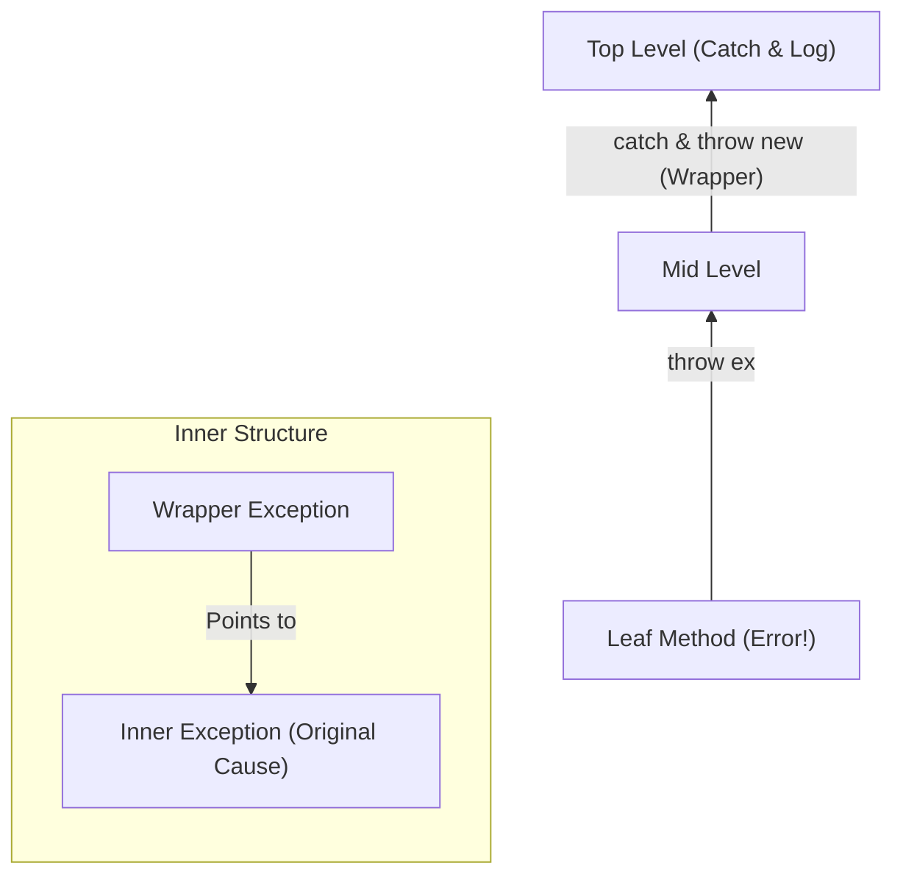

# 第12章：例外の基礎（まず“投げる・握る”のルール）💥🚧

例外（Exception）は、うまく使うと **「壊れたときにすぐ直せるコード」** になります✨
でも使い方を間違えると、**バグが隠れて大事故**になりがち…😱💦
この章では、まず **“投げる（throw）・握る（catch）”の基本ルール** を、実務で困らない形で身につけます🧠🔧

---

## この章のゴール🎯✨

* ✅ 「どこで throw するべきか」が分かる
* ✅ 「どこで catch するべきか」が分かる
* ✅ “握りつぶし”をやめて、原因が追える例外処理にできる
* ✅ デバッガで例外を追える（Exception Helper / Exception Settings）🔍
* ✅ AIの提案を“安全に”使って例外処理を整えられる🤖🛡️

---

## 1) 例外って何？🤔💭（超ざっくり）

例外は「処理が続けられない失敗」を伝える仕組みです💥
発生すると、.NET は **スタックトレース（どの順で呼ばれたか）** を持った状態で上へ上へ伝播します🧗‍♀️⬆️

### 例外に入っている主な情報📦

* `Message`：人間向けの説明📝
* `StackTrace`：どこから呼ばれてここに来たかの道順🗺️
* `InnerException`：原因になった例外（ラップしたとき）🥟

Visual Studio では、例外が起きた瞬間に **Exception Helper** が出て、`InnerException` も追えます👀✨ ([Microsoft Learn][1])



---

## 2) “投げる（throw）”の基本ルール🧨


### ルールA：例外は「通常ルート」に使わない🚫

「分岐のために例外を使う」は避けるのが原則です🙅‍♀️
たとえば、`TryParse` があるのにわざわざ `Parse` を try/catch する…みたいなのは、読みづらくなりがち💦
.NET の設計ガイドラインでも **“通常の制御フローに例外を使うな”** とされています📏 ([Microsoft Learn][2])

✅ 例外が向く：DBやファイルI/O、外部API失敗、壊れた状態、前提違反
❌ 例外が向かない：想定内の入力ミス、分岐の手段、探索の手段

---

### ルールB：前提条件（引数チェック）は“入り口”で投げる🚪✨

「おかしい値を中に入れない」ために、メソッドの最初でガードします🛡️

```csharp
public void RegisterUser(string email, int age)
{
    ArgumentException.ThrowIfNullOrEmpty(email); // null/空文字なら即例外🧷
    ArgumentOutOfRangeException.ThrowIfNegative(age); // 負なら即例外🔢

    // ここから下は「前提が成立してる世界」🌈
}
```

`ArgumentException.ThrowIfNullOrEmpty` は .NET 10 でも公式APIとして載っています📚 ([Microsoft Learn][3])
`ArgumentOutOfRangeException.ThrowIfNegative` も .NET 10 のAPIにあります📚 ([Microsoft Learn][4])

---

### ルールC：例外型は“できるだけ具体的に”🎯

「何がダメだったか」を型で伝えると、呼び出し側が正しく扱えます😊

よく使う例外（超頻出）🌟

* `ArgumentNullException`：nullダメ🙅‍♀️
* `ArgumentException`：引数が不正😵
* `ArgumentOutOfRangeException`：範囲外📉
* `InvalidOperationException`：その状態ではできない😖
* `IOException`：ファイル/ストレージ系の失敗📁

---

## 3) “握る（catch）”の基本ルール🤝🚧

### ルールD：「回復できるときだけ catch」✅

Microsoft Learn の例外ベストプラクティスでも、**回復できないなら catch しない** が基本です📌 ([Microsoft Learn][5])

---

### catch していい理由は、だいたい3つ💡

#### ① 回復できる（別の手段がある）🔁

例：ファイルが無いなら初期データを作る、など。

#### ② 後片付けが必要（でも基本は using でOK）🧹

`using` が最優先✨（`finally` は「usingできない後片付け」に）
これは公式の推奨でも **using優先** です🧼 ([Microsoft Learn][5])

#### ③ 情報を足す / 例外を“翻訳”する🌐

例：`IOException` をそのままUIに見せず、ドメイン寄りの例外に変換する
（この「翻訳」は第34章でさらに深掘りするけど、ここで基礎だけ触れるよ🫶）

---

## 4) “握りつぶし”が一番ダメ🙅‍♀️💣

次の2つは事故の香りがプンプンします👃💥

### ダメ例①：空の catch（闇に消える…）🕳️

```csharp
try
{
    Save();
}
catch
{
    // 何もしない ← バグが隠れる😱
}
```

### ダメ例②：とりあえず成功扱い（静かに壊れる）🧨

```csharp
try
{
    return LoadConfig();
}
catch (Exception)
{
    return new Config(); // しれっとデフォルト返す😇（地獄の始まり）
}
```

✅ 例外を握るなら、最低でも

* 「回復した」ことが説明できる
* もしくは「ログなどで追える」
* もしくは「上位が扱いやすい形に変換する」
  このどれかが必要だよ🛡️✨

---

## 5) 再スロー（throwし直し）の正しい作法🔥

### ルールE：そのまま投げ直すなら `throw;` ✅

`throw;` は **元のスタックトレースを保ったまま** 上に投げ直します🗺️✨
Microsoft Learn でも「適切に再スローする」ことが重要とされています📌 ([Microsoft Learn][6])

```csharp
try
{
    DoWork();
}
catch (IOException)
{
    // ここで何か後処理（ログなど）をして…
    throw; // 元の場所が分かるまま上に伝える✅
}
```

### ルールF：情報を足したいなら “ラップ” + InnerException 🥟

```csharp
try
{
    repo.Save(items);
}
catch (IOException ex)
{
    throw new TodoStorageException("保存に失敗しました。保存先にアクセスできません。", ex);
}
```

`InnerException` を持たせると、Exception Helper で原因を追いやすいです🔍✨ ([Microsoft Learn][1])

---

## 6) finally と using：後片付けの王道👑🧼

### 基本は `using` が最強✨

`IDisposable` なもの（Stream, DB接続など）は `using` で必ず片付けよう🧹
例外が起きても片付けされるのが大事✅ ([Microsoft Learn][5])

```csharp
using var stream = File.OpenRead(path);
// ここで例外が起きても stream はDisposeされる🧼✨
```

### `finally` は「usingできない後処理」に📌

```csharp
StartSpinner();
try
{
    DoWork();
}
finally
{
    StopSpinner(); // 例外でも止める🌀➡️🛑
}
```

---

## 7) async とキャンセル：エラー扱いしない例外がある😴⏹️

非同期では、キャンセル時に `OperationCanceledException` 系が飛ぶことがあります🧵⚡
これは「想定された終了」のことも多いので、ログをエラーとして残すとノイズになりがち💦
Microsoft Learn でも **キャンセルや非同期例外の扱い** が項目としてあります📌 ([Microsoft Learn][5])

よくある形（キャンセルは静かに抜ける）👇

```csharp
try
{
    await DoWorkAsync(ct);
}
catch (OperationCanceledException) when (ct.IsCancellationRequested)
{
    // キャンセルは正常系として扱うことも多い🕊️
}
```

`when`（例外フィルター）で条件付きにすると、余計なcatchを減らせてスッキリします✨

---

## 8) Visual Studioで例外を追う🔍🧑‍💻

### Exception Helper（例外が起きた瞬間の情報）🧾✨

* 例外の型、メッセージ、スタック、`InnerException` を確認できる
* 「この例外で止まる/止まらない」を切り替えられる ✅ ([Microsoft Learn][1])

### Exception Settings（どの例外で止めるか）🧨📌

* Debug → Windows → **Exception Settings**
* 例外をチェックすると「ハンドルされてても投げられた瞬間に止まる」＝ first chance exception で止められるよ🛑 ([Microsoft Learn][7])

---

## 9) ミニ演習📝✨（“握りつぶし”整理）

### お題：雑なcatchを“意味のある例外処理”に直す💪🌸

**Before（ありがちな事故コード）**😇💣

```csharp
public void SaveTodo(string path, string text)
{
    try
    {
        File.WriteAllText(path, text);
    }
    catch (Exception)
    {
        // 何も言わない（闇）🕳️
    }
}
```

**やること（3ステップ）**👇

1. `Exception` をやめて、起こりうる例外に絞る🎯
2. “回復できるか？”を決める（できないなら握らない）🤔
3. どうしても握るなら、上位が扱える形にする📦

**After（例：翻訳して上へ）**✨

```csharp
public void SaveTodo(string path, string text)
{
    try
    {
        File.WriteAllText(path, text);
    }
    catch (IOException ex)
    {
        throw new TodoStorageException("Todoの保存に失敗しました（保存先にアクセスできません）。", ex);
    }
}
```

ポイント🌟

* “何が起きたか”が分かるメッセージになった📝
* 原因（ex）は `InnerException` として保持🥟
* UI側（呼び出し側）は `TodoStorageException` だけ見ればよくなる✨

---

## 10) ミニ演習📝✨（引数チェックを“入り口”へ）

**Before**（中で落ちる…）💥

```csharp
public int Average(int total, int count)
{
    return total / count; // count=0で爆発💣
}
```

**After**（入口で意味のある例外に）🛡️

```csharp
public int Average(int total, int count)
{
    if (count == 0)
        throw new ArgumentOutOfRangeException(nameof(count), "count は 0 にできません。");

    return total / count;
}
```

「どの引数が悪いか」が明確だと、直すのが速いよ🚀✨

---

## 11) AI活用🤖✨（安全に“例外の設計”を相談する）

AIは例外処理の提案が得意だけど、**握りつぶし案**も出しがちなので要注意⚠️😵‍💫
コツは「質問の仕方を固定」することだよ📌✨

### そのまま使えるプロンプト例🪄

* ✅ catchが必要か判定してもらう
  「この try/catch は必要？ “回復できる/できない”観点で理由つきで分類して」

* ✅ 例外型の選定
  「この条件ではどの例外型が適切？ Argument系 / InvalidOperation など候補と理由を出して」

* ✅ 握るなら最低限の形
  「握りつぶし禁止で。上位が扱いやすい例外に翻訳するならどう設計する？」

* ✅ 例外メッセージ改善
  「利用者向け1行メッセージと、ログ向け詳細（idやpath）を分けて提案して」

AIの提案は **必ず差分レビュー + テスト実行** で確定ね✅🤖🛡️

---

## 12) 重要チェックリスト✅✨（これだけ覚えればOK）

### throw（投げる）🧨

* ✅ 通常フローに例外を使ってない？ ([Microsoft Learn][2])
* ✅ 引数チェックは入口でやってる？🚪
* ✅ 例外型は具体的？🎯
* ✅ メッセージは「何が・なぜダメか」が短く書けてる？📝

### catch（握る）🤝

* ✅ 回復できるときだけ握ってる？ ([Microsoft Learn][5])
* ✅ 空catchになってない？🕳️
* ✅ 再スローは `throw;`（スタック維持）でできてる？🗺️ ([Microsoft Learn][6])
* ✅ デバッガ設定（Exception Settings）で原因を追える？🔍 ([Microsoft Learn][7])

---

## まとめ🌟

例外は「怖いもの」じゃなくて、**失敗を正しく伝えて早く直すための道具**です🧰✨
この章で身につけた **投げる場所 / 握る場所 / 握りつぶし禁止 / 正しい再スロー** を守るだけで、バグ対応スピードが一気に上がるよ🚀💕

次の章からは、IDEのリファクタ機能でコード自体をどんどん整えていきます✂️🌸

[1]: https://learn.microsoft.com/en-us/visualstudio/debugger/exception-helper?view=visualstudio "Inspect and break exceptions when debugging - Visual Studio (Windows) | Microsoft Learn"
[2]: https://learn.microsoft.com/en-us/dotnet/standard/design-guidelines/exception-throwing "Exception Throwing - Framework Design Guidelines | Microsoft Learn"
[3]: https://learn.microsoft.com/en-us/dotnet/api/system.argumentexception.throwifnullorempty?view=net-10.0&utm_source=chatgpt.com "ArgumentException.ThrowIfNullOrEmpty(String ..."
[4]: https://learn.microsoft.com/en-us/dotnet/api/system.argumentoutofrangeexception.throwifnegative?view=net-10.0&utm_source=chatgpt.com "ArgumentOutOfRangeException.ThrowIfNegative<T>(T, ..."
[5]: https://learn.microsoft.com/en-us/dotnet/standard/exceptions/best-practices-for-exceptions "Best practices for exceptions - .NET | Microsoft Learn"
[6]: https://learn.microsoft.com/en-us/dotnet/standard/exceptions/best-practices-for-exceptions?utm_source=chatgpt.com "Best practices for exceptions - .NET"
[7]: https://learn.microsoft.com/en-us/visualstudio/debugger/managing-exceptions-with-the-debugger?view=visualstudio "Manage exceptions with the debugger - Visual Studio (Windows) | Microsoft Learn"
