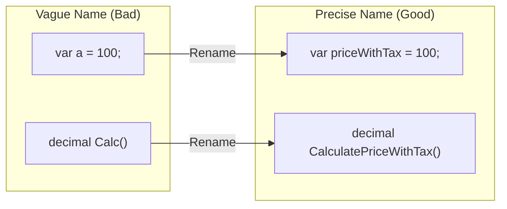

# 第13章：Rename（名前で8割決まる）🏷️✨

## この章のゴール🎯

この章を読み終わると、こんなことができるようになります😊💡

* 「名前を変えるだけ」でコードをグッと読みやすくするコツがわかる👀✨
* Visual Studio / VS Code の **Rename（名前の変更）** を安全に使える🛠️✅
* AIに命名案を出してもらい、**最後は自分で良い名前を決められる**🤖➡️🧠✨
* Renameの“地雷”を踏まずに進められる🚧💣➡️🛡️

---

## 1) Renameって何がうれしいの？😆✨


Renameは「動作を変えずに、名前だけ変える」リファクタです🏷️
でも侮れません…！名前はコードの“説明書”そのもの📘✨

### 名前が良いと起きる良いこと🌈

* 読むスピードが上がる🏃‍♀️💨（脳内変換が減る🧠✨）
* コメントが減る🧾➡️📉（コードで語れる💬➡️🧩）
* バグが減る🪲➡️✅（「勘違い」が減る！）
* AIも賢くなる🤖✨（良い名前があると提案の精度が上がる）



---

## 2) 命名の“基本の型”🍳✨（C#の王道ルール）

「好み」の前に、まずは **C#の基本ルール** を押さえるのが近道です🚀
（チーム開発でも揉めにくい🤝✨）

### よく使う命名規則📌


* **クラス名・メソッド名**：PascalCase（例：`OrderService` / `CalculateTotal`）
* **引数・ローカル変数・privateフィールド**：camelCase（例：`orderId` / `totalPrice`）
* **privateフィールド**：`_` で始める（例：`_items`）
* **省略しすぎない**（`tmp`, `data`, `info` は要注意⚠️）
  これらは Microsoft のガイドとして整理されています。([Microsoft Learn][1])

### bool（真偽値）の命名は超重要✅❌


* ✅ 良い例：`isValid`, `hasPermission`, `canRetry`, `shouldNotify`
* ⚠️ 迷いがちな例：`flag`, `check`, `ok`
* 💣 地雷：`isNotValid`（否定が重なると読む人の脳がバグる🧠💥）

---

## 3) “悪い名前”あるある図鑑📚👀（よく出るやつ）

### ① 意味が広すぎる🫥


* `data`, `info`, `item`, `value`, `result`
  → **何の？** が不明😵‍💫

✅ 改善のコツ
「ドメインの言葉」を入れる🎯

* `user` / `order` / `invoice` / `totalPrice` / `shippingFee` みたいに✨

---

### ② 短すぎる🧩

* `n`, `x`, `tmp`
  → 数学ならOKでも、業務コードだとつらい🥲

✅ 改善のコツ
「単位・意味」を入れる

* `retryCount` / `timeoutSeconds` / `maxItems`

---

### ③ 名前がウソをつく🤥（最悪）

* `GetUser()` なのにDB更新してる
* `Calculate()` なのにログ出したり送信したりしてる
  → 読む人が事故る💥

✅ 改善のコツ
“動詞”を正しくする（副作用があるならそれが伝わる名前へ）⚡

---

## 4) Renameの実例（Before / After）🪄✨

### 例1：変数名（意味を足す）🧠➡️✨

```csharp
// Before 😵
var a = price * 1.1m;

// After 😊
var priceWithTax = price * 1.1m;
```

ポイント💡

* `a` → 何かわからない
* `priceWithTax` → 説明がいらない✨

---

### 例2：メソッド名（やることを正確に）🔧✨

```csharp
// Before 😵
decimal Calc(decimal price) => price * 1.1m;

// After 😊
decimal CalculatePriceWithTax(decimal price) => price * 1.1m;
```

ポイント💡

* `Calc` は広すぎる
* “何を計算？”が名前で伝わるのが強い🏷️✨

---

### 例3：クラス名＋ファイル名（探しやすくする）📁🔎✨

```csharp
// Before 😵
class Manager { }

// After 😊
class OrderManager { }
```

さらにVisual Studioでは、**型名とファイル名が同じ**なら
Rename時に **ファイル名も一緒に変えられるチェック** が出ます📄➡️📄✨
（部分クラスなど一部条件では出ません）([Microsoft Learn][2])

---

## 5) Visual Studio の Rename（最短で安全）🛠️✨

### 一番よく使う操作⚡

1. 変えたい名前にカーソルを置く
2. **Ctrl + R, Ctrl + R**
3. 新しい名前を入力して Enter（または Apply）✅

この流れが公式の手順として案内されています。([Microsoft Learn][2])

### “安全装備”もあるよ🛡️✨

RenameのUIでは、状況により👇が使えます📌

* コメントや文字列も更新する（必要なときだけ）🧾🔁
* 変更のプレビューを見る👀✨
  （チェックボックスから操作できます）([Microsoft Learn][2])

### もう1つの入口（編集→クイックアクション）💡

名前を直接書き換えたあとに、カーソルをその名前に置いて
**Ctrl + .（電球💡）→ Rename** でも同じことができます✨([Microsoft Learn][2])

---

## 6) Visual Studio Code の Rename（サクッと）🧰✨

* シンボルにカーソル
* **F2** で Rename
* 必要なら **Refactor Preview** を出してから適用👀✅

Copilotを使った「名前の改善」手順でも、F2が案内されています。([GitHub Docs][3])
また、VS CodeにはRefactor Previewの操作が整理されています。([Visual Studio Code][4])

---

## 7) Renameの“地雷ポイント”🚧💣（ここだけ注意！）


Renameは強いけど、万能ではありません🙂

### ① 文字列（string）の中身は基本別物🧵

例：ログ文、SQL、JSONキー、URL、XAMLのバインディング名…
「コードの名前」と「文字列」は別世界になりがち🌍💦

✅ 対策

* Renameのオプションで文字列やコメント更新を使う（必要なときだけ）([Microsoft Learn][2])
* それでも不安なら、変更後にプロジェクト検索🔎✨

---

### ② 反射・属性・シリアライズ系は要警戒🪞🏷️

たとえばこんなもの👇

* `nameof(...)` は強い味方🛡️（リネームに追従しやすい）
* `[JsonPropertyName("...")]` / `[DataMember(Name="...")]` みたいな指定
* DIコンテナの文字列指定（あれば）
* WPFのBindingのパス文字列 など

✅ 対策

* なるべく **文字列で名前を持たない設計**に寄せる（`nameof` を使う等）🧠✨
* Rename後にテスト＆動作確認✅🧪

---

### ③ 公開APIのRenameは慎重に📦⚠️

外部から呼ばれるメソッドやライブラリの公開メンバーは、Renameすると利用者が壊れるかも💥

✅ よくある安全策（例）

* 新しい名前を作って、古い名前は残しつつ非推奨にする（`[Obsolete]`）
  （※チームや製品方針に合わせてね）

---

## 8) AIで命名を加速する🤖⚡（でも最後は人間が決める🧠✨）


### AIでできること🎁

* “意味が伝わる候補名”を複数出す
* チームの命名スタイルに合わせた候補を作る
* 長すぎる/短すぎるのバランス調整

Visual Studioでは GitHub Copilot Chat を使った **AI rename suggestions** の紹介もされています。([Microsoft for Developers][5])

---

### AIに投げると強いプロンプト例🪄

そのままコピペでOK✂️✨

**プロンプト1：候補を10個**

```text
この変数は「税込み価格」を表します。C#の一般的な命名で、候補を10個ください。
短すぎず、意図が明確な名前にしてください。
```

**プロンプト2：bool専用**

```text
このboolは「支払いが完了しているか」を表します。
is/has/can/shouldの型で、読みやすい候補を5個ください。
```

**プロンプト3：チーム規約寄せ**

```text
C#の命名規則（PascalCase/camelCase, privateフィールドは_）に合わせて、
このメソッド名を改善してください。副作用がある場合はそれが伝わる名前にしてください。
```

---

### AIの提案を採用するときのチェック✅✅

* 名前を読んだ瞬間に「何のこと？」が消える？👀✨
* その名前はウソをついてない？🤥❌
* 将来、似た概念が増えても耐える？📈✨
* “同じ概念”に同じ単語を使えてる？（用語ゆれ防止）📚🔁

---

## 9) ミニ演習📝✨（Renameで“読みやすさ”を作る）

### お題：このコード、名前を直して読みやすくしてね🏷️💪

次のコードの「名前だけ」を改善します（動作は変えない）✅

```csharp
public class Service
{
    public decimal Calc(decimal p, bool f)
    {
        if (f == false)
        {
            return p;
        }

        return p * 1.1m;
    }
}
```

### 目標🎯

* `Service` / `Calc` / `p` / `f` を改善する✨
* `f == false` を「読みやすい形」にする（意味はそのまま）🧠✨

ヒント💡

* 税込みなら “WithTax” みたいに意味を入れる
* boolは肯定形に寄せる（`isTaxIncluded` など）✅
* ネストを増やさずスッキリ（第17章の伏線🚪✨）

---

### 例（改善案のひとつ）🌸

```csharp
public class PriceCalculator
{
    public decimal CalculatePrice(decimal basePrice, bool includeTax)
    {
        if (!includeTax)
        {
            return basePrice;
        }

        return basePrice * 1.1m;
    }
}
```

---

## 10) 仕上げのチェックリスト✅🧾✨（Renameしたらこれ！）

* ビルドできる？🔨✅
* テストが通る？🧪✅（あるなら最優先！）
* 変更差分（Diff）を見て「余計な所まで変えてない？」👀📌
* 文字列や属性で “名前を固定” してない？🔎🪞
* 小さくコミットできる粒度？🌿✅

---

## 📌 最新トピック（2026年1月時点）🆕✨

* .NET 10 は **2025/11/11** にリリースされた LTS で、サポートは **2028年11月頃まで** と案内されています。([Microsoft for Developers][6])
* .NET 10 とあわせて **Visual Studio 2026 の更新**にも触れられています。([Microsoft for Developers][6])
* C# 14 のハイライトも .NET 10 の発表でまとめられています。([Microsoft for Developers][6])

---

## まとめ🌟

Renameは「一番カンタンなのに、一番効く」リファクタです🏷️✨
ツールを使って安全に一括変更しつつ、**“意図が伝わる名前”** を作っていこう😊💖

次章は **Extract Method（長いメソッドを切る）** ✂️📦
Renameで整えた“言葉”が、分割の精度を上げてくれます✨

[1]: https://learn.microsoft.com/en-us/dotnet/csharp/fundamentals/coding-style/identifier-names?utm_source=chatgpt.com "C# identifier naming rules and conventions"
[2]: https://learn.microsoft.com/en-us/visualstudio/ide/reference/rename?view=visualstudio "Refactor rename - Visual Studio (Windows) | Microsoft Learn"
[3]: https://docs.github.com/en/copilot/tutorials/refactor-code?utm_source=chatgpt.com "Refactoring code with GitHub Copilot"
[4]: https://code.visualstudio.com/docs/editing/refactoring?utm_source=chatgpt.com "Refactoring"
[5]: https://devblogs.microsoft.com/visualstudio/ai-powered-rename-suggestions/?utm_source=chatgpt.com "Naming Made Easy: AI-Powered Rename Suggestions"
[6]: https://devblogs.microsoft.com/dotnet/announcing-dotnet-10/ "Announcing .NET 10 - .NET Blog"
