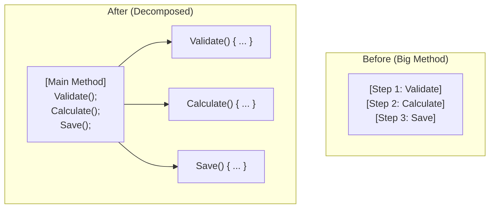

# 第14章：Extract Method（長いメソッドを切る）✂️📦

## ゴール🎯✨

この章を終えると、こんなことができるようになります😊💗

* 長いメソッドを「意味のかたまり」で分割できる✂️
* 分割したメソッドに“いい名前”を付けられる🏷️✨
* 動作を変えずに、安全に切れる（差分・テストで確認）✅
* IDEの機能でサクッと切れる（手作業で事故らない）🛟🧠

---

## Extract Methodってなに？🤔💡


**まとまった処理の一部を、新しいメソッドに切り出す**リファクタです✂️📦
元の場所には「新しいメソッドを呼ぶ1行」が残るので、読みやすさが一気に上がります📖✨



---
文章でいうと…

* だらだら長い文章 → **段落に分けて見出しを付ける** 느낌です📚💕

---

## 「長いメソッド」がしんどい理由😵‍💫💦

長いと、こうなりがちです👇

* 何をしてるか一度で読めない（スクロール地獄）📜🌀
* バグ調査がつらい（どこが原因？）🔍💥
* ちょっと直すだけで怖い（影響範囲が広い）😱
* テストも書きにくい（切り出せないと狙えない）🧪🧩

だから、**「読めるサイズ」に切る**のが最初の大きな一歩です🌱✨

---

## どこで切る？✂️「ここが境界だよ」サイン7つ👀🚦

### ① コメントを書きたくなった所💬

「ここで検証」「ここで合計」みたいなコメントを書きたくなったら、そこは段落です📌✨

### ② 空行で区切ってる所🧼

空行＝頭の中で段落にしてるサイン🌸

### ③ 同じ目的の行が固まってる所🎯

例：入力チェックの塊、集計の塊、表示文字列を作る塊、など📦

### ④ 変数名が“説明文”みたいに増えた所🧠

「この式、説明が必要…」→ **その説明がメソッド名**になります🏷️✨

### ⑤ if/for/try が出てきて、急に読みにくくなった所🌀

ネストが増える前に、ガード節や切り出しで整える入口です🚪🌟

### ⑥ “外部に触る処理”が混ざってる所🔌📁🌐

ファイル、DB、HTTP、日時、乱数…が混ざると読みにくさUP⚡
まずは「純粋ロジック」と分ける意識が大事です🧁🎯

### ⑦ メソッド名を声に出して読んだとき、途中で説明したくなる所🗣️

「このメソッドは〜して、次に〜して、最後に〜する」
→ その “次に/最後に” が分割ポイントです✂️✨

---

## 切り方の基本ルール✂️✨（安全＆キレイのコツ）

### ルール1：切り出したメソッドは「1つの目的」にする🎯

* **検証だけ**
* **計算だけ**
* **文字列作成だけ**
  みたいに “役割” を1つにします😊

### ルール2：メソッド名は「やってることが分かる動詞」🏷️

* `ValidateOrder(...)` ✅
* `CalculateSubtotal(...)` 🧮
* `BuildSummaryLine(...)` 🧾
  みたいに、読んだ瞬間イメージできる名前にします✨

### ルール3：引数が増えすぎたら要注意🧳💦

Extract Methodの副作用として、引数がモリモリ増えることがあります😵‍💫
それは「そもそも責務が混ざってる」サインかも。
（この先の章で、Parameter Object や Extract Class で解決していきます🏗️💗）

### ルール4：外側の変数を書き換えるより、戻り値で返すのが安心🎁

“外の変数をいじる切り出し” は読みにくくなりがちです😢
可能なら **戻り値で返す**ほうがスッキリします✨

---

## Visual Studioでの操作（最短手順）⚡🖱️⌨️

### やり方①：ショートカットで一発✌️

1. 切り出したい行をドラッグで選択🖱️
2. `Ctrl + R` → `Ctrl + M` ✂️
3. 新しいメソッド名を入力して確定🏷️✨

このショートカットが **Extract Method** の定番です💨 ([Microsoft Learn][1])

### やり方②：クイックアクションから（候補が見える）💡

1. 切り出したい行を選択
2. `Ctrl + .`（ピリオド）でメニュー表示📌
3. **Extract Method** を選ぶ✂️

`Ctrl + .` からもできます🧠✨ ([Microsoft Learn][1])

### ちなみに：ローカル関数に切り出す手もある😺

同じメソッドの中だけで使うなら、**Extract local function** も便利です🎀
`Ctrl + .` → **Extract local function** でできます✨ ([Microsoft Learn][2])

---

## 例1：長いメソッドを「3つの段落」にする✂️📦✨

### Before（長くて読むのがつらい…）😵‍💫

```csharp
public static string CreateReceiptLine(Order order)
{
    if (order is null) throw new ArgumentNullException(nameof(order));
    if (order.Items.Count == 0) return "No items";

    decimal subtotal = 0m;
    foreach (var item in order.Items)
    {
        if (item.Quantity <= 0) continue;
        subtotal += item.Price * item.Quantity;
    }

    decimal discount = 0m;
    if (order.MemberRank == "Gold" && subtotal >= 5000m)
    {
        discount = subtotal * 0.1m;
    }

    var total = subtotal - discount;

    return $"{order.CustomerName}: {total:N0}円 (割引 {discount:N0}円)";
}

public sealed class Order
{
    public string CustomerName { get; init; } = "";
    public string MemberRank { get; init; } = "";
    public List<OrderItem> Items { get; } = new();
}

public sealed class OrderItem
{
    public decimal Price { get; init; }
    public int Quantity { get; init; }
}
```

読む人の頭の中では、だいたいこう分かれます👇

* 入力チェック✅
* 小計計算🧮
* 割引＆表示🧾

だから、この3段落で切ります✂️✨

### After（段落ごとに読める😍）

```csharp
public static string CreateReceiptLine(Order order)
{
    ValidateOrder(order);

    if (order.Items.Count == 0) return "No items";

    var subtotal = CalculateSubtotal(order.Items);
    var discount = CalculateDiscount(order.MemberRank, subtotal);
    var total = subtotal - discount;

    return BuildReceiptLine(order.CustomerName, total, discount);
}

private static void ValidateOrder(Order order)
{
    if (order is null) throw new ArgumentNullException(nameof(order));
}

private static decimal CalculateSubtotal(IReadOnlyList<OrderItem> items)
{
    decimal subtotal = 0m;

    foreach (var item in items)
    {
        if (item.Quantity <= 0) continue;
        subtotal += item.Price * item.Quantity;
    }

    return subtotal;
}

private static decimal CalculateDiscount(string memberRank, decimal subtotal)
{
    if (memberRank == "Gold" && subtotal >= 5000m)
        return subtotal * 0.1m;

    return 0m;
}

private static string BuildReceiptLine(string customerName, decimal total, decimal discount)
{
    return $"{customerName}: {total:N0}円 (割引 {discount:N0}円)";
}
```

ポイントはこれです👇💡

* それぞれが「1つの目的」だけやってる🎯
* 元のメソッドが“目次”みたいに読める📚✨
* 変数名とメソッド名で意図が伝わる🏷️💗

---

## 例2：「外側の変数を書き換える」切り出しは要注意⚠️😵

### よくあるパターン（外側の変数をいじる）

```csharp
decimal subtotal = 0m;

AddValidItemsTotal(order.Items, ref subtotal);

private static void AddValidItemsTotal(List<OrderItem> items, ref decimal subtotal)
{
    foreach (var item in items)
    {
        if (item.Quantity <= 0) continue;
        subtotal += item.Price * item.Quantity;
    }
}
```

`ref` が出てくると、読む側が「どこで値が変わるの？」って迷いやすいです🌀💦

### こっちの方が読みやすい（戻り値で返す）✨

```csharp
var subtotal = CalculateSubtotal(order.Items);

private static decimal CalculateSubtotal(IReadOnlyList<OrderItem> items)
{
    decimal subtotal = 0m;

    foreach (var item in items)
    {
        if (item.Quantity <= 0) continue;
        subtotal += item.Price * item.Quantity;
    }

    return subtotal;
}
```

戻り値にすると、**データの流れが一直線**になって気持ちいいです🧠✨

---

## Extract Methodしたあとに、ちょい足しで強くなる💪🌟

* ① **メソッド名、声に出して読む**🗣️
  「CalculateDiscount」→ うん、何してるか分かる👍
* ② **引数の数をチェック**🧳
  3〜4個以上なら「切り方が違う？」を疑う👀
* ③ **同じ切り出しが他にもできそうか探す**🔎
  似た処理が散ってたら、次は重複整理のチャンス✨
* ④ **差分を見て“動作変更してない”を確認**📌✅
  1リファクタ＝小さく、が最強です🌿

---

## ミニ演習📝💗（手を動かすと一気に身につく！）

### 演習1：コメントをメソッドに変える💬➡️✂️

```csharp
public static bool CanShip(Order order)
{
    // 入力チェック
    if (order is null) return false;
    if (order.Items.Count == 0) return false;

    // 在庫チェック
    foreach (var item in order.Items)
    {
        if (item.Stock < item.Quantity) return false;
    }

    return true;
}
```

やること🎯

* 「入力チェック」「在庫チェック」をそれぞれ Extract Method ✂️
* `CanShip` が“目次”になる形にする📚✨

---

### 演習2：ネストを切って読みやすくする🌀➡️🌟

```csharp
public static string GetPriceLabel(Product p)
{
    if (p != null)
    {
        if (p.IsActive)
        {
            if (p.Price > 0)
            {
                return $"{p.Price:N0}円";
            }
        }
    }
    return "販売停止";
}
```

やること🎯

* ガード節で読みやすくして🚪
* 値を作る部分を Extract Method 🧾✨

---

### 演習3：引数が増えすぎそうな切り出しに挑戦🧳💦

```csharp
public static string BuildEmailBody(User user, Order order)
{
    var title = $"ご注文ありがとうございます！ {user.Name} 様";
    var total = order.Items.Sum(x => x.Price * x.Quantity);
    var lines = string.Join("\n", order.Items.Select(x => $"{x.Name} x{x.Quantity}"));
    return $"{title}\n\n{lines}\n\n合計: {total:N0}円";
}
```

やること🎯

* `BuildTitle` / `BuildLines` / `CalculateTotal` などに分割✂️
* 引数が増えすぎたら「どの情報を渡すべき？」を見直す👀✨

---

## AI活用🤖✨：「切る場所」と「名前」を一緒に考える

AIはとても便利だけど、**最終判断は差分と動作確認**で決めます✅📌
おすすめの使い方はこちら👇💗

### ① 切る場所の候補を出してもらう🔎

```text
次のC#メソッドを、動作を変えずにExtract Methodで分割したいです。
- 切れそうな境界を3〜5個、理由付きで提案して
- 新しいメソッド名をそれぞれ3案ずつ出して
- 副作用（外側の変数変更やI/O）がある箇所があれば指摘して

（ここにコード）
```

### ② IDEで実行して「差分レビュー」する📌

AIの提案をそのまま手打ちで反映するより、**IDEのExtract Method**で安全に切って、差分を見て整えるのが事故りにくいです✂️✅ ([Microsoft Learn][1])

---

## よくある落とし穴🕳️💦（ここだけ押さえれば安心！）

### 落とし穴1：切ったら引数が8個になった😱

→ それ、**「一つの目的」じゃなくなってる**サインかも👀

* もう一段、分割できない？✂️
* まとめて渡せる“型”を作れない？📦（後の章でやるやつ！）

### 落とし穴2：切り出したら名前が「Method1」みたいになった🙃

→ 名前は超大事🏷️✨
「何をする？」を動詞で言い直してみてください🗣️
例：`DoStuff()` ❌ → `CalculateDiscount()` ✅

### 落とし穴3：切り出し後に挙動が不安😨

→ “不安”は正しい感覚です👏✨

* テスト実行🧪✅
* 差分を読む📌
* 小さくコミット🌿
  この3点セットで勝てます💪💕

---

## チェックリスト✅🌸（提出前の最終確認みたいに使ってOK）

* メソッド名だけで「何してるか」読める？🏷️
* 1メソッド1目的になってる？🎯
* 引数が多すぎない？🧳
* 外側の変数の書き換えが増えてない？🌀
* 元のメソッドが“目次”になってる？📚
* 差分が小さくて説明できる？🗣️✨

---

## ちょこっと最新メモ📌✨

* C# 14 は .NET 10 でサポートされ、Visual Studio 2026 から利用できます🌟 ([Microsoft Learn][3])
* .NET 10 は 2025/11/11 リリースの LTS で、サポートポリシー上の最新パッチ情報も公開されています🛡️ ([Microsoft][4])

---

## まとめ🌟

Extract Method は、リファクタの中でも **「効果が大きくて、学びやすい」** 王道テクです✂️📦💕
段落で切って、いい名前を付けて、差分とテストで守る✅
これだけでコードが一気に“読み物”になります📚✨

[1]: https://learn.microsoft.com/en-us/visualstudio/ide/reference/extract-method?view=visualstudio&utm_source=chatgpt.com "Extract a method - Visual Studio (Windows)"
[2]: https://learn.microsoft.com/en-us/visualstudio/ide/reference/extract-local-function?view=visualstudio&utm_source=chatgpt.com "Extract local function - Visual Studio (Windows)"
[3]: https://learn.microsoft.com/en-us/dotnet/csharp/whats-new/csharp-14?utm_source=chatgpt.com "What's new in C# 14"
[4]: https://dotnet.microsoft.com/en-us/platform/support/policy/dotnet-core?utm_source=chatgpt.com "NET and .NET Core official support policy"
