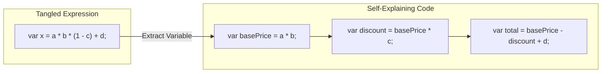

# 第15章：Extract Variable / Inline（式を読みやすく）🧠✨

長〜い式って、**読んでるだけで脳が疲れる**よね…😵‍💫💦
この章では、式に“名前”を付けて読みやすくする **Extract Variable（= Introduce local variable）** と、逆に“余計な一時変数”を消してスッキリさせる **Inline（= Inline temporary variable）** をセットで学ぶよ〜🪄✨

---

## この章のゴール🎯✨

* 複雑な式を **「読める言葉」** に変える（＝Extract Variable）🏷️💡
* 変数が増えすぎてゴチャゴチャしたときに **減らす判断** ができる（＝Inline）🧹✨
* **短絡評価（&& / ||）** を壊さない安全なやり方がわかる🛡️✅
* Visual Studio / VS Code で **サクッと自動リファクタ**できるようになる⌨️⚡
  （Quick Actions は Ctrl + . で開けるよ）([Microsoft Learn][1])

---

## まずイメージ🍓：変数は“ミニ見出し”📌

### Extract Variable（式→変数）✂️➡️📦

* 複雑な式の一部を **中間変数** にして、読みやすくする✨
* “意図”が見える名前にするのがコツ🏷️💕

### Inline（変数→式）📦➡️✂️


* 意味が薄い一時変数を消して、**ノイズを減らす**✨
* “名付ける価値がない”なら消した方が読みやすいこともある🧼



---

## 1) Extract Variable（Introduce local variable）🏷️✨


### いつ使う？🕒

* 式が長くて読めない😵‍💫
* 条件式が複雑でミスりそう💥
* 同じ計算（や同じ呼び出し）を何回もしている🔁
* デバッグで **途中の値を見たい**👀（Watch に置ける！）

### どうやる？（Visual Studio）⌨️✨


1. 変数にしたい **式（expression）を選択**する🖱️
2. **Ctrl + .**（Quick Actions / Refactorings）を開く🎛️([Microsoft Learn][1])
3. **Introduce local variable** を選ぶ✅([Microsoft Learn][2])

※右クリック → Quick Actions and Refactorings からでもOKだよ🖱️✨([Microsoft Learn][1])

### どうやる？（VS Code）⌨️✨

* だいたい同じで、**Ctrl + .** → Refactorings → **Extract Variable** の流れ🪄
  VS Code のリファクタ全体の考え方はこのページにまとまってるよ([Visual Studio Code][3])

---

### 例①：計算式が“読める”になる💎


**Before（読みづらい…）😵‍💫**

```csharp
decimal total = price * quantity * (1m - discountRate) + shippingFee;
```

**After（意味が見える！）✨**

```csharp
decimal subtotal = price * quantity;
decimal discounted = subtotal * (1m - discountRate);
decimal total = discounted + shippingFee;
```

ポイント💡

* `subtotal` / `discounted` みたいに **値の意味が伝わる名前**を付ける🏷️✨
* “何をしてる式なのか”が一瞬で分かるようになるよ👀🌟

---

### 例②：条件式を“文章”にする🧩📝

**Before（条件が長いと目が滑る…）🥺**

```csharp
if (user != null && user.IsActive && user.Plan != null && user.Plan.Type == PlanType.Premium)
{
    GrantPremiumFeature(user);
}
```

**After（安全に読みやすく）✨**

```csharp
bool isActiveUser = user?.IsActive == true;
bool isPremiumPlan = user?.Plan?.Type == PlanType.Premium;

if (isActiveUser && isPremiumPlan)
{
    GrantPremiumFeature(user!);
}
```

ここ超大事⚠️✨

* `&&` は**短絡評価**（左が false なら右を見ない）だよね🧠


* でも、うっかりこうすると危険💥👇

```csharp
// ❌危険：user.Plan が null のとき例外になる可能性
bool isPremiumPlan = user.Plan.Type == PlanType.Premium;

if (user != null && user.IsActive && isPremiumPlan) { ... }
```

✅安全に Extract したいなら


* `?.` や `== true` を使って **null を吸収**する
* もしくは先に null を除外する（ガード節は次章で詳しくやるよ🚪✨）

---

## 2) Inline（Inline temporary variable）🧹✨


### いつ使う？🕒

* 1回しか使わないのに変数が増えてて、読みにくい😵‍💫
* 変数名が薄い（`tmp`, `x`, `value`）…😿
* “ただ置いただけ”の変数が多くてスクロールが長い📜💦

### どうやる？（Visual Studio / VS Code）⌨️✨

1. インラインしたい **一時変数にカーソル**を置く🖱️
2. **Ctrl + .**（Quick Actions / Refactorings）を開く🎛️([Microsoft Learn][4])
3. **Inline temporary variable** を選ぶ✅([Microsoft Learn][4])

---

### 例：意味が薄い変数は消す🫧

**Before（変数が増えてノイズかも）😵‍💫**

```csharp
decimal rate = 0.1m;
decimal tax = price * rate;
decimal total = price + tax;
```

**After（この程度ならスッキリ）✨**

```csharp
decimal total = price + (price * 0.1m);
```

でもね…ここも判断があるよ🧠✨

* `0.1m` が何か分からないなら、次章の **Introduce Constant**（マジックナンバー退治）で `TaxRate` にする方が気持ちいい🔢🧯
* デバッグで途中の `tax` を見たいなら、残すのもアリ👀✅

---

## 3) Extract と Inline の判断基準🧭✨

### Extract Variable を選ぶとき✅


* その式に **“名前を付ける価値”** がある🏷️
* その値が **ドメイン的に意味を持つ**（例：`isEligibleForDiscount`）💎
* 同じ式を2回以上使う（重複削減）🔁
* 条件式が複雑（読み間違い防止）🧩

### Inline を選ぶとき✅

* 変数名が説明になってない（`tmp`, `x`）😿
* 1回しか使わない＆式も短い🫧
* 変数が多すぎて “本筋” が見えない🌫️

---

## 4) よくある落とし穴⚠️（ここで事故が減る！）🛡️✨

### 落とし穴①：短絡評価を壊す（&& / ||）💥

* 条件式の一部を先に変数にしちゃうと、**本来は評価されないはずの右側が評価される**ことがある😵‍💫
* 対策✅：`?.` や `is not null` などで安全にする／評価順を変えない

### 落とし穴②：副作用がある式は慎重に🎲⏰

例：`DateTime.Now`、乱数、I/O、状態を変えるメソッドなど

* Extract すると「呼ばれるタイミング」や「回数」が変わる可能性があるよ💦
* 対策✅：**“動作が変わらない？”**を必ず確認（テスト・実行・差分チェック）🧪✅

### 落とし穴③：変数名がフワフワ☁️

* `result` `data` `value` だけだと、読者の脳内で補完できない😿
* 対策✅：`is〜` / `has〜` / `total〜` / `discounted〜` みたいに意味が分かる形へ🏷️✨

---

## 5) ミニ演習📝✨（手を動かすと一気に身につく！）💪💕

### お題：条件式を読みやすくして、不要な変数は Inline してみよう🪄

**Before**

```csharp
public static bool CanCheckout(User? user, Cart cart)
{
    var price = cart.Subtotal();
    var ok = user != null && user.IsActive && user.Address != null && user.Address.ZipCode.Length == 7
             && price > 0 && (price + cart.ShippingFee()) <= user.CreditLimit;

    return ok;
}
```

#### ステップA（Extract Variable）🏷️✨

* `user` 周りの条件を “言葉” にする
* `price + cart.ShippingFee()` みたいな式を分けて意味を付ける

#### ステップB（Inline）🧹✨

* `ok` が “ただの戻り値” で、式が十分読めるなら消す（Inline する）

---

### 例（After の一例）✅✨

```csharp
public static bool CanCheckout(User? user, Cart cart)
{
    bool isActiveUser = user?.IsActive == true;
    bool hasValidZip = user?.Address?.ZipCode?.Length == 7;

    decimal subtotal = cart.Subtotal();
    decimal shipping = cart.ShippingFee();
    decimal total = subtotal + shipping;

    return isActiveUser
           && hasValidZip
           && subtotal > 0
           && user is not null
           && total <= user.CreditLimit;
}
```

ポイント💡

* `hasValidZip` みたいな **質問文っぽい名前**は条件式と相性が良いよ📝✨
* `return ok;` は Inline して **return 式**にすると、1行減ってスッキリしがち🧹

---

## 6) AI拡張の使いどころ🤖✨（安全にラクする💕）

### 命名案を出してもらう🏷️

* 「この式の意図が伝わる変数名を5つ出して。`is〜/has〜` も混ぜて」💬✨
* 「ドメイン用語っぽい名前にして（例：checkout/credit limit/shipping）」💬📚

### Extract/Inline 候補を探してもらう🔎

* 「読みづらい式を3つ指摘して、Extract Variable の候補を出して」🤖🧠
* 「Inline した方が良い一時変数があれば理由付きで」🧹✨

⚠️採用ルールはこれだけ守ると安心🛡️

* 提案は **差分で見る**👀
* **テスト or 実行で確認**✅
* “意味”の最終決定は人間がする🏁✨

---

## 7) まとめチェックリスト✅🧾✨

* [ ] 長い式に **名前**を付けて、意図が読めるようになった🏷️
* [ ] `&& / ||` の **短絡評価**を壊してない🧠🛡️
* [ ] 副作用がある式（時間・乱数・I/O）をうっかり Extract してない🎲⏰
* [ ] 意味が薄い一時変数は **Inline** してノイズを減らした🧹
* [ ] Ctrl + . の Quick Actions でサクッとやれた🎛️⚡([Microsoft Learn][1])

---

## 参考：最新版の言語・SDKの位置づけ🆕✨

C# は **C# 14** が最新リリースで、**.NET 10** 上でサポートされているよ📦🌟([Microsoft Learn][5])
また、.NET 10 のリリース案内では **Visual Studio 2026** や VS Code の **C# Dev Kit** 側の更新にも触れられているよ🛠️✨([devblogs.microsoft.com][6])

[1]: https://learn.microsoft.com/en-us/visualstudio/ide/quick-actions?view=visualstudio&utm_source=chatgpt.com "Quick Actions - Visual Studio (Windows)"
[2]: https://learn.microsoft.com/en-us/visualstudio/ide/reference/introduce-local-variable?view=visualstudio&utm_source=chatgpt.com "Introduce a local variable - Visual Studio (Windows)"
[3]: https://code.visualstudio.com/docs/editing/refactoring?utm_source=chatgpt.com "Refactoring"
[4]: https://learn.microsoft.com/en-us/visualstudio/ide/reference/inline-temporary-variable?view=vs-2022&utm_source=chatgpt.com "Inline a temporary variable refactoring - Visual Studio"
[5]: https://learn.microsoft.com/en-us/dotnet/csharp/whats-new/csharp-14?utm_source=chatgpt.com "What's new in C# 14"
[6]: https://devblogs.microsoft.com/dotnet/announcing-dotnet-10/?utm_source=chatgpt.com "Announcing .NET 10"
