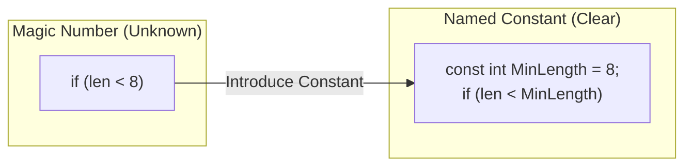

# 第16章：Introduce Constant（マジックナンバー退治）🔢🧯

## この章でできるようになること🎯✨

* 「意味不明な数値・文字列（マジック値）」を見つけられる👀🔎
* 値を **定数（Constant）** にして、コードの意図を“名前”で説明できる🏷️✨
* **const / static readonly / enum** の使い分けがざっくり分かる🧠🌈
* IDEのリファクタ機能で、サクッと安全に置き換えられる🛠️✅

---

## 1. マジック値ってなに？😵‍💫🌀


コードの中に、こういう「突然出てくる数字や文字列」ありませんか？👇

```csharp
if (password.Length < 8) return false;
if (retryCount > 3) throw new Exception("Too many retries");
var timeoutMs = 30000;
```

この `8` / `3` / `30000` みたいな値が **マジック値** です🔮💦
問題はこれ👇

* その値が **何を意味するのか分からない** 😵
* 同じ値が散らばると **変更漏れ** が起きる😱
* 仕様変更のときに **影響範囲が読めない** 🧨

まず“安全に触れる地面”を作る回だよ🌱



---

## 2. まずは変身例（Before → After）🪄✨

### Before：意味が読み取れない😵

```csharp
public bool CanRegister(string password)
{
    if (password.Length < 8) return false;
    return true;
}
```

### After：意図が名前で伝わる😍


```csharp
public class PasswordPolicy
{
    private const int MinPasswordLength = 8;

    public bool CanRegister(string password)
    {
        if (password.Length < MinPasswordLength) return false;
        return true;
    }
}
```

`8` が「最低パスワード長」って一発で分かるようになりました🏷️✨
この「値を説明する名前を付ける」だけで、読みやすさが一気に上がります📈💖

---

## 3. IDEでやる：Introduce Constant の基本操作🖱️✨


流れはシンプルです👇

1. 定数化したいリテラル（例：`8`）を選択 or カーソルを置く👆
2. **Quick Actions（Ctrl + .）** を出す💡
3. **Introduce constant** を選ぶ➡️🏷️
4. 名前を付ける（例：`MinPasswordLength`）✅

「Ctrl + . から Introduce constant」手順は、紹介記事でも同じ流れで説明されています。 ([Zenn][1])

> もし「ローカル定数（メソッド内だけ）」にしたいなら、同じ流れで “ローカル定数” を選ぶイメージです🧁✨
> （スコープの決め方は後でやるよ！）

---

## 4. C#の「定数」には種類があるよ🧰✨（超重要）


### 4.1 `const`：コンパイル時に決まる定数📌

* `const` は **コンパイル時に値が確定** する定数です。 ([Microsoft Learn][2])
* 数値・bool・string・null など、限られた型だけが対象になります。 ([Microsoft Learn][3])

```csharp
private const int MaxRetryCount = 3;
private const string DefaultUserName = "guest";
```

そして超大事な注意⚠️：
`const` は参照側に値が埋め込まれる（定数伝播）ので、**値を変えたら利用側の再コンパイルが必要**になるケースがあります。 ([Microsoft Learn][4])
なので、ライブラリ公開APIで「変わりそうな値」を `public const` にするのは慎重に…！🧯

---

### 4.2 `static readonly`：実行時に決まる“実質定数”🧊✨

* `readonly` フィールドは **宣言時 or コンストラクタでだけ代入できる** ので、それ以降は変更できません。 ([Microsoft Learn][5])
* `static readonly` にすると「クラス全体で共通の、変更できない値」になります🧠✨

`const` にできない代表例：`DateTime` / `TimeSpan` / 配列 / 複雑な生成結果など

```csharp
private static readonly TimeSpan DefaultTimeout = TimeSpan.FromSeconds(30);
```

---

### 4.3 `enum`：選択肢（種類）があるなら enum が強い🎛️✨


「0,1,2 が状態」みたいなとき、定数化より **enum** のほうが読みやすいことが多いです🌸

```csharp
public enum OrderStatus
{
    Draft,
    Paid,
    Shipped
}
```

---

## 5. どこに置く？スコープの決め方🗺️✨


### 5.1 まずは最小スコープが基本🌱

「そのメソッドでしか使わない」なら、メソッド内に置くのがスッキリします🧁

```csharp
public int CalcShippingFee(int totalPrice)
{
    const int FreeShippingThreshold = 5000;
    if (totalPrice >= FreeShippingThreshold) return 0;
    return 500;
}
```

### 5.2 クラス内に置くべき時🏠✨

* 複数メソッドで使う
* “そのクラスのルール” っぽい
* 変更点を1か所に集めたい

```csharp
public class RetryPolicy
{
    private const int MaxRetryCount = 3;
    // ...
}
```

### 5.3 `public const` は慎重に🧯

さっきの「定数伝播」の事情で、公開APIにすると後々困ることがあります。 ([Microsoft Learn][4])
迷ったら `private` / `internal` で始めるのが安全です✅✨

---

## 6. 名前の付け方（定数名が命🏷️💖）

### 6.1 いい名前の条件🌟

* **意味が分かる**（何の数字？何の文字列？）
* **単位が入ってる**（Seconds / Minutes / Bytes / Ms など）⏱️📦
* **否定が少ない**（Not〜 は脳が疲れる😵‍💫）

例👇

* `DefaultTimeout`（OK）
* `TimeoutMs`（単位つきでOK）
* `Value1`（ダメ〜😇）

---

## 7. “定数化”のコツ：数値だけじゃないよ🧠✨

### 7.1 よくあるマジック文字列も退治🧯


```csharp
if (role == "Admin") { /* ... */ }
```

→ こう！

```csharp
private const string AdminRole = "Admin";

if (role == AdminRole) { /* ... */ }
```

### 7.2 時間は `TimeSpan` を使うと読みやすい⏳💖


```csharp
var timeoutMs = 30000; // これ、30秒？
```

→ こう！

```csharp
private static readonly TimeSpan DefaultTimeout = TimeSpan.FromSeconds(30);
```

---

## 8. ミニ演習📝✨（3つやろう！）

### 演習①：マジックナンバーを3つ定数化🔢➡️🏷️

次のコードから `8` / `3` / `30000` を定数にしてみよう👇

```csharp
public class AccountService
{
    public bool CanRegister(string password, int retryCount)
    {
        if (password.Length < 8) return false;
        if (retryCount > 3) return false;

        var timeoutMs = 30000;
        // timeoutMs を使う処理がある想定
        return true;
    }
}
```

**ゴール🎯**

* `MinPasswordLength`（const）
* `MaxRetryCount`（const）
* `DefaultTimeout`（static readonly + TimeSpan）

---

### 演習②：スコープを選ぶ🗺️✨

同じ値を「メソッド内」「クラス内」どっちに置くべきか、理由を1行で書こう📝
（例：この値は他メソッドでも使うからクラス内、など）

---

### 演習③：同じ文字列が2回以上出てきたら定数化💬➡️🏷️

検索（Ctrl+F）で `"Admin"` とか `"Error"` とか、同じ文字列が2回以上あるケースを探して退治🧯✨

---

## 9. AI拡張の使い方（安全に強く🤖🛡️）

### 9.1 使えるお願い例💡✨

* 「このクラスのマジックナンバー候補を列挙して、意味が分かる定数名を3案ずつ出して」🤖🏷️
* 「この `30000` は何の単位に見える？TimeSpan化するならどう書く？」⏳🤖
* 「定数のスコープ（ローカル/クラス）どっちが良い？理由も」🗺️🤖

### 9.2 採用前のチェック✅

* 置き換え後に **テスト or 実行で動作確認** ✅🧪
* “名前が意味を説明できてるか” を人間が最終判断🏷️🧠
* 変更が大きくなりそうなら、分割して小さく進める✂️📌

---

## 10. よくある落とし穴⚠️😇

### 落とし穴①：何でも `const` にしちゃう🙅‍♀️

`const` は「いつでも変わる可能性がある情報」に使わないのが基本です。 ([Microsoft Learn][2])
例：価格、バージョン、会社名、外部仕様に引っ張られる値…など💸📦

### 落とし穴②：`public const` を変えたのに反映されない！？😱

利用側に値が埋め込まれるので、**参照してる側を再ビルドしないと古い値のまま**になり得ます。 ([Microsoft Learn][4])

### 落とし穴③：名前が抽象すぎて逆に読めない🌀

`Limit` とか `Value` は意味が薄いので、**何の制限？どんな値？** を名前に入れるのがおすすめです🏷️✨

---

## 11. 今日のまとめ🌈✨

* マジック値は「意味が読めない」「変更に弱い」ので定数化する🔢🧯
* `const` はコンパイル時定数（型に制限あり）📌 ([Microsoft Learn][2])
* `static readonly` は実行時に決まる“実質定数”で、TimeSpanなどに便利⏳🧊 ([Microsoft Learn][5])
* `public const` は定数伝播に注意（変更時の再コンパイル問題）🧯 ([Microsoft Learn][4])
* IDEの Quick Actions（Ctrl + .）から Introduce constant でサクッとできる🛠️✨ ([Zenn][1])

---

## おまけ：最新環境メモ🗓️✨（根拠つき）

* .NET 10 は **LTS（3年サポート）** で、サポートは **2028年11月10日まで** と案内されています。 ([Microsoft for Developers][6])
* Visual Studio 2026 では .NET 10 と C# 14 のサポートが組み込みで提供されています。 ([Microsoft Learn][7])

[1]: https://zenn.dev/takeru_tomii/articles/0c733694400b67?utm_source=chatgpt.com "Frequently used features for solid and fast code on Visual ..."
[2]: https://learn.microsoft.com/en-us/dotnet/csharp/language-reference/keywords/const?utm_source=chatgpt.com "The const keyword - C# reference"
[3]: https://learn.microsoft.com/en-us/dotnet/csharp/programming-guide/classes-and-structs/constants?utm_source=chatgpt.com "Constants (C# Programming Guide)"
[4]: https://learn.microsoft.com/ja-jp/dotnet/csharp/language-reference/keywords/const?utm_source=chatgpt.com "const キーワード - C# reference"
[5]: https://learn.microsoft.com/en-us/dotnet/csharp/language-reference/keywords/readonly?utm_source=chatgpt.com "readonly keyword - C# reference"
[6]: https://devblogs.microsoft.com/dotnet/announcing-dotnet-10/?utm_source=chatgpt.com "Announcing .NET 10"
[7]: https://learn.microsoft.com/en-us/visualstudio/releases/2026/release-notes?utm_source=chatgpt.com "Visual Studio 2026 Release Notes"
