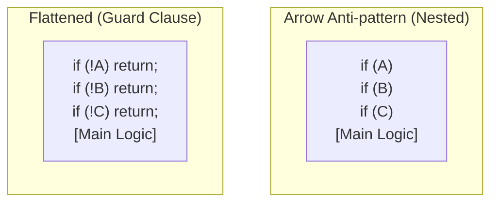

# 第17章：ガード節（早期return）でネストを減らす🚪🌟

## この章でできるようになること🎯✨

* `if` のネスト（階段みたいなインデント）を減らして、読みやすいコードにできる🙂📖
* 「ここで処理を終わらせてOK！」という **入口チェック** をスッキリ書ける✅
* `return` と `throw` の使い分けがざっくり分かる🧠⚖️

※C# 14 は .NET 10 / Visual Studio 2026 で利用できます。([Microsoft Learn][1])

---

## 1. ガード節ってなに？🤔🛡️


**ガード節（guard clause）** は、メソッドの最初のほうで

> 「この条件なら、これ以上やることないから終わり！」

を **早めに確定** して、残りの処理をスッキリさせる書き方だよ🌸✨
つまり **ネストを深くしないための作法** 💡



---

## 2. なぜ読みやすくなるの？👀✨


ネストが深いと、読む人の脳内でこうなる…😵‍💫

* 「今どの `if` の中だっけ？」
* 「この `else` は誰の `if` だっけ？」
* 「本筋の処理はどこから？」

ガード節にすると、本筋（メインの処理）が **左側にまっすぐ並ぶ** から、目が迷子になりにくいよ🧭💖

---

## 3. まずはBefore/Afterで体感しよう✋🧩


### Before：ネストが深い😵‍💫

```csharp
public static string FormatUserName(string? firstName, string? lastName)
{
    if (firstName != null)
    {
        if (lastName != null)
        {
            if (firstName.Length > 0 && lastName.Length > 0)
            {
                return $"{lastName} {firstName}";
            }
        }
    }

    return "Unknown";
}
```

### After：ガード節でスッキリ🙂✨

```csharp
public static string FormatUserName(string? firstName, string? lastName)
{
    if (firstName is null) return "Unknown";
    if (lastName is null) return "Unknown";
    if (firstName.Length == 0) return "Unknown";
    if (lastName.Length == 0) return "Unknown";

    return $"{lastName} {firstName}";
}
```

ポイント🌟

* 「ダメなら早く終わる」を先に並べる
* 本筋（最後の `return`）が **一番読みやすい場所** に来る✨

---

## 4. ガード節の“よくある形”5選🧰✨

### ① 引数チェック（null/空）🧷

```csharp
if (name is null) return;
if (name.Length == 0) return;
```

### ② 条件を満たさないなら何もしない🚪

```csharp
if (!isEnabled) return;
```

### ③ 早期return（失敗時の戻り値がある）📦

```csharp
if (items.Count == 0) return 0;
```

### ④ 例外を投げる（契約違反・呼び出し側が悪い）💥

```csharp
if (price < 0) throw new ArgumentOutOfRangeException(nameof(price));
```

### ⑤ 失敗を Result で返す（仕様として失敗を扱う）🚦

```csharp
if (!isValid) return Result.Fail("入力が不正です");
```

---

## 5. 「return」と「throw」どっち？🧠⚖️


ざっくりルール（迷ったらこれ）💡

* **return**：よく起きる・仕様として自然な分岐（例：検索して見つからない、入力が空なら何もしない）🙂
* **throw**：呼び出しが間違ってる／続行すると危険（例：引数が null は許可しない、範囲外はバグの可能性）💥

---

## 6. Visual Studio での進め方（安全にやる）🛟💻


ガード節は「動作を変えずに形を整える」作業だから、**小さく・頻繁に確認** が相性抜群だよ🔁✅

おすすめ手順🌷

1. 変更したいメソッドを開く👀
2. いちばん外側の `if` を見つける🔎
3. 「条件を反転できない？」を考える（例：`if (x != null)` → `if (x is null) return ...;`）🔁


4. まず1個だけガード節にする✂️
5. ビルド＆テスト実行✅
6. 次の `if` へ…を繰り返す🔁

💡コードスタイルは `.editorconfig` でチーム全体に揃えられるよ（Visual Studio は Code Cleanup / Code Style をサポート）🧼📏 ([Microsoft Learn][2])

---

## 7. ミニ演習📝：ネスト2段 → 1段へ⬇️✨

### お題：送料計算（Before）📦🚚


次のコードを、ガード節で読みやすくしてね🙂💕

```csharp
public static int CalculateShippingFee(string? prefecture, int itemCount, bool isMember)
{
    if (prefecture != null)
    {
        if (prefecture.Length > 0)
        {
            if (itemCount > 0)
            {
                if (isMember)
                {
                    return 0;
                }

                if (prefecture == "Tokyo")
                {
                    return 500;
                }

                return 800;
            }
        }
    }

    return -1;
}
```

### 目標🎯

* 「変な入力」は先に弾いて早期return
* 本筋の分岐（会員/東京/それ以外）を読みやすい位置へ✨

### 例（Afterの一例）🌸

```csharp
public static int CalculateShippingFee(string? prefecture, int itemCount, bool isMember)
{
    if (prefecture is null) return -1;
    if (prefecture.Length == 0) return -1;
    if (itemCount <= 0) return -1;

    if (isMember) return 0;
    if (prefecture == "Tokyo") return 500;

    return 800;
}
```

✅チェック

* 戻り値の意味（`-1`）は変えてない
* 条件の意味も同じ
* ネストがなくなって読みやすい

---

## 8. AI（Copilot / Chat）活用のコツ🤖✨（安全第一🛡️）

### おすすめの頼み方🗣️💡

* 「**動作は変えない**」を最初に宣言✅
* 「**ガード節化だけ**」に絞る🎯
* 「**差分が小さい形**」で出してもらう📌

例（コピペOK）📝

```text
このメソッドをガード節（早期return）でネスト削減してください。
条件：動作は絶対に変えない／例外仕様は変えない／差分は小さく／まず最外のifだけ。
Before/Afterの差分が分かる形で出してください。
```

### 受け取ったら必ずやること✅

* 差分を目で見る👀
* ビルドする🔧
* テストを通す🧪

---

## 9. よくある落とし穴⚠️😿

### 落とし穴①：return が増えすぎて逆に読みにくい💦

ガード節は **入口のチェック** に使うのが基本✨
本筋の処理の途中で `return` 乱発は、別の読みづらさを生むこともあるよ🌀

### 落とし穴②：後片付けが必要なのに早期returnしちゃう🧹

`using` や `try/finally` で片付けが保証されてるならOK👍
でも、手動で「最後に必ずやる処理」があるなら要注意⚠️

### 落とし穴③：例外にするべき所を return にしちゃう😵

「呼び出し側のミス」なら `throw` が自然なことが多いよ💥
（return にすると、バグが静かに隠れがち🙈）

---

## 10. まとめ🌈✨

* ガード節は **入口で早めに終わらせて** ネストを減らす作法🚪🌟
* 本筋の処理が **左にまっすぐ並ぶ** から読みやすい📖💕
* `return` と `throw` は「仕様の分岐」か「契約違反」かで考える🧠⚖️
* 変更は小さく、差分レビュー＆テストで安全に進める✅🛡️

---

### 補足（最新動向メモ）🧾✨

* .NET 10 と Visual Studio 2026 は 2025年11月の .NET Conf でリリースが案内されています。([gihyo.jp][3])

[1]: https://learn.microsoft.com/ja-jp/dotnet/csharp/whats-new/csharp-14?utm_source=chatgpt.com "C# 14 の新機能"
[2]: https://learn.microsoft.com/en-us/visualstudio/ide/code-styles-and-code-cleanup?view=visualstudio&utm_source=chatgpt.com "Code Style Options and Code Cleanup - Visual Studio ..."
[3]: https://gihyo.jp/article/2025/11/dotnet-10?utm_source=chatgpt.com "Microsoft、.NET 10をリリース —— Visual Studio 2026も一般 ..."
