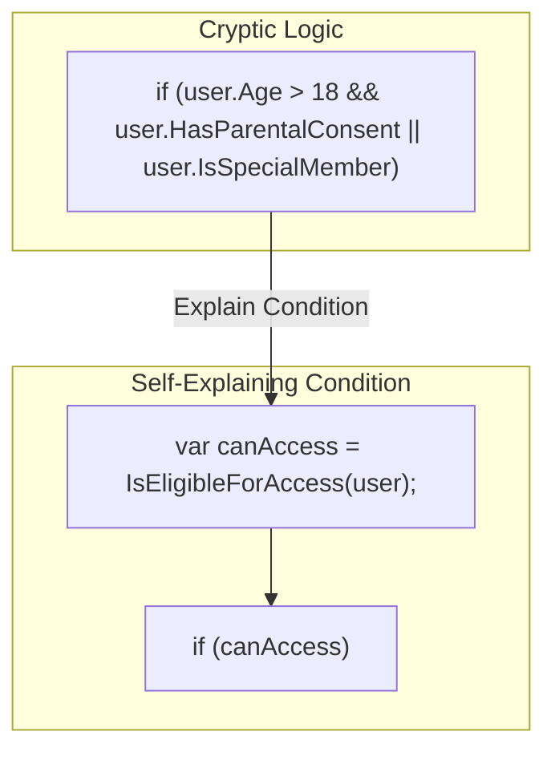

# 第18章：条件式の分解（Explain Condition）🧩📝

## ねらい🎯

複雑で読みにくい `if` の条件式を、**意味が伝わる“言葉”**に分解して、コードをスラスラ読める状態にします📖✨
ポイントはこれ👇

* 条件式を **「説明できる名前」** にする🏷️
* 否定・二重否定を減らして **読み間違いを防ぐ** 🙅‍♀️
* 「何を判定してるの？」を **関数名で語らせる** 🗣️

※C# 14 は .NET 10 と Visual Studio 2026 で試せます🌟 ([Microsoft Learn][1])

---

## Explain Condition って何？💡


「Explain Condition」は、リファクタリングの定番テクです✨
やることはシンプル👇

* ごちゃごちゃした条件式を
  ✅ **中間変数（説明変数）** にする
  ✅ **判定メソッド（`Is〜`）** にする
* その結果、`if` の行が「文章」みたいに読めるようになる📚✨



---
この系統は “Decompose Conditional（条件の分解）” としても知られていて、条件を `summer()` みたいな判定関数に置き換える形が紹介されています📌 ([リファクタリング][2])

---

## なんで条件式って読めなくなるの？🤯


あるある原因はこのへん👇

* `&&` と `||` が長い行に詰め込まれてる📛
* `!`（否定）が増えて、頭の中で反転し続ける🌀
* `null` チェックや境界条件が混ざってる🧷
* 「本当は3つの判定」なのに、1行に全部入ってる🍱💦

読む側の脳内でこうなる…👇
「えっと…この `!` は反転して…`||` の優先順位は…」😵‍💫

---

## Before → After で体感しよう👀✨

### Before：条件が“暗号”になってる例🧩💦


「送料無料かどうか」を決めたいだけなのに、条件がつらい…！

```csharp
public static decimal CalculateShippingFee(Order order, Customer? customer)
{
    if ((customer != null && customer.IsVip && order.TotalAmount >= 10_000m)
        || (order.TotalAmount >= 20_000m && order.DestinationCountry == "JP" && !order.HasHazardousItems)
        || (order.Items.Count == 0 && order.IsGift && customer != null && !customer.IsBlacklisted))
    {
        return 0m;
    }

    return 800m;
}

public sealed class Order
{
    public decimal TotalAmount { get; init; }
    public string DestinationCountry { get; init; } = "";
    public bool HasHazardousItems { get; init; }
    public List<string> Items { get; } = new();
    public bool IsGift { get; init; }
}

public sealed class Customer
{
    public bool IsVip { get; init; }
    public bool IsBlacklisted { get; init; }
}
```

---

## Step 1：まずは「説明変数」で分解しよう🏷️✨


いきなりメソッド化せず、まずは **bool 変数**で「意味」を付けます📝

```csharp
public static decimal CalculateShippingFee(Order order, Customer? customer)
{
    bool isVip = customer?.IsVip == true;
    bool isBlacklisted = customer?.IsBlacklisted == true;

    bool vipFreeShipping = isVip && order.TotalAmount >= 10_000m;

    bool largeDomesticOrder =
        order.TotalAmount >= 20_000m
        && order.DestinationCountry == "JP"
        && !order.HasHazardousItems;

    bool emptyGiftOrder =
        order.Items.Count == 0
        && order.IsGift
        && customer is not null
        && !isBlacklisted;

    bool isFreeShipping = vipFreeShipping || largeDomesticOrder || emptyGiftOrder;

    return isFreeShipping ? 0m : 800m;
}
```

### ここが大事💖

* `vipFreeShipping` みたいに **「true の意味」が読める名前**にする🏷️
* 先に `isVip` を作ると、`customer != null && customer.IsVip` を何回も書かなくて済む😊
* 最後に `isFreeShipping` でまとめると、`if` の意図が一瞬でわかる👀✨

---

## Step 2：「Is〜」判定メソッドにして“文章化”する🗣️✨


条件が複数箇所で使われそう、またはルールとして名前を固定したいなら **判定メソッド化**が強いです💪

```csharp
public static decimal CalculateShippingFee(Order order, Customer? customer)
{
    return IsFreeShippingEligible(order, customer) ? 0m : 800m;
}

private static bool IsFreeShippingEligible(Order order, Customer? customer)
{
    return IsVipFreeShipping(order, customer)
        || IsLargeDomesticOrderFreeShipping(order)
        || IsEmptyGiftOrderFreeShipping(order, customer);
}

private static bool IsVipFreeShipping(Order order, Customer? customer)
    => customer is { IsVip: true } && order.TotalAmount >= 10_000m;

private static bool IsLargeDomesticOrderFreeShipping(Order order)
    => order.TotalAmount >= 20_000m
       && order.DestinationCountry == "JP"
       && !order.HasHazardousItems;

private static bool IsEmptyGiftOrderFreeShipping(Order order, Customer? customer)
    => order.Items.Count == 0
       && order.IsGift
       && customer is { IsBlacklisted: false };
```

### 読み心地がこう変わる😍

`IsFreeShippingEligible(...)` ← **何をしたいかが即わかる**
中の条件は、**ルールごとに名前が付いてる**から迷わない🧭✨

---

## Step 3：否定（!）を減らすコツ🙅‍♀️➡️🙂


否定が増えると、読み間違いが増えます💦
できるだけ **肯定形**に寄せるのがおすすめ🌸

* ❌ `!isNotValid`（二重否定みたいで混乱）
* ✅ `isValid`
* ❌ `!(a && b)`
* ✅ `!a || !b` に変形…よりも
  ✅ **そもそも `Is〜` メソッドに隠す**（読み手の脳内負担ゼロ）✨

---

## 「どこまで分解する？」の目安📏✨

分解しすぎも逆に読みにくくなるので、目安を持つと安心です😊

### ✅ 変数で十分なケース

* その `if` だけでしか使わない
* “一瞬で意味が通る” くらいの複雑さ
* 変更されにくい単発条件

### ✅ メソッドにしたいケース


* 同じ条件が複数箇所で登場してる🔁
* ビジネスルールとして名前を固定したい📜
* 条件が3行以上で「読むのに息継ぎが必要」😮‍💨

---

## 安全に進める手順🛡️🔁

条件式の変更はバグりやすいので、**小さく**いきます💓

1. ✅ 先に動作確認（テスト or 実行でOK）
2. ✅ 条件式を **説明変数**にする（動作は変えない）
3. ✅ 変数名を整える（読みやすさUP）
4. ✅ 必要なら **判定メソッド化**
5. ✅ 最後にもう一回、必ず動作確認✅

---

## ミニテスト例（挙動が変わってないか確認）🧪✨

「VIP で 10,000円以上なら送料無料」の確認だけでも保険になります🛟

```csharp
using Xunit;

public sealed class ShippingTests
{
    [Fact]
    public void Vip_and_10000_or_more_is_free_shipping()
    {
        var order = new Order { TotalAmount = 10_000m, DestinationCountry = "JP" };
        var customer = new Customer { IsVip = true };

        var fee = CalculateShippingFee(order, customer);

        Assert.Equal(0m, fee);
    }

    // この章のサンプルをここに貼る想定
    private static decimal CalculateShippingFee(Order order, Customer? customer)
        => IsFreeShippingEligible(order, customer) ? 0m : 800m;

    private static bool IsFreeShippingEligible(Order order, Customer? customer)
        => customer is { IsVip: true } && order.TotalAmount >= 10_000m;
}
```

---

## Visual Studio で爆速にやる🪄💻

「分解」は IDE のリファクタ機能を使うと超ラクです✨

* **Extract Method（メソッド抽出）**
  キーボード：`Ctrl+R` → `Ctrl+M`（プロファイルで違うことあり） ([Microsoft Learn][3])
* **Rename（名前変更）**
  キーボード：`Ctrl+R` → `Ctrl+R` ([Microsoft Learn][4])
* **Introduce Local Variable（ローカル変数抽出）**
  まず `Ctrl+.`（Quick Actions）で候補が出せるよ🪛✨ ([Microsoft Learn][5])
* **ショートカット一覧**（Refactor 系がまとまってて便利） ([Microsoft Learn][6])

---

## AI拡張（Copilot / OpenAI系）での使いどころ🤖✨

AIは「意味の言語化」と「命名案」が得意です💖
ただし、**採用前に必ず差分とテストで確認**ね✅

### 使える頼み方例🗣️

* 「この条件式が true のとき、日本語で何が起きてる？」📝
* 「説明変数名を5案。肯定形で、短めで！」🏷️
* 「`Is〜` 判定メソッドに分解して。副作用がない前提で」🧩
* 「二重否定を減らして読みやすくして」🙂

---

## ミニ演習📝✨（手を動かすよ〜！）

次のコードを、**2〜3個の判定関数**に分解してみよう✂️💕

### 演習コード

```csharp
public static bool CanCheckout(User? user, Cart cart)
{
    return user != null
        && !user.IsSuspended
        && cart.Items.Count > 0
        && (cart.TotalAmount >= 3000m || user.IsPremium)
        && !(cart.HasAgeRestrictedItems && user.Age < 18);
}

public sealed class User
{
    public bool IsSuspended { get; init; }
    public bool IsPremium { get; init; }
    public int Age { get; init; }
}

public sealed class Cart
{
    public List<string> Items { get; } = new();
    public decimal TotalAmount { get; init; }
    public bool HasAgeRestrictedItems { get; init; }
}
```

### ゴール例（こんな感じになればOK）🌸

* `IsActiveUser(user)`
* `HasItems(cart)`
* `IsEligibleByPriceOrPremium(user, cart)`
* `IsAllowedForAgeRestriction(user, cart)`

---

## よくある落とし穴⚠️

* 条件の中に **関数呼び出し**があるとき

  * その関数が重い / 副作用ありだと、分解でタイミングが変わることがある💦
* `&&` / `||` の **短絡評価**（途中で評価が止まる）を壊さないように注意⚡


* `null` を含む条件は、`?.` やパターン（`is { ... }`）で安全に🧷

---

## まとめチェックリスト✅✨

* [ ] 条件式を読んで「何の判定？」が1秒で言える🙂
* [ ] `!` が多すぎない（否定まみれになってない）🙅‍♀️
* [ ] `Is〜` / `Has〜` など、**true の意味が明確な名前**になってる🏷️
* [ ] 変更は小さく、動作確認できてる✅
* [ ] `if` が“文章”として読めるようになってる📖✨

---

### 参考（リファクタリングの代表パターン）📚✨

* Decompose Conditional（条件の分解） ([リファクタリング][2])
* リファクタリングは「外部動作を変えずに内部構造を改善する」小さな変換の積み重ね ([martinfowler.com][7])

[1]: https://learn.microsoft.com/en-us/dotnet/csharp/whats-new/csharp-14?utm_source=chatgpt.com "What's new in C# 14"
[2]: https://refactoring.com/catalog/decomposeConditional.html?utm_source=chatgpt.com "Decompose Conditional - Refactoring"
[3]: https://learn.microsoft.com/en-us/visualstudio/ide/reference/extract-method?view=visualstudio&utm_source=chatgpt.com "Extract a method - Visual Studio (Windows)"
[4]: https://learn.microsoft.com/en-us/visualstudio/ide/reference/rename?view=visualstudio&utm_source=chatgpt.com "Refactor rename - Visual Studio (Windows)"
[5]: https://learn.microsoft.com/en-us/visualstudio/ide/reference/introduce-local-variable?view=visualstudio&utm_source=chatgpt.com "Introduce a local variable - Visual Studio (Windows)"
[6]: https://learn.microsoft.com/en-us/visualstudio/ide/default-keyboard-shortcuts-in-visual-studio?view=visualstudio&utm_source=chatgpt.com "Keyboard shortcuts - Visual Studio (Windows)"
[7]: https://martinfowler.com/tags/refactoring.html?utm_source=chatgpt.com "tagged by: refactoring"
