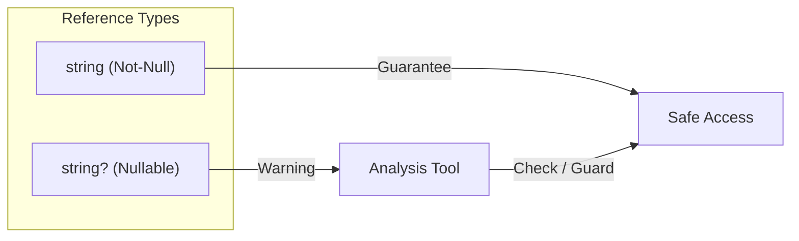

# 第19章：Nullable Reference Types 基礎（null事故を減らす①）🧷🙂

## ねらい🎯

* **null になり得る／なり得ない**を「型」で表して、**NullReferenceException を減らす**🧯✨
* 警告（CS8602 など）を「敵」じゃなく、**安全運転のナビ**として読めるようになる🗺️🚗
* ありがちな null 対応パターン（ガード節・代替値・nullable のまま扱う）を身につける🧠💡

---

## 1. Nullable Reference Types（NRT）って何？🧩


Nullable Reference Types は、コンパイル時に「この参照、null かも？」を追跡して、危ないコードに**警告**を出してくれる仕組みだよ🔔✨
コンパイラは各式の状態を **not-null / maybe-null** の2つで追いかける（null-state）って考えると分かりやすいよ🙂📌 ([Microsoft Learn][1])

大事ポイント👇

* これは**コンパイル時の安全機能**（実行時の型が変わるわけじゃない）🧠
* 例えば「string」と「string?」は、実行時にはどっちも同じ「System.String」扱い（違いは注釈＆解析）だよ🧷 ([Microsoft Learn][1])
* なので、**警告を無視すれば実行時に null 例外は普通に起きる**。必要なら実行時チェックもちゃんと入れる💥 ([Microsoft Learn][1])



---

## 2. 「string」と「string?」の気持ちの違い🙂🪄


* 「string」：**null であってほしくない**（非 null）
* 「string?」：**null の可能性がある**（nullable）

### 超ミニ例🧪

```csharp
string name = null;     // ⚠️ 警告（null を入れようとしてる）
string? nickname = null; // OK（null でもいいよの宣言）
```

「string?」を使うのは、**null が仕様としてあり得る**ときだけにするのがコツだよ🧠✨
（なんでもかんでも nullable にすると、逆に「全部 null かも」になって守りが薄くなる💦）

---

## 3. Nullable を有効にする（コンテキストの考え方）🧷⚙️


NRT は「有効／無効」だけじゃなく、**注釈（annotation）**と**警告（warning）**の2つのスイッチを持ってるのが特徴だよ🔀✨ ([Microsoft Learn][1])

* enable：注釈も警告も ON（フル装備）🛡️
* warnings：警告だけ強めに見たい（移行用）🚦
* annotations：注釈は書けるけど警告は出さない（移行用）🧷
* disable：従来モード🕰️

プロジェクト全体で設定するなら、プロジェクトファイルに「Nullable」を入れるのが基本👇 ([Microsoft Learn][2])

```xml
<PropertyGroup>
  <Nullable>enable</Nullable>
</PropertyGroup>
```

ファイル単位なら、先頭付近にこれ👇 ([Microsoft Learn][2])

```csharp
#nullable enable
```

---

## 4. よく会う警告トップ4（まずこれだけ覚える）👀⚡


Microsoft Learn でも、null 事故を減らすためにいろいろな警告が整理されてるよ📚 ([Microsoft Learn][3])
ここでは「最初に慣れるべき4つ」をピックアップ✨

### (1) CS8602：null かもなのに .（ドット）で触ってる💥

**例：**

```csharp
string? message = GetMessage();
Console.WriteLine(message.Length); // CS8602 になりやすい
```

**直し方の定番：**

* null のときの挙動を決める（戻る／例外／代替値）

```csharp
if (message is null) return;
Console.WriteLine(message.Length);
```

---

### (2) CS8604：引数に null かもを渡してる📦💦

```csharp
void Print(string text) { /* ... */ }

string? maybe = GetText();
Print(maybe); // CS8604 になりやすい
```

**直し方：**

```csharp
if (maybe is null) return;
Print(maybe);
```

---

### (3) CS8601 / CS8600：null かもを非 null に入れようとしてる🧷🚫

```csharp
string? input = GetText();
string text = input; // CS8600 / CS8601 になりやすい
```

**直し方：**

* 代替値を決める（空文字にする？エラーにする？）

```csharp
string text = input ?? "";
```

---

### (4) CS8618：非 null のはずのフィールド/プロパティが初期化されてない🏗️💦

「コンストラクタ終了時点で null じゃない保証がないよ」ってやつ🧨 ([Microsoft Learn][3])

**直し方の選択肢：**

1. コンストラクタで必ず入れる✅
2. 本当に null あり得るなら nullable（string?）にする🧷
3. 初期値を入れる（ただし仕様に合う場合だけ）🧼

---

## 5. null 対応の王道パターン3つ👑✨

### パターンA：入口で弾く（ガード節）🚪🛡️


「このメソッドは null を受け付けない」なら、早めに弾くのが一番きれい🙂✨
おすすめは **ArgumentNullException.ThrowIfNull** だよ🧷（.NET の公式API） ([Microsoft Learn][4])

```csharp
public void Save(string path)
{
    ArgumentNullException.ThrowIfNull(path);
    // ここから下は path が null じゃない前提で書ける✨
}
```

---

### パターンB：代替値を使う（null 合体）🪄🍬


「null ならこれにしよ」で読みやすい✨

```csharp
string? title = GetTitle();
string display = title ?? "（無題）";
```

---

### パターンC：nullable のまま流して、最後に決める🧷➡️🎯

「途中は null あり得る。でも最後に UI 表示で決める」みたいな時に便利🙂

```csharp
string? memo = GetMemo();

if (memo is not null)
{
    Console.WriteLine(memo);
}
```

---

## 6. 便利だけど使いどころ注意：null 許容抑制（!）⚠️🧨


「ここは絶対 null じゃない！」と宣言して警告を消す演算子があるよ（抑制演算子）🧯
でも、**間違ってたら実行時に爆発**するので、最後の手段くらいの気持ちで🙂💦 ([Microsoft Learn][2])

```csharp
string? maybe = GetText();
Console.WriteLine(maybe!.Length); // 「絶対nullじゃない」宣言（本当に？）
```

---

## 7. C# 14 の “null なら代入しない” が便利🎁✨

C# 14 では、null 条件演算子（?. / ?[]）が **代入の左側**でも使えるようになったよ🙂
つまり「null じゃない時だけ代入」がスッと書ける✨ ([Microsoft Learn][5])

```csharp
customer?.Order = GetCurrentOrder();
```

しかも **customer が null のときは右辺が評価されない**（GetCurrentOrder が呼ばれない）っていう安全設計だよ🛡️✨ ([Microsoft Learn][5])

---

## 8. ミニ演習📝🎀（nullable 警告を減らしつつ挙動確認✅）

### お題：次のコードを「安全に」直す🧷

```csharp
public sealed class UserService
{
    public string GetDisplayName(User? user)
    {
        // 仕様：user が null なら "Guest" を返す
        // 仕様：Name が null/空なら "Unknown" を返す
        return user.Name.ToUpper();
    }
}

public sealed class User
{
    public string Name { get; set; }
}
```

### ステップ1：警告ポイントを言語化する🗣️✨

* user が null かも（CS8602 的な危険）💥
* Name が初期化されてないかも（CS8618 的な危険）🏗️💦

### ステップ2：仕様どおりの分岐を作る🧠

```csharp
public sealed class UserService
{
    public string GetDisplayName(User? user)
    {
        if (user is null) return "Guest";

        var name = user.Name;
        if (string.IsNullOrEmpty(name)) return "Unknown";

        return name.ToUpperInvariant();
    }
}

public sealed class User
{
    public required string Name { get; init; }
}
```

ポイント💡

* null のときの挙動（Guest/Unknown）を**最初に決めてコードにする**🪄
* 「required」は「必ず入れてね」を型側に寄せる考え方（初期化漏れ対策）🏷️✨
* 最後に ToUpperInvariant にしておくとカルチャ依存の事故が減りやすい🌍🧠

---

## 9. AI活用🤖✨（安全な null 対応案を複数出させる🧠）


AIに頼むときは「**最小変更**」「**挙動は変えない**」「**差分で確認**」の3点セットが強いよ🛡️📌

### 使える依頼文例💬✨

* 「この CS8602 を消すための修正を **3案**。それぞれメリット・デメリットも」
* 「仕様：null のときは X を返す。これを満たす最小修正の差分を出して」
* 「!（抑制演算子）を使わずに直す方法を優先して」

AIが出した案は、最後に必ず👇

* テスト実行✅
* 変更差分レビュー👀
* “null のとき何が起きるか” を自分の言葉で説明できるかチェック🗣️✨

---

## 10. この章のまとめ📦💕

* NRT は「null かも？」を **型と静的解析**で見える化する仕組み🧷🔔 ([Microsoft Learn][1])
* まずは **CS8602 / CS8604 / CS8601 / CS8618** あたりに慣れると強い💪✨ ([Microsoft Learn][3])
* 解決の王道は、

  * 入口で弾く（ThrowIfNull）🚪🛡️ ([Microsoft Learn][4])
  * 代替値を決める（??）🍬
  * nullable のまま扱って最後に決める🧷➡️🎯
* C# 14 の null-conditional assignment は「null なら代入しない」が読みやすい🎁✨ ([Microsoft Learn][5])

[1]: https://learn.microsoft.com/en-us/dotnet/csharp/nullable-references "Nullable reference types - C# | Microsoft Learn"
[2]: https://learn.microsoft.com/en-us/dotnet/csharp/language-reference/compiler-messages/nullable-warnings "Resolve nullable warnings - C# reference | Microsoft Learn"
[3]: https://learn.microsoft.com/ja-jp/dotnet/csharp/language-reference/compiler-messages/nullable-warnings "null 許容の警告を解決する - C# reference | Microsoft Learn"
[4]: https://learn.microsoft.com/ja-jp/dotnet/api/system.argumentnullexception.throwifnull?view=net-10.0&utm_source=chatgpt.com "ArgumentNullException.ThrowIfNull Method (System)"
[5]: https://learn.microsoft.com/en-us/dotnet/csharp/whats-new/csharp-14 "What's new in C# 14 | Microsoft Learn"
