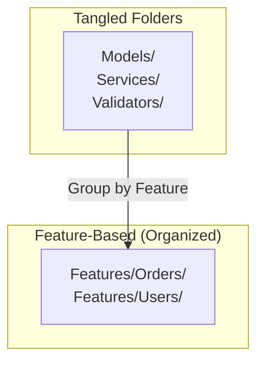

# 第20章：ファイル整理（using・名前空間・配置）📁🧼

## この章のゴール🎯✨

* 必要なクラスが「どこにあるか」すぐ分かる構成にする📌
* using／名前空間の散らかりを減らして、差分が小さくなる習慣をつける✂️
* ファイル移動しても壊れにくい（＝安全にいじれる）土台を作る🛡️

---

## 1) “ファイル整理”がリファクタになる理由🧠💡


コードの中身を変えなくても、ファイル配置や名前空間がぐちゃぐちゃだと…

* 探すだけで時間が溶ける🫠
* 似たようなクラスを別の場所にまた作っちゃう（重複）👯‍♀️
* 変更したい範囲が見えず、怖くて触れない😱

逆に「置き場所・名前空間・using」が整うと、次の章（コードスメル）以降の改善が**めちゃ進みます**🚀✨



---

## 2) using を整える（少なく・揃えて・自動化）🧹✨

## 2-1. まず知っておく：using には3種類あるよ🧩

1. **ファイル内 using**：そのファイルだけに効く
2. **global using**：プロジェクト内の全ファイルに効く（最上部に書くルールあり）([Microsoft Learn][1])
3. **Implicit Usings**：プロジェクト設定で、よく使う名前空間が自動で global using される（SDKが裏で追加）([Microsoft Learn][2])

.NET系の新しめプロジェクトだと、Implicit Usings が最初から有効なことが多いです🪄([Microsoft Learn][2])

---

## 2-2. 実務でおすすめの方針（迷いが減るやつ）✅✨

* **基本は Implicit Usings に任せる**（増やしすぎない）([Microsoft Learn][2])
* それでも頻出なら **GlobalUsings.cs を1つ作って global using を集約**🧺
* ファイル先頭の using は「本当にそのファイルで必要なものだけ」にする🌿

### 例：GlobalUsings.cs（プロジェクト直下に置くのが分かりやすい）📄✨

```csharp
// GlobalUsings.cs
global using System;
global using System.Collections.Generic;
global using System.Linq;

// 例：よく使う自作名前空間をまとめる
global using MyApp.Common;
```

※ global using は「namespace や型宣言より前」に書く必要があります🧷([Microsoft Learn][1])

---

## 2-3. Visual Studioで “using整理” を自動化する🪄🧼

手でポチポチするより、IDEにやらせた方が安定します💯

* **Sort Usings**（usingを並べ替え）
* **Code Cleanup**（不要using削除・スタイル適用など）

Visual Studio には Code Cleanup があり、EditorConfig のルールを元に整形できます🧽([Microsoft Learn][3])
Sort Usings もメニューから実行できます🧷([Microsoft Learn][4])

---

## 3) 名前空間を整える（ズレを減らして迷子ゼロへ）🗺️✨

## 3-1. file-scoped namespace を使う（インデントが減る！）⬇️

1ファイルに1つの名前空間なら、これが読みやすいです🌸
（波カッコが消えて、ネストが1段減る😊）

```csharp
namespace MyApp.Features.Orders;

public class OrderService
{
    // ...
}
```

この書き方は「1ファイル＝1名前空間」に向いてます📌([Microsoft Learn][5])

---

## 3-2. 「フォルダ」と「名前空間」を揃える？揃えない？🤔📁

初心者のうちは、迷いが減るので **揃える運用がラク**です✨
さらに、.NET のスタイルルールにも「フォルダ構成と名前空間を一致させる」ための分析ルール（IDE0130）があります🔎([Microsoft Learn][6])

ただし、絶対ルールではないです🙆‍♀️
チームや規模に合わせて「揃える/揃えない」を決められればOK！

---

## 4) ファイル配置のコツ（“近くに置く”が正義）📌💖

## 4-1. 関連物は近くに置く🧲✨

たとえば「注文機能」に関係するものは、同じフォルダ（同じ名前空間）に寄せると強いです💪

📁 Features
　📁 Orders
　　- Order.cs（モデル）
　　- OrderService.cs（ロジック）
　　- OrderValidator.cs（検証）
　　- OrderController.cs / OrderEndpoint.cs（入口）

「見る範囲」が小さくなるので、理解が速いです⚡

---

## 4-2. “共通” は増やしすぎない（Common地獄注意）⚠️🕳️

Common / Utils / Helpers を作るのは簡単だけど、増えすぎると**何でも入るゴミ箱**になります🗑️💦
共通化は「本当に複数機能で同じ理由で変わる」ものだけに絞るのがコツです🌿

---

## 5) Visual Studioでの実践手順（安全に移動する）🚚🛡️

## 手順A：ファイルをフォルダ移動 → 名前空間を同期📁🔁

1. ソリューション エクスプローラーで、ファイルをドラッグして目的フォルダへ移動
2. 名前空間がズレたら、名前空間上で **Ctrl + .**
3. **Sync namespace and folder name**（フォルダ名に合わせて名前空間変更）を選ぶ🪄

このリファクタ機能が用意されています✨([Microsoft Learn][7])

---

## 手順B：型（クラス）ごと名前空間へ移す🧳➡️🏷️

1. クラス名にカーソル
2. **Ctrl + .**
3. **Move to namespace** を選んで、移動先を指定

Visual Studio の「Move to namespace」手順がドキュメント化されています📘([Microsoft Learn][8])

---

## 手順C：最後に using を整える🧼✨

* Sort Usings（並び替え）([Microsoft Learn][4])
* Code Cleanup（不要using削除＋ルール適用）([Microsoft Learn][3])

→ そして **ビルド＆テスト**✅（ここ超大事）

---

## 6) ミニ演習📝✨（“同じ目的の型をまとめて移動”🚚）

## お題🎀

次のように散らかった状態を整えるよ🧹

* OrderService が Services に
* Order が Models に
* OrderValidator が Validators に
* でも「注文機能」なら Features/Orders にまとめたい！…みたいな状態😵‍💫

## やること✅

1. 「Features/Orders」フォルダを作る📁
2. 注文機能の型をまとめて移動🚚
3. file-scoped namespace に統一（できる範囲でOK）✍️
4. Ctrl + . で名前空間を同期 or Move to namespace を使う🪄([Microsoft Learn][7])
5. Code Cleanup で using を整える🧼([Microsoft Learn][3])
6. ビルド＆テスト✅
7. 「ファイル整理だけ」で1コミット🌿📌

---

## 7) AI拡張の使いどころ🤖✨（安全運転ルールつき🛡️）

## 7-1. 相談していいこと🙆‍♀️

* 「このプロジェクト、フォルダ構成どう分ける？」🗂️
* 「GlobalUsings.cs にまとめる候補どれ？」🧺
* 「名前空間の粒度、フォルダ一致ルールにする？」🔎（IDE0130も絡めて理由付きで）([Microsoft Learn][6])

## 7-2. AIへの依頼文テンプレ（コピペOK）📋✨

* 「このプロジェクト構成を見て、Features単位のフォルダ案を3つ。メリット・デメリットも。」
* 「GlobalUsings.cs に集約する候補を列挙して。増やしすぎない方針で。」
* 「ファイル移動後、名前空間を同期する手順を Visual Studio の操作で箇条書きにして。」([Microsoft Learn][7])

**お願いのコツ**：1コミット分の小ささで頼むと事故が減るよ🧯✨

---

## 8) よくあるつまずき😭➡️解決🧷

* **global using を下の方に書いてコンパイルエラー**
  → global using は namespace や型より前に置くルールがあるよ📌([Microsoft Learn][1])

* **フォルダ移動したのに名前空間が古いまま**
  → Ctrl + . → Sync namespace and folder name を使う🪄([Microsoft Learn][7])

* **ファイル整理したのに差分が大きい**
  → Code Cleanup / Sort Usings を最後に1回だけかけると差分が安定しやすい🧼([Microsoft Learn][3])

---

## まとめ🌈✨

* using は「増やさない」「揃える」「IDEに任せる」🧼
* 名前空間は file-scoped を使うと読みやすい📄✨([Microsoft Learn][5])
* フォルダと名前空間を揃える運用は、初心者ほど迷いが減る（IDE0130でも支援できる）🗺️([Microsoft Learn][6])
* Visual Studio のリファクタ機能（同期・移動）で安全に整理できる🚚🛡️([Microsoft Learn][7])

[1]: https://learn.microsoft.com/en-us/dotnet/csharp/language-reference/keywords/using-directive?utm_source=chatgpt.com "The using directive: Import types from a namespace - C# ..."
[2]: https://learn.microsoft.com/en-us/dotnet/core/project-sdk/overview?utm_source=chatgpt.com "NET project SDK overview"
[3]: https://learn.microsoft.com/en-us/visualstudio/ide/code-styles-and-code-cleanup?view=visualstudio&utm_source=chatgpt.com "Code Style Options and Code Cleanup - Visual Studio ..."
[4]: https://learn.microsoft.com/en-us/visualstudio/ide/reference/sort-usings?view=visualstudio&utm_source=chatgpt.com "Sort usings - Visual Studio (Windows)"
[5]: https://learn.microsoft.com/en-us/dotnet/csharp/language-reference/proposals/csharp-10.0/file-scoped-namespaces?utm_source=chatgpt.com "File scoped namespaces - C# feature specifications"
[6]: https://learn.microsoft.com/en-us/dotnet/fundamentals/code-analysis/style-rules/ide0130?utm_source=chatgpt.com "IDE0130: Namespace does not match folder structure - .NET"
[7]: https://learn.microsoft.com/en-us/visualstudio/ide/reference/sync-namespace-and-folder-name?view=visualstudio&utm_source=chatgpt.com "Sync namespace and folder name - Visual Studio (Windows)"
[8]: https://learn.microsoft.com/en-us/visualstudio/ide/reference/move-type-to-namespace?view=visualstudio&utm_source=chatgpt.com "Move type to namespace - Visual Studio (Windows)"
