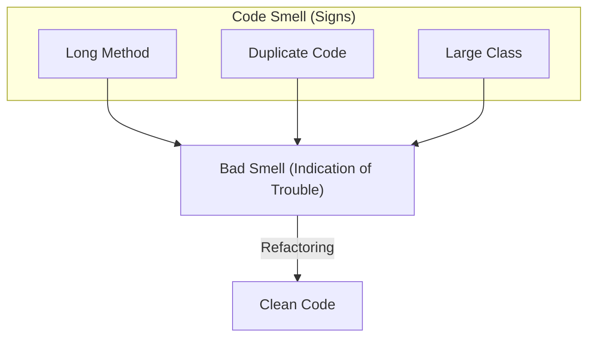

# 第21章：コードスメルとは？（違和感を言葉にする）😮🔎

## この章のゴール🎯

* 「コードスメル＝直したほうがよさそうな“サイン”」を説明できる👃✨
* 代表的なスメルを見て「これかも！」と気づける👀💡
* 見つけたスメルに対して、**最初の一手（小さな直し方）**を選べる🛠️🌸
* 見つけたスメルに対して、**最初の一手（小さな直し方）**を選べる🛠️🌸

---

## 1. コードスメルってなに？👃💭


**コードスメル**は、プログラムの動きが間違っている（バグ）とは限らないけど、
「このままだとツラくなりそう…😵‍💫」という**品質の問題のサイン**のことだよ〜📌✨ ([ウィキペディア][1])

ポイントはこれ👇

* ✅ **今すぐ壊れてはいない**（動くことも多い）
* ✅ でも **読みづらい・直しづらい・テストしづらい** を呼びやすい
* ✅ 「絶対に悪！」じゃなくて、**状況によって判断が変わる**（主観も入る） ([ウィキペディア][1])



---

## 2. バグとスメルの違い🧯🆚👃


### バグ💥

* 期待と違う動きをする（例：合計金額が間違う、落ちる、例外が出る）😱

### スメル👃

* 動くけど、将来つらい匂いがする（例：直すたびに別のところが壊れる、仕様追加が地獄）😵‍💫

イメージとしては👇

* バグ：**今困ってる**🚨
* スメル：**未来の自分が困る予告**📅💦

---

## 3. まず覚える！代表スメル5つ👀✨

この教材の次の章でも深掘りするやつを、ここで「顔見せ」するね😊🌸
（分類や一覧の考え方は定番があるよ📚） ([リファクタリング ガール][2])

### ① 長いメソッド（Long Method）📜✂️


**サイン**：スクロールが長い、途中で何やってるか忘れる😵
**困ること**：理解が遅い、ちょっと直すのが怖い
**最初の一手**：意味のまとまりで **Extract Method**（切って名前をつける）✂️🏷️

---

### ② 巨大クラス（Large Class）🏢➡️🏠🏠


**サイン**：フィールドもメソッドも多い、変更理由がいっぱい😮
**困ること**：責務が混ざって、影響範囲が読めない
**最初の一手**：責務をラベル分けして、1つだけ外へ逃がす（Extract Classの入口）🏷️🚪

---

### ③ 重複コード（Duplicate Code）♻️😵


**サイン**：同じような処理がコピペで何回も出てくる
**困ること**：仕様変更のたびに全部直す＝直し漏れ💦
**最初の一手**：「同じ“知識”」だけ共通化（まずは Extract Method）🧠✂️

---

### ④ 密結合（Tight Coupling）🧲💦


**サイン**：あちこちのクラスを new してる／外部（DB・HTTP・ファイル）直呼びが多い
**困ること**：テストしづらい、ちょっと直したら連鎖で崩れる😱
**最初の一手**：外部呼び出しを1枚包む（Wrapper/Adapterの入口）🧤🔌

---

### ⑤ 引数が多い（Long Parameter List / Data Clumps）🧳📦


**サイン**：メソッド呼び出しが引数だらけ、しかも同じ組み合わせが何度も出る
**困ること**：順番間違い・渡し忘れが起きる、読むだけで疲れる🥺
**最初の一手**：まとめて **Parameter Object**（小さな型にする）📦✨

---

## 4. スメルを見つける「超実用」チェックリスト📝👀


コードを見た瞬間に、これを心の中でチェック✅✨

1. **読むのに時間がかかる**（「え、何これ？」が多い）⏳😵
2. **変更が怖い**（どこに影響するか想像できない）😱
3. **同じ修正を何回もしてる**（またここも直すの？）🔁💦
4. **テストが書きにくい**（外部依存・状態がぐちゃぐちゃ）🧪🥲
5. **名前が弱い**（doStuff、Process、tmp…みたいに意図が薄い）🏷️🌀

スメル発見は、いきなり完璧じゃなくてOK🙆‍♀️✨
「違和感メモ📝」→「言葉にする🗣️」だけで、次の一手が見えてくるよ🌈

---

## 5. AIで“スメル候補”を秒速で集める🤖⚡

AIはすごく便利だけど、扱いはこのスタンスが安全だよ👇

* AIの指摘＝**仮説（ヒント）**🧠💡
* 採用するかは **差分レビュー＋動作確認** で決める✅🔍

Visual Studio 2026 と .NET 10 まわりは、AI支援も強化されてる（Copilot連携など）よ〜🤖✨ ([Microsoft for Developers][3])

### 使いやすい質問テンプレ🪄

* 「このメソッドの責務を3つに分けるなら？理由付きで」🧩
* 「コードスメル候補を5つ、根拠と“最初の一手”も添えて」👃📋
* 「変更を1コミット分に収めるなら、どこをどう直す？」🌿📌
* 「安全に Extract Method できそうな境界を提案して」✂️🔎

---

## 6. ミニ演習：このコードからスメルを5つ発見しよう🕵️‍♀️🔍

次のコードには、わざとスメルを混ぜてあるよ😈💦
**目標：スメルを5つ見つけて、名前をつける**（例：長いメソッド、重複…）🏷️✨

```csharp
using System;
using System.Data.SqlClient;
using System.Net.Mail;

public class OrderService
{
    public void ProcessOrder(
        int customerId,
        string customerName,
        string email,
        string shippingZip,
        string shippingAddress1,
        string shippingAddress2,
        int itemId,
        int quantity,
        decimal unitPrice,
        bool isExpress)
    {
        // ① マジック値が混ざってる（例：税率、送料など）
        var taxRate = 0.1m;
        var shippingFee = isExpress ? 1200 : 600;

        if (quantity <= 0)
        {
            Console.WriteLine("Invalid quantity");
            return;
        }

        if (string.IsNullOrWhiteSpace(email))
        {
            Console.WriteLine("Invalid email");
            return;
        }

        // ② ここから長いメソッド＆責務ごちゃ混ぜ（計算・DB・メール・ログ）
        var subtotal = unitPrice * quantity;
        var tax = subtotal * taxRate;
        var total = subtotal + tax + shippingFee;

        Console.WriteLine($"Order start: customerId={customerId}, itemId={itemId}, qty={quantity}");

        // ③ DB直結＆newが直書き（テストしづらい密結合）
        using (var con = new SqlConnection("Server=.;Database=Shop;Trusted_Connection=True;"))
        {
            con.Open();

            var cmd = con.CreateCommand();
            cmd.CommandText =
                "INSERT INTO Orders(CustomerId, ItemId, Quantity, Total, ShipZip, ShipAddr1, ShipAddr2) " +
                "VALUES(@CustomerId, @ItemId, @Quantity, @Total, @ShipZip, @ShipAddr1, @ShipAddr2)";

            cmd.Parameters.AddWithValue("@CustomerId", customerId);
            cmd.Parameters.AddWithValue("@ItemId", itemId);
            cmd.Parameters.AddWithValue("@Quantity", quantity);
            cmd.Parameters.AddWithValue("@Total", total);
            cmd.Parameters.AddWithValue("@ShipZip", shippingZip);
            cmd.Parameters.AddWithValue("@ShipAddr1", shippingAddress1);
            cmd.Parameters.AddWithValue("@ShipAddr2", shippingAddress2);

            cmd.ExecuteNonQuery();
        }

        Console.WriteLine($"Order saved: total={total}");

        // ④ メール送信も直書き（これも外部依存）
        var message = new MailMessage("noreply@example.com", email);
        message.Subject = "Order Confirmed";
        message.Body =
            $"Hi {customerName}\n" +
            $"Total: {total}\n" +
            $"ShipTo: {shippingZip} {shippingAddress1} {shippingAddress2}\n" +
            $"Express: {isExpress}";

        using (var smtp = new SmtpClient("localhost"))
        {
            smtp.Send(message);
        }

        Console.WriteLine($"Mail sent: to={email}");
        Console.WriteLine("Order end");
    }
}
```

### やること📝✨

1. このコードから **スメルを5つ** 見つけて、メモする👃📝
2. 各スメルに対して「困ること」を一言で書く😵‍💫
3. 「最初の一手」を1つずつ選ぶ（Rename / Extract Method / Parameter Object など）🛠️🌸

### ヒント💡（見つけやすい場所）

* 引数の数、多くない？🧳💦
* ProcessOrder の中、責務が混ざってない？🌀
* DBとメール、テストしやすい形？🧪🥲
* 同じ種類のログ、増えたらどうなる？🧾🔁

---

## 7. Visual Studioで“安全に匂いを減らす”操作の入口🛠️✨

スメルは「一気に大改造！」より、**小さく直す**のがコツだよ🌿📌

* **Quick Actions / Refactorings**：その場で候補を出してくれる（便利！）✨
* **Extract Method**：選択して抽出（ショートカットもある）✂️📦 ([Microsoft Learn][4])

---

## まとめ：この章で覚えたい3つ🌈✨

* コードスメル＝**品質の問題のサイン**（バグとは違う）👃📌 ([ウィキペディア][1])
* まずは代表スメル（長いメソッド・巨大クラス・重複・密結合・引数多い）を見分ける👀✨ ([リファクタリング ガール][2])
* 直し方は「大工事」じゃなくて、**最初の一手を小さく**（Extract/Rename など）🛠️🌿 ([Microsoft Learn][4])

[1]: https://en.wikipedia.org/wiki/Code_smell?utm_source=chatgpt.com "Code smell"
[2]: https://refactoring.guru/refactoring/smells?utm_source=chatgpt.com "Code Smells"
[3]: https://devblogs.microsoft.com/dotnet/announcing-dotnet-10/ "Announcing .NET 10 - .NET Blog"
[4]: https://learn.microsoft.com/en-us/visualstudio/ide/reference/extract-method?view=visualstudio&utm_source=chatgpt.com "Extract a method - Visual Studio (Windows)"
