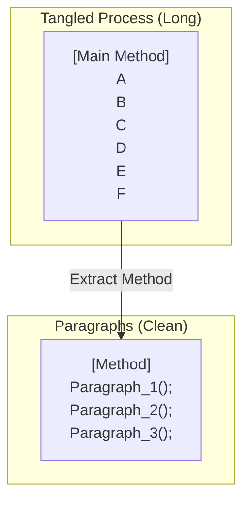

# 第22章：長いメソッド攻略（“読めない”の原因を分解）📜✂️

## この章でできるようになること🎯✨

* 「長いメソッド」を**“段落”として分解**して読めるようになる👀📝
* Extract Method で**安全に切る順番**が分かる✂️✅
* 切った後に**名前で意図を固定**できる🏷️✨
* AI（Copilot / Codex系）に頼むときの**事故らない頼み方**が分かる🤖🛡️

---

## そもそも「長いメソッド」って何が困るの？😵‍💫💦


長いメソッドはだいたい、こんな状態になりがち👇

* 途中で何やってるか見失う🌀
* 1つ直したいだけなのに、影響範囲が読めない😱
* 「入力チェック」「計算」「保存」「通知」みたいな別ジャンルが混ざる🍲
* 同じような処理が散らばって重複しやすい📎

結果、**直すのが怖い → 放置 → もっと大変**のループに入りやすいよ〜😇



---
ちなみに今の主流のC#周りは、.NET 10 + C# 14 を Visual Studio 2026 で扱う流れがはっきりしてるので、IDEのリファクタ機能＆AI支援を前提に“安全に切る”のが現実的だよ🧰✨ ([Microsoft Learn][1])

---

## 攻略のコツは「段落」📖➡️✂️


長いメソッドは、いきなり切り始めると事故りがち💥
まずは **“読むための整頓” → “切る”** の順にするのが安定だよ😊✨

### ステップ0：段落を作る（まだ切らない）📝

* 空行を入れて、処理のまとまりを分ける
* まとまりごとに「何してる段落？」って**一言コメント**を書く（仮でOK）💬

このコメントはあとで **Extract Method の名前候補**になるよ🏷️✨

---

## 「切る」時の3つのルール💡✨

### ルール①：1段落 = 1つの意図（1つの理由で変わる）🧠

* 「入力チェック段落」「金額計算段落」「保存段落」みたいに分ける🍱

### ルール②：抽出メソッド名は “やること” を言い切る🏷️


* `DoWork()` ❌
* `ValidateRequest()` ✅
* `CalculateTotals()` ✅

### ルール③：引数が増えすぎたら“まとめるサイン”📦


Extract Method したら引数が6個…みたいになったら、

* その段落は責務が広い
* もしくは、データの塊（Data Clumps）がある
  どっちかの可能性が高いよ🧳💦

---

## 実演：長いメソッドを「段落→抽出」で切る👀✨

## Before：長い…読めない…😇

```csharp
public class OrderService
{
    private readonly IInventory inventory;
    private readonly IPaymentGateway payment;
    private readonly IOrderRepository orders;
    private readonly IEmailSender email;

    public OrderService(IInventory inventory, IPaymentGateway payment, IOrderRepository orders, IEmailSender email)
    {
        this.inventory = inventory;
        this.payment = payment;
        this.orders = orders;
        this.email = email;
    }

    public async Task<PlaceOrderResult> PlaceOrderAsync(PlaceOrderRequest request, CancellationToken ct)
    {
        // ① 入力チェック
        if (request is null) throw new ArgumentNullException(nameof(request));
        if (request.Items.Count == 0) return PlaceOrderResult.Fail("No items");
        if (string.IsNullOrWhiteSpace(request.CustomerEmail)) return PlaceOrderResult.Fail("Email required");

        // ② 在庫チェック & 引当
        foreach (var item in request.Items)
        {
            var ok = await inventory.IsAvailableAsync(item.Sku, item.Quantity, ct);
            if (!ok) return PlaceOrderResult.Fail($"Out of stock: {item.Sku}");
        }
        foreach (var item in request.Items)
        {
            await inventory.ReserveAsync(item.Sku, item.Quantity, ct);
        }

        // ③ 金額計算
        decimal subtotal = 0;
        foreach (var item in request.Items)
        {
            subtotal += item.UnitPrice * item.Quantity;
        }
        var shipping = subtotal >= 5000 ? 0 : 500;
        var tax = Math.Floor(subtotal * 0.10m);
        var total = subtotal + shipping + tax;

        // ④ 決済
        PaymentResult payResult;
        try
        {
            payResult = await payment.ChargeAsync(request.CustomerEmail, total, ct);
        }
        catch (Exception ex)
        {
            return PlaceOrderResult.Fail($"Payment error: {ex.Message}");
        }
        if (!payResult.Success) return PlaceOrderResult.Fail("Payment declined");

        // ⑤ 保存
        var order = new OrderEntity
        {
            CustomerEmail = request.CustomerEmail,
            Subtotal = subtotal,
            Shipping = shipping,
            Tax = tax,
            Total = total,
            Items = request.Items.Select(x => new OrderItemEntity(x.Sku, x.UnitPrice, x.Quantity)).ToList(),
            PaidAtUtc = DateTime.UtcNow
        };
        await orders.SaveAsync(order, ct);

        // ⑥ 通知
        await email.SendAsync(
            request.CustomerEmail,
            "Your order is confirmed",
            $"Total: {total} (subtotal: {subtotal}, shipping: {shipping}, tax: {tax})",
            ct);

        return PlaceOrderResult.Ok(order.Id);
    }
}
```

---

## ステップ1：段落コメントを「メソッド名」にする🏷️✨

このメソッド、段落はもう見えてるよね👇
①入力チェック / ②在庫 / ③計算 / ④決済 / ⑤保存 / ⑥通知

ここからは **段落ごとに Extract Method** していくよ✂️🪄

---

## After：短くて読める😍✨（“やること”が見出しになる）


```csharp
public async Task<PlaceOrderResult> PlaceOrderAsync(PlaceOrderRequest request, CancellationToken ct)
{
    var validation = ValidateRequest(request);
    if (!validation.Success) return validation;

    await EnsureInStockAsync(request, ct);
    await ReserveInventoryAsync(request, ct);

    var money = CalculateTotals(request);

    var charged = await TryChargeAsync(request.CustomerEmail, money.Total, ct);
    if (!charged.Success) return PlaceOrderResult.Fail(charged.ErrorMessage);

    var order = CreateOrderEntity(request, money);
    await orders.SaveAsync(order, ct);

    await SendConfirmationAsync(request.CustomerEmail, money, ct);

    return PlaceOrderResult.Ok(order.Id);
}

private static PlaceOrderResult ValidateRequest(PlaceOrderRequest request)
{
    if (request is null) throw new ArgumentNullException(nameof(request));
    if (request.Items.Count == 0) return PlaceOrderResult.Fail("No items");
    if (string.IsNullOrWhiteSpace(request.CustomerEmail)) return PlaceOrderResult.Fail("Email required");
    return PlaceOrderResult.Ok(0);
}

private async Task EnsureInStockAsync(PlaceOrderRequest request, CancellationToken ct)
{
    foreach (var item in request.Items)
    {
        var ok = await inventory.IsAvailableAsync(item.Sku, item.Quantity, ct);
        if (!ok) throw new InvalidOperationException($"Out of stock: {item.Sku}");
    }
}

private async Task ReserveInventoryAsync(PlaceOrderRequest request, CancellationToken ct)
{
    foreach (var item in request.Items)
    {
        await inventory.ReserveAsync(item.Sku, item.Quantity, ct);
    }
}

private static Totals CalculateTotals(PlaceOrderRequest request)
{
    decimal subtotal = 0;
    foreach (var item in request.Items)
    {
        subtotal += item.UnitPrice * item.Quantity;
    }
    var shipping = subtotal >= 5000 ? 0 : 500;
    var tax = Math.Floor(subtotal * 0.10m);
    var total = subtotal + shipping + tax;
    return new Totals(subtotal, shipping, tax, total);
}

private async Task<(bool Success, string ErrorMessage)> TryChargeAsync(string email, decimal amount, CancellationToken ct)
{
    try
    {
        var result = await payment.ChargeAsync(email, amount, ct);
        return result.Success ? (true, "") : (false, "Payment declined");
    }
    catch (Exception ex)
    {
        return (false, $"Payment error: {ex.Message}");
    }
}

private static OrderEntity CreateOrderEntity(PlaceOrderRequest request, Totals money)
{
    return new OrderEntity
    {
        CustomerEmail = request.CustomerEmail,
        Subtotal = money.Subtotal,
        Shipping = money.Shipping,
        Tax = money.Tax,
        Total = money.Total,
        Items = request.Items.Select(x => new OrderItemEntity(x.Sku, x.UnitPrice, x.Quantity)).ToList(),
        PaidAtUtc = DateTime.UtcNow
    };
}

private async Task SendConfirmationAsync(string emailAddress, Totals money, CancellationToken ct)
{
    await email.SendAsync(
        emailAddress,
        "Your order is confirmed",
        $"Total: {money.Total} (subtotal: {money.Subtotal}, shipping: {money.Shipping}, tax: {money.Tax})",
        ct);
}

public readonly record struct Totals(decimal Subtotal, decimal Shipping, decimal Tax, decimal Total);
```

### どこが良くなった？🌸

* 上から読むと「やってること」が見出しみたいに並ぶ📚✨
* 1つの段落を直しても、他に波及しにくい🌊➡️🫧
* テストやデバッグで「どの段落が怪しい？」がすぐ分かる🔍✅

---

## 演習📝💪：段落コメント→Extract Method で切ってみよう✂️✨

## お題🎀

あなたの手元にある（or サンプルの）“長いメソッド”を1つ選んで、次をやってね👇

1. **空行**で段落を作る📖
2. 各段落に**1行コメント**を書く💬
3. 段落ごとに **Extract Method**（IDE機能）✂️
4. 抽出したメソッド名を **Rename** で“言い切り”にする🏷️
5. 最後にビルド＆テスト✅🧪（通らなかったら即戻す🔁）

## 合格ライン✅✨

* 元の長いメソッドが **上から読んで意味が分かる**
* 抽出メソッドの名前だけで、処理の流れが追える
* “1つ直したい”時に触る場所が絞れる

---

## AI活用🤖✨：「分割案3パターン」を出させるコツ


Visual Studio 2026 はAI連携が強化されていて、IDE内で相談→差分確認がしやすい流れが続いてるよ🧰🤖 ([Microsoft for Developers][2])

## おすすめ依頼テンプレ（コピペOK）📋✨

* **テンプレ①：段落案を出させる**

  * 「このメソッドを“段落”に分けるなら、段落名を箇条書きで出して。副作用がありそうな箇所も指摘して」

* **テンプレ②：Extract Method 案を3パターン**

  * 「Extract Method の分割案を3パターン出して。各案のメリット/デメリットも1行で。変更は“動作を変えない”前提」

* **テンプレ③：1コミットに収める**

  * 「まずは“段落コメント追加＋1つだけExtract Method”まで。差分が小さくなるように提案して」

## 採用ルール🛡️✅

* AI提案は **そのまま採用しない**（差分を読む👀）
* **ビルド & テストが通ることが採用条件**✅
* 1回の変更量を小さく（戻せるの大事🌿）

---

## 仕上げチェックリスト✅📌


* [ ] 元メソッドが **10〜20行くらい**の“読み物”になった？📖
* [ ] 抽出メソッド名が `Do/Handle/Process` だらけになってない？😇（もっと言い切る🏷️）
* [ ] 抽出メソッドの引数が増えすぎてない？🧳💦
* [ ] “チェック/計算/保存/通知”が混ざってない？🍲➡️🍱
* [ ] 変更後に **ビルド＆テスト**した？✅🧪

---

## よくある失敗🙅‍♀️💥（ここだけ注意！）


* **切ったけど名前が雑**で、結局読めない😵‍💫
* Extract Method の結果、**引数だらけ**になって余計つらい🧳
* “とりあえず小さいメソッド量産”で、逆に迷子になる🌀
* 例外処理や戻り値の扱いを変えてしまい、**動作が変わる**😱

---

## ミニ確認クイズ🎓✨

1. 長いメソッドを切る前にまずやることは？（ヒント：段落📖）
2. `DoWork()` みたいな名前がダメな理由は？🏷️
3. Extract Method したら引数が8個になった！これは何のサイン？🧳

---

## まとめ🧁✨

* 長いメソッドは **段落にしてから切る**のが安全📖✂️
* Extract Method の成功は **名前で8割決まる**🏷️✨
* AIは「分割案」出しが得意！でも **差分レビュー＋テスト**がセット🤖✅

（次章は「重複」の見極めに進むと、さらにスッキリするよ〜👃📚）

[1]: https://learn.microsoft.com/en-us/dotnet/csharp/whats-new/csharp-14?utm_source=chatgpt.com "What's new in C# 14"
[2]: https://devblogs.microsoft.com/dotnet/announcing-dotnet-10/?utm_source=chatgpt.com "Announcing .NET 10"
