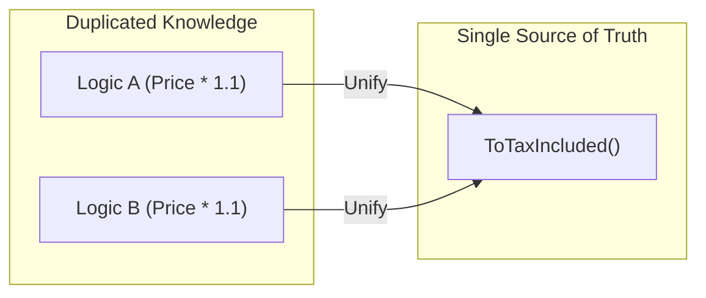

# 第23章：重複の見極め（DRYの正しい使い方）🧠⚖️

## ねらい🎯

「重複＝全部まとめる！」にならずに、**まとめて良い重複**と**放置して良い重複**を見分けられるようになるよ👀✨
そして、まとめるときは **“名前”で意図を固定する**ところまでやるよ🏷️💕

---

## まず結論：DRYは「同じコードを消す」じゃなくて「同じ知識を1か所に」📌✨


DRY（Don’t Repeat Yourself）は、ざっくり言うと👇

* ❌ 同じ行が2回出たら即共通化！
* ✅ **同じルール（知識・意味）が2か所にあるのが危険**

たとえば…

* 「送料は500円（ただし1万円以上で無料）」みたいな**ビジネスルール**が複数箇所に散らばってる → これは危険😱
* たまたま似た形の`if`が2か所にあるだけ（理由が別） → これは放置でもOKなこと多い🙂



---

## 重複の3タイプを見分けよう👃✨（コードスメルの正体）

### ① コピペ重複（同じ形・同じ意味）📄📄

* 例：エラーメッセージ生成が全く同じ
* ✅ **まとめてOK率が高い**✨
* ただし、まとめるときは「何の重複か」を**名前で言い切る**のが大事🏷️

### ② 似てる重複（形は似てるけど意味がズレてる）🌀

* 例：どっちも「割引」だけど、片方は会員割・片方はキャンペーン割
* ⚠️ 無理に一体化すると「何でも屋メソッド」になって読みにくい😵‍💫
* ✅ まずは「同じ知識か？」をチェック！

### ③ “知識”の重複（コードは違うのにルールが同じ）🧠💥

* 例：A画面とB画面で「税込み計算」のルールが同じなのに別実装
* ✅ 一番ヤバい重複！将来の仕様変更で事故りやすい🚨
* ✅ **ルールを1か所に寄せる価値が高い**✨

---

## 共通化していいか迷ったらコレ🧩✅（判断チェックリスト）

次の質問に「はい」が多いほど、共通化しやすいよ👇

* ✅ **変更理由が同じ？**（同じ仕様変更で一緒に直す？）
* ✅ **呼び名が同じ？**（同じ言葉で説明できる？）
* ✅ **入力と出力が同じ意味？**（値は同じでも意味が違うと危険💦）
* ✅ **同じレイヤー（層）？**（UIの都合とドメインの都合は混ぜない）
* ✅ **共通化した後、名前がスパッと付く？**（名前が付かないならまだ早い😇）

逆に、こうなったらやめとこ🙅‍♀️

* ❌ 引数が増えまくる（`bool isCampaign, bool isMember, bool ...`）
* ❌ 例外だらけ（`if (specialCase) ...`）
* ❌ 名前が「Helper」「Util」になりがち（意味がない🥲）

---

## 実践：重複を“安全に”まとめる基本手順🛡️🔁

### Step 1：まず「同じ知識？」を言葉にする🗣️💭

例：

* 「これは“支払合計の計算”の重複だね」
* 「これは“エラー表示用メッセージ整形”の重複だね」
  みたいに、**名詞で言える**と強いよ✨

### Step 2：差分をはっきりさせる（何が違う？）🔎

* 変わるのは **数字？条件？メッセージ？**
* “違い”が1〜2個なら共通化しやすい🙆‍♀️
* 違いが多いなら、今は放置が正解なことも多い🙂

### Step 3：一番カンタンな形で共通化する（最小ステップ）✂️

* まずは **Extract Method**（メソッド抽出）でOK！
* いきなりクラス分割まで行かなくて大丈夫🏠✨

### Step 4：最後に「名前」でロックする🔒🏷️

共通化のゴールは「短くなった」じゃなくて👇

* ✅ **意味が伝わる名前になった**
* ✅ **ルールが1か所に固定された**
  これができたら勝ち🎉

---

## 例題：コピペ重複 → “知識”としてまとめる💎✨

### Before（重複してる）😵‍💫

```csharp
public static class PriceText
{
    public static string FormatForCart(decimal price)
    {
        var taxIncluded = price * 1.10m;
        return $"合計: {taxIncluded:N0}円（税込）";
    }

    public static string FormatForReceipt(decimal price)
    {
        var taxIncluded = price * 1.10m;
        return $"お支払い: {taxIncluded:N0}円（税込）";
    }
}
```

「税込みにするルール（×1.10）」が2か所にあるよね😱
将来、税率が変わったら…両方直し忘れる事故が起きがち💦

---

### After（“税率ルール”を1か所に）✅🏷️

```csharp
public static class PriceText
{
    private const decimal TaxRate = 1.10m;

    public static string FormatForCart(decimal price)
        => $"合計: {ToTaxIncluded(price):N0}円（税込）";

    public static string FormatForReceipt(decimal price)
        => $"お支払い: {ToTaxIncluded(price):N0}円（税込）";

    private static decimal ToTaxIncluded(decimal price)
        => price * TaxRate;
}
```

ポイントはここ👇✨

* 税込み計算の知識を `ToTaxIncluded` に固定🧠🔒
* `TaxRate` も定数化して意味を付けた🏷️
* 表示文言は用途別のまま残す（ここを無理に一体化しない）🙂

---

## 「共通化しすぎ」あるある事故😇💥（やらないで〜）

### 事故パターン：何でも入るメソッドを作っちゃう

```csharp
public static string Format(decimal price, bool isCart, bool isReceipt, bool withComma, bool withTax, bool ...)
{
    ...
}
```

こうなると👇

* 読む側が地獄😵‍💫
* 変更が怖い😱
* 条件が増えるほどバグる💥

✅ 対策：**用途別の入り口は残す**（`FormatForCart`は残す）
✅ 中身だけ“同じ知識”を寄せる（`ToTaxIncluded`みたいに）

---

## IDEでの見つけ方🔎✨（重複の発見ルート3つ）

### ① “まずは目視で怪しい匂い”を拾う👃

* 同じコメント
* 同じ数字
* 同じメッセージ
* 同じ`try-catch`の形
  このへんは重複の入口になりやすい🙂

### ② 検索で当たりを付ける🔍

* 目印になる文字列（例：`"税込"`）
* マジックナンバー（例：`1.10m`）
* 例外メッセージ
  から探すと早いよ✨

### ③ “コードクローン分析”で見つける（使える場合）🧬

Visual Studio には **Analyze Solution for Code Clones**（重複検出）機能があり、メニューからソリューション全体を解析できるよ🔎✨（環境によっては追加コンポーネントの導入が必要なこともあるよ）([Stack Overflow][1])

---

## AIの使い方🤖✨（重複は“判断”が大事だから、聞き方がコツ）

### AIに投げると良い質問例💬

* 「この2つのメソッドは“同じ知識”の重複？それとも偶然？」
* 「共通化するなら“最小ステップ”で、3案出して。危険点も書いて」
* 「引数が増えすぎない形でまとめたい。どこまでが自然？」

### 注意⚠️

AIは「まとめる」提案が得意だけど、**やりすぎ案**も出しがち🥲
なので👇

* ✅ 1コミット分に制限
* ✅ 差分を読む
* ✅ テストで確認
  をセットでね🛡️✨

（Visual Studio側でもコード整形やルール統一に **EditorConfig / Code Cleanup** が使えるよ🧼📏([Microsoft Learn][2])）

---

## ミニ演習📝🎀（10〜20分）

### 演習1：重複を“分類”する👃🔎

次のうち、どれに近いか当ててみてね👇

1. コピペ重複📄
2. 似てる重複🌀
3. 知識の重複🧠

自分のプロジェクト or サンプルで、似た処理を2つ探して分類しよう✨

### 演習2：重複1つだけ統合して、名前で意図を固定🏷️

* 例：`ToTaxIncluded` / `NormalizeEmail` / `BuildErrorMessage` みたいに
* できたら、**差分を小さく**してコミット📌🌿

---

## よくあるQ&A🙋‍♀️💡

### Q1：どれくらい似てたら共通化するの？

A：**同じ仕様変更で一緒に変わる**なら、共通化しやすいよ✅
逆に「似てるけど理由が別」なら、無理にまとめないのが正解🙂

### Q2：共通化したら逆に読みにくくなった…

A：それは超あるある😇

* “名前が付けにくい”
* “引数が増えすぎ”
  が出たら、**一段戻す**のも正しい判断だよ🔙✨

---

## まとめ✨

* DRYは「同じコード」じゃなくて **同じ知識を1か所に**🧠🔒
* 重複は3タイプ（コピペ／似てる／知識）で見分ける👃
* 共通化のゴールは「短く」じゃなくて **名前で意図を固定**🏷️✨
* 迷ったら「変更理由が同じ？」で判断✅
* AIは“案出し”に使って、採用は差分とテストで決める🤖🛡️

（参考：Visual Studioのスタイル統一はEditorConfigで共有できるよ🧼([Microsoft Learn][2])。また、JetBrains ReSharper 2025.3 はC# 14のサポートやVisual Studio 2026互換など、最新言語機能に合わせたリファクタリング群の更新が案内されているよ🔧✨([The JetBrains Blog][3])）

[1]: https://stackoverflow.com/questions/77113392/how-to-identify-duplicate-code-in-visual-studio-2022?utm_source=chatgpt.com "How to identify duplicate code in Visual Studio 2022"
[2]: https://learn.microsoft.com/en-us/visualstudio/ide/code-styles-and-code-cleanup?view=visualstudio&utm_source=chatgpt.com "Code Style Options and Code Cleanup - Visual Studio ..."
[3]: https://blog.jetbrains.com/dotnet/2025/11/11/resharper-2025-3-day-one-csharp-14-support-visual-studio-2026-compatible/?utm_source=chatgpt.com "ReSharper 2025.3: Day-One C# 14 Support, Visual Studio ..."
