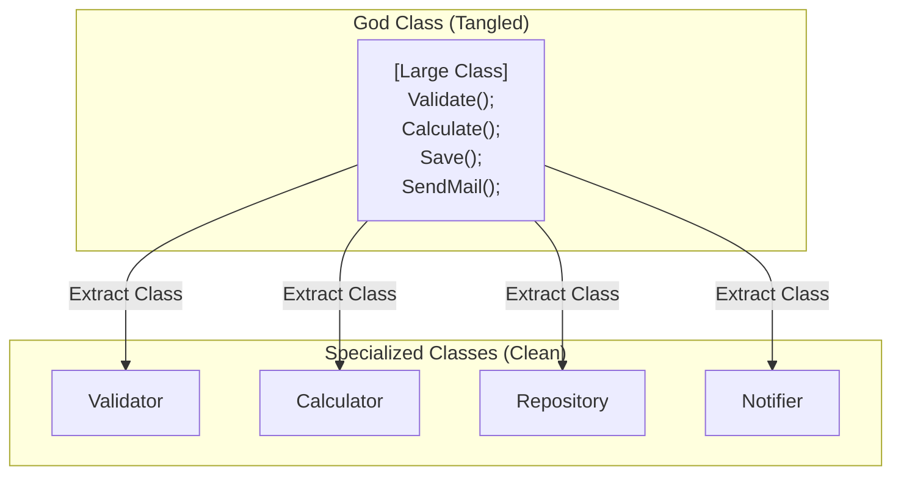

# 第24章：巨大クラスのサイン（責務が混ざってる）🏢➡️🏠🏠

## この章でできるようになること🎯✨

* 「あ、これ巨大クラスかも…！」を**具体的なサイン**で見抜ける👀💡
* クラスの中身を「入力」「計算」「保存」「通知」みたいに**責務ラベル**で仕分けできる🏷️🗂️
* 壊さずに、**小さく安全に Extract Class（クラス分割）**を進められる🛡️✂️
* AI（Copilot / OpenAI系）に頼る時も、**事故らない指示**が出せる🤖✅

---

## 1. 巨大クラスってなに？🏢💦


巨大クラス（Large Class）は、ざっくり言うと **「なんでも屋さんになってしまったクラス」**です😵‍💫
本来は1つの目的のためにあるはずなのに、いつの間にか…

* 入力チェックもして🧾
* 計算もして🧮
* DB保存もして💾
* メール通知もして📧
* ログも握って🧾
* 例外も揉み消して😇

みたいに、**複数の役割（責務）が混ざって**しまう状態です。
この “混ざり” が増えると、変更のたびに壊れやすくなります🥲
（「Large Class は Extract Class などで分割する」のが典型的な対処として整理されています📚） ([refactoring.guru][1])



---

## 2. 巨大クラスの「よくあるサイン」チェックリスト👃🔎

次のサインが複数当てはまったら、巨大クラス疑い強めです⚠️

## サインA：変更理由が多い🌀

* 「仕様変更」が来るたびに、いつもこのクラスが巻き込まれる😇
* “割引の変更”でも“画面表示の変更”でも同じクラスを触る…

👉 **1つのクラスに “変更理由” が複数**あるのが危険信号です🚨

## サインB：フィールド（状態）が多すぎる🧳💦

* フィールドがズラッと並ぶ
* しかも「どれがどの処理で必要なの？」ってなる

「インスタンス変数が多すぎるのは、やりすぎの兆候」っていう古典的な見立てもあります📖 ([industriallogic.com][2])

## サインC：メソッドが散らかってる🧨

* 似た名前のメソッドが大量（`ProcessA` `ProcessB` …）
* 呼び出し関係が迷路🌀

## サインD：クラス名がフワッとしてる☁️

* `Manager` / `Service` / `Helper` / `Util` が付いてる
  （全部が悪いわけじゃないけど、巨大化しやすい名前です😇）

## サインE：#region が多い（あるある）📦

* `#region Validation`
* `#region Database`
* `#region Email`
  みたいに “区画整理” してるなら、**区画ごとに家（クラス）を分けられる**可能性が高いです🏠✂️
  （指標として語られることがあります📌） ([anthonysciamanna.com][3])

---

## 3. でも「大きい＝悪」ではない🙅‍♀️⭕

サイズが大きくても、必ずしも悪ではありません🙂✨
たとえば…

* **DTO / record** みたいに「データの箱」だけの型📦
* **Facade（窓口）**として「薄く呼び出すだけ」の型🚪
* 生成コードやフレームワーク都合の型🧩

こういうのは “大きく見える” けど、責務が混ざってないことも多いです👌
大事なのは **行数より “責務の混ざり”** です🏷️⚖️

---

## 4. まずは「責務ラベル貼り」から🏷️🗂️（最強に効く）


巨大クラスを分割する時、いきなり切ると事故りやすいです🧨
だから最初に、クラス内のコードを **ラベルで仕分け**します✨

## やり方（超シンプル）📝

1. クラスを上から読む👀
2. メソッド（または処理の塊）ごとにラベルを付ける🏷️

   * 例：`入力` / `検証` / `計算` / `永続化` / `通知` / `ログ` / `変換` など
3. 同じラベルが固まってる場所を見つける🔎
4. 「まとまり」を1つ選んで、そこだけ切り出す✂️🏠

この章のミニ演習も、この方法でいきます🎀

---

## 5. 分割の“良い切り方”と“微妙な切り方”🍰⚔️

## 良い切り方（おすすめ）👍✨

* “計算” を `Calculator` にする🧮
* “検証” を `Validator` にする✅
* “永続化” を `Repository` にする💾
* “通知” を `Notifier` にする📧

✅ つまり **「役割（責務）で切る」** です🏷️

## 微妙な切り方（初心者がやりがち）😇

* 「private メソッドを適当に別クラスに移しただけ」
* 「データだけ移して、処理が元クラスに残る」

こうなると、分割したのに呼び出しが増えて余計に読みにくい…ってなりがちです🥲

---

## 6. 実例で体験：注文処理クラスが巨大化した例🛒💦

## Before：なんでも屋 `OrderProcessor` 🏢

```csharp
public sealed class OrderProcessor
{
    private readonly IOrderRepository _repo;
    private readonly IEmailSender _email;
    private readonly ILogger _log;

    public OrderProcessor(IOrderRepository repo, IEmailSender email, ILogger log)
    {
        _repo = repo;
        _email = email;
        _log = log;
    }

    public async Task<OrderResult> PlaceOrderAsync(OrderRequest request, CancellationToken ct)
    {
        // ①入力チェック（検証）
        if (request is null) return OrderResult.Fail("request is null");
        if (request.Items.Count == 0) return OrderResult.Fail("no items");

        // ②価格計算（計算）
        var subtotal = request.Items.Sum(x => x.UnitPrice * x.Quantity);
        var discount = request.CouponCode == "NEW10" ? subtotal * 0.10m : 0m;
        var total = subtotal - discount;

        // ③永続化（保存）
        var orderId = await _repo.InsertAsync(request.CustomerId, request.Items, total, ct);

        // ④通知（メール）
        await _email.SendAsync(request.CustomerEmail, $"Thanks! OrderId={orderId}", ct);

        // ⑤ログ
        _log.Info($"Order placed. id={orderId} total={total}");

        return OrderResult.Success(orderId);
    }
}
```

この時点でラベル貼りすると…

* ①検証✅
* ②計算🧮
* ③保存💾
* ④通知📧
* ⑤ログ🧾

ほら、もう責務が5つありますね😵‍💫

---

## 7. 安全に切る手順（小さく！）🛡️✂️

巨大クラスは「一気に分割」すると壊れやすいので、**小さな勝ち**を積み上げます🏆✨
（リファクタはステップを小さく＆テストで確認が基本、という整理もあります📚） ([refactoring.guru][4])

## 手順0：挙動を固定する✅📸

* 既にテストがあれば最高🧪✨
* なければ「最小の Characterization Test（挙動写し）」でOK📸

例：正常系だけでも1本あると安心度が爆上がりです🛡️

## 手順1：切り出す責務を “1つだけ” 選ぶ🏷️➡️🏠

初心者におすすめは **「計算」か「検証」** です🙂
外部I/O（DB/メール）より安全に切れます✅

## 手順2：新しいクラスを作る🧱

* `OrderPricing` / `OrderValidator` みたいに、役割がわかる名前に🏷️✨

## 手順3：フィールドではなく「メソッドの塊」から移す✂️

* まず `CalculateTotal(...)` を新クラスに移動🧮
* 元クラスはそれを呼ぶだけにする📞

## 手順4：コンパイル✅→テスト✅→コミット🌿

* 1ステップごとに区切ると、戻せて安心です🧸✨

---

## 8. After：計算だけ外に出してスッキリ🧮✨

```csharp
public sealed class OrderPricing
{
    public Money CalculateTotal(OrderRequest request)
    {
        var subtotal = request.Items.Sum(x => x.UnitPrice * x.Quantity);
        var discount = request.CouponCode == "NEW10" ? subtotal * 0.10m : 0m;
        return new Money(subtotal - discount);
    }
}

public readonly record struct Money(decimal Value);

public sealed class OrderProcessor
{
    private readonly IOrderRepository _repo;
    private readonly IEmailSender _email;
    private readonly ILogger _log;
    private readonly OrderPricing _pricing = new();

    public OrderProcessor(IOrderRepository repo, IEmailSender email, ILogger log)
    {
        _repo = repo;
        _email = email;
        _log = log;
    }

    public async Task<OrderResult> PlaceOrderAsync(OrderRequest request, CancellationToken ct)
    {
        if (request is null) return OrderResult.Fail("request is null");
        if (request.Items.Count == 0) return OrderResult.Fail("no items");

        var total = _pricing.CalculateTotal(request);

        var orderId = await _repo.InsertAsync(request.CustomerId, request.Items, total.Value, ct);
        await _email.SendAsync(request.CustomerEmail, $"Thanks! OrderId={orderId}", ct);
        _log.Info($"Order placed. id={orderId} total={total.Value}");

        return OrderResult.Success(orderId);
    }
}
```

✅ これだけでも、元クラスの頭の中が一気に軽くなります🧠✨
ここから次の責務（検証・通知・保存）も同じやり方で、**1個ずつ**切れます✂️🏠🏠

---

## 9. Visual Studioでの探索テク（巨大クラスほど効く）🔍💻

* **Find All References**：そのフィールド/メソッドがどこで使われてるか一撃👀
* **Call Hierarchy**：呼び出しの流れを迷子にならずに追う🧭
* **Go To Definition**：依存先をすぐ開ける📌
* **差分表示（Diff）**：AI提案も、必ず差分で確認✅

Visual Studio 2026 は AI 統合やパフォーマンス改善を前面に出しています🤖⚡ ([Microsoft Learn][5])

---

## 10. AIに頼むときの“安全プロンプト”集🤖🛡️

AIはめっちゃ便利だけど、「一気に全部直して」は事故りやすいです😇
**1コミット分の小ささ**で頼むのがコツです🌿✨

## ① 責務ラベルを付けてもらう🏷️

```text
このC#クラスを読んで、責務を3〜6個のラベルに分類して。
各メソッドを「どのラベルか」対応付けて、理由も短く。
```

## ② 切り出し候補を “小さく” 出してもらう✂️

```text
このクラスから Extract Class するなら、まず一番安全に切れる責務を1つ選んで。
最小ステップ（コンパイルが通る単位）で手順を書いて。
```

## ③ テストの当たりを作ってもらう🧪

```text
このメソッドの挙動を固定するために、最小のテスト（正常系1本＋境界1本）案を出して。
期待値は推測じゃなく「入力→出力」を明記して。
```

## ④ 差分レビュー補助📌

```text
この変更差分で、挙動が変わってしまいそうな点を列挙して。
特に null、例外、境界条件、I/O、非同期を重点的に。
```

---

## 11. ミニ演習📝🎀：責務ラベル → 1つだけ分割！

## 演習1：ラベル貼り🏷️

1. 自分のプロジェクト or サンプルで「大きめのクラス」を1つ選ぶ🏢
2. メソッドごとにラベルを付ける（最低4つ）🏷️🏷️🏷️🏷️

おすすめラベル例👇

* 検証✅ / 計算🧮 / 変換🔁 / 保存💾 / 通知📧 / ログ🧾 / 例外🚧

## 演習2：一番安全そうなラベルを1つだけ切る✂️

* “計算” か “変換” が初心者向き🙂✨
* 新クラス名は **役割が伝わる名詞**で🏷️（例：`Pricing`, `Validator`）

## 演習3：コミットを3回に分ける🌿

* コミット1：新クラス追加（まだ未使用でもOK）
* コミット2：メソッド移動（元クラスから呼ぶだけに）
* コミット3：名前や引数を整理（リネームなど）

---

## 12. 仕上げチェック✅✨（分割が成功してるサイン）

* 元クラスのメソッドが「やってること説明」になった（短く読める）📖
* 新クラス名を見て役割が一発でわかる🏷️
* 変更が来た時「触るクラス」が減った🧯
* テストが書きやすくなった🧪✨

---

## まとめ🌈✨

巨大クラスの正体は「サイズ」じゃなくて **責務の混ざり**です🏷️🌀
まずは **責務ラベル貼り**で見える化して、**1責務ずつ**安全に切り出すのが最短ルート✂️🛡️
Large Class は Extract Class などで分割する、という整理が定番としてまとめられています📚 ([refactoring.guru][1])

次章では、巨大クラスとセットで出やすい「引数が多い（Data Clumps）」を扱います🧳💦

[1]: https://refactoring.guru/smells/large-class?utm_source=chatgpt.com "Large Class"
[2]: https://www.industriallogic.com/img/blog/2005/09/smellstorefactorings.pdf?utm_source=chatgpt.com "Smells to Refactorings"
[3]: https://anthonysciamanna.com/2015/12/31/regions-are-code-smell-indicators.html?utm_source=chatgpt.com "Regions are Code Smell Indicators"
[4]: https://refactoring.guru/refactoring?utm_source=chatgpt.com "Refactoring: clean your code"
[5]: https://learn.microsoft.com/en-us/visualstudio/releases/2026/release-notes?utm_source=chatgpt.com "Visual Studio 2026 Release Notes"
