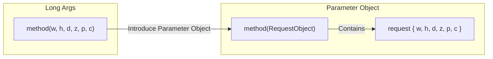

# 第25章：引数が多い（Long Parameter List / Data Clumps）🧳💦

## ねらい🎯

引数がズラッと並ぶメソッドを見たときに、**「まとめるべき“かたまり”」を見抜いて**、**いい感じの“型”にしてスッキリ**できるようになること✨
Long Parameter List / Data Clumps は「オブジェクト化しなよ〜」っていうサインになりやすいよ👃💡 ([martinfowler.com][1])

---

## まずは用語：この章の2大スメル👃👃

### 1) Long Parameter List（引数が長い）📜

メソッド呼び出しが読みにくく、**順番ミス・渡し忘れ・変更の波及**が起きやすい状態💦
（引数が増える背景には「いろんな処理が混ざった」「分岐制御のためにフラグが増えた」などがありがち） ([refactoring.guru][2])

### 2) Data Clumps（いつも一緒に行動するデータの塊）🧷🧷

たとえば `start` と `end`、`prefecture` と `city` と `zip` みたいに、**いつもセットで渡されてる**やつ。
こういう“塊”は **Range / Address みたいなオブジェクトになりたがってる**ことが多いよ📦✨ ([martinfowler.com][1])



---

## 何が困るの？😵‍💫（つらみポイント）

* 呼び出し側が **「どの値が何？」** ってなる（読みづらい）📚💦
* 順番を間違えると **コンパイルは通るのにバグる**（特に同じ型が並ぶと危険⚠️）
* 仕様変更で **呼び出し箇所が大量に壊れる**（変更が波及🌊）
* 「関係ある値」が散らばって、**責務の境界が見えなくなる**🌀

---

## 見つけ方🔎✨（初心者でもできるチェック）

次のうち **2つ以上** 当てはまったら、かなり怪しいよ👀💡

* 引数が **5個以上**（目安）📌
* `string, string, string...` や `int, int, int...` が並んでる（順番バグの匂い）😱
* `start/end`、`x/y`、`min/max` みたいな **“ペア/セット”** がある🧷
* 似た引数セットが **複数メソッドにコピペ**されてる（Data Clumps）📎
* `bool isXxx` みたいな **フラグ引数** がある（分岐が育ちがち）🚩

---

## 直し方の選択肢🧰✨（まずはコレだけ覚えよ！）

Long Parameter List を直す代表技はこのへん👇（状況で選ぶよ）

1. **Introduce Parameter Object（引数をオブジェクトにまとめる）📦**
   “いつも一緒”の塊を **1つの型** にして渡す。まず第一候補💎 ([refactoring.guru][3])

2. **Preserve Whole Object（元のオブジェクトごと渡す）🧺**
   すでに「住所オブジェクト」みたいなのがあるのに、そこから値を抜き出してバラ渡ししてるなら、**そのオブジェクトをそのまま渡す**ほうが自然なことも多いよ📌 ([informit.com][4])

3. **Replace Parameter with Query（引数を減らして問い合わせで取得）🔍**
   ある引数が **他の引数から計算できる**なら、重複なので減らせることがあるよ🧠 ([informit.com][4])

4. **Remove Flag Argument（フラグ引数を消す）🚩❌**
   `bool isExpress` みたいな “分岐スイッチ” は、**別メソッドに分ける**・**Strategyにする**などが安全✨ ([informit.com][4])

---

## いちばん大事：Parameter Object の作り方📦🪄


### ✅ 基本方針（失敗しにくい）

* まずは **「データをまとめるだけ」** から開始（いきなり賢くしない）🙂
* できれば **不変（immutable）** にする（途中で書き換わると追跡が地獄💥） ([refactoring.guru][3])
* “全部まとめ”は危険⚠️：**一緒に変わる・一緒に使う**が基準🧷

---

## 手順（安全にいこうね🛡️✅）

### Step 0：安全ネット準備🧪

* テストがあるなら実行✅
* テストがないなら、最小の Characterization Test（挙動の写し）を1本でもいいから用意📸🧪

### Step 1：塊（clump）を見つけて名前を付ける🏷️✨

例：

* `widthCm, heightCm, depthCm` → **Dimensions**
* `zip, prefecture, city, street` → **Address**
* `start, end` → **DateRange** ([martinfowler.com][1])

### Step 2：Parameter Object を作る📦

まずは “ただの入れ物” でOK🙂
（あとで育てる🌱）

### Step 3：メソッドを「新しい形」にする🔁

いきなり既存シグネチャを消すより、**新メソッド（or overload）を追加**してから移行すると事故りにくいよ🛡️

### Step 4：呼び出し側を置換していく🧹✨

Visual Studio の「参照の検索」「置換」「リネーム」を使って、一気に整える💨

### Step 5：古い形を消す（または Obsolete にする）🗑️

移行が完了したら整理して終わり🏁✨

---

## 例題：引数6個 → 1つの型へ📦✨

### Before（引数が多くてツラい😵‍💫）

```csharp
public static decimal CalcShippingCost(
    decimal weightKg,
    decimal widthCm,
    decimal heightCm,
    decimal depthCm,
    string destinationCountryCode,
    bool isExpress)
{
    // 例: ざっくりしたダミー計算
    var volume = widthCm * heightCm * depthCm;
    var baseCost = weightKg * 120m + volume * 0.01m;

    if (destinationCountryCode == "JP") baseCost += 300m;
    if (isExpress) baseCost *= 1.5m;

    return decimal.Round(baseCost, 0);
}
```

呼び出し側がこうなると、もう読めないよね…🥺💦

```csharp
var cost = CalcShippingCost(2.5m, 30m, 20m, 10m, "JP", true);
```

---

### After（Parameter Objectでスッキリ😍✨）

```csharp
public sealed class ShippingRequest
{
    public decimal WeightKg { get; }
    public decimal WidthCm { get; }
    public decimal HeightCm { get; }
    public decimal DepthCm { get; }
    public string DestinationCountryCode { get; }
    public bool IsExpress { get; }

    public ShippingRequest(
        decimal weightKg,
        decimal widthCm,
        decimal heightCm,
        decimal depthCm,
        string destinationCountryCode,
        bool isExpress)
    {
        if (weightKg <= 0) throw new ArgumentOutOfRangeException(nameof(weightKg));
        if (widthCm <= 0 || heightCm <= 0 || depthCm <= 0) throw new ArgumentOutOfRangeException("dimensions");
        DestinationCountryCode = destinationCountryCode ?? throw new ArgumentNullException(nameof(destinationCountryCode));

        WeightKg = weightKg;
        WidthCm = widthCm;
        HeightCm = heightCm;
        DepthCm = depthCm;
        IsExpress = isExpress;
    }
}

public static decimal CalcShippingCost(ShippingRequest request)
{
    var volume = request.WidthCm * request.HeightCm * request.DepthCm;
    var baseCost = request.WeightKg * 120m + volume * 0.01m;

    if (request.DestinationCountryCode == "JP") baseCost += 300m;
    if (request.IsExpress) baseCost *= 1.5m;

    return decimal.Round(baseCost, 0);
}
```

呼び出し側がこうなる🎉

```csharp
var request = new ShippingRequest(
    weightKg: 2.5m,
    widthCm: 30m,
    heightCm: 20m,
    depthCm: 10m,
    destinationCountryCode: "JP",
    isExpress: true);

var cost = CalcShippingCost(request);
```

✅ **named arguments** と相性バツグンで、「何の値？」が消えるよ🏷️✨

---

## さらに良くする（育てる🌱→💎）

Data Clumps の“面白いところ”はここから👇
塊をオブジェクトにしたら、次は **「振る舞い」を移せる**ようになるよ✨ ([martinfowler.com][1])

例：寸法計算は `Dimensions` に寄せる、住所チェックは `Address` に寄せる、みたいに🏠📦

---

## “まとめちゃダメ”なケースもあるよ⚠️

### ✅ 例：DI（依存注入）でコンストラクタ引数が多い🤝

依存が多い＝設計のサインのこともあるけど、**Parameter Object にまとめると依存関係が見えなくなる**ことがある。
「スメルはルールじゃない」って視点が大事🙂 ([Doc Norton & Associates][5])

---

## AI（Copilot / Codex系）活用プロンプト例🤖✨

そのままコピって使える形👇（1回の変更を小さくするのがコツ🧠📌）

### ① 塊の候補出し（Data Clumps 検出）🔎

```text
このメソッドの引数リストから、Data Clumps（いつも一緒に出てくる塊）候補を3案出して。
それぞれ「なぜその単位でまとめるべきか（変更理由・意味）」も1〜2行で。
```

### ② Parameter Object の設計（不変＋命名）📦🏷️

```text
Introduce Parameter Object をやりたい。
不変（immutable）で、プロパティ名が読みやすい C# のクラス案を作って。
null/範囲チェックも最低限入れて。
```

### ③ 移行手順（1コミットに収める）🛡️

```text
この変更を「1コミットで安全にやる」手順に分解して。
中間状態でもビルドが通るように、オーバーロード追加→呼び出し置換→旧メソッド削除の流れで。
```

---

## ミニ演習📝💖（手を動かすよ〜）

### 演習1：引数6個→Parameter Object 1個📦

* 自分のコード（or サンプル）から、引数が多いメソッドを1つ選ぶ👀
* Parameter Object を作る
* 既存呼び出しを置き換える
* テスト（なければ簡単な Characterization Test）で挙動確認✅

### 演習2：Data Clumps を3箇所から根絶📎🔥

* 同じ引数セットが出てくるメソッドを3つ探す
* まとめた型を共通利用にする
* 「その型に移せそうな処理」を1つだけ移す（例：バリデーション）🧠✨ ([martinfowler.com][1])

---

## まとめ🌈✨

* **Long Parameter List** は、呼び出し側の可読性と変更耐性を壊しがち💦 ([refactoring.guru][2])
* **Data Clumps** は「それ、オブジェクトになりたいよ」サイン📦✨ ([martinfowler.com][1])
* まずは **Introduce Parameter Object**（不変で）でスッキリが定番💎 ([refactoring.guru][3])
* フラグ引数や“丸ごと渡せる”ケースは、別の手（Remove Flag / Preserve Whole Object）も検討🚩🧺 ([informit.com][4])
* C# 14 は .NET 10 とセットで進化中なので、最新の言語機能・ツール前提で進められるよ🧁✨ ([learn.microsoft.com][6])

[1]: https://martinfowler.com/bliki/DataClump.html?utm_source=chatgpt.com "Data Clump"
[2]: https://refactoring.guru/smells/long-parameter-list?utm_source=chatgpt.com "Long Parameter List"
[3]: https://refactoring.guru/introduce-parameter-object?utm_source=chatgpt.com "Introduce Parameter Object"
[4]: https://www.informit.com/articles/article.aspx?p=2952392&seqNum=4&utm_source=chatgpt.com "Long Parameter List | When to Start Refactoring Code— ..."
[5]: https://docondev.com/blog/2020/6/2/refactoring-introduce-parameter-object?utm_source=chatgpt.com "Refactoring: Introduce Parameter Object - Doc Norton"
[6]: https://learn.microsoft.com/en-us/dotnet/csharp/whats-new/csharp-14?utm_source=chatgpt.com "What's new in C# 14"
