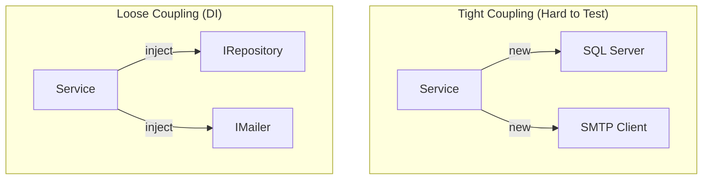

# 第26章：密結合のサイン（参照が多すぎる）🧲🪶

---

## 密結合ってどんな状態？🧲😵


密結合（Tight Coupling）は、ざっくり言うと…

> **ある処理が、たくさんの“具体的なもの”にベッタリ依存していて、ちょっと変えただけで広範囲が壊れやすい状態**💥

たとえば👇

* DBの種類を変えたい → いろんなクラスが直にDBアクセスしてて無理😇
* メール送信を止めたい → あちこちに `new SmtpClient()` が散らばってる📩💦
* テストしたい → `DateTime.Now` とファイルI/OとHTTPが混ざってて詰み😭



---

## まず「依存」を数えよう🔢🧠

密結合の第一歩はとっても地味だけど強い👇✨

## ✅ 依存（Dependency）とは？

「このコードが動くために必要な外部のもの」だよ📦
例：他クラス、DB、HTTP、ファイル、時刻、乱数、静的クラス、設定、環境変数…などなど。

## ✅ 超カンタンな数え方

次のどれかが多いと黄色信号🚦💛

* **コンストラクタ引数が多い**（例：6個以上）🧳💦
* **メソッド内の `new` が多い**（外部クラスを作りまくり）🧱🧱🧱
* **`static` 呼び出しが多い**（差し替え不能）🧊
* **外部I/O（DB/HTTP/ファイル）がロジックと混ざってる**🍝💦
* **“便利クラス”がなんでも知ってる**（神クラス）👑😇

---

## 密結合チェックリスト👃🔎（サイン集）

当てはまるほど密結合のにおい強め👃💨

## 1) 「具体クラス」に直依存してる🧱

* `SqlConnection` / `HttpClient` / `SmtpClient` / `File.ReadAllText` などを直に呼ぶ
* 変更が**伝染**しやすい🦠

## 2) 依存が “隠れてる”🫥

* メソッド引数に見えないのに、内部で勝手に `new` してる
* ぱっと見で「何に依存してるか」分からない😵

## 3) 変更のたびに「関係ない場所」も修正になる🌀

* 仕様ちょい変更なのに、UI・DB・ドメインが全部巻き込まれる

## 4) テストがつらい（これ最強のサイン）🧪😭

* テスト時にDB準備・ネットワーク・ファイルが必要
* つまり「ロジックだけ」を取り出せてない🍝

---

## 例題：全部入りサービス🍱💦（密結合あるある）

「注文確定」をするメソッドが、いろいろ抱えすぎの例だよ👇

```csharp
public sealed class OrderService
{
    public void PlaceOrder(int userId, int productId, int quantity)
    {
        // 1) 時刻に依存（差し替え不能）
        var now = DateTime.Now;

        // 2) DBに直依存
        using var conn = new SqlConnection("Server=...");
        conn.Open();

        // 3) ロジックとSQLが混在
        using var cmd = conn.CreateCommand();
        cmd.CommandText = """
            INSERT INTO Orders(UserId, ProductId, Quantity, OrderedAt)
            VALUES (@u, @p, @q, @t)
        """;
        cmd.Parameters.AddWithValue("@u", userId);
        cmd.Parameters.AddWithValue("@p", productId);
        cmd.Parameters.AddWithValue("@q", quantity);
        cmd.Parameters.AddWithValue("@t", now);
        cmd.ExecuteNonQuery();

        // 4) メール送信に直依存
        using var smtp = new SmtpClient("smtp.example.com");
        smtp.Send("noreply@example.com", "user@example.com", "Order", "Thanks!");
    }
}
```

## このコードがツラい理由😭💦

* DBとメールと時刻が**全部くっついて**いて、テストが困難🧪
* DB文字列やメール先が直書きで、変更が痛い🩹
* 「注文のルール」だけ変えたいのに、I/Oが邪魔🍝

---

## ほどき方の基本3ステップ🧵✨（1個ずつでOK！）


## ステップ①：依存を “見える化” する👀

まずは「何に依存してるか」を**外に出す**のがコツ📤

* `DateTime.Now` → `IClock` にする⏰
* DB操作 → `IOrderRepository` に寄せる🗄️
* メール → `IEmailSender` に寄せる📩

## ステップ②：境界（I/O）を “薄く” する🧁

外部の世界（DB/HTTP/ファイル/メール）は**境界**に追い出す🚪✨
中身（ドメインロジック）は「純粋」に近づける🧼

## ステップ③：注入（DI）で差し替え可能にする🎁

依存を `new` で作らず、**外から渡す**（コンストラクタ注入）にすると強い💪
.NET のDIは「依存グラフ（依存関係ツリー）」を解決する考え方だよ🌳✨ ([Microsoft Learn][1])

---

## 改善後：依存を外から渡す版✨（テストしやすい！）

```csharp
public interface IClock
{
    DateTime Now { get; }
}

public sealed class SystemClock : IClock
{
    public DateTime Now => DateTime.Now;
}

public interface IOrderRepository
{
    void Add(Order order);
}

public interface IEmailSender
{
    void SendOrderCompleted(int userId, Order order);
}

public sealed record Order(int UserId, int ProductId, int Quantity, DateTime OrderedAt);

public sealed class OrderService
{
    private readonly IClock _clock;
    private readonly IOrderRepository _repo;
    private readonly IEmailSender _email;

    public OrderService(IClock clock, IOrderRepository repo, IEmailSender email)
    {
        _clock = clock;
        _repo = repo;
        _email = email;
    }

    public void PlaceOrder(int userId, int productId, int quantity)
    {
        // ここは「注文のルール」に集中できる✨
        if (quantity <= 0) throw new ArgumentOutOfRangeException(nameof(quantity));

        var order = new Order(userId, productId, quantity, _clock.Now);

        _repo.Add(order);
        _email.SendOrderCompleted(userId, order);
    }
}
```

## 何が嬉しいの？🥰✨

* `OrderService` が **DBやSMTPを知らなくてよくなる**🙆‍♀️
* テストで `IClock` を偽物にできる（時間固定できる）⏰🧪
* DBなしでロジック検証できる（速い！）🚀

---

## ミニ演習📝✨：外部参照を1つ減らそう🔧

## お題🎯

さっきの「全部入りサービス」から、まずはこれ👇を1つだけ外に出してみよう！

* `DateTime.Now` を `IClock` にする⏰✨（おすすめ）

  * 理由：差が小さいのに効果が大きい🧪💖

## 手順（超安全）🛡️

1. `IClock` と `SystemClock` を作る
2. `DateTime.Now` を `_clock.Now` に置換
3. 動作確認✅（手動でもOK）
4. 1コミット🌿📌

---

## Visual Studioで「密結合ポイント」を探す🔍🧭

* **Find All References**：どこから使われてるか追う👣
* **Call Hierarchy**：呼び出しの流れを木で見る🌳
* **Go To Definition / Peek Definition**：依存先を覗いて「重さ」を感じ取る👀

「この1メソッド、何個の世界と繋がってる…？😵」って感覚が育つよ✨

---

## AI活用🤖✨（密結合の見つけ方＆ほどき方）

## ✅ 依存の列挙をさせる（見える化👀）

* 「このクラスが依存している外部要素（DB/HTTP/時刻/ファイル等）を列挙して。テストしづらい順に並べて」

## ✅ 1コミット分の改善案を出させる🧩

* 「このメソッドの外部依存を1つだけ減らしたい。最小差分で、まず `DateTime.Now` を差し替え可能にする案をください」

## ✅ “やりすぎ”チェックもさせる⚖️

* 「この変更は抽象化しすぎ？やりすぎポイントと、より小さい案を教えて」

※AIの提案は便利だけど、**採用前に差分レビュー＆動作確認**は必須だよ📌✅

---

## よくある失敗⚠️😭（ここ注意！）

## ❌ インターフェース作りすぎ問題🌀

「全部 `IWhatever` にしよ！」はやりすぎになりやすい💦
👉 **まずは“外部I/O”や“変化しやすいもの”から**でOK🙆‍♀️

## ❌ 1回で全部直そうとして燃える🔥

密結合は“積年の蓄積”なことが多い😇
👉 **1つ減らす**を繰り返すのが勝ち✨

## ❌ `static` 便利だからと増やす🧊

便利だけど差し替え不能で、テストが地獄になりやすい🧪😭
👉 使うなら「境界だけ」などルール化が大事📏

---

## まとめ🌟

* 密結合は「参照が多すぎる」「具体にベッタリ」で起きやすい🧲
* まずは **依存を数える** → **見える化** が第一歩🔢👀
* ほどき方は **境界に寄せる**＋**注入で差し替え**🎁✨
* いきなり完璧じゃなくてOK！**1個ずつ減らす**のが正解🧵💖

---

## 理解チェック✅🧠（サクッと）

1. `DateTime.Now` はテストしづらさに関係ある？あるならなぜ？⏰🧪
2. 「依存が隠れてる」ってどういう状態？🫥
3. 密結合の改善で、最初にやると安全な一手は？🛡️
4. インターフェースを増やしすぎると何が起きる？🌀
5. 「境界」ってどこ？例を3つ言える？🚪

---

## 最新トピックメモ🆕✨

C# 14 は .NET 10 と一緒に提供され、最新の Visual Studio 2026 または .NET 10 SDK で利用できるよ📦🌟 ([Microsoft Learn][2])

[1]: https://learn.microsoft.com/en-us/dotnet/core/extensions/dependency-injection?utm_source=chatgpt.com "Dependency injection - .NET"
[2]: https://learn.microsoft.com/en-us/dotnet/csharp/whats-new/csharp-14?utm_source=chatgpt.com "What's new in C# 14"
