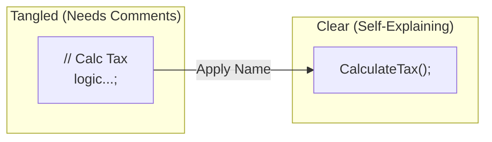

# 第27章：コメントに頼りすぎ（コードで語る）💬➡️🧾

## この章のゴール🎯✨

* 「説明コメント（何をしてるか）」を減らして、**コードだけで意図が伝わる**ようにする🪄💖
* コメントが必要な場面（残すべきコメント）もちゃんと見分けられるようになる✅🧠
* Visual Studio のリファクタ機能＋AI提案で、**コメント→コード化**を安全に進められるようになる🧹🤖

---

## まず結論：コメントは「悪」じゃない🙂‍↕️✨

でも、**増えすぎると危険**⚠️
特に「コードの説明（What/How）」系コメントが大量にあると、だんだんこうなる👇💦

* コメントが古くなって嘘になる（コメントと実装がズレる）🧟‍♀️
* 読む順番が「コメント→コード」になって理解が遅くなる🐢
* 直す人が「コメント直した気」になってバグる😵‍💫
* “説明が必要な複雑さ”を温存しちゃう🧨



---

## 「コメントに頼りすぎ」スメルあるある👃💭


次のどれかが見えたら、コメントを減らすチャンス💡✨

* `// ここで◯◯する` みたいに **コードと同じことを書いてる**📌
* `// XXXに注意` が多い（注意が必要＝設計が怖い）😰
* `// 例外的に…` が多い（分岐や責務が混ざってる）🌀
* 1つのメソッドの中が、コメントで「章立て」されてる📚（＝長すぎ）
* `TODO` が永遠に残ってる🫠（＝置き場所が不明）

---

## 残していいコメント／消したいコメント✅❌

### 消したい（コードに変換したい）コメント❌🧹

* **What/How（何してる・どうやってる）**

  * 例：`// 合計を計算する`（→メソッド名で言える✨）
* 条件の説明（→`Is~` メソッドや中間変数で言える）🧩
* 「この値は◯◯」みたいな意味付け（→型・定数で言える）🏷️

### 残していいコメント✅🫶

* **Why（なぜそうした？）**：仕様・意図・理由

  * 例：`// 外部APIが5回/分制限なのでキャッシュする`
* **トレードオフ**：なぜ別案を選ばなかったか⚖️
* **危険な前提**：外部仕様、互換性、バグ回避の経緯🧨
* **公開APIのドキュメント**（XMLコメント `///`）📖
* **TODO**（ただし“いつ消えるか”が分かる形）🗓️

---

## コメント→コード化する「7つの変換テク」🪄✨

### ① コメント1行＝名前1つにする🏷️💖

コメントを読んで「一言で言うと？」を **名前にする**✨

* 変数名：`discountRate` / `isHoliday`
* メソッド名：`ValidateOrder()` / `CalculateShippingFee()`

---

### ② 章立てコメントは Extract Method の合図✂️📦

「// 1. 入力チェック」「// 2. 計算」「// 3. 保存」みたいなのは
**そのままメソッドに分ける**と一気に読みやすい🌸

---

### ③ 条件コメントは Explain Condition（Is〜にする）🧩🙂

`// 未成年かつ深夜は購入不可`
→ `if (IsRestrictedPurchase(user, now)) ...`

---

### ④ “意味のある数字/文字列”は定数・型にする🔢➡️🏷️

`// 送料は500円` → `const int StandardShippingFee = 500;`
さらに進むと Value Object（第31章）で「金額」を型で守れる💰✨

---

### ⑤ 注意コメントが多いなら、ガード節で事故を止める🚪🛡️

`// nullなら落ちるので注意`
→ 入口で `ArgumentNullException.ThrowIfNull(x);` みたいに**先に止める**✅

---

### ⑥ フラグ説明コメントは「列挙型（enum）」にする🚩➡️🎛️

`// trueなら簡易モード` みたいなコメントは消えにくい😵‍💫
→ `Mode.Simple / Mode.Full` の方が読める✨

---

### ⑦ “使い方コメント”はテストで残す🧪📸

「この入力でこうなる」系は、コメントより **Characterization Test**（第8章）が強い💪✨

* 嘘になりにくい
* 実装を変えるとテストが守ってくれる

---

## 例題：コメントだらけコードを「コードで語る」へ🧁✨

### Before（説明コメントが多い）😵‍💫

```csharp
public decimal CalcTotal(User user, Order order, DateTime now)
{
    // ユーザーが無効ならエラー
    if (user == null) throw new ArgumentNullException(nameof(user));

    // 注文が空なら0
    if (order == null || order.Items.Count == 0) return 0m;

    // 深夜＆未成年は購入不可
    if (now.Hour >= 23 && user.Age < 20) throw new InvalidOperationException("restricted");

    // 小計を計算
    decimal subtotal = 0m;
    foreach (var item in order.Items)
    {
        // 数量×単価
        subtotal += item.UnitPrice * item.Quantity;
    }

    // 1万円以上なら送料無料
    decimal shipping = 0m;
    if (subtotal < 10000m) shipping = 500m;

    // 合計
    return subtotal + shipping;
}
```

「読める」けど、コメントがないと怖い感じがする…という状態🫠
ここから、コメントを減らすために **“名前”と“分割”** を入れるよ🪄✨

---

### Step 1：入口をガードで固めて、コメントを不要にする🚪🛡️

* 「注意」系のコメントは、入口で止めるのが正解✅

```csharp
public decimal CalcTotal(User user, Order order, DateTime now)
{
    ArgumentNullException.ThrowIfNull(user);

    if (order is null || order.Items.Count == 0) return 0m;

    ThrowIfRestrictedPurchase(user, now);

    var subtotal = CalculateSubtotal(order);
    var shipping = CalculateShippingFee(subtotal);

    return subtotal + shipping;
}
```

この時点でもう、コメントがいらなくなってきたね☺️🌸

---

### Step 2：コメントを“関数名”に変換する✂️🏷️

```csharp
private static void ThrowIfRestrictedPurchase(User user, DateTime now)
{
    if (IsRestrictedPurchase(user, now))
        throw new InvalidOperationException("restricted");
}

private static bool IsRestrictedPurchase(User user, DateTime now)
    => now.Hour >= 23 && user.Age < 20;

private static decimal CalculateSubtotal(Order order)
{
    decimal subtotal = 0m;
    foreach (var item in order.Items)
        subtotal += item.UnitPrice * item.Quantity;

    return subtotal;
}

private static decimal CalculateShippingFee(decimal subtotal)
{
    const decimal FreeShippingThreshold = 10_000m;
    const decimal StandardShippingFee = 500m;

    return subtotal >= FreeShippingThreshold ? 0m : StandardShippingFee;
}
```

ポイント🎀✨

* 「// 深夜＆未成年は購入不可」→ `IsRestrictedPurchase` が説明してくれる🙂
* 「// 1万円以上なら送料無料」→ `FreeShippingThreshold` が語ってくれる🏷️
* `10_000m` みたいに区切りを入れると読みやすい（数字が“文章”になる）🔢✨

---

## Visual Studio で爆速にやる🧹💻✨

* `Ctrl + .`：Quick Actions（安全な小リファクタの入口）⚡
* Rename / Extract Method など：IDE機能を優先すると事故が減る🛟
* **Code Cleanup**：プロジェクト全体にも実行できて、整形や整理を一気にかけられる🧼✨（ほうきアイコンや `Ctrl+K, Ctrl+E` など） ([Microsoft Learn][1])
* 警告が大量で今すぐ直せない時は、Analyze メニューから抑制もできるけど、**最終的には直す前提**で使うのが安全👌（リリースビルドに抑制を混ぜない注意もあるよ） ([Microsoft Learn][2])

---

## AI拡張の使い方（コメント→コード化）🤖🪄

AIは「変換案の大量出し」が得意✨
ただし、採用は **1コミット分**に絞るのが安全🛡️

### 使える頼み方テンプレ📝

* 「このコメントを消したい。**命名とExtract Method**でコード化する案を3つ。差分は最小で。」
* 「この `if` の条件を **Explain Condition** で読みやすくして。`Is~` の名前候補も5つ。」
* 「このメソッド、コメントの章立てごとに分けたい。**分割順**（どれから移す？）も書いて。」

Visual Studio 2026 は .NET 10 / C# 14 をフルサポートで、エディタ補完も最新前提で動くよ✨ ([Microsoft Learn][3])
C# 14 側も新機能が追加されていて（例：nullまわりや書き方の拡張など）、読みやすさ改善の選択肢が増えてる🧠✨ ([Microsoft Learn][4])

---

## ミニ演習📝💖（15〜25分）

### 演習1：コメント1行を「名前」に変える🏷️

次のコメントを、変数名 or メソッド名に変換してみよう✨

* `// 会員ランクに応じて割引率を決める`
* `// 入力が不正なら早期return`
* `// 在庫が足りないケースは例外`

---

### 演習2：章立てコメントを Extract Method✂️📦

1つの長いメソッドを見つけて、コメントがある単位で3つに分割🌸

* 分割後のメソッド名は「動詞＋目的語」にする（例：`CalculateTax`）🏷️✨

---

### 演習3：Whyコメントだけ残す✅

説明コメント（What/How）を3つ消して、
“残す価値があるWhyコメント”を1つだけ書く🫶✨

* 例：外部仕様、パフォーマンス理由、互換性理由など

---

## チェックリスト✅✨（コメントを消す前に）

* [ ] コメントが「何をしてるか」なら、名前か分割で言える？🏷️✂️
* [ ] コメントが「注意」なら、ガード節や検証で止められる？🚪🛡️
* [ ] コメントが「使い方」なら、テストで残せる？🧪📸
* [ ] コメントが「理由（Why）」なら、残す価値がある？🫶
* [ ] 変更は小さく、テストと差分レビューで確認できてる？✅🔍

[1]: https://learn.microsoft.com/en-us/visualstudio/ide/code-styles-and-code-cleanup?view=visualstudio&utm_source=chatgpt.com "Code Style Options and Code Cleanup - Visual Studio ..."
[2]: https://learn.microsoft.com/en-us/visualstudio/code-quality/in-source-suppression-overview?view=visualstudio&utm_source=chatgpt.com "Suppress code analysis violations - Visual Studio (Windows)"
[3]: https://learn.microsoft.com/ja-jp/visualstudio/releases/2026/release-notes "Visual Studio 2026 リリース ノート | Microsoft Learn"
[4]: https://learn.microsoft.com/en-us/dotnet/csharp/whats-new/csharp-14 "What's new in C# 14 | Microsoft Learn"
