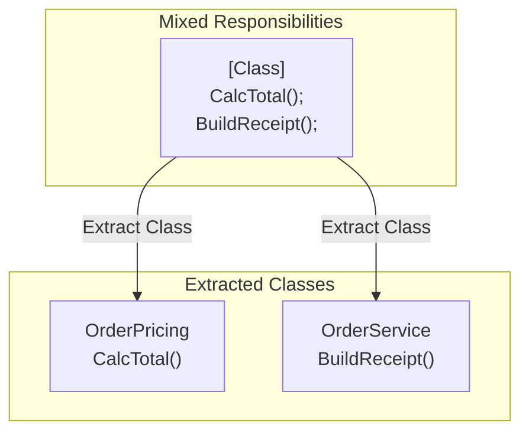

# 第28章：Extract Class 実践（分割のやり方）✂️🏠

## 1. Extract Classってなに？🤔✨


**1つのクラスが抱えすぎている責務（やること）を、別クラスに切り出して分ける**リファクタリングだよ〜😊💡
目的はシンプル👇

* **読める**📖✨（探しやすい・意図が分かる）
* **直しやすい**🛠️（変更点が1か所に集まる）
* **テストしやすい**🧪（依存や副作用が減る）



---

## 2. この章のゴール🎯🌸

できるようになりたいことはこれ👇✨

* 「どこで分ける？」を**根拠つきで決められる**🧠💎
* **事故らない順番**で、1クラス→2クラスに分割できる🛡️🔁
* 分割後に「使いにくい設計」にならないコツが分かる🚫🧩

---

## 3. Extract Class するべきサイン👃💦（見つけ方）

次のどれかが出てきたら、分割チャンスだよ〜✨

### ✅ サインA：クラスの中に「話題」が2つ以上ある🗣️🗣️

例：

* 料金計算もするし、レシート文字列も作るし、ログも出す…😵‍💫
* DBアクセスもするし、画面表示用の文字列も作る…😵‍💫

### ✅ サインB：フィールドの“グループ”がある📦

例：

* `taxRate`, `shippingFee`, `discountRate` は計算チーム💰
* `companyName`, `address`, `tel` は請求書チーム🧾

### ✅ サインC：変更理由が複数ある🔁

「税率が変わったから直す」
「レシートの見た目を変えたいから直す」
…同じクラスをいじるなら、責務が混ざってる可能性大⚠️

---

## 4. 境界の決め方（迷ったらコレ）🧭✨

分割ラインは、だいたい次のどれかで決められるよ😊

### ① “名詞”で切る（モノで切る）🏷️

* `Pricing`（料金計算）
* `Receipt`（レシート）
* `Address`（住所）

### ② “動詞のまとまり”で切る（手続きで切る）🏃‍♀️

* 「計算する」系のメソッドだけ集める
* 「文字列を整形する」系のメソッドだけ集める

### ③ “外部I/O”は薄くする（外に寄せる）🌐💾

DB/HTTP/ファイル/時計/乱数みたいな外部要素は、中心ロジックから遠ざけたい💡
（この教材の後半でやる「境界分離」にもつながるよ〜🧁🎯）

### ④ “同じデータを触ってるメソッド群”で切る🧷

「この3つのメソッド、いつもこの2フィールド触ってるな〜」
→ そこが“自然なクラス”になりやすい🌿

### ⑤ “悪い名前”が出たらやり直し🚫

新クラス名が `Utils`, `Helper`, `Manager2` みたいになったら、境界がぼんやりしてる可能性高いよ🥲
**「それって何担当？」が一発で分かる名前**を目指そ✨

---

## 5. 事故らないExtract Class手順（これが超大事）🛡️🔁

Extract Classは、勢いでやると壊れがち😭
おすすめの順番はこれ👇（安全第一✨）

### Step 0：安全ネットを張る🧪✅

* 既存テストがあれば実行✅
* テストが無ければ、最低限の「挙動固定テスト」を1本📸
* ここまででコミット🌿📌（「分割前」の戻り地点）

### Step 1：責務ラベルを付ける🏷️📝

クラス内のフィールドとメソッドに、付箋みたいにラベルを付ける気持ちで分類するよ✨

* 💰計算
* 🧾表示
* 🧰入力チェック
* 📡外部通信

### Step 2：新クラスを“空で”作る🏠✨

いきなり全部移さない！
まずは **クラスだけ**作って、コンパイル通る状態を維持😊

### Step 3：フィールド（データ）を移す📦➡️🏠

だいたい **データ→メソッド** の順が安全だよ✨

* まとめて動くフィールドを新クラスへ
* 元クラスには、新クラスのフィールドを1つ持たせる（委譲する）

### Step 4：メソッドを少しずつ移す✂️➡️🏠

* 1メソッド移す
* ビルドする
* テストする
* コミットする🌿📌
  この刻みが最強🛡️

### Step 5：呼び出し側を “委譲” に揃える☎️

* 元：`CalculateTax()`
* 後：`pricing.CalculateTax()`
  みたいに、入口を揃えると読みやすいよ✨

### Step 6：アクセス修正（private/publicの整理）🔒🧹

* 新クラスの内部は `private` 多め
* 外に見せるのは必要最小限だけ✨

### Step 7：仕上げ（命名・重複・整形）🧼🏷️

* 名前を整える（Rename）🏷️
* 小さくExtract Methodして読みやすく✂️
* Code Cleanupで整形🧽（Visual StudioのCode Cleanupは便利だよ） ([Microsoft Learn][1])

---

## 6. 実践：OrderServiceを2クラスに分割してみよう✂️🏠💰

### 🎬 Before：いろいろ抱えすぎクラス😵‍💫

「料金計算」と「レシート文字列作り」が混在してる例👇

```csharp
public sealed class OrderService
{
    private readonly decimal _taxRate;
    private readonly decimal _shippingFee;

    public OrderService(decimal taxRate, decimal shippingFee)
    {
        _taxRate = taxRate;
        _shippingFee = shippingFee;
    }

    public decimal CalculateTotal(IReadOnlyList<OrderItem> items, string? couponCode)
    {
        var subtotal = items.Sum(x => x.UnitPrice * x.Quantity);

        var discount = 0m;
        if (!string.IsNullOrWhiteSpace(couponCode) && couponCode == "OFF10")
        {
            discount = subtotal * 0.10m;
        }

        var taxed = (subtotal - discount) * (1m + _taxRate);
        return taxed + _shippingFee;
    }

    public string BuildReceiptText(IReadOnlyList<OrderItem> items, string? couponCode)
    {
        var total = CalculateTotal(items, couponCode);

        var lines = new List<string>();
        lines.Add("=== RECEIPT ===");
        foreach (var item in items)
        {
            lines.Add($"{item.Name} x{item.Quantity} : {item.UnitPrice * item.Quantity:C}");
        }
        lines.Add($"Shipping: {_shippingFee:C}");
        lines.Add($"Total: {total:C}");
        return string.Join(Environment.NewLine, lines);
    }
}

public sealed record OrderItem(string Name, decimal UnitPrice, int Quantity);
```

---

### ✅ Step 1：分割ラインを決める🧭

* 💰計算担当 → `OrderPricing`
* 🧾表示担当 → `OrderService` に残す（今回は“2クラス”にしたいので、表示はそのまま残すよ😊）

### ✅ Step 2：新クラスを作る🏠✨

```csharp
public sealed class OrderPricing
{
    private readonly decimal _taxRate;
    private readonly decimal _shippingFee;

    public OrderPricing(decimal taxRate, decimal shippingFee)
    {
        _taxRate = taxRate;
        _shippingFee = shippingFee;
    }

    public decimal CalculateTotal(IReadOnlyList<OrderItem> items, string? couponCode)
    {
        var subtotal = items.Sum(x => x.UnitPrice * x.Quantity);

        var discount = CalculateDiscount(subtotal, couponCode);
        var taxed = (subtotal - discount) * (1m + _taxRate);

        return taxed + _shippingFee;
    }

    private static decimal CalculateDiscount(decimal subtotal, string? couponCode)
    {
        if (!string.IsNullOrWhiteSpace(couponCode) && couponCode == "OFF10")
        {
            return subtotal * 0.10m;
        }
        return 0m;
    }

    public decimal ShippingFee => _shippingFee;
}
```

ポイント💡

* まずは **計算に必要なフィールドを移した**📦
* `CalculateDiscount` は “計算担当”なので一緒に移した✨
* `ShippingFee` はレシート表示に必要なので、**読み取り専用で公開**🔒

---

### ✅ Step 3：元クラスは“委譲”する☎️✨

```csharp
public sealed class OrderService
{
    private readonly OrderPricing _pricing;

    public OrderService(decimal taxRate, decimal shippingFee)
    {
        _pricing = new OrderPricing(taxRate, shippingFee);
    }

    public string BuildReceiptText(IReadOnlyList<OrderItem> items, string? couponCode)
    {
        var total = _pricing.CalculateTotal(items, couponCode);

        var lines = new List<string>
        {
            "=== RECEIPT ==="
        };

        foreach (var item in items)
        {
            lines.Add($"{item.Name} x{item.Quantity} : {item.UnitPrice * item.Quantity:C}");
        }

        lines.Add($"Shipping: {_pricing.ShippingFee:C}");
        lines.Add($"Total: {total:C}");

        return string.Join(Environment.NewLine, lines);
    }
}
```

これで、責務がこう分かれたよ〜😍

* `OrderPricing`：計算💰
* `OrderService`：組み立て・表示🧾

---

## 7. よくある失敗あるある😇💥（回避テクつき）

### ❌ 失敗1：新クラスが「ただの引っ越し先」になってる🏚️

フィールドだけ移して、結局メソッドは元のクラスに残った…
→ **“そのデータを扱うロジック”ごと移す**のが基本💡

### ❌ 失敗2：引数が増えすぎる🧳💦

「新クラスのメソッドに、元クラスの情報を引数で全部渡す」
→ それは分割じゃなくて“運搬”になりがち😭
対策✨：

* “必要なデータ”を新クラスに持たせる
* もしくは次章以降の「Parameter Object」系へつなげる📦

### ❌ 失敗3：クラス名がフワフワしてる🌫️

`OrderHelper` とか `OrderUtil` とか…
→ “担当名”にしよう！
例：`OrderPricing`, `ReceiptBuilder`, `OrderValidator` 🏷️✨

---

## 8. Visual Studioでの操作のコツ💻✨

### 🔦 Quick Actions（Ctrl + .）を積極的に使う

小さな修正（using追加、書き換え提案など）はライトバルブ💡で素早く片付くよ〜
（Visual Studioのリファクタリング操作は “Quick Actions and Refactorings” からできる系が多いよ） ([Microsoft Learn][2])

### ✂️ Extract Method を先に挟むと、Extract Classが楽になる

「移したいコードがでかい…」って時は、先に小さく切ってから移すと安全😊
Extract Method 自体は Visual Studio の基本リファクタだよ✨ ([Microsoft Learn][3])

### 🧩（オプション）Class Designerを使う手もある

クラス図上でメンバーを Cut/Paste して別型へ移す方法も紹介されてるよ🗺️✂️ ([Microsoft Learn][4])
（慣れてる人向け。まずは手作業＋小コミットでOK😊）

---

## 9. AI拡張（Copilot / Codex系）で安全に進めるコツ🤖🛡️

AIは超便利だけど、Extract Classは**壊れやすい系**なので、頼み方が大事だよ✨

### ✅ おすすめ依頼（小さく！）🧩

* 「このクラスのフィールドとメソッドを、責務ラベルで分類して」🏷️
* 「“計算担当”だけを新クラスに移す手順を、1ステップずつ提案して」🔁
* 「移動後の public/private の最小案を出して」🔒

### ✅ 合格ライン（ここ通ったら採用）✅

* ビルド通る
* テスト通る
* 差分が読める（1コミットで説明できる）📌

---

## 10. ミニ演習📝💖（手を動かすよ〜！）

### 演習A：責務ラベル分け🏷️

次の観点で、クラス内のメンバーにラベルを付けてみてね😊

* 💰計算
* 🧾表示
* 🧰検証
* 📡外部

### 演習B：1クラス→2クラスに分割✂️🏠

ルール👇

* 先に空クラスを作る
* フィールド→メソッドの順に移す
* 1回移したらビルド＆テスト✅
* できれば「分割前」「分割途中」「分割後」でコミット3回🌿📌

### 演習C：命名を仕上げる🏷️✨

* `Helper` / `Util` 禁止🙅‍♀️
* “担当が分かる名前”にする（例：`Pricing` / `Validator` / `Formatter`）

---

## 11. 理解チェック✅🧠

* Q1：Extract Class の分割ラインを決める時、「フィールドのグループ化」が役立つのはなぜ？📦
* Q2：Extract Classで「フィールド→メソッド」の順が安全な理由は？🛡️
* Q3：新クラス名が `Utils` になりそうな時、何が起きてる可能性が高い？🌫️

---

## 12. 最新環境メモ（知っておくと安心）🧾✨

* **.NET 10 は LTS**で、サポートは **2028年11月頃まで**の案内になってるよ📅✨ ([Microsoft for Developers][5])
* **C# 14** は **.NET 10 SDK / Visual Studio 2026** で試せるよ〜💻🌟 ([Microsoft Learn][6])

（この章の内容は、言語バージョンに強く依存しない“普遍テク”だから、ここは安心してOK😊👍）

[1]: https://learn.microsoft.com/en-us/visualstudio/ide/code-styles-and-code-cleanup?view=visualstudio&utm_source=chatgpt.com "Code Style Options and Code Cleanup - Visual Studio (Windows)"
[2]: https://learn.microsoft.com/ja-jp/visualstudio/ide/reference/inline-method?view=visualstudio&utm_source=chatgpt.com "メソッドのインライン化 - Visual Studio (Windows)"
[3]: https://learn.microsoft.com/en-us/visualstudio/ide/reference/extract-method?view=visualstudio&utm_source=chatgpt.com "Extract a method refactoring - Visual Studio"
[4]: https://learn.microsoft.com/en-us/visualstudio/ide/class-designer/refactoring-classes-and-types?view=visualstudio&utm_source=chatgpt.com "Refactor classes and types in Class Designer"
[5]: https://devblogs.microsoft.com/dotnet/announcing-dotnet-10/?utm_source=chatgpt.com "Announcing .NET 10"
[6]: https://learn.microsoft.com/en-us/dotnet/csharp/whats-new/csharp-14?utm_source=chatgpt.com "What's new in C# 14"
