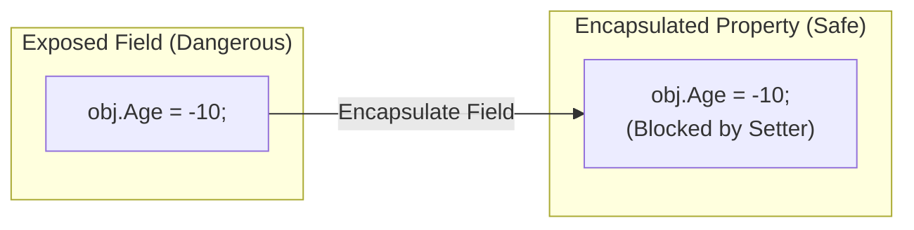

# 第29章：Encapsulate Field（直接触らせない）🔒✨

## この章のゴール🎯

* フィールド直参照（`obj.field`）をやめて、**プロパティ経由（`obj.Property`）**に置き換えられる🙂✨
* 「公開していい範囲」を小さくして、**変更に強いコード**にできる🏗️💪
* 値チェック（検証）を“入口”に集めて、**無効データを入れない**土台を作れる🚧✅

---

## まず覚えたい超大事ポイント🧠💎

**公開フィールド（public/protected なインスタンスフィールド）は基本NG**🙅‍♀️
外から直接書き換えできると、あとからルールを足したい時に詰みやすいです😵‍💫
（.NET の設計ガイドラインでも「公開フィールドは避けてプロパティで公開してね」と明確に言っています📘） ([Microsoft Learn][1])



---

## Encapsulate Fieldってなに？🔐


ざっくり言うと👇
**「外から触れる“入口”をフィールドからプロパティに移す」**リファクタです✨

* Before：`public int age;` ← 誰でも自由に書き換え放題😱
* After：`public int Age { get; set; }` ← 入口が1つになって、あとからルールを足せる💡

プロパティは「賢いフィールド（smart field）」として扱うべき、という考え方があります📘 ([Microsoft Learn][2])

---

## なぜ“直接触らせない”の？（あるある事故）😵‍💥

### 事故①：ルールを足したくても、あちこち直す羽目になる🌀

たとえば「年齢は0〜120だけ」みたいなルールを追加したいのに、フィールド直書きだと**代入箇所が全滅**します😭

### 事故②：将来の変更がしんどい（内部表現を変えられない）🧱

あとで「内部は `DateOfBirth` に変えたい」みたいになっても、外部が `age` を直参照してると崩壊します💥

### 事故③：デバッグもテストも追いにくい🔍

どこで値が変わったか追跡しづらい…
プロパティに集めると、入口でログや検証を入れられて楽になります🧾✨

---

## 使い分けミニ早見表📌

* **「まず入口を作る（挙動は変えない）」** → `get; set;` で置き換え🙂
* **「外からは変更させたくない」** → `get; private set;`（外は読めるだけ）🔒
* **「作った後は不変にしたい」** → `get; init;`（初期化時だけセット）🧊 ([Microsoft Learn][3])

---

## 手順（安全に小さく）🛡️🔁

### 1) まずは“挙動を変えずに”プロパティへ移す🙂✨

最初の一歩はこれが安定です✅
**公開フィールド → 公開プロパティ（get/set）**にして、参照箇所を一気に置換します。

### 2) 次のコミットで「公開範囲を最小」にする🔒📏

置換できたら、ここで初めて

* `private set` にする
* 更新専用メソッドを作る（`SetXxx` / `UpdateXxx`）
  などに進むと事故が少ないです🌿✨

### 3) 入口（プロパティ）に“検証”を入れる🚧✅

「入れていい値」を入口で守ると、クラスの中が壊れません💎

---

## IDEで一発：Encapsulate Field（自動置換）⚡🛠️

### Visual Studio の場合💻

* メニュー：`Edit > Refactor > Encapsulate Field`
* 右クリック：Quick Actions から Encapsulate Field
* ショートカット例：`Ctrl+R, Ctrl+E`（設定で変わることあり）
  などで、**フィールド→プロパティ作成＋参照更新**までまとめてやってくれます✨ ([Microsoft Learn][4])

### Visual Studio Code の場合🧩

C# のリファクタ機能として **Encapsulate field** が用意されています🛠️ ([Visual Studio Code][5])

---

## 例1：いちばん基本（フィールド直参照 → 自動プロパティ）🌸

### Before 😱

```csharp
public class Player
{
    public int level; // 外から自由に書けちゃう
}
```

### After ✨（入口をプロパティに）

```csharp
public class Player
{
    public int Level { get; set; } // 入口が1つになった
}
```

自動実装プロパティは、コンパイラが裏でバッキングフィールドを作ってくれるのでスッキリです🧠✨ ([Microsoft Learn][6])

---

## 例2：公開範囲を絞る（private set）🔒✨

「外から勝手に変更されたくない」なら、こうします👇

```csharp
public class Player
{
    public int Level { get; private set; } = 1;

    public void LevelUp() => Level++;
}
```

* 外：`player.Level` は読める👀
* 外：`player.Level = 99` はできない🙅‍♀️
* 中：`LevelUp()` みたいな“正規ルート”だけが変更できる🔒✨

---

## 例3：値チェックを入れる（検証）🚧✅

### パターンA：昔ながらの「バッキングフィールド」方式🧱

```csharp
public class Coupon
{
    private int _discountPercent;

    public int DiscountPercent
    {
        get => _discountPercent;
        set
        {
            if (value is < 0 or > 100)
                throw new ArgumentOutOfRangeException(nameof(value), "0〜100にしてね🥺");

            _discountPercent = value;
        }
    }
}
```

「入口で守る」ので、クラスの中が安全になります🛡️✨

### パターンB：C# 14 の `field` で、もっとスッキリ（最新）🪄✨

C# 14 では、**自動プロパティの裏側フィールド**に `field` で触れて、検証を最小コードで書けます🙂
（`field` はプロパティのバッキングフィールドを指す新しい仕組みです📘） ([Microsoft Learn][7])

```csharp
public class Coupon
{
    public int DiscountPercent
    {
        get;
        set
        {
            if (value is < 0 or > 100)
                throw new ArgumentOutOfRangeException(nameof(value), "0〜100にしてね🥺");

            field = value; // ← ここがC# 14っぽい✨
        }
    }
}
```

プロパティの説明にも “field-backed properties” として載っています📘 ([Microsoft Learn][8])

---

## ミニ演習（手を動かすよ📝✨）

### 演習1：直参照を消す🧹

次を **Encapsulate Field** でプロパティ化して、参照を全部置換してね🙂

```csharp
public class UserProfile
{
    public string displayName;
    public int age;
}
```

### 演習2：「公開範囲を最小」にする🔒📏

演習1の `age` を、外からは変更できないようにして

* `Birthday` じゃなくてOK（ここでは簡単に）
* `SetAge(int age)` みたいなメソッドを1本作って、そこ経由で変更するようにしてみて✨

### 演習3：検証を入れる🚧

`age` は 0〜120 だけ許可！

* それ以外が来たら例外で止める💥
* どこで止める？ → **入口（プロパティ or 更新メソッド）**だよ✅

---

## よくある落とし穴⚠️（先に踏み抜きポイント回避😇）

### 落とし穴1：いきなり `private set` にしてコンパイルエラー祭り🎆

まずは `get; set;` で置換 → 次のコミットで絞る、が安全です🌿✨

### 落とし穴2：シリアライズ（JSON）で詰まることがある🧩

外部から復元する都合で「非public setter」が必要な場面もあります。
`System.Text.Json` は `[JsonInclude]` で private/internal の setter/getter を扱えるケースがあります📘 ([Microsoft Learn][9])
（ここは“必要になったら調整”でOK。最初から怖がらなくて大丈夫🙂✨）

### 落とし穴3：`field` という名前のメンバーがあると混乱するかも😵‍💫

`field` は新しいキーワードなので、同名の変数を使っていると衝突しやすいです⚠️ ([Microsoft Learn][10])

---

## AI活用（Copilot / Codex で時短🤖✨）

### 使える頼み方テンプレ🪄

* 「このクラスの public フィールドを Encapsulate Field して、プロパティに置き換えて。参照も更新して。」
* 「どのプロパティは `private set` にできそう？コンパイルが通る範囲で提案して。」
* 「このプロパティに入れるべき検証条件（ガード）案を箇条書きで出して。」
* 「変更差分を“1コミット分”に収める手順で分割して。」

### 採用ルール（安全運転）🛡️✅

* AIの提案は **差分レビューしてから**入れる📌
* **ビルド＋テストが通らない提案は不採用**✅
* 1回に直すのは **フィールド1〜2個まで**が平和🌿🙂

---

## まとめ（この章の持ち帰り）🎁✨

* 公開フィールドは避けて、**プロパティで公開**するのが基本🔒 ([Microsoft Learn][1])
* Encapsulate Field は「入口づくり」：まず `get; set;` で置換→あとで公開範囲を絞るのが安全🛡️
* 検証は入口に集めると、**無効状態を作りにくい**🚧✅
* C# 14 の `field` を使うと、**自動プロパティ＋検証**がスッキリ書ける🪄 ([Microsoft Learn][7])

[1]: https://learn.microsoft.com/en-us/dotnet/standard/design-guidelines/field?utm_source=chatgpt.com "Field Design - Framework Design Guidelines"
[2]: https://learn.microsoft.com/en-us/dotnet/standard/design-guidelines/property?utm_source=chatgpt.com "Property Design - Framework Design Guidelines"
[3]: https://learn.microsoft.com/en-us/dotnet/csharp/language-reference/keywords/init?utm_source=chatgpt.com "The init keyword - init only properties - C# reference"
[4]: https://learn.microsoft.com/en-us/visualstudio/ide/reference/encapsulate-field?view=visualstudio&utm_source=chatgpt.com "Encapsulate a field refactoring - Visual Studio"
[5]: https://code.visualstudio.com/docs/csharp/refactoring?utm_source=chatgpt.com "C# Quick Actions and Refactorings"
[6]: https://learn.microsoft.com/en-us/dotnet/csharp/programming-guide/classes-and-structs/auto-implemented-properties?utm_source=chatgpt.com "Automatically Implemented Properties - C#"
[7]: https://learn.microsoft.com/en-us/dotnet/csharp/language-reference/keywords/field?utm_source=chatgpt.com "The `field` contextual keyword - C# reference"
[8]: https://learn.microsoft.com/en-us/dotnet/csharp/programming-guide/classes-and-structs/properties?utm_source=chatgpt.com "Properties (C# Programming Guide)"
[9]: https://learn.microsoft.com/en-us/dotnet/standard/serialization/system-text-json/migrate-from-newtonsoft?utm_source=chatgpt.com "Migrate from Newtonsoft.Json to System.Text.Json - .NET"
[10]: https://learn.microsoft.com/en-us/dotnet/csharp/whats-new/csharp-13?utm_source=chatgpt.com "What's new in C# 13"
