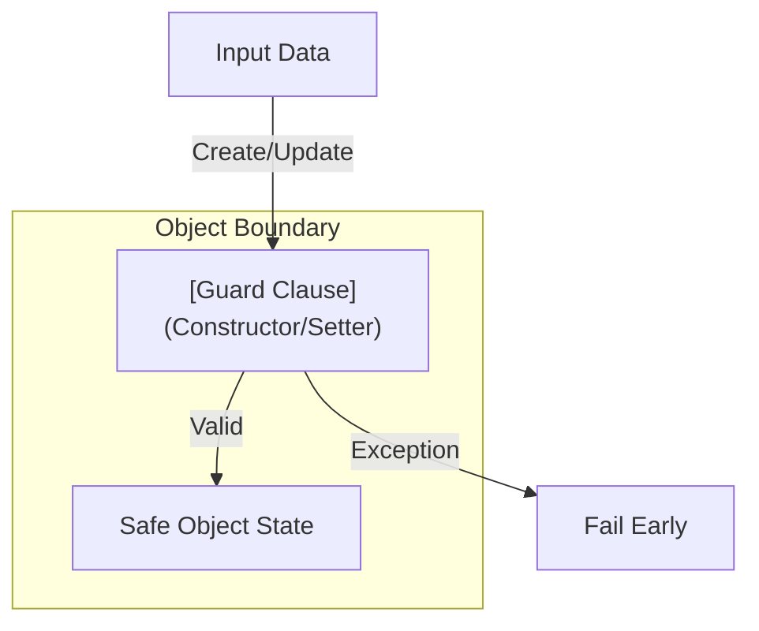

# 第30章：不変条件の入口（無効状態を作らない①）🚧✅

## この章でできるようになること🎯✨

* 「そのクラスが**絶対に守るルール**（＝不変条件）」を言葉にできる📝💎
* コンストラクタ・更新メソッド・プロパティで「**壊れた値を入れない**」入口を作れる🚪🛡️
* 例外の種類を「どれ投げる？」って迷いにくくなる💥🧠
* ガード節を“短く・読みやすく”書ける✂️🌸

---

## 1. 不変条件（Invariant）ってなに？🧩💡


**不変条件**は、「そのオブジェクトが生きてる間ずっと守られててほしいルール」です💎✨
たとえば👇

* 金額は 0円以上💰✅
* 個数は 1以上📦✅
* 名前は空文字じゃない🏷️✅
* 期間は Start ≤ End 📅✅
* 在庫が無いのに “購入済み” にならない🛒🚫

ここで超大事なのは…
**“不変条件が壊れたオブジェクト” がシステム内に入り込むと、後でどこで爆発するか分からない**ってこと💣😱
だから入口で止める！🚪🛑



---

## 2. 入口はどこ？（守る場所ベスト3）🏰✨


不変条件を守る「入口」は基本この3つが強いよ👇

1. **生成時（コンストラクタ / Factory）** 🧱
2. **状態変更のメソッド（Update / ChangeXxx）** 🔁
3. **外から値が入るプロパティ setter** 🧷

そして、入口で使う代表テクが **ガード節（早期チェック）** 🚧✨
「ダメなら即終了」ってやつだね🙂

---

## 3. ガード節は“短く・先頭で・具体的に”🚧🪄

## 3.1 まずは最小形（読みやすさ優先）📘✨

```csharp
public sealed class CartItem
{
    public string ProductCode { get; }
    public int Quantity { get; private set; }

    public CartItem(string productCode, int quantity)
    {
        ArgumentException.ThrowIfNullOrEmpty(productCode, nameof(productCode)); // 空はダメ🛑
        ArgumentOutOfRangeException.ThrowIfNegative(quantity, nameof(quantity)); // マイナスはダメ🛑
        if (quantity == 0) throw new ArgumentOutOfRangeException(nameof(quantity), "Quantity must be >= 1."); // 0もダメ🛑

        ProductCode = productCode;
        Quantity = quantity;
    }

    public void ChangeQuantity(int newQuantity)
    {
        if (newQuantity <= 0)
            throw new ArgumentOutOfRangeException(nameof(newQuantity), "Quantity must be >= 1.");

        Quantity = newQuantity;
    }
}
```

ポイント👇😊

* **チェックは先頭**（下に行くほど安心）🧘‍♀️
* **メッセージは具体的に**（あとで読むのは未来の自分）📝✨
* `nameof(引数名)` を使うと、名前変更しても壊れにくい🏷️💪

`ArgumentException.ThrowIfNullOrEmpty` は「null または空文字」をサクッと弾ける便利ガードだよ✅ ([Microsoft Learn][1])
数値の範囲チェックには `ArgumentOutOfRangeException.ThrowIfNegative` みたいな “ThrowIf～” が使えるよ✅ ([Microsoft Learn][2])

---

## 4. 例外、どれ投げる？（迷子にならないルール）🧭💥


「不正な引数が来た」系は、だいたいこの3兄弟でOK🙂✨

* `ArgumentNullException`：**nullがダメ**なのに来た🫥🛑 ([Microsoft Learn][3])
* `ArgumentException`：**値の形がダメ**（空文字、フォーマット違反など）🧩🛑 ([Microsoft Learn][4])
* `ArgumentOutOfRangeException`：**範囲がダメ**（負数、上限超えなど）📏🛑 ([Microsoft Learn][5])

さらに、.NETの例外運用のベストプラクティスとして「例外は回復できる場所でだけcatchしよう」みたいな基本もあるよ🧯✨ ([Microsoft Learn][6])

---

## 5. “不変条件”と“入力チェック”は同じ？ちょい違う🙂🧠


似てるけど、気持ち違うよ👇

* **入力チェック**：外から来た値が、今の処理で扱える？（API/画面/ファイルなど）📥
* **不変条件**：このオブジェクトは、どんな時でも絶対こうあるべき！💎

つまり、不変条件はもっと「そのクラスの憲法」📜✨
だから、**クラスの中に閉じ込める**のが強い💪🧁

---

## 6. 更新メソッドで“壊れた状態”を作らない🔁🛡️

生成時に守っても、更新で壊れたら意味ないよね😵‍💫
だから、状態変更の入口にもガードを置くよ👇

```csharp
public sealed class BankAccount
{
    public decimal Balance { get; private set; }

    public BankAccount(decimal initialBalance)
    {
        if (initialBalance < 0)
            throw new ArgumentOutOfRangeException(nameof(initialBalance), "Initial balance must be >= 0.");

        Balance = initialBalance;
    }

    public void Deposit(decimal amount)
    {
        if (amount <= 0)
            throw new ArgumentOutOfRangeException(nameof(amount), "Deposit amount must be > 0.");

        Balance += amount;
    }

    public void Withdraw(decimal amount)
    {
        if (amount <= 0)
            throw new ArgumentOutOfRangeException(nameof(amount), "Withdraw amount must be > 0.");

        if (Balance - amount < 0)
            throw new InvalidOperationException("Insufficient funds."); // 状態的に無理💸🛑

        Balance -= amount;
    }
}
```

ここでの小ワザ✨

* **引数が悪い** → `Argument...` 系
* **今の状態だと無理**（残高不足など） → `InvalidOperationException` が自然なことが多いよ🧠 ([Microsoft Learn][7])

---

## 7. async メソッドの入口チェックは “await前” が鉄則⚡🧵


非同期だと例外が「タスクの中」に入っちゃって、発生タイミングがズレることがあるよね💦
だから、**async の本体に入る前（awaitする前）に引数検証を済ませる**のが推奨されてるよ✅ ([Microsoft Learn][8])

```csharp
public async Task<string> DownloadAsync(string url, CancellationToken ct)
{
    ArgumentException.ThrowIfNullOrEmpty(url, nameof(url)); // 先にチェック✅

    // ここから先で await してもOK🙂
    await Task.Delay(10, ct);
    return "ok";
}
```

---

## 8. C# 14 の `field` で「検証付きプロパティ」をスッキリ✨🏷️


「setterで検証したいけど、裏フィールド書くのダルい〜😵」ってなることあるよね。
C# 14 だと `field` キーワードで、**自動生成されるバッキングフィールド**に触れられるよ✨（プロパティの検証が書きやすくなる） ([Microsoft Learn][9])

```csharp
public sealed class UserProfile
{
    public string DisplayName
    {
        get => field;
        set
        {
            ArgumentException.ThrowIfNullOrEmpty(value, nameof(value));
            field = value.Trim();
        }
    } = "Guest"; // 初期値
}
```

注意ポイント⚠️🙂

* setterでトリムや正規化（Normalize）すると、値が統一されて強い✨
* ただし「表示名は空じゃダメ」みたいなルールは、**クラスの中に閉じ込める**のが正解✅

---

## 9. ミニ演習📝💖（手を動かすと一気に身につく！）

## 演習1：コンストラクタで不変条件を守る🚪🛡️

次のルールを満たす `Product` を作ってね👇

* `Code`：null/空はダメ
* `Price`：0以上
* `Stock`：0以上

ヒント：`ThrowIfNullOrEmpty` と `ThrowIfNegative` を使うと短いよ🙂✨ ([Microsoft Learn][1])

---

## 演習2：更新メソッドで壊れないようにする🔁✅

`Stock` を減らす `DecreaseStock(int amount)` を追加してね👇

* `amount` は 1以上
* 減らした結果がマイナスになるなら状態的にNG（例外で止める）🛑

---

## 演習3：エラーメッセージを“読める日本語”にする🧾✨

例外メッセージを、あとから見ても一発で分かるように改善してね🙂
（例：「Price must be >= 0.」みたいに、**条件をそのまま書く**と強い💪）

---

## 10. チェックリスト✅📋（コミット前にこれだけ！）

* [ ] 生成時に不変条件が全部チェックされてる？🧱
* [ ] 更新メソッドでも同じ不変条件が守られてる？🔁
* [ ] 例外の種類が「引数エラー」「状態エラー」で分かれてる？🧭
* [ ] `nameof(...)` を使ってる？🏷️
* [ ] メッセージが「条件そのまま」で具体的？📝
* [ ] async は `await` 前に検証してる？⚡ ([Microsoft Learn][8])

---

## 11. AI活用（Copilot / Chat）🤖✨：安全に“入口”を作るプロンプト集

## 11.1 不変条件の洗い出し（ドメイン理解用）🧠💎

```text
次のC#クラスに対して「不変条件（常に守るべきルール）」候補を10個挙げて。
各ルールは「なぜ必要か」も1行で。
対象クラス：<<ここにクラス貼る>>
また、例外にするべきか（Argument系 / InvalidOperation）も提案して。
```

## 11.2 ガード節の実装案（1コミット分）✂️📌

```text
次のメソッドにガード節を追加して不変条件を守りたい。
差分が小さくなるように、変更は最小にして。
例外の種類とメッセージも提案して。
メソッド：<<ここにメソッド貼る>>
ルール：<<箇条書きで条件>>
```

## 11.3 例外メッセージ改善（読みやすさUP）🧾✨

```text
次の例外メッセージを、あとから読んでも一発で分かるように改善案を5つ出して。
条件が伝わる短い文にして。
現状：<<メッセージ貼る>>
条件：<<守りたい条件>>
```

---

## 12. よくある落とし穴😵‍💫🕳️（ここだけ注意！）

* **チェックが散らばる**：あちこちで同じ検証をして、仕様変更で破綻しがち🌀 → 入口に寄せる🚪✨
* **例外の種類が雑**：全部 `Exception` とか `ArgumentException` で投げると、呼び出し側が困る😢 → 3兄弟を使い分け🧭 ([Microsoft Learn][4])
* **asyncで検証が遅い**：await後に検証して、例外が分かりにくい⚡ → await前にチェック✅ ([Microsoft Learn][8])
* **“とりあえずtry/catch”**：回復できないのにcatchして握りつぶす🚫 → 回復できる場所だけcatch🧯 ([Microsoft Learn][6])

---

[1]: https://learn.microsoft.com/en-us/dotnet/api/system.argumentexception.throwifnullorempty?view=net-10.0&utm_source=chatgpt.com "ArgumentException.ThrowIfNullOrEmpty(String ..."
[2]: https://learn.microsoft.com/en-us/dotnet/api/system.argumentoutofrangeexception.throwifnegative?view=net-10.0&utm_source=chatgpt.com "ArgumentOutOfRangeException.ThrowIfNegative<T>(T, ..."
[3]: https://learn.microsoft.com/en-us/dotnet/api/system.argumentnullexception?view=net-10.0&utm_source=chatgpt.com "ArgumentNullException Class (System)"
[4]: https://learn.microsoft.com/ja-jp/dotnet/api/system.argumentexception?view=net-10.0&utm_source=chatgpt.com "ArgumentException Class (System)"
[5]: https://learn.microsoft.com/en-us/dotnet/api/system.argumentoutofrangeexception?view=net-10.0&utm_source=chatgpt.com "ArgumentOutOfRangeException Class (System)"
[6]: https://learn.microsoft.com/ja-jp/dotnet/standard/exceptions/best-practices-for-exceptions?utm_source=chatgpt.com "例外のベスト プラクティス - .NET"
[7]: https://learn.microsoft.com/ja-jp/dotnet/api/system.argumentexception?view=net-8.0&utm_source=chatgpt.com "ArgumentException クラス (System)"
[8]: https://learn.microsoft.com/ja-jp/dotnet/csharp/fundamentals/exceptions/creating-and-throwing-exceptions?utm_source=chatgpt.com "例外の作成とスロー - C#"
[9]: https://learn.microsoft.com/en-gb/dotnet/csharp/language-reference/proposals/csharp-14.0/field-keyword?utm_source=chatgpt.com "The `field` contextual keyword - C# feature specifications"
