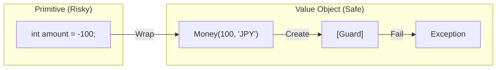

# 第31章：Value Object 入門（無効状態を作らない②）💎📏

## この章でできるようになること🎯✨

* 「金額💰」「期間📅」「メール📧」みたいな **意味のある値** を “ただの `string` / `int`” で扱わず、**専用の型**にできるようになる🙌
* **無効状態（壊れた値）を作らない** ための置き場所を、コードの中にちゃんと作れるようになる🛡️
* C# の `record` / `record struct` を使って、**等価性（同じかどうか）** と **不変（変わらない）** をラクに実装できるようになる💎✨ ([Microsoft Learn][1])



---

## Value Objectってなに？🤔💡


Value Object（値オブジェクト）は、ざっくり言うと👇

* **ID（個体識別）がない**（= 「山田さん」という“人”じゃなくて「金額」「住所」みたいな“値”）
* **値が同じなら同じもの**（等価性は“中身”で決まる）
* **基本は不変（immutable）**（作ったら勝手に変形しない）

C# で言うと、`record` / `record struct` は **値ベースの等価性を標準でサポート**してくれるから、Value Objectと相性がいいよ💎 ([Microsoft Learn][1])

---

## 「ただのプリミティブ地獄」あるある😇💦


たとえば、こんなメソッド👇

* `decimal amount, string currency`
* `DateTime start, DateTime end`
* `string email`

…ぜんぶ「ただの値」だから、**事故が起きやすい**😵‍💫

### 事故例💥

* `amount = -100`（マイナス金額が混入）
* `currency = "yen"`（大小文字やフォーマットがバラバラ）
* `start > end`（期間が逆転）
* `email = "aaa"`（メールじゃない）

✅ こういう「ルール」を **毎回 if で書く** と、どこかで漏れる。
✅ だから「ルールを型の中に閉じ込める」＝Value Object！🏠🔒

---

## Value Objectの“3点セット”🎁✨


Value Objectを作る時は、この3つを意識すると超強い💪

1. **検証（validation）を型の中に置く**🧪
2. **不変（immutable）にする**🧊
3. **等価性（equality）を“値”で定義する**⚖️

`record` 系は 2 と 3 をやりやすくしてくれるよ🧡 ([Microsoft Learn][1])

---

## `record class` と `readonly record struct` どっち？🤔🧭


### まず知っておきたい事実📌

* `record` は **値ベース等価性** が標準で入る💎 ([Microsoft Learn][1])
* `record struct` は **パラメータなしコンストラクタ（= default）を持つ**（全部デフォルト値になる）😇
  → つまり、**無効状態が “勝手に作れてしまう” 可能性**がある ⚠️ ([Microsoft Learn][1])
* EF Core の “エンティティ” は **参照等価性が必要**なので、**records はエンティティ型に向かない**（※Value Object用途はOK）📦 ([Microsoft Learn][1])

### 使い分けの目安🍀

* **迷ったら `record class`**（default無効問題が少ない・扱いやすい）🙂
* **軽量で小さい値**（Money、Email、郵便番号など）で、コピー負担も小さいなら **`readonly record struct`** もアリ✨
  ただし **default対策**は必須だよ⚠️

---

## 実装例①：Money（“金額”を型で守る）💰💎


### ゴール🎯

* マイナス禁止
* 通貨コードは “3文字・大文字” に統一
* 加算は「同じ通貨」だけOK

### 実装（`record class`版：初心者におすすめ）🧡

```csharp
using System;

public sealed record Money
{
    public decimal Amount { get; }
    public string Currency { get; }

    public Money(decimal amount, string currency)
    {
        if (amount < 0)
            throw new ArgumentOutOfRangeException(nameof(amount), "金額は0以上だよ💰");

        if (string.IsNullOrWhiteSpace(currency))
            throw new ArgumentException("通貨コードが空だよ🥲", nameof(currency));

        currency = currency.Trim().ToUpperInvariant();
        if (currency.Length != 3)
            throw new ArgumentException("通貨コードは3文字（例: JPY, USD）だよ🌍", nameof(currency));

        Amount = amount;
        Currency = currency;
    }

    public static Money operator +(Money a, Money b)
    {
        if (a.Currency != b.Currency)
            throw new InvalidOperationException($"通貨が違うよ！ {a.Currency} と {b.Currency} は足せないよ😵");

        return new Money(a.Amount + b.Amount, a.Currency);
    }

    public override string ToString() => $"{Amount:0.##} {Currency}";
}
```

`record` は値ベース等価性を持つので、`Money(100,"JPY")` と `Money(100,"JPY")` は **“同じ値”として等しい** 判定になりやすいよ💎 ([Microsoft Learn][1])

---

## 実装例②：DateRange（“期間”を型で守る）📅🧷


### ゴール🎯

* `Start <= End` を絶対に守る
* 「含む？」をメソッドにする（使う側がラクになる✨）

```csharp
using System;

public sealed record DateRange
{
    public DateOnly Start { get; }
    public DateOnly End { get; }

    public DateRange(DateOnly start, DateOnly end)
    {
        if (end < start)
            throw new ArgumentException("期間が逆だよ🥲 Start <= End にしてね📅");

        Start = start;
        End = end;
    }

    public bool Contains(DateOnly day) => Start <= day && day <= End;

    public int LengthDaysInclusive() => End.DayNumber - Start.DayNumber + 1;
}
```

`DateOnly` を使うと「日付だけ」を表現できて、時間のズレ事故が減るよ📅✨（“日付だけ”の概念が必要なときに便利）

---

## テストで“型の約束”を固定しよう✅🧪

Value Objectは **仕様そのもの** なので、テストが超相性いい💖

```csharp
using System;
using Xunit;

public class MoneyTests
{
    [Fact]
    public void Same_value_should_be_equal()
    {
        var a = new Money(100, "jpy");
        var b = new Money(100, "JPY");

        Assert.Equal(a, b); // 値が同じなら同じ💎
    }

    [Fact]
    public void Negative_amount_should_throw()
    {
        Assert.Throws<ArgumentOutOfRangeException>(() => new Money(-1, "JPY"));
    }

    [Fact]
    public void Different_currency_add_should_throw()
    {
        var jpy = new Money(100, "JPY");
        var usd = new Money(1, "USD");

        Assert.Throws<InvalidOperationException>(() => _ = jpy + usd);
    }
}
```

こういうテストがあると、将来リファクタしても **“約束を破った瞬間に落ちる”** から安全〜🛡️✨

---

## `record struct` を使うときの超重要注意⚠️😇

`record struct` は **default（全部0/null）** が作れちゃう！
つまり `default(Money)` みたいな **“検証を通ってない値”** が存在しうるんだよね…😇 ([Microsoft Learn][1])

### 対策案（おすすめ順）🧯

1. **初心者は `record class` に寄せる**🙂
2. `record struct` を使うなら、**default を弾く仕組み**を作る（例：`IsValid` / `TryCreate` / `Result`）
3. 「defaultは未設定」を許す設計なら、**Nullable（`Money?`）で表す**🧷

---

## シリアライズ（JSON）との付き合い方📦🧾

Value ObjectをAPIで受け渡しするとき、JSON変換が出てくるよね🙂

* `System.Text.Json` は基本は **パラメータなしコンストラクタ**を使うことが多い
* でも **パラメータありコンストラクタを使わせたい**場合は `[JsonConstructor]` が使える
* そして **records はデシリアライズ対象としてサポートされている** 📦✨ ([Microsoft Learn][2])

---

## DB（EF Core）での扱い：Value Objectは「Complex Types」が相性◎🏗️✨


EF Core 10 では、Value Object的なものを **Complex Types（複合型）**として扱えるよ✨
Complex Types は **値セマンティクス**（= 中身で扱う）なので、Value Objectと相性よし💎 ([Microsoft Learn][3])

### ざっくりイメージ🍀

* **エンティティ**：IDで追跡（参照等価性が重要）
* **Value Object**：中身で同一性（Complex Typesがぴったり）

EF Core 10 は .NET 10 のLTSとしてリリースされてるよ📌 ([Microsoft Learn][3])

---

## よくある落とし穴集🕳️💦（先に踏まない！）

### 1) Value Objectが “ただの入れ物” で終わる😪

✅ `Contains()` とか `+` とか、**概念に合うふるまい**も入れてOK！
（「ルールの置き場所」がValue Objectの価値💎）

### 2) `string[]` みたいなコレクションを持って等価性がズレる😵

`record` の等価性は「プロパティの等価性」に依存するから、配列みたいに参照で比べる型だと期待とズレることがあるよ⚠️（必要なら等価性を自前で定義する） ([GitHub][4])

### 3) 例外メッセージが雑でデバッグが地獄👻

✅ 例外は「入力名」と「期待値」を入れると未来の自分が助かる🛟✨

---

## ミニ演習📝🎀（手を動かすと定着する！）

### 演習A：EmailAddress を作ろう📧✨

**仕様**

* `@` を含む
* 前後空白はトリム
* 小文字に統一（運用ルールとして）

**やること**

1. `EmailAddress` を `record class` で作る
2. `ToString()` を戻す
3. `Equals` が “値” で成り立つことをテストで確認✅

---

### 演習B：既存コードを “型でリファクタ” しよう🔧💎

次のメソッドを👇

* Before：`Pay(decimal amount, string currency)`
* After：`Pay(Money money)`

に変えて、呼び出し側のコードもスッキリさせよう✨
（「引数の意味」が消えないのが最高ポイント！🏷️）

---

## AI活用🤖✨（Copilot / Codex系）

### おすすめの聞き方（そのままコピペOK）🪄

* 「この `Money` を Value Object として自然にしたい。無効状態が入らない設計にして、テストも3本作って」
* 「`Pay(decimal amount, string currency)` を `Pay(Money money)` に置き換えるリファクタ手順を、コミット分割も含めて提案して」
* 「この Value Object の例外メッセージを、デバッグしやすい文に改善して」

✅ ポイント：**提案は“差分”で見て、テストが通ったら採用**ね🧪✅

---

## 章末チェックリスト✅🌸

* [ ] 「意味のある値」を `string/int` のまま放置せず、型にできた💎
* [ ] 検証が “呼び出し側” に散らばってない（型の中にある）🔒
* [ ] 不変になってる（勝手に書き換わらない）🧊
* [ ] 等価性が “中身” で決まる（テストで確認した）⚖️✅
* [ ] `record struct` の default 問題を理解した😇⚠️ ([Microsoft Learn][1])

[1]: https://learn.microsoft.com/en-us/dotnet/csharp/language-reference/builtin-types/record?utm_source=chatgpt.com "Records - C# reference"
[2]: https://learn.microsoft.com/en-us/dotnet/standard/serialization/system-text-json/migrate-from-newtonsoft?utm_source=chatgpt.com "Migrate from Newtonsoft.Json to System.Text.Json - .NET"
[3]: https://learn.microsoft.com/en-us/ef/core/what-is-new/ef-core-10.0/whatsnew?utm_source=chatgpt.com "What's New in EF Core 10"
[4]: https://github.com/dotnet/csharplang/discussions/5777?utm_source=chatgpt.com "Equality of nested readonly record structs? #5777"
