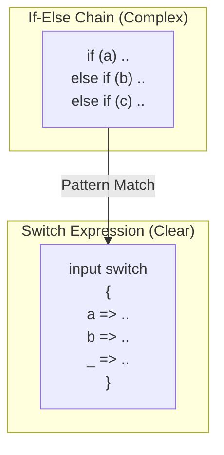

# 第32章：switch とパターンマッチで分岐を整理（読みやすさ）🎛️✨

## この章でできるようになること🎯💖

* if/else の長い連鎖を **switch** にまとめて、見通しを良くする👀✨
* **switch式**（値を返すswitch）で「分岐＝値の決定」をスッキリ書ける🧠📦
* **パターンマッチ**（型・値・条件・形）で「読みやすい条件分岐」が作れる🧩🌈 ([Microsoft Learn][1])
* Visual Studio の **Quick Actions（Ctrl+.）** で if→switch 変換を一瞬でやる💨🪄 ([Microsoft Learn][2])

---

## まず結論：if連鎖がツラい理由😵‍💫💦


if/else が増えると…

* 条件が上から下まで長くて **目が迷子**👀🌀
* 似た条件が混ざって **重複＆バグの温床**🧨
* 「どの条件が先に当たる？」が分かりづらい（順番に依存しがち）📌

そこで **switch + パターンマッチ** の出番！🎉
「この入力はどの“形（パターン）”？」って考え方で、分岐が読みやすくなります🧁✨ ([Microsoft Learn][1])



---

## switch は2種類あるよ🧁🎀


### 1) switchステートメント（昔ながら）🧱

* `case:` の中に処理を書ける（複数行の処理向き）🛠️
* `break;` が必要（忘れると危ない時代は終わったけど、今も基本は必要）⚠️

### 2) switch式（値を返すswitch）🍬✨

* 「分岐して **値を返す**」のが得意
* 各分岐は `=>` で1つの式（短くて気持ちいい）💖
* だいたい最後に `_ => ...`（その他）を置くのが定番👑

switch式は「条件分岐で値を決める」場面で超つよいです💪✨ ([Microsoft Learn][3])

---

## Visual Studio の時短ワザ⚡：if→switch 変換（Ctrl+.）⌨️✨


if の `if` キーワードにカーソルを置いて **Ctrl+.** を押すと、

* **switchステートメントに変換**
* **switch式に変換**

が選べます🎉（めっちゃ便利） ([Microsoft Learn][2])

> 変換したあとに「パターン」「when」「or/and」などを足して、読みやすさを仕上げるのがコツだよ🪄✨

---

## パターンマッチの“語彙”を増やそう📚✨


C# のパターンには、ざっくりこういう種類があります👇
（全部いっぺんに覚えなくてOK！よく使うのからで大丈夫😊）

* **定数パターン**：`0` / `"A"` / `true` みたいな値
* **型パターン**：`int` / `string` みたいな型
* **宣言パターン**：`int x` みたいに受け取って変数にする
* **関係（relational）**：`>= 10` とか
* **論理（and/or/not）**：`and` / `or` / `not`
* **プロパティパターン**：`{ Status: "Paid" }` みたいに中身を見る
* **タプル/位置パターン**：`(a, b)` や record の形
* **リストパターン**：`[1, 2, ..]` みたいに配列・リストの形を見る
* **var / discard**：`var x` と `_`（捨てる） ([Microsoft Learn][1])

---

## 実例①：if連鎖 → switch式（基本）🐣✨

### Before（if連鎖）😵‍💫

```csharp
static string GetRankMessage(int score)
{
    if (score >= 90) return "S";
    else if (score >= 80) return "A";
    else if (score >= 70) return "B";
    else if (score >= 60) return "C";
    else return "D";
}
```

### After（switch式 + relational patterns）🎀✨

```csharp
static string GetRankMessage(int score) =>
    score switch
    {
        >= 90 => "S",
        >= 80 => "A",
        >= 70 => "B",
        >= 60 => "C",
        _ => "D",
    };
```

**ポイント💡**

* 上から順にマッチするよ（最初に当たったやつが勝ち）👑
* `>= 80` は「80以上」だけど、`>= 90` が先にあるからOK👌
* `_` は「それ以外」って意味（だいたい最後）🧹 ([Microsoft Learn][1])

---

## 実例②：when（ガード）で“追加条件”をきれいに書く🌿✨


「特定の形に当てはまるけど、さらに条件がある」ってときは `when` が便利🪄

例：割引率を決める（会員なら追加で条件）💳✨

```csharp
static decimal GetDiscountRate(bool isMember, int totalPrice) =>
    (isMember, totalPrice) switch
    {
        (true, >= 10000) => 0.10m,
        (true, _) when totalPrice >= 5000 => 0.05m,
        (false, >= 20000) => 0.03m,
        _ => 0.00m
    };
```

**ポイント💡**

* `(isMember, totalPrice)` みたいに **タプル**にして分岐すると読みやすい✨
* `when` は「追加のフィルター」みたいな感覚🌿
* `_` は「なんでもいい」って意味（ワイルドカード）🃏 ([Microsoft Learn][1])

---

## 実例③：型で分岐（type pattern）🧠🎭

「object として受け取るけど、中身によって処理が違う」みたいな場面で強い💪

```csharp
static string Describe(object? value) =>
    value switch
    {
        null => "nullです",
        int i => $"intです: {i}",
        string s => $"stringです: \"{s}\"",
        DateTime dt => $"日付です: {dt:yyyy-MM-dd}",
        _ => $"知らない型です: {value.GetType().Name}",
    };
```

**ポイント💡**

* `int i` みたいに書くと、その型のときだけ `i` が使えるよ🎀
* `null` もパターンで書ける（先に書くと安全）🧷 ([Microsoft Learn][1])

---

## 実例④：プロパティパターン（中身のプロパティで分岐）🏠✨

例：注文の状態に応じて表示メッセージを変える📦💬

```csharp
public sealed record Order(string Status, int TotalPrice, bool IsExpress);

static string GetOrderMessage(Order order) =>
    order switch
    {
        { Status: "Canceled" } => "キャンセルされました😢",
        { Status: "Paid", IsExpress: true } => "お急ぎ便で発送します🚀",
        { Status: "Paid", TotalPrice: >= 10000 } => "高額注文ありがとうございます💖",
        { Status: "Paid" } => "お支払い完了です✅",
        _ => "処理中です⌛",
    };
```

**ポイント💡**

* `{ Status: "Paid" }` みたいに **オブジェクトの形**で分岐できるよ🧩
* 条件が増えても「何を見てるか」が読めていい感じ👀✨ ([Microsoft Learn][1])

---

## 実例⑤：and / or / not（条件を“文章っぽく”つなぐ）🪄📖

HTTPステータスみたいに「範囲」で分けたいときに便利💡

```csharp
static string ClassifyStatus(int statusCode) =>
    statusCode switch
    {
        >= 200 and < 300 => "Success ✅",
        >= 400 and < 500 => "Client Error 🧍‍♀️💦",
        >= 500 and < 600 => "Server Error 🖥️🔥",
        _ => "Other 🤷‍♀️"
    };
```

**ポイント💡**

* `and` / `or` / `not` で条件を合成できるよ✨ ([Microsoft Learn][1])

---

## 実例⑥：リストパターン（配列・リストの“形”で分岐）📚🍡


「要素の並び」で分けたいときに使えるよ🧁
（配列なら特に相性◎）

```csharp
static string Analyze(int[] numbers) =>
    numbers switch
    {
        [] => "空っぽだよ🫙",
        [0] => "0だけだよ0️⃣",
        [1, 2, ..] => "1,2で始まってるよ✨",
        [var first, .. var rest] => $"先頭は {first}、残りは {rest.Length} 個だよ📦",
    };
```

**ポイント💡**

* `[]` は空配列
* `..` は「残り全部」って感じ（スプレッドっぽい）✨
* リストパターンは「並びを見て分ける」時にめっちゃ読みやすいよ🍡 ([Microsoft Learn][1])

---

## “読みやすいswitch”のコツ集🧠✨（超だいじ）

### ✅ 1) 上から順に評価される（最初に当たったら終了）👑

* 「広い条件（`>= 0`）」を先に書くと、後ろが死ぬ💀
* **狭い条件→広い条件** の順が基本🎀

### ✅ 2) `_ =>`（それ以外）は最後に置く🧹

* switch式なら特に「最後に `_`」が安心🛡️

### ✅ 3) 1ケースは短く（長い処理は別メソッドへ）✂️

* switchの中でゴチャゴチャすると、逆に読みにくい😵‍💫
* 目安：**case 1つ＝数行以内**✨

### ✅ 4) switch式は「値を返す」に寄せる🍬

* 副作用（ログ出す・DB書く）だらけにしない方がキレイ💖
* 「決める」と「やる」は分けると超読みやすい🧁

---

## AI拡張の使い方（安全運転）🤖🛡️✨

### 使えるお願いテンプレ📝💡

* 「この if/else を switch式に変換して。**動作は変えない**で、`_ =>` を入れて」
* 「この分岐、**property pattern** で読みやすくして。条件の順番も注意して」
* 「変換後に **同じ入力で同じ出力** になる確認コード（テスト/簡易チェック）も付けて」

### 採用ルール✅

* 変換したら **差分レビュー**（意図と一致してる？）👀📌
* **テスト実行** or 最低でも代表ケースを手で確認✅
* 1回の変更は小さく（1コミット分）🌿

---

## ミニ演習（手を動かそう🖐️✨）

### 演習1🐣：点数→評価（switch式）

次の if を switch式にしてね🎀

```csharp
static string Grade(int score)
{
    if (score >= 80) return "Good";
    else if (score >= 60) return "OK";
    else return "NG";
}
```

**例（答えの一つ）✨**

```csharp
static string Grade(int score) =>
    score switch
    {
        >= 80 => "Good",
        >= 60 => "OK",
        _ => "NG"
    };
```

---

### 演習2🐤：タプル + when（ちょい難）🌿

「会員」「金額」で送料を決めてね🚚✨

ルール：

* 会員で 5000以上 → 送料0
* 会員で 5000未満 → 送料300
* 非会員で 10000以上 → 送料200
* それ以外 → 送料500

**ヒント**：`(isMember, total)` を switch すると読みやすいよ🎀

**例（答えの一つ）✨**

```csharp
static int ShippingFee(bool isMember, int total) =>
    (isMember, total) switch
    {
        (true, >= 5000) => 0,
        (true, _) => 300,
        (false, >= 10000) => 200,
        _ => 500
    };
```

---

### 演習3🦄：リストパターン（配列の形）🍡

`int[] numbers` について…

* 空なら `"Empty"`
* 先頭が 0 なら `"StartsWithZero"`
* 先頭が 1,2 なら `"StartsWith1And2"`
* それ以外は `"Other"`

で返す関数を書いてみてね✨

**例（答えの一つ）✨**

```csharp
static string Detect(int[] numbers) =>
    numbers switch
    {
        [] => "Empty",
        [0, ..] => "StartsWithZero",
        [1, 2, ..] => "StartsWith1And2",
        _ => "Other"
    };
```

---

## まとめ🌈✨

* if連鎖は増えるほど読みにくくなるけど、**switch + パターン**でスッキリできるよ🎛️✨
* **switch式**は「分岐して値を返す」場面で特に強い🍬
* パターンは「形で分ける」発想：型・値・範囲・プロパティ・配列の並びまで扱える🧩💖 ([Microsoft Learn][1])
* VS の **Ctrl+.** 変換で速攻スタートして、最後に読みやすさを整えるのが勝ち🏆✨ ([Microsoft Learn][2])

[1]: https://learn.microsoft.com/en-us/dotnet/csharp/language-reference/operators/patterns?utm_source=chatgpt.com "Pattern matching using the is and switch expressions. - C# ..."
[2]: https://learn.microsoft.com/en-us/visualstudio/ide/reference/convert-if-statement-to-switch-statement-or-switch-expression?view=visualstudio&utm_source=chatgpt.com "Convert if statement to switch statement or expression"
[3]: https://learn.microsoft.com/en-us/dotnet/csharp/fundamentals/functional/pattern-matching?utm_source=chatgpt.com "Pattern matching overview - C#"
