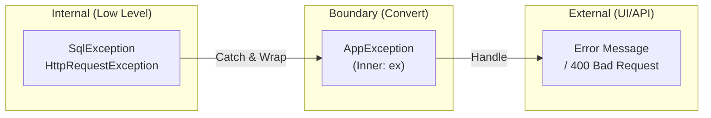

# 第34章：例外の境界（投げる・変換する場所を決める）🚧💥

## 0. この章で身につけること🎯✨

* 「どこで例外を投げる？」「どこでcatchする？」を**迷わず決められる**ようになる🙆‍♀️✨
* 例外が散らばってカオスになるのを防いで、**利用側（UI/呼び出し側）をラクにする**🧹🌈
* 「スタックトレースが消えた😭」を防いで、**デバッグしやすい例外**にする🔍🧠 ([Microsoft Learn][1])

---

## 1. そもそも「例外の境界」って何？🧱🚪


例外って、放っておくとこんな風に散らかりがち👇💦

* どのメソッドにも try/catch がある🕸️
* catch してログだけ出して、**何事もなかったように進む**（最悪😱）
* 画面に出すメッセージが低レイヤのエラー文そのまま（ユーザー困る😵‍💫）

そこで登場するのが **例外の境界** 🚪✨
「ここから外へ出すときは、例外を**整形**して渡そうね」っていう**境目のルール**だよ💡



---

* 内側：実装の都合が強い（DB/HTTP/ファイル/ライブラリ例外など）🔧
* 外側：利用者が理解できる形（画面メッセージ、HTTPレスポンス、エラーコードなど）📣

---

## 2. 例外を“3種類”に分けて考える🧠📦

分類すると、境界を決めるのが一気にラクになるよ😊✨

### A) バグ or 前提違反（＝直すべき）🪲🚨

* `null` 前提なのに `null` が来た
* 配列の範囲外
* 本来ありえない状態（不変条件が壊れた）

👉 基本：**直す対象**。変に握りつぶさない🙅‍♀️
（境界でまとめて捕まえてログ＋安全に終了、が多い）

### B) 入力不正（ユーザーや外部からの不正データ）📝⚠️

* 住所が空
* 金額がマイナス
* 必須項目が未入力

👉 これは **境界（UI/API）で検証して、分かる形で返す**のが基本✨
「深い所で突然例外」は利用側が困るよね😵‍💫

### C) 外部都合の失敗（ネットワーク/DB/他サービス）🌐⛈️

* 通信失敗
* タイムアウト
* 一時的にDBが落ちてる

👉 内側の例外をそのまま漏らすと、利用側が**実装依存**になっちゃう💦
だから境界で「このアプリ的には何が起きた？」に**変換**するのが強い✨ ([Microsoft Learn][1])

---

## 3. 例外の境界ルール（これだけ覚えればOK）✅💖

### ルール1：回復できないなら、そこでcatchしない🙅‍♀️

「その場で直せない・回復できない」なら、catchせず上に投げた方が安全👍
例外は「回復できる場所で扱う」のが基本だよ✨ ([Microsoft Learn][1])

### ルール2：catchしたら、**握りつぶさない**😱🧨

* ログだけ書いて終わり
* `return;` して何も起きてないフリ

これはデバッグ地獄の入口🥶
「失敗したなら失敗した」を伝える設計にするのが大事💡 ([Microsoft Learn][1])

### ルール3：`throw ex;` は基本NG、`throw;` を使う🧯✨

同じ例外を上に投げ直すなら、こう👇

* ✅ `throw;` → **元のスタックトレース保持**
* ❌ `throw ex;` → スタックトレースがリセットされて原因追跡が難しくなる

これは公式の解析ルールでも注意されてるよ🧠🔍 ([Microsoft Learn][2])

### ルール4：変換するなら「wrap（包む）」🎁🧩

低レイヤ例外を、アプリ側の意味に変換するなら👇

* 新しい例外を作って
* `innerException` に元の例外を入れる

こうすると「何が起きたか」と「根っこ」の両方が残るよ✨ ([Microsoft Learn][1])

### ルール5：境界では「利用側が欲しい情報」に揃える📣✨

* UI：ユーザーに見せる文章（短く、次の行動が分かる）🙂
* API：HTTPステータスやエラーコード（機械が扱える）🤖
* バッチ：終了コード、リトライ判定材料🧾

### ルール6：「よくある条件」を例外で処理しない⚖️

例外は“例外的”なときに使うのが基本だよ🫶
普通に起きる分岐は if などで扱う方が読みやすい✨ ([Microsoft Learn][1])

---

## 4. 「どこが境界？」よくある3レイヤで決める🗺️✨

### (1) 外側の境界：UI / API / バッチの入口🚪🖥️

ここは **“最後に全部まとめる場所”** になりやすいよ💡

* 予期しない例外をキャッチして安全に終了
* ログを残す
* 利用者向けの形にする（メッセージ/ステータス）

### (2) 真ん中：アプリケーション層（ユースケース）🎮📦

* 「入力不正」「外部失敗」など**意味のある失敗**にまとめる
* UIに近い表現に寄せすぎない（UIが複数あると破綻しやすい）💦

### (3) 内側：インフラ（DB/HTTP/ファイル）🔌🧤

ここは **“他人の例外を自分の言葉に変換する場所”** になりやすい✨

* `HttpRequestException` や `SqlException` などを
* アプリ独自の例外へ変換して上に渡す🎁

---

## 5. 実践①：外部APIの例外を「アプリ用の例外」に変換する🌐➡️📦

### 例：支払いAPIがタイムアウトしたら…⏳💳

* 低レイヤ：`HttpRequestException` / `TaskCanceledException`
* アプリ的には：`PaymentServiceUnavailableException`（支払いサービスが使えない）

```csharp
public sealed class PaymentServiceUnavailableException : Exception
{
    public PaymentServiceUnavailableException(string message, Exception innerException)
        : base(message, innerException) { }
}

public sealed class PaymentGatewayClient
{
    private readonly HttpClient _http;

    public PaymentGatewayClient(HttpClient http) => _http = http;

    public async Task ChargeAsync(string orderId, decimal amount, CancellationToken ct)
    {
        try
        {
            // 例：外部API呼び出し
            using var response = await _http.PostAsync(
                $"https://example-payments/charge?orderId={orderId}&amount={amount}",
                content: null,
                cancellationToken: ct);

            response.EnsureSuccessStatusCode();
        }
        catch (HttpRequestException ex)
        {
            // 低レイヤ例外 → アプリ例外へ変換（元はinnerに残す）
            throw new PaymentServiceUnavailableException(
                "支払いサービスに接続できませんでした。時間をおいて再試行してください。",
                ex);
        }
        catch (TaskCanceledException ex) when (!ct.IsCancellationRequested)
        {
            // ユーザーキャンセルではなくタイムアウト系、みたいな判定もできる👍
            throw new PaymentServiceUnavailableException(
                "支払いサービスがタイムアウトしました。時間をおいて再試行してください。",
                ex);
        }
    }
}
```

ポイント💡✨

* 「外部の例外型」を上に漏らさない（利用側が `HttpRequestException` を知る必要がなくなる）🧠
* inner に元例外を残す（原因追跡できる）🔍 ([Microsoft Learn][1])

---

## 6. 実践②：境界でcatchして“利用側”を簡単にする🧹🙂

### コンソール/デスクトップ系のイメージ：最上位でまとめる🧯🖥️

```csharp
try
{
    await app.RunAsync();
}
catch (PaymentServiceUnavailableException ex)
{
    // ユーザー向け表示（短く・次の行動が分かる）
    Console.WriteLine(ex.Message);

    // ログは詳細（ex自体も渡す）
    logger.LogWarning(ex, "Payment failed");
}
catch (Exception ex)
{
    // 予期しない例外
    logger.LogError(ex, "Unhandled exception");
    Console.WriteLine("予期しないエラーが発生しました。再起動しても直らない場合は連絡してください。");
}
```

ここでのコツ💖

* 利用側（UI）は「例外の種類」が少ないほどラク🙂
* 深い層は「原因を作らない」「作ったら意味のある例外にして上へ」✨

---

## 7. 実践③：Webなら“グローバル例外ハンドリング”が境界の主役🌍🛡️

ASP.NET Core では、例外をアプリ全体で扱う仕組みが用意されてるよ🧰✨
たとえば例外処理ミドルウェア＋ハンドラーで、例外をHTTPレスポンスに整形できる📮

さらに最新の .NET 10 では、例外ハンドラーが「処理済み」とした例外について、診断出力（ログ/メトリクス等）を抑制する挙動がデフォルトになっていて、必要ならオプションで制御できるよ🧠✨ ([Microsoft Learn][3])

---

## 8. 「スタックトレース消えた😭」を防ぐ最重要ポイント🔍🧠

### ✅ rethrow は `throw;`

```csharp
try
{
    DoWork();
}
catch (Exception ex)
{
    logger.LogError(ex, "failed");
    throw; // 元のスタックトレースを保つ
}
```

### ✅ 例外を“意味づけ”して投げるなら wrap（innerを残す）

```csharp
catch (SqlException ex)
{
    throw new DataAccessException("DBアクセスに失敗しました。", ex);
}
```

このへんは公式でも「正しく再スローしてスタックトレースを保つ」って強く書かれてるよ📚✨ ([Microsoft Learn][1])

---

## 9. リファクタの観点：try/catch が散ってたら、こう直す🧹🧩

### 症状👃💦

* あちこちに `try/catch (Exception)`
* どこで何をしてるか分からない
* エラー表示の責務が下の層に混ざる

### 改善の順番（安全にいくよ）✅🌿

1. **境界を1つ決める**（UI/APIの入口など）🚪
2. 内側の catch は「回復できる場合だけ」に減らす🙆‍♀️
3. 外部依存の例外は、インフラ境界でアプリ例外に変換🎁
4. 最後に境界でまとめて catch → 表示/レスポンス整形📣

---

## 10. ミニ演習📝✨（手を動かすと一気に定着するよ！）

### 演習1：try/catch の“散らばり”を回収しよう🧲🧹

1. サンプルコードで `try/catch` を検索🔎
2. 「回復してる？」をチェック（してないなら削除候補）👀
3. “境界の1か所” に例外処理を集める🚪✨
4. 動作確認（テスト or 実行）✅

合格ライン🎉

* `catch (Exception)` が深い層から消えて、境界に寄った✨

### 演習2：外部依存を“アプリ例外”に変換しよう🎁🌐

1. HTTP/DB/ファイルの呼び出し箇所を1つ選ぶ
2. そこで起きうる例外を2〜3個ピックアップ
3. アプリ側の例外型を1つ作る（例：`ExternalServiceException`）
4. inner を入れて throw new で変換

合格ライン🎉

* 上の層が `HttpRequestException` を知らなくてよくなった✨

### 演習3：`throw ex;` を撲滅しよう🧯🔥

1. `throw ex` を検索🔎
2. rethrow は `throw;` に変更
3. “付加情報を足したい”場合は wrap に変更
4. 例外が起きたときに、スタックトレースが分かりやすいか確認🔍

---

## 11. AI活用コーナー🤖✨（安全に使うコツつき）

### 使いどころ①：境界候補を洗い出す🗺️

AIにこう聞くと便利だよ👇

* 「このコードの境界（UI/API/インフラ）っぽい場所を列挙して」
* 「例外を catch すべき場所と理由を3つ出して」

👉 返ってきた案は、**“回復できるか？”**で最終判断しよう🙆‍♀️

### 使いどころ②：例外の変換設計（wrapの型名案）🏷️

* 「この `HttpRequestException` をアプリ側の例外に変換したい。例外名候補を5つ」
* 「利用側に見せるメッセージ案を3つ（短く、次の行動が分かるように）」

### 使いどころ③：ログに残す情報のチェック📋🧠

* 「この例外をログに出すなら、何の情報が必要？」
  （例：注文ID、ユーザーID、リクエストID…など）

---

## 12. まとめ🌈✨

* 例外の境界は「内側の都合」を「外側が扱える形」に整える“関所”🚪✨
* 回復できない場所で無理にcatchしない🙅‍♀️（必要なら上へ） ([Microsoft Learn][1])
* rethrow は `throw;`、変換は wrap（innerに元例外）🧠🔍 ([Microsoft Learn][1])
* Webならグローバル例外処理が特に強い武器🛡️（最新の .NET 10 では診断出力の扱いも制御ポイントあり） ([Microsoft Learn][3])

次章は、この境界設計をさらに進めて「例外 vs Result」を整理していくよ🚦📦

[1]: https://learn.microsoft.com/en-us/dotnet/standard/exceptions/best-practices-for-exceptions?utm_source=chatgpt.com "Best practices for exceptions - .NET"
[2]: https://learn.microsoft.com/en-us/dotnet/fundamentals/code-analysis/quality-rules/ca2200?utm_source=chatgpt.com "CA2200: Rethrow to preserve stack details (code analysis)"
[3]: https://learn.microsoft.com/en-us/aspnet/core/fundamentals/error-handling?view=aspnetcore-10.0&utm_source=chatgpt.com "Handle errors in ASP.NET Core"
