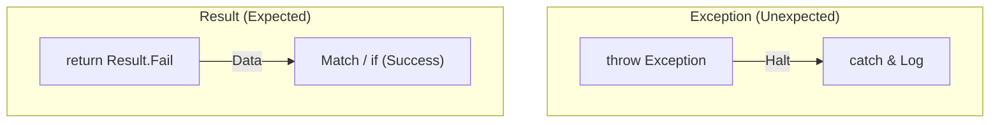

# 第35章：エラーモデリング入門（例外 vs Result）🚦📦

## この章のゴール🎯✨

この章が終わると、こんなことができるようになります👇💡

* 「この失敗は**例外**？それとも**Result**？」を迷わず選べる🧭
* 失敗を「仕様」として扱い、呼び出し側のコードを読みやすくできる📚✨
* テストしやすいエラー設計（＝テスタブル）に近づける🧪🌸

---

## 1. そもそも「エラー」って2種類あるよね？🧠🧩


まず大事なのは、失敗を “気分” で扱わないこと😇
エラーには大きく2種類あります👇

## A) 仕様として起こりうる失敗（想定内）🙂📌

例：

* 入力が不正（メールが空、数値が範囲外）✍️❌
* ドメインルール違反（残高不足、在庫なし）💰🚫
* 外部サービスが落ちてる（ネットワーク、タイムアウト）🌐⏳

👉 **こういうのは Result が向きやすい**（呼び出し側が分岐しやすい）

## B) 想定外の失敗（バグ・壊れた状態）😱💥

例：

* null のつもりじゃないのに null が来た
* 絶対起きない前提が壊れてる（不変条件違反）
* あり得ない enum 値、到達しないはずの分岐

👉 **こういうのは例外が向きやすい**（直すべき問題として “目立たせる”）

Microsoft も「よくある条件は例外にしない（例外を避ける設計）」などの指針を出しています。 ([Microsoft Learn][1])

---

## 2. 例外と Result のざっくり判断表🧾✨

| 状況                  | おすすめ                  | 理由                        |
| ------------------- | --------------------- | ------------------------- |
| ユーザー入力ミス            | Result                | 呼び出し側でメッセージ表示など分岐したい🙂    |
| ドメイン上あり得る失敗（残高不足など） | Result                | “失敗も正常系の一部” として扱える📦      |
| 外部I/O失敗（HTTP/DB/FS） | Result or 例外（境界で方針統一） | 仕様として扱うならResult、想定外なら例外🚧 |
| バグ・不変条件違反           | 例外                    | 早く気づく＆ログに残す💥             |

例外は「投げると高コストになり得る」ので、頻繁に起きる失敗に使うのは避けたい…という話も .NET のガイドラインで触れられています。 ([Microsoft Learn][2])

---

## 3. エラーモデリングって何？🧱🎨


**エラーモデリング**＝「失敗を分類して、扱い方（戻し方）を設計すること」💡
これをやると…

* 呼び出し側が **catch 地獄** にならない😵‍💫➡️🙂
* “何が起きうるか” がコードに表れて、読みやすい📖✨
* テストがめちゃ書きやすくなる🧪🎀



---

## 4. 失敗の分類ラベル（おすすめ4分類）🏷️📋


エラー設計で迷ったら、まずこれでラベル付けしてね👇✨

1. **Validation**（入力不正）✍️❌
2. **DomainRule**（業務ルール違反）📏🚫
3. **External**（外部依存失敗）🌐🔌
4. **Unexpected**（想定外＝バグ寄り）💥😱

ポイント👉：

* 1〜3 は「起こりうる」ので **Resultにしやすい**
* 4 は直す対象なので **例外に寄せやすい**

---

## 5. 最小 Result 型を自作して感覚を掴もう🧪📦


ライブラリを入れる前に、まず “仕組み” を体験しよう😊
（自作は学習用。実務は後半でライブラリ紹介もするよ✨）

```csharp
public readonly record struct Error(string Code, string Message);

public readonly record struct Result<T>(T? Value, Error? Error)
{
    public bool IsSuccess => Error is null;

    public static Result<T> Ok(T value) => new(value, null);

    public static Result<T> Fail(string code, string message)
        => new(default, new(code, message));

    public TResult Match<TResult>(Func<T, TResult> onOk, Func<Error, TResult> onFail)
        => IsSuccess ? onOk(Value!) : onFail(Error!);
}
```

## 使い方（呼び出し側が読みやすい👀✨）

```csharp
Result<int> parsed = TryParsePositiveInt(input);

string message = parsed.Match(
    ok => $"OK! 値={ok}",
    err => $"NG: [{err.Code}] {err.Message}"
);

Console.WriteLine(message);
```

---

## 6. 例外版 vs Result版（同じ処理を比べよう）⚖️✨


題材：「年齢を受け取って会員登録する」🧁

## 6-1) 例外で全部やると…（ありがちな形）😵‍💫

```csharp
public void Register(string name, int age)
{
    if (string.IsNullOrWhiteSpace(name))
        throw new ArgumentException("name is required.");

    if (age < 18)
        throw new InvalidOperationException("age must be 18+.");

    // ここで外部API呼ぶ（失敗したら例外が飛ぶ想定）
    _externalApi.SendWelcome(name);
}
```

呼び出し側がこうなりがち👇

* 何を catch すればいい？🤔
* メッセージをUI用に整形するのどこ？😇

## 6-2) 「想定内」を Result にすると…🙂📦

```csharp
public Result<Unit> Register(string name, int age)
{
    if (string.IsNullOrWhiteSpace(name))
        return Result<Unit>.Fail("Validation.NameRequired", "名前は必須だよ📝");

    if (age < 18)
        return Result<Unit>.Fail("DomainRule.AgeTooYoung", "18歳以上が必要だよ🎓");

    // 外部失敗も “起こりうる” 扱いにするなら Result
    var sent = _externalApi.TrySendWelcome(name);
    if (!sent)
        return Result<Unit>.Fail("External.WelcomeFailed", "通信に失敗したよ…📡");

    return Result<Unit>.Ok(Unit.Value);
}

public readonly record struct Unit
{
    public static readonly Unit Value = new();
}
```

呼び出し側がこう書ける👇✨

```csharp
var result = service.Register(name, age);

var uiText = result.Match(
    _ => "登録できたよ🎉",
    e => e.Message
);
```

---

## 7. Result と 例外を “混ぜる” 正しい作法🧁🚧

現実は「全部 Result」でも「全部例外」でもなく、混ざることが多いよね🙂
コツはこれ👇

## ✅ ルール：Result は “想定内”、例外は “想定外” 🧭

* 想定内（Validation / DomainRule / Externalの一部）→ Result
* 想定外（不変条件違反、バグ、壊れた状態）→ 例外

例外については .NET の設計ガイドでも「例外を主要なエラー報告手段とする」など枠組みの考え方があります（特に“ライブラリ/フレームワーク”の設計観点）。 ([Microsoft Learn][3])
一方で、アプリ側で「想定内失敗」を Result にして扱いやすくするのは、設計としてよく採られます🙂✨

---

## 8. Web API につなぐと “超キレイ” になる（ProblemDetails）🌐🧾✨

HTTP API では、エラー応答の標準として **RFC 7807 の Problem Details** がよく使われます。 ([datatracker.ietf.org][4])
ASP.NET Core でも ProblemDetails が組み込みで扱えます。 ([Microsoft Learn][5])

## 8-1) “中心” は Result、境界で ProblemDetails に変換する🧁➡️🌐


（例：Minimal API っぽいイメージ）

```csharp
app.MapPost("/register", (RegisterRequest req, RegisterService svc) =>
{
    var result = svc.Register(req.Name, req.Age);

    return result.Match<IResult>(
        _ => Results.Ok(new { message = "登録OK🎉" }),
        e => e.Code switch
        {
            "Validation.NameRequired" => Results.Problem(
                title: "入力エラー📝",
                detail: e.Message,
                statusCode: 400
            ),
            "DomainRule.AgeTooYoung" => Results.Problem(
                title: "ルール違反📏",
                detail: e.Message,
                statusCode: 409
            ),
            _ => Results.Problem(
                title: "失敗しちゃった…😢",
                detail: e.Message,
                statusCode: 503
            )
        }
    );
});

public sealed record RegisterRequest(string Name, int Age);
```

こうすると👇✨

* ドメイン側は HTTP を知らなくてOK🧁
* API側は **エラーを一定の形式** で返せる🧾
* “想定外例外” はグローバルに捕まえて ProblemDetails にする（第34章の話と相性◎）🚧

---

## 9. よくある落とし穴（ここ注意！）🕳️⚠️

## ❌ Result を使ってるのに、結局 throw してる

* Result の意味が薄れるよ〜😇
* “想定内” は Result の中で完結させよう📦

## ❌ Error に情報を詰め込みすぎる

* まずは `Code` と `Message` だけで十分👌
* 必要になってから `Details` や `Meta` を足す📌

## ❌ Code がバラバラで運用できない

* `Validation.* / DomainRule.* / External.*` みたいに “接頭辞ルール” を作ると強い🏷️✨

---

## 10. ミニ演習📝✨（20〜40分）

## 演習テーマ：入力不正を Result 化して、UI表示を整える🪄

次の関数を “Result版” にしてね👇

### Before（例外だらけ）😵

```csharp
public int ParseDiscountRate(string text)
{
    if (string.IsNullOrWhiteSpace(text))
        throw new ArgumentException("rate is required");

    var rate = int.Parse(text);

    if (rate < 0 || rate > 90)
        throw new InvalidOperationException("rate must be 0..90");

    return rate;
}
```

## Task ✅

1. `Result<int>` を返すようにする📦
2. エラーコードを 2つ決める（例：`Validation.Empty` / `Validation.OutOfRange`）🏷️
3. 呼び出し側で `Match` を使ってメッセージ表示を作る💬
4. テストを2本書く🧪（空文字・範囲外）

### テスト例（ヒント）🧁

```csharp
[Fact]
public void EmptyText_ReturnsFail()
{
    var r = TryParseDiscountRate("");
    Assert.False(r.IsSuccess);
    Assert.Equal("Validation.Empty", r.Error!.Value.Code);
}
```

---

## 11. AI拡張の使い方（この章向け）🤖✨

## 使うと便利なお願い例💬

* 「このメソッドの失敗ケースを **Validation/DomainRule/External/Unexpected** に分類して🏷️」
* 「Result型（最小版）と Match を作って。差分は小さくね✂️」
* 「この Result を ProblemDetails にマッピングする switch を提案して🧾」

## 採用ルール（事故防止🛡️）

* 1回の提案は “1コミット分” まで📌
* 変更後は必ずテスト✅
* `Code` の命名ルールは人間が決める🏷️🙂

---

## 12. まとめ🌈✨

* 失敗には「想定内🙂」と「想定外💥」がある
* 想定内は Result に寄せると、呼び出し側が読みやすくなる📦✨
* 想定外は例外で目立たせて、境界でまとめて扱うのがキレイ🚧
* Web API は ProblemDetails と相性が良い🧾🌐（RFC 7807 / ASP.NET Core の仕組みあり） ([datatracker.ietf.org][4])

---

## チェッククイズ✅🧠（サクッと）

1. 「ユーザー入力ミス」は例外？Result？🙂
2. 「不変条件が壊れてる（あり得ない状態）」は例外？Result？💥
3. 「外部APIがタイムアウト」はどっちが自然？（設計方針もセットで）🌐⏳

[1]: https://learn.microsoft.com/en-us/dotnet/standard/exceptions/best-practices-for-exceptions?utm_source=chatgpt.com "Best practices for exceptions - .NET"
[2]: https://learn.microsoft.com/en-us/dotnet/standard/design-guidelines/exceptions-and-performance?utm_source=chatgpt.com "Exceptions and Performance - Framework Design Guidelines"
[3]: https://learn.microsoft.com/en-us/dotnet/standard/design-guidelines/exception-throwing?utm_source=chatgpt.com "Exception Throwing - Framework Design Guidelines"
[4]: https://datatracker.ietf.org/doc/html/rfc7807?utm_source=chatgpt.com "RFC 7807 - Problem Details for HTTP APIs - Datatracker - IETF"
[5]: https://learn.microsoft.com/en-us/aspnet/core/fundamentals/error-handling-api?view=aspnetcore-10.0&utm_source=chatgpt.com "Handle errors in ASP.NET Core APIs"
