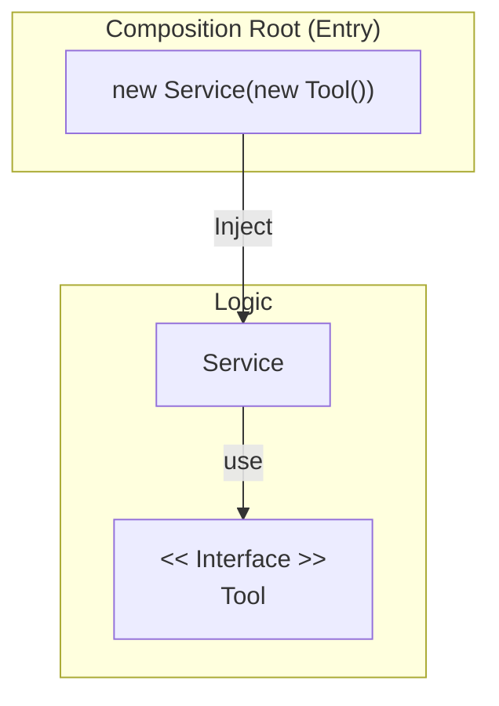

# 第36章：newしない設計（DI超入門：手動注入）🎁🔁

## この章でやること 🎯✨

* 「`new` しない」ってどういう意味？を、**テストしやすさ**で体感する🧪💖
* まずは DI コンテナなしでOK！**手動で注入（手動DI）**できるようになる✋🙂
* 「時計⏰」「乱数🎲」「外部呼び出し🌐」を**差し替え可能**にするコツを掴む🧩✨

---

## 1. なんで「newしない」の？🤔💭（答え：テストがツラいから）


たとえば、こんなコード👇
「今の時刻」「乱数」「外部サービス」を **メソッドの中で `new` してる**と…

* テストで「今を固定」できない（テストが日付で壊れる）⏰💥
* 乱数が毎回変わる（結果が安定しない）🎲😵
* 外部通信が走る（遅い・失敗する・課金も怖い）🌐💸

---

## 2. DIってなに？超ざっくり🍰✨


DI（Dependency Injection）は、
**必要な道具（依存）を、外から渡してあげる**やり方だよ🎁

* 依存（Dependency）＝ クラスが使う「道具」🧰
  例：時計⏰、乱数🎲、APIクライアント🌐、DBアクセス🗄️
* 注入（Injection）＝ それを **コンストラクタ等で受け取る**📦✨
* これでクラスは「自分で道具を作らない」→ **差し替え可能**になる🔁💖

.NET の公式ドキュメントでも DI は「依存とクラスを疎結合にするための基本パターン」として説明されてるよ📚✨ ([Microsoft Learn][1])



---

## 3. “手動注入”ってなに？🧶🙂（DIコンテナはまだ使わない）

この章は **DIコンテナ無し**でいくよ！✅
やることはシンプルで、

* クラスの中で `new` しない
* 必要なものは **コンストラクタで受け取る**
* `new` するのは **組み立てる場所（入口）だけ**（ここ超大事！）🚪✨

この「組み立てる場所」をよく **Composition Root**（組み立て地点）って呼ぶよ🏗️

---

## 4. 例題：クーポン期限チェックを“時刻差し替え可能”にする⏰🎫

### 4-1. まずはダメな例（テストしづらい）🙅‍♀️💦

```csharp
public sealed class Coupon
{
    public required DateTimeOffset ExpiresAtUtc { get; init; }
}

public sealed class CouponService
{
    public bool CanUse(Coupon coupon)
    {
        // ❌ クラスの中で「今の時刻」を直取りしてる
        return DateTimeOffset.UtcNow <= coupon.ExpiresAtUtc;
    }
}
```

これ、テストで「今」を固定できないから、
日付またぎとかで壊れがち…🥲🕛

---

### 4-2. 改善：TimeProvider を受け取る（手動DI）🎁✨

.NET には **TimeProvider** という「時間の抽象化」があるよ⏳
`.NET 8+` でフレームワークに含まれてて、時間依存コードをテストしやすくする目的で用意されてる📚✨ ([Microsoft Learn][2])

```csharp
public sealed class Coupon
{
    public required DateTimeOffset ExpiresAtUtc { get; init; }
}

public sealed class CouponService
{
    private readonly TimeProvider _timeProvider;

    public CouponService(TimeProvider timeProvider)
    {
        _timeProvider = timeProvider;
    }

    public bool CanUse(Coupon coupon)
    {
        var now = _timeProvider.GetUtcNow();
        return now <= coupon.ExpiresAtUtc;
    }
}
```

これで CouponService は「時間」を自分で作らない👏✨
外から渡された時計で判断するだけ⏰✅

---

### 4-3. 組み立て（ここだけ new してOK）🚪🏗️✨


本番の入口（例：Console の `Program.cs`）で組み立てるよ🙂

```csharp
var service = new CouponService(TimeProvider.System); // ✅ 本番の時計
var coupon = new Coupon { ExpiresAtUtc = DateTimeOffset.UtcNow.AddHours(1) };

Console.WriteLine(service.CanUse(coupon) ? "OK" : "NG");
```

`TimeProvider.System` は「システムの時計」を返してくれるよ⌚✨ ([Microsoft Learn][3])

---

## 5. テスト：FakeTimeProvider で「今」を固定する🧪⏰✨


テストでは **FakeTimeProvider** を使うと便利！
公式にも「時間依存コードのテストのために FakeTimeProvider を使える」と書かれてるよ📚✨ ([Microsoft Learn][3])

```csharp
using Microsoft.Extensions.Time.Testing;
using Xunit;

public sealed class CouponServiceTests
{
    [Fact]
    public void 期限切れなら使えない()
    {
        var fake = new FakeTimeProvider();
        fake.SetUtcNow(new DateTimeOffset(2026, 1, 25, 0, 0, 0, TimeSpan.Zero));

        var sut = new CouponService(fake);

        var coupon = new Coupon
        {
            ExpiresAtUtc = new DateTimeOffset(2026, 1, 24, 23, 59, 59, TimeSpan.Zero)
        };

        Assert.False(sut.CanUse(coupon));
    }

    [Fact]
    public void 期限内なら使える()
    {
        var fake = new FakeTimeProvider();
        fake.SetUtcNow(new DateTimeOffset(2026, 1, 25, 0, 0, 0, TimeSpan.Zero));

        var sut = new CouponService(fake);

        var coupon = new Coupon
        {
            ExpiresAtUtc = new DateTimeOffset(2026, 1, 25, 0, 0, 1, TimeSpan.Zero)
        };

        Assert.True(sut.CanUse(coupon));
    }
}
```

`SetUtcNow` は FakeTimeProvider の API として用意されていて、テストで時刻を進められるよ⏩✨ ([Microsoft Learn][4])

---

## 6. “時計・乱数・外部呼び出し”を差し替えるコツ3点 🧠✨

### コツ①：依存は「受け取る」🎁

* `DateTimeOffset.UtcNow` を直接使わない
* `Random.Shared` を直接使わない
* `HttpClient` や SDK を直接 new しない

### コツ②：境界を薄くする🧅✨

外部APIやDBは「1枚ラップ」して、中心ロジックに入れない🌐🧤
（次の章で Adapter/Wrapper をやるよ！）

### コツ③：まず1個だけやる🪄


最初から全部 DI にしないでOK🙂
「壊れやすいところ」から1つずつで十分✨

---

## 7. よくある落とし穴⚠️😵

### 落とし穴A：注入したのに、結局 `new` してる🥲

「受け取ってるのに使わず、また `new` する」パターンはありがち！

✅ 対策：`new` していいのは「入口だけ」🚪✨

---

### 落とし穴B：依存が増えすぎてコンストラクタが長い🧳💦

それは「責務が多い」サインかも👃💡

* Extract Class
* 役割ごとにクラスを分ける
  を疑ってみてね🏠🏠✨

---

### 落とし穴C：Service Locator（必要になったら取り出す）🌀

`IServiceProvider.GetService()` みたいに「必要なときに取り出す」は、
一見便利でも依存が見えなくなってテストが辛くなりがち😵‍♀️
（手動DIでは特に避けるのがおすすめ！） ([Microsoft Learn][1])

---

## 8. ミニ演習📝💖（手を動かすやつ！）

### 演習1：時計を差し替える⏰

* `DateTimeOffset.UtcNow` を使ってる箇所を1つ探す🔎
* `TimeProvider` を受け取る形に直す
* FakeTimeProvider でテストを書く🧪✨

### 演習2：乱数を差し替える🎲

* 抽選ロジックで `Random` を使う
* 本番：`new Random()`
* テスト：`new Random(0)`（固定seed）で結果を安定させる✅

### 演習3：外部通知を差し替える📨

* `INotifier` を作って `Notify(string message)` を定義
* 本番：Consoleに出す実装
* テスト：呼び出された回数やメッセージを記録する Fake 実装

---

## 9. AI拡張の使いどころ🤖✨（“小さく頼む”がコツ）

### 依存の発見を手伝わせる🔎

* 「このクラスが直接触ってる外部要素（時刻・乱数・I/O）を列挙して」

### 手動DIへの変形を手伝わせる🧩

* 「この `DateTimeOffset.UtcNow` を `TimeProvider` 注入に置き換えて。変更は最小で、差分が小さくなるように」

### Fake実装の雛形を作らせる🧱

* 「`INotifier` の Fake 実装を作って。受け取ったメッセージを List に貯められるようにして」

※採用前に「差分」と「テストが通るか」を必ず確認ね✅📌

---

## 10. 章末チェックリスト✅✨

* [ ] クラスの中で `new` してる「道具」を見つけられる🔎
* [ ] 依存をコンストラクタで受け取れる🎁
* [ ] `new` は入口（組み立て地点）に追い出せる🚪
* [ ] Fake（偽物）でテストが安定する🧪💖
* [ ] 変更が怖くなくなる（差し替えできる）🔁✨

[1]: https://learn.microsoft.com/ja-jp/dotnet/core/extensions/dependency-injection?utm_source=chatgpt.com "NET での依存関係の挿入"
[2]: https://learn.microsoft.com/en-us/dotnet/standard/datetime/timeprovider-overview?utm_source=chatgpt.com "What is the TimeProvider class - .NET"
[3]: https://learn.microsoft.com/ja-jp/dotnet/api/system.timeprovider?view=net-8.0&utm_source=chatgpt.com "TimeProvider クラス (System)"
[4]: https://learn.microsoft.com/ja-jp/dotnet/api/microsoft.extensions.time.testing.faketimeprovider.setutcnow?view=net-9.0-pp&utm_source=chatgpt.com "FakeTimeProvider.SetUtcNow(DateTimeOffset) メソッド"
