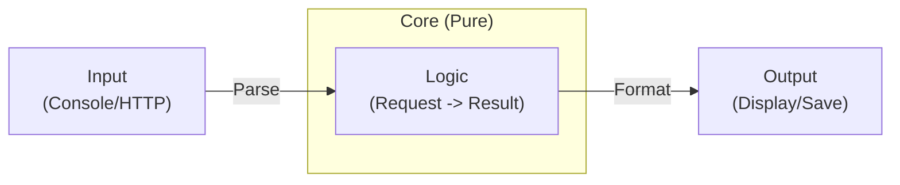

# 第38章：I/O境界分離①（入出力を薄くして中心を守る）🧁🎯

## この章でできるようになること💪✨

* 「入出力（I/O）」と「純粋ロジック」を分けて、**中心（コア）をキレイに保つ**🏠🧼
* **テストしやすい**コードに変えて、リファクタの安全性を上げる🧪🛡️
* Console / ファイル / DB / HTTP みたいな“外の世界”の変更で、中心が壊れないようにする🔌🌍➡️🏠

---

## I/O境界ってなに？🤔📌


I/O（Input/Output）は、ざっくり言うと「外の世界とのやりとり」だよ✨

* Input：ユーザー入力、HTTPリクエスト、ファイル読み込み、DB取得…📥
* Output：画面表示、HTTPレスポンス、ファイル書き込み、DB保存…📤

ここで大事なのは👇
**中心のロジック（計算・判定・ルール）は、外の世界を知らない**ようにすること🏠✨
外の世界に依存すると、テストが難しくなって、変更に弱くなるの🥺💦

ちなみに .NET 10 は LTS で、しばらく安心して使える基盤だよ（学んだ分離パターンが長生きしやすい）🧸✨ ([Microsoft for Developers][1])
C# 14 も .NET 10 / Visual Studio 2026 で試せるよ🌟 ([Microsoft Learn][2])

---

## ありがちな “混ぜ込みコード” の問題点👀💥

I/Oとロジックが混ざると、こうなるよ👇

* Console.ReadLine があるから、テストで呼べない😵‍💫
* File.ReadAllText のせいで、実行環境に依存しちゃう📄⚠️
* DateTime.Now / Random で結果が毎回ブレる⏰🎲
* ちょっと表示を変えただけで計算ロジックまで触る羽目に…🌀

---

## 合言葉はこれ！🪄✨「外は薄く、中は濃く」


* 外側（I/O）：**薄くする**（入力を整えて渡す、結果を整えて出す）🧻



---
* 内側（コア）：**濃くする**（仕様・ルール・計算の本体）🍫

---

## まず覚えるルール5つ🧷✅


### ルール1：コアは I/O API を呼ばない🙅‍♀️

コア内にこれが出てきたら黄色信号🚦

* `Console.*` / `File.*` / `HttpClient` / `DbContext`
* `DateTime.Now` / `Environment.*` / `Thread.Sleep`

### ルール2：コアは「引数→戻り値」で完結させる📦➡️📦

副作用なし（または最小）にするとテストが超ラク🧪✨

### ルール3：入力整形は外でやる（Parse/Trim/Validate）🧹

「文字列→数値」変換や、フォーマット調整は外側で🎀

### ルール4：出力整形も外でやる（表示文言・桁・通貨）🖨️

コアは「結果のデータ」だけ返すのがキレイ✨

### ルール5：境界で“データの形”を決める（Request/Result）🧩


* `Request`：コアに渡す入力
* `Result`：コアから返る結果

---

## 例：混ざってる版（Before）😵‍💫

「見積もり計算」なのに、I/Oが全部入りの例だよ💦

```csharp
using System.Text.Json;

Console.Write("商品合計（円）: ");
var subtotalText = Console.ReadLine();

Console.Write("クーポンコード（なければ空）: ");
var coupon = Console.ReadLine();

var subtotal = decimal.Parse(subtotalText!);

// ファイルから税率を読む（I/O）
var configJson = File.ReadAllText("appsettings.json");
var config = JsonSerializer.Deserialize<AppConfig>(configJson)!;

var now = DateTimeOffset.Now; // 時刻依存
var isHappyHour = now.Hour >= 15 && now.Hour < 17;

var discountRate =
    coupon == "OFF10" ? 0.10m :
    isHappyHour ? 0.05m :
    0m;

// ロジック（計算）
var total = subtotal * (1 - discountRate) * (1 + config.TaxRate);

Console.WriteLine($"合計: {total:N0} 円");

// ログ書き込み（I/O）
File.AppendAllText("quote.log", $"{now:u} subtotal={subtotal} total={total}\n");

public sealed class AppConfig
{
    public decimal TaxRate { get; set; }
}
```

### 何がつらい？🥺

* 税率ファイルがないと動かない📄❌
* “今の時刻”で結果が変わる⏰
* テストが「Console入力待ち」で止まる🛑
* 表示を変えるだけでロジックまで触りがち🌀

---

## 分離した版（After）✨🧁（中心を守る）

### ① コア：純粋ロジックだけ（テストしやすい）🧪


```csharp
public sealed record QuoteRequest(decimal Subtotal, string CouponCode, bool IsHappyHour, decimal TaxRate);

public sealed record QuoteResult(decimal DiscountRate, decimal Total);

public static class QuoteCalculator
{
    public static QuoteResult Calculate(QuoteRequest req)
    {
        var discountRate =
            req.CouponCode == "OFF10" ? 0.10m :
            req.IsHappyHour ? 0.05m :
            0m;

        var total = req.Subtotal * (1 - discountRate) * (1 + req.TaxRate);
        return new QuoteResult(discountRate, total);
    }
}
```

ポイント🧸✨

* コアは `Console` も `File` も `DateTime` も知らない🙆‍♀️
* “必要な情報（IsHappyHour, TaxRate）”は外から渡す📦

---

### ② 外側：I/Oを薄くして「整えて渡す」🧻

```csharp
using System.Text.Json;

Console.Write("商品合計（円）: ");
var subtotal = decimal.Parse(Console.ReadLine()!.Trim());

Console.Write("クーポンコード（なければ空）: ");
var coupon = (Console.ReadLine() ?? "").Trim();

var taxRate = LoadTaxRate();                 // I/O（外側でOK）
var isHappyHour = IsHappyHour(DateTimeOffset.Now); // 時刻も外側で判定して bool にする

var req = new QuoteRequest(subtotal, coupon, isHappyHour, taxRate);
var result = QuoteCalculator.Calculate(req);

Console.WriteLine($"割引: {result.DiscountRate:P0}");
Console.WriteLine($"合計: {result.Total:N0} 円");

AppendLog(result); // I/O（外側でOK）

static decimal LoadTaxRate()
{
    var json = File.ReadAllText("appsettings.json");
    var config = JsonSerializer.Deserialize<AppConfig>(json)!;
    return config.TaxRate;
}

static bool IsHappyHour(DateTimeOffset now) => now.Hour is >= 15 and < 17;

static void AppendLog(QuoteResult result)
{
    File.AppendAllText("quote.log", $"total={result.Total}\n");
}

public sealed class AppConfig
{
    public decimal TaxRate { get; set; }
}
```

ここが“分離のコツ”だよ🎀

* `DateTimeOffset.Now` は外側で使って、コアには **bool（結果）だけ**渡す✅
* 税率ファイルも外側で読んで、コアには **decimal（値）だけ**渡す✅

---

## コアが一気にテストしやすくなる🧪🌸


```csharp
using Xunit;

public sealed class QuoteCalculatorTests
{
    [Fact]
    public void OFF10なら10パー割引になる()
    {
        var req = new QuoteRequest(
            Subtotal: 1000m,
            CouponCode: "OFF10",
            IsHappyHour: false,
            TaxRate: 0.10m);

        var result = QuoteCalculator.Calculate(req);

        Assert.Equal(0.10m, result.DiscountRate);
        Assert.Equal(990m, result.Total); // 1000*(1-0.1)*(1+0.1)=990
    }

    [Fact]
    public void ハッピーアワーなら5パー割引になる()
    {
        var req = new QuoteRequest(1000m, "", true, 0.10m);
        var result = QuoteCalculator.Calculate(req);

        Assert.Equal(0.05m, result.DiscountRate);
        Assert.Equal(1045m, result.Total); // 1000*(0.95)*(1.1)=1045
    }
}
```

テストが速い＝安心して小さく直せる✨🛡️

---

## “I/Oを薄くする”チェックリスト🧾✅

リファクタ中、ここを見ていくと迷いにくいよ👀

* [ ] コアに `Console/File/Http/Db` がない
* [ ] コアが `DateTime.Now` / `Random` を直接使ってない
* [ ] 入力整形（Parse/Trim/Validate）は外側にある
* [ ] コアは `Request -> Result` の形で完結してる
* [ ] 出力整形（表示文言、書式）は外側にある

---

## “Generic Host”で外側を整える（Consoleでも便利）🏗️✨

Consoleアプリでも、起動・DI・ログなどをまとめるために Generic Host を使えるよ（外側の整理がしやすい）🧰
Microsoft のドキュメントでも、Console apps で Generic Host を使えるって説明されてるよ📚 ([Microsoft Learn][3])

この章の範囲では「外側を薄くする」が主役なので、Host は“外側の整理に使える道具”として覚えておけばOK🎀

---

## AI拡張の使い方（安全に分離するための頼み方）🤖🛡️

### 1) I/Oとロジックを仕分けしてもらう📦

* 「このメソッド内の処理を **I/O** と **純粋ロジック** に分類して、箇条書きで出して」

### 2) コア抽出案を“差分最小”で作ってもらう✂️

* 「純粋ロジックを `Request -> Result` 形式のメソッドに抽出して。**変更は1コミット分**に収めて」

### 3) コアのテスト雛形を作ってもらう🧪

* 「抽出した `Calculate` に対して、境界値（0、OFF10、ハッピーアワー）を含む xUnit テスト雛形を作って」

### 4) 最後に人間がチェックするポイント👀✅

* 期待値（計算結果）が合ってる？
* 例外ケース（空入力・不正値）は外側で扱ってる？
* コアにI/Oが紛れ込んでない？

---

## ミニ演習📝🌷（30〜45分）

### 演習A：混ざってるコードから “中心” を救出する🧁

1. Beforeコードから I/O 行にマーカーを付ける🖍️
2. 計算・判定だけを `QuoteCalculator.Calculate` に移す✂️
3. `QuoteRequest / QuoteResult` を用意して引数と戻り値を整理📦
4. xUnit テストを2本以上作る🧪

### 演習B：表示を変えてもコアは触らない🖨️

* 出力を「円」「税込/税抜」「割引理由（クーポン/時間帯）」に変更してみる✨
* コアを触らず、外側だけで対応できたら勝ち🏆💕

---

## この章のまとめ🎀✨

* I/O（外）とロジック（中）を分けると、テストできて、変更に強くなる🧪🛡️
* コアは **引数→戻り値**で完結させて、外の世界を知らないようにする🏠
* 外側は “薄く”して、入力整形・出力整形・I/Oだけ担当する🧻✨

[1]: https://devblogs.microsoft.com/dotnet/announcing-dotnet-10/?utm_source=chatgpt.com "Announcing .NET 10"
[2]: https://learn.microsoft.com/en-us/dotnet/csharp/whats-new/csharp-14?utm_source=chatgpt.com "What's new in C# 14"
[3]: https://learn.microsoft.com/en-us/dotnet/core/extensions/generic-host?utm_source=chatgpt.com "NET Generic Host"
