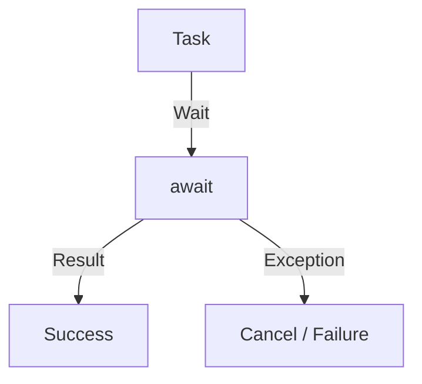

# 第39章：非同期コードのリファクタ（async/await・キャンセル・タイムアウト）⚡🧵

## この章でできるようになること 🎯✨

* `async/await` のコードを **短く・読みやすく** 整理できるようになる ✂️📘
* **キャンセル**（`CancellationToken`）を「ちゃんと効く」形で最後まで通せるようになる 🛑🧷
* **タイムアウト**を安全に入れて、固まり事故を防げるようになる ⏳✅
* 例外がごちゃつく非同期コードを「境界で整える」感覚がつく 🚧🧼

---

## まずここ！非同期が読みにくくなる3大原因 😵‍💫🌀


### 1) 「待つ場所」が散らかる 🧵



---
`await` が増えるほど、処理の流れが **飛び飛び** に見えて読みづらい…💦

### 2) キャンセル・タイムアウトが後付けで壊れる 🛑⏳

途中で `CancellationToken` を渡し忘れると、
**UIのキャンセルボタン押したのに止まらない** みたいな事故が起きるよ😇

### 3) 例外が混ざる 💥

* 通信失敗（`HttpRequestException`）
* キャンセル（`OperationCanceledException`）
* タイムアウト（`TimeoutException` など）

全部まとめて `catch (Exception)` すると、仕様が崩れがち…🥲

---

## 非同期リファクタの鉄板ルール 5つ 🧱✨

### ルール1：async は最後まで貫く（async all the way）🏃‍♀️💨

`Result` / `Wait()` で待つと、**UIが固まる**＆**デッドロック**の温床になりやすいよ🚫🧊
→ 入口から出口まで `await` でつなぐのが基本✅

### ルール2：戻り値は `Task` / `Task<T>` にする 🎁

`async void` は **イベントハンドラ専用**（ボタン押下とか）にするのが安全🙆‍♀️

### ルール3：`CancellationToken` は「引数で受けて、渡し続ける」🧷➡️➡️➡️

「受ける」だけじゃなくて、**内部の待ち（I/OやDelay）に渡す**のが大事💡
最近のAPIも `CancellationToken` や `TimeSpan timeout` を受け取る形が増えてるよ📈✨ ([Microsoft Learn][1])

### ルール4：タイムアウトは “仕組み” を統一する ⏳🧠

* `CancellationTokenSource.CancelAfter(...)` で「一定時間後にキャンセル」する
  → Microsoftの解説がこれだよ🧷 ([Microsoft Learn][2])
* `Task.WaitAsync(timeout, ct)` で「このTaskをタイムアウト付きで待つ」
  → .NET 10 のAPIにも載ってる標準手段💎 ([Microsoft Learn][3])

### ルール5：外部通信は “回復性” を意識する 🛡️🌐

HTTPは落ちる前提…😇
.NET は `Microsoft.Extensions.Http.Resilience` で **タイムアウト/リトライ/遮断**みたいな定番を組みやすくしてるよ🧰✨ ([Microsoft Learn][4])
（中で Polly の考え方ともつながるよ）([pollydocs.org][5])

---

## キャンセルを「ちゃんと効かせる」最小パターン 🛑🧷

### 基本形：引数で受けて、awaitするAPIに渡す ✅

```csharp
public async Task<string> DownloadAsync(string url, CancellationToken ct = default)
{
    using var http = new HttpClient();

    // ct を渡す！ここが超大事✨
    return await http.GetStringAsync(url, ct);
}
```

### UI側：キャンセルボタンで止める例 🖱️🛑

```csharp
private CancellationTokenSource? _cts;

private async void StartButton_Click(object sender, EventArgs e)
{
    _cts = new CancellationTokenSource();

    try
    {
        var text = await _service.DownloadAsync("https://example.com", _cts.Token);
        MessageBox.Show("完了✨\n" + text[..Math.Min(100, text.Length)]);
    }
    catch (OperationCanceledException)
    {
        MessageBox.Show("キャンセルしたよ🛑");
    }
}

private void CancelButton_Click(object sender, EventArgs e)
{
    _cts?.Cancel();
}
```

ポイント💡

* **キャンセルは例外（`OperationCanceledException`）として上がってくる**のが普通だよ🙂
* `catch (Exception)` に混ぜないで、まずは `OperationCanceledException` を分けると読みやすい✨

---

## タイムアウトの入れ方 2通り ⏳✨

### 1) CancelAfter 方式：時間が来たらキャンセルする ⏰🛑

Microsoftの定番はこれ🧷 ([Microsoft Learn][2])

```csharp
public async Task<string> DownloadWithTimeoutAsync(
    string url,
    TimeSpan timeout,
    CancellationToken ct = default)
{
    using var timeoutCts = CancellationTokenSource.CreateLinkedTokenSource(ct);
    timeoutCts.CancelAfter(timeout); // 指定時間でキャンセル予定🛑

    using var http = new HttpClient();
    return await http.GetStringAsync(url, timeoutCts.Token);
}
```

**「ユーザーキャンセル」と「タイムアウト」を合体**して渡してるのがキモだよ🧠✨

---

### 2) WaitAsync 方式：待ちにタイムアウトを付ける ⏳🧵

`Task.WaitAsync(TimeSpan, CancellationToken)` は .NET 10 のAPIにもある標準手段だよ📘 ([Microsoft Learn][3])

```csharp
public async Task<string> DownloadWithWaitAsync(
    string url,
    TimeSpan timeout,
    CancellationToken ct = default)
{
    using var http = new HttpClient();

    var task = http.GetStringAsync(url, ct);
    return await task.WaitAsync(timeout, ct); // timeout を過ぎたら TimeoutException になりやすい🕰️
}
```

使い分けイメージ🌷

* **CancelAfter**：アプリ全体の「この処理はここまで」っていう“締切”を作りたい時に便利🛑
* **WaitAsync**：すでにある `Task` に「後からタイムアウト」を付けたい時に便利⏳

---

## 例外の交通整理：キャンセルとタイムアウトを分ける 🚦✨

### ありがちな悪い例 😱

```csharp
try
{
    await _service.DoAsync();
}
catch (Exception ex)
{
    // キャンセルもタイムアウトも通信失敗も全部ここ…🥲
    _logger.LogError(ex, "失敗");
}
```

### まずはこの形にするのがおすすめ 🧼✅

```csharp
try
{
    await _service.DoAsync(ct);
}
catch (OperationCanceledException) when (ct.IsCancellationRequested)
{
    // ユーザーキャンセル🛑
}
catch (TimeoutException)
{
    // タイムアウト⏳
}
catch (HttpRequestException ex)
{
    // 通信失敗🌐💥
}
```

※ `TimeoutException` が出るか、`OperationCanceledException` に寄るかは方式やAPIによって変わるので、
「アプリの見せ方」として境界で整えるのがコツだよ🚧✨

---

## 実践：ごちゃごちゃ async を短くするリファクタ ✂️🧁

### Before：責務が混ざってる長い async 😵‍💫

* 入力チェック
* URL組み立て
* HTTP
* 例外整形
* パース
  が1メソッドに混在💦

```csharp
public async Task<decimal> GetPriceAsync(string sku)
{
    if (string.IsNullOrWhiteSpace(sku))
        throw new ArgumentException("sku is required");

    using var http = new HttpClient();
    var url = "https://api.example.com/prices/" + sku;

    try
    {
        var json = await http.GetStringAsync(url);
        // ここでは雑にパースしてる想定
        return decimal.Parse(json);
    }
    catch (Exception ex)
    {
        throw new InvalidOperationException("Failed to get price: " + sku, ex);
    }
}
```

---

### After：待つ場所とロジックを分離して読みやすく ✨📘

ポイントはこれ👇

* **入口でキャンセル/タイムアウトを受け取る**
* **I/Oは短いメソッドに閉じ込める**
* **パースは純粋メソッドにする（テストしやすい）** 🧪

```csharp
public async Task<decimal> GetPriceAsync(
    string sku,
    TimeSpan timeout,
    CancellationToken ct = default)
{
    ValidateSku(sku);

    using var timeoutCts = CancellationTokenSource.CreateLinkedTokenSource(ct);
    timeoutCts.CancelAfter(timeout);

    var json = await DownloadPriceJsonAsync(sku, timeoutCts.Token);
    return ParsePrice(json);
}

private static void ValidateSku(string sku)
{
    if (string.IsNullOrWhiteSpace(sku))
        throw new ArgumentException("sku is required", nameof(sku));
}

private async Task<string> DownloadPriceJsonAsync(string sku, CancellationToken ct)
{
    using var http = new HttpClient();
    var url = BuildUrl(sku);

    // ct を渡す！🧷
    return await http.GetStringAsync(url, ct);
}

private static string BuildUrl(string sku)
    => "https://api.example.com/prices/" + sku;

private static decimal ParsePrice(string json)
    => decimal.Parse(json);
```

読みどころ👀✨

* `GetPriceAsync` が「やりたいことの順番」だけになって、**物語みたいに読める**📖
* パースや入力チェックは同期メソッドにして、**テストが超ラク**🧪💕

---

## 5. キャンセル・タイムアウトの流れ🛑⏳⚖️


---

## ミニ演習 📝✨

### 演習1：キャンセル対応を入れてみよう 🛑🧷

次の条件を満たすように修正してね👇

* `CancellationToken ct = default` を public メソッドの引数に追加
* `Task.Delay` / `HttpClient` などの await に ct を渡す
* `OperationCanceledException` を UI か呼び出し元で表示

チェック✅

* 「キャンセル押したら本当に止まる」こと！

### 演習2：タイムアウトを統一しよう ⏳🧠

* `CancelAfter` 方式で「3秒」でタイムアウト
* タイムアウトしたら「タイムアウト⏳」と表示
* ユーザーキャンセルは「キャンセル🛑」と表示
  （分けられたら勝ち✨）

### 演習3：asyncメソッドを短くしよう ✂️

長い `async` を見つけて、次をやってね👇

* 「入力整形」「I/O」「ロジック」「例外整形」を別メソッドへ分離
* `await` があるメソッドを“見える範囲”に減らす（目標：1〜2個）👀✨

---

## テストの超基本：async は async でテストする 🧪💖

```csharp
[Fact]
public async Task Cancel_Should_Throw_OperationCanceledException()
{
    using var cts = new CancellationTokenSource();
    cts.Cancel();

    await Assert.ThrowsAsync<OperationCanceledException>(
        () => _service.GetPriceAsync("ABC", TimeSpan.FromSeconds(10), cts.Token));
}
```

「キャンセル・タイムアウトは仕様」だから、テストで固定できると安心だよ✅✨

---

## AI拡張の使い方 🤖🧠✨

### そのまま使える頼み方例 💬

* 「この `async` メソッドの責務を 4つに分けて、`Extract Method` の候補を出して」✂️
* 「`CancellationToken` を最後まで渡す修正を、差分が小さくなる順に提案して」🧷
* 「`CancelAfter` と `WaitAsync` のどっちが合う？このコードの“締切”の定義も一緒に考えて」⏳

ルール🛡️

* AIの提案は **1コミット分** に刻む🌿
* 置き換えたら **必ず動作確認＆テスト** ✅
* キャンセル/タイムアウトは **実際に押して試す** 🖱️🛑

---

## よくある落とし穴まとめ 💣😇

* `Task.Result` / `Wait()`：UI固まり・デッドロックの元🚫🧊
* `async void` を増やす：例外が捕まえにくい⚠️
* `CancellationToken` を“受けるだけ”で渡さない：キャンセルが効かない🧷💦
* タイムアウトの実装がバラバラ：挙動が読めなくなる⏳🌀
* 外部通信でリトライを雑に自作：事故りやすいので標準/定番を活用🛡️ ([Microsoft Learn][4])

---

## まとめ 🌈✨

非同期のリファクタは、やることがシンプルだよ😊💕

* **待つ場所を減らす**（短くする）✂️
* **キャンセルを最後まで通す** 🧷
* **タイムアウトを統一する** ⏳
* **例外を境界で整理する** 🚧

そして、C# 14 / .NET 10 は最新の機能も揃ってるから、安心してこの型で整えていけるよ🌟 ([Microsoft Learn][6])

[1]: https://learn.microsoft.com/en-us/aspnet/core/release-notes/aspnetcore-10.0?view=aspnetcore-10.0&utm_source=chatgpt.com "What's new in ASP.NET Core in .NET 10"
[2]: https://learn.microsoft.com/en-us/dotnet/csharp/asynchronous-programming/cancel-async-tasks-after-a-period-of-time?utm_source=chatgpt.com "Cancel async tasks after a period of time\" - C#"
[3]: https://learn.microsoft.com/en-us/dotnet/api/system.threading.tasks.task.waitasync?view=net-10.0&utm_source=chatgpt.com "Task.WaitAsync Method (System.Threading.Tasks)"
[4]: https://learn.microsoft.com/en-us/dotnet/core/resilience/http-resilience?utm_source=chatgpt.com "Build resilient HTTP apps: Key development patterns - .NET"
[5]: https://www.pollydocs.org/pipelines/?utm_source=chatgpt.com "Resilience pipelines"
[6]: https://learn.microsoft.com/ja-jp/dotnet/csharp/whats-new/csharp-14?utm_source=chatgpt.com "C# 14 の新機能"
