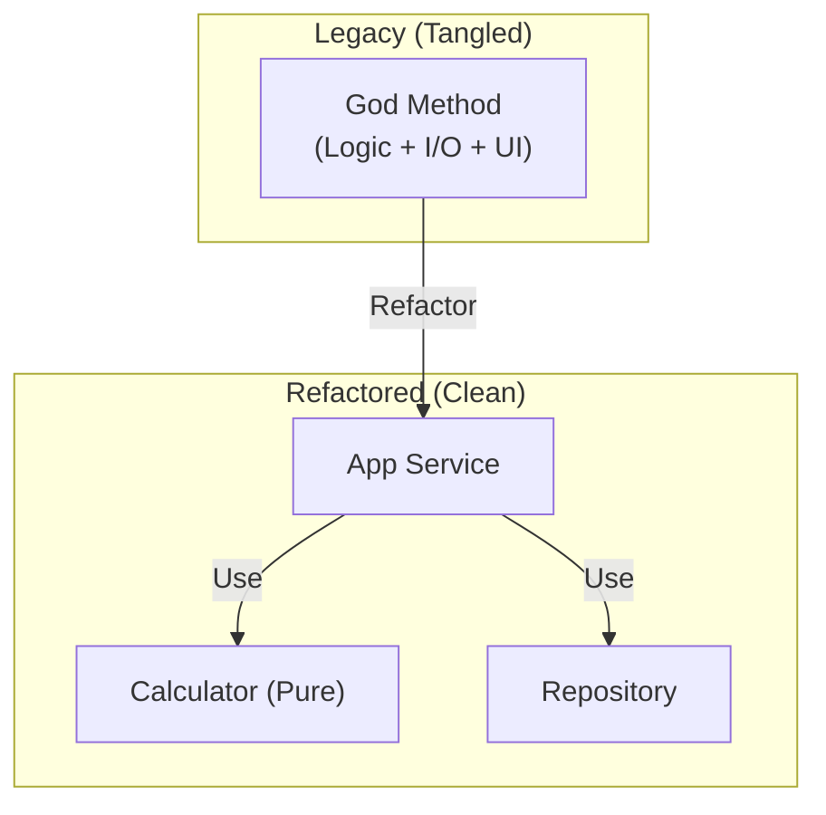

# 第40章：総合ケーススタディ（レガシー1本を安全に改善）🧗‍♀️💖

## 今日のゴール🌈✨

この章が終わる頃には、こんなことができるようになります🎯

* レガシーコードを **壊さずに** 触り始められる（観測テスト📸）
* **小さく** リファクタして、**小さく** コミットできる🌿📌
* 仕上げに「設計っぽい改善（やりすぎない）」で読みやすくできる🏗️🌼
* テスト＋静的解析＋IDE機能で「安心の根拠」を作れる✅🚦

> ちなみに .NET 10 は 2025/11/11 に正式リリースで、LTS（3年サポート）です📅✨ ([Microsoft for Developers][1])

---

## 今回のお題：学園祭カフェの「注文合計」☕🍰


学園祭のカフェで、注文の合計金額を計算して、レシート文字列を返す処理を直します🧾✨
レガシーあるある全部入りにしてあります😇

* 1つのメソッドが長い📜💦
* null/空文字チェックがぐちゃぐちゃ🧩
* 計算（ロジック）と I/O（保存・ログ）が混ざってる🌀
* テストが無いので怖い😱



---

## Before：レガシー版（わざと読みにくい）🫠💥


```csharp
using System.Text;

public static class LegacyCheckout
{
    // 受け取って、計算して、ログ出して、保存して、文字列返す…全部ここ🥲
    public static string PlaceOrder(
        string customerId,
        string? couponCode,
        List<OrderItem> items,
        Func<DateTime>? now = null,
        Func<int, int, int>? nextInt = null,
        ITaxRateProvider? taxRateProvider = null,
        IOrderRepository? repo = null,
        ILogger? logger = null)
    {
        now ??= () => DateTime.Now;
        nextInt ??= (min, max) => Random.Shared.Next(min, max);
        taxRateProvider ??= new FixedTaxRateProvider(0.1m);
        repo ??= new FileOrderRepository();
        logger ??= new ConsoleLogger();

        if (customerId == null) customerId = "";
        if (items == null) items = new List<OrderItem>();

        if (customerId.Trim().Length == 0)
        {
            logger.Log("customerId is empty!");
            return "ERROR: customerId";
        }

        if (items.Count == 0)
        {
            logger.Log("items is empty!");
            return "ERROR: items";
        }

        decimal subtotal = 0m;
        for (int i = 0; i < items.Count; i++)
        {
            var it = items[i];
            if (it.Quantity <= 0)
            {
                logger.Log("qty invalid");
                return "ERROR: qty";
            }

            if (it.UnitPrice < 0)
            {
                logger.Log("price invalid");
                return "ERROR: price";
            }

            subtotal += it.UnitPrice * it.Quantity;
        }

        decimal discount = 0m;
        if (!string.IsNullOrWhiteSpace(couponCode))
        {
            // 쿠폰が "GAKUSAI10" なら 10% 引き…みたいな雑ルール😅
            if (couponCode.Trim().ToUpperInvariant() == "GAKUSAI10")
                discount = subtotal * 0.10m;
            else if (couponCode.Trim().ToUpperInvariant() == "GAKUSAI500")
                discount = 500m;
        }

        if (discount > subtotal) discount = subtotal;

        decimal taxedBase = subtotal - discount;

        decimal taxRate = taxRateProvider.GetTaxRate(); // 本当は外部(API)とか想定
        decimal tax = Math.Round(taxedBase * taxRate, 0, MidpointRounding.AwayFromZero);

        decimal total = taxedBase + tax;

        var orderId = $"{now().yyyyMMdd}-{nextInt(1000, 9999)}";

        var sb = new StringBuilder();
        sb.AppendLine($"ORDER:{orderId}");
        sb.AppendLine($"CUSTOMER:{customerId}");
        sb.AppendLine($"SUBTOTAL:{subtotal}");
        sb.AppendLine($"DISCOUNT:{discount}");
        sb.AppendLine($"TAX:{tax}");
        sb.AppendLine($"TOTAL:{total}");

        // 保存（I/O）
        repo.Save(new OrderRecord(orderId, customerId, total, now()));

        // ログ（I/O）
        logger.Log("order placed: " + orderId);

        return sb.ToString();
    }
}

public sealed record OrderItem(string Sku, int Quantity, decimal UnitPrice);

public sealed record OrderRecord(string OrderId, string CustomerId, decimal Total, DateTime CreatedAt);

public interface ITaxRateProvider { decimal GetTaxRate(); }
public sealed class FixedTaxRateProvider(decimal rate) : ITaxRateProvider { public decimal GetTaxRate() => rate; }

public interface IOrderRepository { void Save(OrderRecord record); }
public sealed class FileOrderRepository : IOrderRepository
{
    public void Save(OrderRecord record)
    {
        Directory.CreateDirectory("orders");
        File.WriteAllText(Path.Combine("orders", record.OrderId + ".txt"),
            $"{record.OrderId},{record.CustomerId},{record.Total},{record.CreatedAt:O}");
    }
}

public interface ILogger { void Log(string message); }
public sealed class ConsoleLogger : ILogger { public void Log(string message) => Console.WriteLine(message); }
```

> ここでは「観測しやすくするために」依存（時間・乱数・税率・保存・ログ）を引数で差し替え可能にしてあります🎁
> これが **Seam（差し替えの切れ目）** です🧵✨（第36〜38章の総仕上げ！）

---

## 進め方（この章のロードマップ）🗺️✨

この順番で、**安全に** 直します✅

1. ① 観測（Characterization Test）📸
2. ② 小さくリファクタ（Rename / Extract / ガード節）✂️
3. ③ 設計寄せ（Extract Class / Value Object / I/O境界分離）🏗️
4. ④ テスト＆静的解析で確認✅🚦
5. ⑤ 1リファクタ＝1コミットを積む🌿📌

---

## ① 観測（Characterization Test）📸🕵️‍♀️

### ねらい🎯

「今の挙動」を写し取って固定します📌
ここで作るテストは、“正しい設計”じゃなくてOK！まずは **挙動のコピー** でOKです🙆‍♀️✨

### 観測のコツ🧠✨

* **乱数と時間は固定**（テストが毎回同じになる）⏰🎲
* I/O は **インメモリに置き換え**（ファイル書き込みを避ける）🧠🧾
* 結果は「返り値（レシート文字列）」＋「保存された内容」を見る👀

### テスト（xUnit）例🧪🎀

```csharp
using Xunit;

public sealed class LegacyCheckoutCharacterizationTests
{
    [Fact]
    public void PlaceOrder_GAKUSAI10_WorksLikeBefore()
    {
        // Arrange
        var fixedNow = new Func<DateTime>(() => new DateTime(2026, 1, 1, 12, 0, 0));
        var fixedRand = new Func<int, int, int>((min, max) => 1234);

        var repo = new InMemoryOrderRepository();
        var logger = new InMemoryLogger();
        var tax = new FixedTaxRateProvider(0.1m);

        var items = new List<OrderItem>
        {
            new("CAKE", 2, 300m), // 600
            new("COFFEE", 1, 500m) // 500
        };

        // Act
        var receipt = LegacyCheckout.PlaceOrder(
            customerId: "A001",
            couponCode: "GAKUSAI10",
            items: items,
            now: fixedNow,
            nextInt: fixedRand,
            taxRateProvider: tax,
            repo: repo,
            logger: logger);

        // Assert（いまの挙動を固定📸）
        Assert.Contains("ORDER:20260101-1234", receipt);
        Assert.Contains("CUSTOMER:A001", receipt);
        Assert.Contains("SUBTOTAL:1100", receipt);     // 600+500
        Assert.Contains("DISCOUNT:110.0", receipt);    // 10%
        Assert.Contains("TAX:99", receipt);            // (1100-110)*0.1=99
        Assert.Contains("TOTAL:1089.0", receipt);

        Assert.Single(repo.Saved);
        Assert.Equal("20260101-1234", repo.Saved[0].OrderId);
        Assert.Equal(1089.0m, repo.Saved[0].Total);
    }

    private sealed class InMemoryOrderRepository : IOrderRepository
    {
        public List<OrderRecord> Saved { get; } = new();
        public void Save(OrderRecord record) => Saved.Add(record);
    }

    private sealed class InMemoryLogger : ILogger
    {
        public List<string> Logs { get; } = new();
        public void Log(string message) => Logs.Add(message);
    }
}
```

### ここまでで「安心の根拠」完成✅🛡️

* テストが通る＝挙動が変わってない可能性が高い
* これがあるから、次から **怖くない** 😌✨

> .NET のコード分析（Roslynアナライザー）は、.NET 5+ をターゲットにしていれば SDK に含まれていて、特別に入れなくても有効です🔎✨ ([Microsoft Learn][2])

---

## ② 小さくリファクタ（Rename / Extract / ガード節）✂️🌟

### 目標🎯

「読める」状態に近づける（まだ設計はがんばらない）🙂✨
この段階は、**IDEのリファクタ機能**をガンガン使います🛠️💕

### コミット例（この章はずっとこれ）🌿📌

* `test: add characterization for PlaceOrder (GAKUSAI10)`
* `refactor: rename subtotal/taxedBase variables`
* `refactor: extract discount calculation`
* `refactor: guard clauses for input validation`

### 小分けの定番3つ🍡✨

#### 1) Rename（意図が伝わる名前へ）🏷️

* `it` → `item`
* `sb` → `receiptBuilder`
* `taxedBase` → `amountAfterDiscount`
  みたいに「読んだ瞬間にわかる」へ🙂

#### 2) Extract Method（段落で分ける）✂️

おすすめの切り方👇

* `Validate(...)`
* `CalculateSubtotal(...)`
* `CalculateDiscount(...)`
* `BuildReceipt(...)`

#### 3) ガード節（早期return）🚪✨

ネストが減って、視線が迷子にならない👀💕

---

## ③ 設計寄せ（Extract Class / Value Object / I/O境界分離）🏗️💎

ここが「総合演習」の本番🔥✨
でも、やるのは **小さく** です🍬

### 3-1) Extract Class：計算を `OrderCalculator` に引っ越し🏠➡️🏠

**狙い**：PlaceOrder から “計算” を抜いて、読める中心を作る🧁🎯

最終的にこんな形を目指します👇

* `CheckoutAppService`：注文の流れ（I/Oも呼ぶ）
* `OrderCalculator`：純粋な計算（できれば副作用なし）
* `OrderRepository`：保存（I/O）
* `TaxRateProvider`：税率取得（外部）

### 3-2) Value Object：お金を `Money` で守る💰🛡️

`decimal` が散らばると、単位ミスや丸めミスが起きやすいです😵‍💫
ここでは超ミニでOK！

```csharp
public readonly record struct Money(decimal Value)
{
    public static Money Zero => new(0m);

    public Money Add(Money other) => new(Value + other.Value);
    public Money Subtract(Money other) => new(Value - other.Value);
    public Money Multiply(int qty) => new(Value * qty);

    public Money RoundAwayFromZero() =>
        new(Math.Round(Value, 0, MidpointRounding.AwayFromZero));
}
```

※「やりすぎValueObject」にならないよう、まずは **置き換えやすい場所だけ** でOKです🙆‍♀️✨

### 3-3) I/O境界分離：中心（計算）を真ん中に置く🧁🎯

PlaceOrder の中で混ざってたコレ👇

* 計算（純粋）
* 保存（ファイルなど）
* ログ（コンソールなど）

を分けます✨

ポイントはこれだけ👇

* **中心ロジックは I/O を知らない**
* I/O は外側で呼ぶ（境界）🚧

---

## ④ テスト＆静的解析で確認✅🚦

### 4-1) テストの回し方🧪🔁

* IDEのテスト実行も便利だけど、困ったら `dotnet test` が確実✅
* .NET 10 の `dotnet test` は Microsoft Testing Platform（MTP）もサポートしていて、周辺が強化されています🧰✨ ([Microsoft Learn][3])

### 4-2) Test Explorer が「ぐるぐる」したら😵‍💫🌀

2026年1月時点で、Visual Studio 2026 + .NET 10 + xUnit でテスト探索が固まる/回り続ける報告があります🌀 ([Developer Community][4])
対処の定番はこれ👇

* まず `dotnet test` で実行して切り分け✅
* xUnit の VS アダプター（`xunit.runner.visualstudio`）を最新へ⬆️（.NET 8+ 対応） ([NuGet][5])

### 4-3) 静的解析（アナライザー）も味方にする🔎✨

* 可能なら「SDK側のアナライザー有効化」を使うのが推奨です（SDK更新で改善が入るから）🛠️✨ ([Microsoft Learn][6])
* `AnalysisLevel` は既定で `latest`（最新ルールを追従）という説明もあります📌 ([Microsoft Learn][7])

### 4-4) Code Cleanup で整える🧹✨

Visual Studio の Code Cleanup は、設定したスタイル修正をまとめて適用できます🧼
「整形・不要using削除・シンプル化」などを一気に揃えられて、差分も読みやすくなります📌 ([Microsoft Learn][8])

---

## ⑤ 1リファクタ＝1コミット（おすすめの積み方）🌿📌

### 例：このケーススタディのコミット列（モデル）🧱✨

1. `test: add characterization tests for PlaceOrder (happy path)` 📸
2. `test: add characterization tests for invalid inputs` 🚫
3. `refactor: rename variables for readability` 🏷️
4. `refactor: extract subtotal calculation` ✂️
5. `refactor: extract discount calculation` ✂️
6. `refactor: apply guard clauses in validation` 🚪
7. `refactor: extract receipt builder method` 🧾
8. `refactor: introduce OrderCalculator` 🏗️
9. `refactor: introduce Money value object (partial)` 💎
10. `refactor: move I/O (repo/logger) to outer layer` 🧁
11. `chore: code cleanup + fix analyzer warnings` 🧹🚦

### ルール（超だいじ）🛡️✨

* 1コミットでやるのは「1つの意図」だけ🎯
* コミットのたびにテスト✅
* 差分は自分の目で読む👀（AIの提案も同じ！）

---

## AI拡張の使い方ルール（安全運転）🤖🛡️

### 「1コミット分だけ」お願いするテンプレ📌✨

そのまま貼って使える形👇

**A. 観測テストを作りたい時📸**

* 「この `PlaceOrder` の今の挙動を固定したい。時間と乱数を固定して、xUnitで Characterization Test を1本だけ作って。Assertは “変わらないこと” が目的。差分は最小で。」

**B. Extract Method をしたい時✂️**

* 「このメソッドを段落ごとに分割したい。抽出候補を3つ提案して、1コミットで収まるように “一番小さい案” だけコードで出して。」

**C. I/O境界分離をしたい時🧁**

* 「計算（純粋）と保存/ログ（I/O）が混ざってる。中心ロジックを `OrderCalculator` に寄せたい。まずはインターフェイスの形と、移動順序だけ提案して（実装は1コミット分）。」

### AIの提案を採用する前チェック✅

* テスト通る？🧪
* 差分は小さい？📌
* 意図が説明できる？🗣️✨
* “読みやすさが上がった” と言える？🙂

---

## 最終形（After）のイメージ🌟

「中心が読める」状態はこんな感じになります💕

* `CheckoutAppService.PlaceOrder(...)`

  * 入力チェック
  * `OrderCalculator` を呼んで合計を作る
  * `repo.Save(...)` / `logger.Log(...)` はここ（外側）
* `OrderCalculator.Calculate(...)`

  * ひたすら計算（できれば副作用ゼロ）
* `Money`

  * お金の丸め・計算をここに寄せて事故を減らす💎

---

## Before/After を説明できるようにしよう🗣️✨（最後のミニ課題📝）

次の3点を、差分を見せながら説明できたらクリアです✅💖

1. 何が怖かった？（テスト無し／I/O混在／長すぎ etc）😱
2. 何で安全になった？（観測テスト＋小コミット）🛡️
3. 何が読みやすくなった？（責務分離／名前／境界）🙂

---

## 参考（今どき情報の根拠）📚✨

* .NET 10 は 2025/11/11 リリースで LTS（3年サポート） ([Microsoft for Developers][1])
* .NET のコード分析（アナライザー）は SDK に含まれ、.NET 5+ では既定で有効 ([Microsoft Learn][2])
* SDK側で .NET アナライザーを有効化するのが推奨（更新に追従しやすい） ([Microsoft Learn][6])
* Visual Studio の Code Cleanup 機能 ([Microsoft Learn][8])
* xUnit v3 テンプレートは `-f net10.0` を許可（.NET 10 で作れる） ([xUnit.net][9])
* xUnit の VS アダプターは .NET 8+ 対応 ([NuGet][5])
* VS 2026 + .NET 10 + xUnit で Test Explorer が回り続ける報告（2026年1月時点） ([Developer Community][4])

[1]: https://devblogs.microsoft.com/dotnet/announcing-dotnet-10/?utm_source=chatgpt.com "Announcing .NET 10"
[2]: https://learn.microsoft.com/en-us/dotnet/fundamentals/code-analysis/overview?utm_source=chatgpt.com "Code analysis in .NET"
[3]: https://learn.microsoft.com/en-us/dotnet/core/whats-new/dotnet-10/overview?utm_source=chatgpt.com "What's new in .NET 10"
[4]: https://developercommunity.visualstudio.com/t/11022991?utm_source=chatgpt.com "Visual Studio Test Explorer hangs indefinitely on .NET 10 ..."
[5]: https://www.nuget.org/packages/xunit.runner.visualstudio?utm_source=chatgpt.com "xunit.runner.visualstudio 3.1.5"
[6]: https://learn.microsoft.com/ja-jp/visualstudio/code-quality/install-net-analyzers?view=visualstudio&utm_source=chatgpt.com "ファースト パーティの .NET アナライザーを有効または ..."
[7]: https://learn.microsoft.com/ja-jp/dotnet/fundamentals/code-analysis/overview?utm_source=chatgpt.com "NET ソース コード分析の概要"
[8]: https://learn.microsoft.com/en-us/visualstudio/ide/code-styles-and-code-cleanup?view=visualstudio&utm_source=chatgpt.com "Code Style Options and Code Cleanup - Visual Studio ..."
[9]: https://xunit.net/releases/v3/3.1.0?utm_source=chatgpt.com "Core Framework v3 3.1.0 [2025 September 27]"
