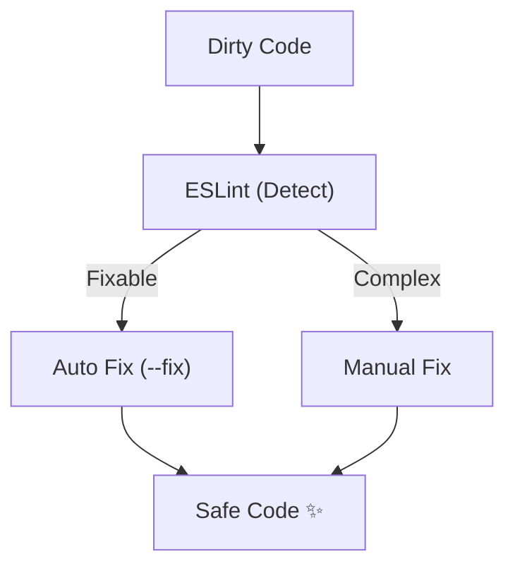

# 第10章：Lint導入（危ない書き方を減らす）👮‍♀️⚠️

### ねらい🎯




* 「動くけど危ない」書き方を、早めに見つけられるようになる🔍✨
* Lintの警告の読み方＆直し方に慣れる🧠💡
* “直せるものは自動で直す”流れを作る🤖🧹

---

### 今日のゴール🏁

* ESLintを入れて、`npx eslint .` が動く✅
* よくある警告を3つ以上直せる🔧✨
* VS Codeで「保存したら自動修正」ができるようになる💾🪄

---

## 1) Lintってなに？🧹🔍（フォーマットと何が違うの？）

* **フォーマッタ（Prettier）**：見た目を整える🎀（改行・インデント・クォートなど）
* **Linter（ESLint）**：危ない書き方を見つける👮‍♀️（未使用変数・到達不能コード・うっかりミス…）

ESLintは「バグの芽🌱」を早めに見つけるための“校閲さん”みたいな存在だよ📚✨
ちなみに最近のESLintは **Flat Config（`eslint.config.*`）が基本**で、移行ガイドでもその前提で説明されてるよ📌 ([ESLint][1])

---

## 2) まずは導入して動かす👣🛠️（最短ルート）

### Step 1: インストール📦

ターミナルでこれ👇（devDependenciesに入れる）

```bash
npm install --save-dev eslint @eslint/js typescript typescript-eslint
```

この入れ方は typescript-eslint の “Quickstart” で案内されている形だよ🧩 ([TypeScript ESLint][2])

---

### Step 2: 設定ファイルを作る📝

プロジェクト直下に **`eslint.config.mjs`** を作って、まずはこの形👇（そのままコピペOK）

```js
// @ts-check

import eslint from "@eslint/js";
import { defineConfig } from "eslint/config";
import tseslint from "typescript-eslint";

export default defineConfig(
  eslint.configs.recommended,
  tseslint.configs.recommended,
);
```

この最小構成で「ESLintおすすめ」＋「TypeScript向けおすすめ」が有効になるよ✅ ([TypeScript ESLint][2])

💡 `.mjs` にしておくと、`package.json` の `"type": "module"` を気にせず進めやすいよ（docsでも説明あり） ([TypeScript ESLint][2])

---

### Step 3: 実行してみる▶️

```bash
npx eslint .
```

docsでもこのコマンドが基本になってるよ🧪 ([TypeScript ESLint][2])

---

### Step 4: npm scriptsを用意（毎回ラクする）🧷

`package.json` に追加👇

```jsonc
{
  "scripts": {
    "lint": "eslint .",
    "lint:fix": "eslint . --fix"
  }
}
```

以後はこれでOK👇

* `npm run lint` 🔍
* `npm run lint:fix` 🪄（直せるものは自動修正）

---

## 3) VS Codeで“見える化”＋“保存で自動修正”👀🪄

### ESLint拡張機能🧩

VS Codeの **ESLint拡張（dbaeumer.vscode-eslint）** を入れると、エディタ内にその場で警告が出るよ⚠️✨
この拡張は Flat Config 周りも継続的に改善されていて、`eslint.useFlatConfig` の挙動も説明されてるよ📌 ([Visual Studio Marketplace][3])

### 保存時に自動で直す💾🧹

`.vscode/settings.json`（またはユーザー設定JSON）に👇

```jsonc
{
  "editor.codeActionsOnSave": {
    "source.fixAll.eslint": "explicit"
  }
}
```

`source.fixAll.eslint` は ESLint拡張が案内している “Auto Fix on Save” のやり方だよ🪄 ([GitHub][4])

---

## 4) まずは「警告の読み方」を覚える📣👓

ESLintの出力はだいたいこんな感じ👇

```text
src/sample.ts
  4:3  error  Unexpected 'debugger' statement  no-debugger
  6:9  error  'discount' is assigned a value but never used  @typescript-eslint/no-unused-vars
```

見るポイントは3つだけ💡

1. **場所**（`6:9` みたいな行:列）🧭
2. **メッセージ**（何がダメ？）🗣️
3. **ルール名**（`no-debugger` とか）🏷️

---

## 5) ビフォー／アフターで“3つ直す”練習🔧✨

### Before（ありがち危ないセット⚠️）

```ts
export function calcDiscount(price: number, coupon?: string) {
  const discount = price * 0.1; // 使ってない（unused）
  debugger; // 本番に残ると大事故💥

  if (coupon) {
    return price - price * 0.1;
  }

  return price;

  console.log("never"); // 到達不能（unreachable）
}
```

### After（挙動を変えずに安全化🛟）

```ts
export function calcDiscount(price: number, coupon?: string) {
  const discount = price * 0.1;

  if (coupon) {
    return price - discount;
  }

  return price;
}
```

直したこと🧠✨

* `debugger` を削除🧯
* 未使用変数は「使う」or「消す」🧹
* `return` の後ろ（到達不能）は消す✂️

---

## 6) ルールの強さを調整する🎚️（最初は“ゆるく”でもOK）

ESLintのルールはだいたいこの3段階👇

* `"off"`：無視🙈
* `"warn"`：警告（ビルドは止めない）⚠️
* `"error"`：エラー（CIで落としたい時）🚨

例：未使用引数は「先頭が `_` ならOK」にして、まずは warn で始める👇

```js
import eslint from "@eslint/js";
import { defineConfig } from "eslint/config";
import tseslint from "typescript-eslint";

export default defineConfig(
  eslint.configs.recommended,
  tseslint.configs.recommended,
  {
    rules: {
      "@typescript-eslint/no-unused-vars": ["warn", { argsIgnorePattern: "^_" }],
    },
  },
);
```

---

## 7) 既存コードが多いときの「現実的な導入」🧱🛟

### ① 生成物を見ない（まずこれ大事）🙅‍♀️

Flat Configでは `.eslintignore` を読まないので、無視したいものは設定に入れるのが基本だよ📌 ([ESLint][5])

```js
import eslint from "@eslint/js";
import { defineConfig } from "eslint/config";
import tseslint from "typescript-eslint";

export default defineConfig(
  { ignores: ["dist/**", "build/**", "coverage/**"] },
  eslint.configs.recommended,
  tseslint.configs.recommended,
);
```

### ② まずは “warn運用” → 慣れたら “error運用” にする👣

* 初日は warning を消すだけでも偉い👏✨
* 直せるところだけ `--fix` でコツコツ🪄
* 「あとで直す」は“いつか”になりがちなので、少しずつ前進が勝ち🏃‍♀️🌸

---

## 8) もう少し強くしたい人へ（次の一歩）🚀

typescript-eslint の docs では、次の追加もおすすめされてるよ👇

* `strict`：よりバグっぽいのを拾う🧯
* `stylistic`：見た目の一貫性（※フォーマッタとは別枠）🎀
  ([TypeScript ESLint][2])

```js
export default defineConfig(
  eslint.configs.recommended,
  tseslint.configs.recommended,
  tseslint.configs.strict,
  tseslint.configs.stylistic,
);
```

さらに「型情報を使うLint（強いけど少し重い）」もあって、`recommendedTypeChecked` と `parserOptions.projectService: true` みたいに設定するよ🧠🔍 ([TypeScript ESLint][6])

---

## 9) Prettierとの関係（ケンカさせない）🎀🤝

Prettier公式では「Prettierを“Lintのルール”として動かす系（例：eslint-plugin-prettier）は、基本おすすめではないよ」という注意が書かれてるよ📌 ([Prettier][7])

💡 つまり、雰囲気としては👇

* **Prettier**：整形担当🎀
* **ESLint**：危険検知担当👮‍♀️

---

## 10) （Windows向け）依存パッケージは“固定”が安心🔒🪟

過去に `eslint-config-prettier` が **Windows上でインストール時に動く悪性コード**を含む形で改ざんされた事例が報告されているよ（特定バージョンが対象）🧯 ([wiz.io][8])

最低限の自衛としては👇

* lockfile（`package-lock.json` 等）をコミットする📌
* 依存更新はまとめてやらず、差分を見ながら👀
* `npm audit` で確認する🔍

---

## ミニ課題✍️🌸（手を動かす！）

1. ESLintを導入して `npm run lint` を通す✅
2. `npm run lint:fix` を実行して、直った差分を確認👀✨
3. 警告を3つ、手で直す（例：unused / debugger / unreachable）🔧
4. `dist/**` を ignores して、生成物で警告が出ないようにする🧹
5. VS Codeで保存したら自動修正が走るのを確認💾🪄

---

## AI活用ポイント🤖✅（お願い方テンプレ）

### ① 警告の意味を“やさしく翻訳”してもらう🗣️💡

* 「このESLintエラーを、初心者向けに説明して😊
  直し方を3案出して。**挙動が変わる可能性**も一緒に教えて！」

### ② 直す前に“安全チェック観点”を出してもらう🛟

* 「この修正で壊れやすい点は？
  どんなテスト（入力例）を追加すれば安心？」

### ③ `--fix` で直らないやつの“手順”を刻んでもらう👣

* 「この警告を直す手順を、**1ステップずつ**に分けて書いて！」

最後にチェック✅✨

* 差分は小さい？👣
* `lint` は通る？👮‍♀️
* 型チェック・テストは通る？🧷🧪
* 動きは同じ？✅

[1]: https://eslint.org/docs/latest/use/configure/migration-guide "Configuration Migration Guide - ESLint - Pluggable JavaScript Linter"
[2]: https://typescript-eslint.io/getting-started/ "Getting Started | typescript-eslint"
[3]: https://marketplace.visualstudio.com/items?itemName=dbaeumer.vscode-eslint "
        ESLint - Visual Studio Marketplace
    "
[4]: https://github.com/microsoft/vscode-eslint?utm_source=chatgpt.com "microsoft/vscode-eslint"
[5]: https://eslint.org/docs/latest/use/configure/migration-guide?utm_source=chatgpt.com "Configuration Migration Guide"
[6]: https://typescript-eslint.io/getting-started/typed-linting/ "Linting with Type Information | typescript-eslint"
[7]: https://prettier.io/docs/integrating-with-linters?utm_source=chatgpt.com "Integrating with Linters"
[8]: https://www.wiz.io/vulnerability-database/cve/cve-2025-54313?utm_source=chatgpt.com "CVE-2025-54313 Impact, Exploitability, and Mitigation Steps"
