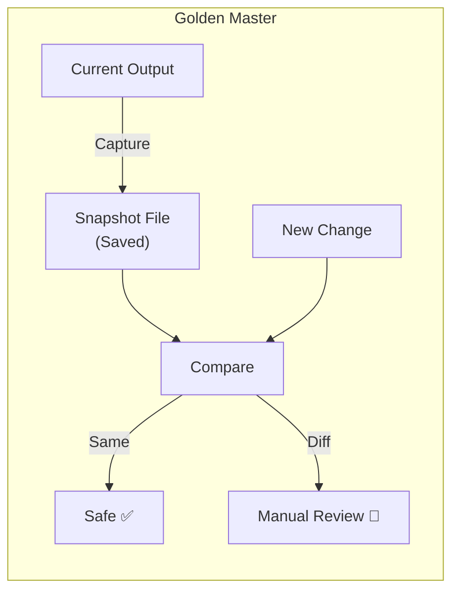
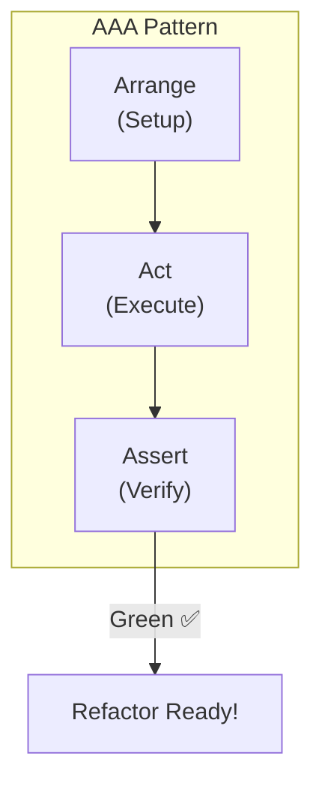

# 第12章：テストの最小導入（まず1本）🧪🥚

### ねらい🎯







* 「壊してない保証」を**テスト1本**で作る🛟✨
* リファクタ前に、安心して触れる“お守り”を置けるようになる🧿✅

---

### 今日のゴール🏁✨


✅ `npm run test` でテストが緑になる
✅ “重要な関数”に対して **ユニットテスト1本**を追加できる
✅ 変更しても自動でテストが走る状態を体験する🔁👀 ([Vitest][1])

---

## 1) 「まず1本」どれをテストする？🤔📌

テスト1本で効果が大きいのは、このへん👇

* **計算・変換・判定**みたいに「入出力がはっきり」してる関数🧮✨
* 間違うと痛い（料金・日付・権限・在庫…）💸🗓️🔐
* 触る回数が多い（よく修正される）🔁

目安はこれでOK👇
**正常系 1つ + 境界値 1つ + 異常系 1つ** = まずは勝ち🏆✨

---

## 2) Vitest を入れて、テストを動かす🧪⚙️

### 2-1. インストール📦

```bash
npm i -D vitest
```

### 2-2. `package.json` にスクリプト追加🧷


```json
{
  "scripts": {
    "test": "vitest",
    "test:run": "vitest run",
    "coverage": "vitest run --coverage"
  }
}
```

`vitest` は開発中は基本 **watch mode** で動いて、ファイルを直すと関連テストだけ賢く再実行してくれるよ🔁⚡ ([Vitest][1])
（CI では `vitest run` 相当になりやすい、って覚えておけばOK👌） ([Vitest][1])

---

## 3) サンプルで「1本テスト」を完成させよう🧩➡️✅

### 3-1. テスト対象の関数を用意する🧠

```ts
// src/shipping.ts
export function calcShippingFeeYen(subtotalYen: number, isRemoteArea: boolean): number {
  if (!Number.isFinite(subtotalYen) || subtotalYen < 0) {
    throw new Error("INVALID_SUBTOTAL");
  }

  if (subtotalYen >= 5000) {
    return isRemoteArea ? 500 : 0;
  }

  return isRemoteArea ? 800 : 300;
}
```

### 3-2. テストファイルを作る🧪📝


Vitest はファイル名に `.test.` か `.spec.` が入ってるものをテストとして拾うよ👀 ([Vitest][2])

```ts
// src/shipping.test.ts
import { describe, it, expect } from "vitest";
import { calcShippingFeeYen } from "./shipping";

describe("calcShippingFeeYen", () => {
  it("5000円以上なら通常エリアは送料無料になる", () => {
    expect(calcShippingFeeYen(5000, false)).toBe(0);
    expect(calcShippingFeeYen(12000, false)).toBe(0);
  });

  it("遠隔地は加算される", () => {
    expect(calcShippingFeeYen(5000, true)).toBe(500);
    expect(calcShippingFeeYen(4999, true)).toBe(800);
  });

  it("不正な小計はエラーにする", () => {
    expect(() => calcShippingFeeYen(-1, false)).toThrowError("INVALID_SUBTOTAL");
    expect(() => calcShippingFeeYen(Number.NaN, false)).toThrowError("INVALID_SUBTOTAL");
  });
});
```

### 3-3. 実行する▶️

```bash
npm run test
```

💡 緑✅になったら「守り」が置けた合図だよ〜！🛡️✨

---

## 4) よく使う “期待値” の書き方セット🧰✨

### 4-1. ふつうの値チェック🎯

* `toBe`（数値・文字列など）
* `toEqual`（オブジェクト/配列を中身で比較）

### 4-2. 例外（throw）をテストする⚠️


例外テストは **関数で包む**のがポイント！そうしないとエラーを捕まえられないよ🙅‍♀️ ([Vitest][3])

```ts
expect(() => someFn()).toThrowError("SOME_ERROR");
```

### 4-3. async の失敗（reject）をテストする🌩️


async は `rejects` を使うよ✨（Promise をちゃんとほどいて確認してくれる） ([Vitest][3])

```ts
// src/parseJsonAsync.ts
export async function parseJsonAsync(text: string): Promise<unknown> {
  try {
    return JSON.parse(text);
  } catch {
    throw new Error("INVALID_JSON");
  }
}
```

```ts
import { it, expect } from "vitest";
import { parseJsonAsync } from "./parseJsonAsync";

it("壊れたJSONは reject する", async () => {
  await expect(parseJsonAsync("{")).rejects.toThrowError("INVALID_JSON");
});
```

（`await` を忘れると “すり抜け” が起きやすいから注意〜！😵‍💫🧷）

---

## 5) まずは “守れる形” にするコツ👣🛡️

### 5-1. AAA で書く（超ラク）🧁


* Arrange：準備🍽️
* Act：実行🏃‍♀️
* Assert：確認✅

### 5-2. テスト名は「日本語の仕様書」📄✨


* ❌ `works`
* ✅ `5000円以上なら通常エリアは送料無料になる`
  あとから読む自分を助けるよ〜🫶💕

---

## 6) カバレッジは “おまけで1回” 見てみよ📊✨

```bash
npm run coverage
```

Vitest のカバレッジは **v8 がデフォルト**で、必要なら `istanbul` に切り替えもできるよ🧰 ([Vitest][4])
実行時に必要パッケージのインストールを促してくれることもあるよ👍 ([Vitest][4])

---

## ミニ課題✍️🌸（所要 15〜25分）

### 課題A：テスト1本を追加しよう🧪

1. 自分のプロジェクトから「計算・判定・変換」っぽい関数を1つ選ぶ🔍
2. **正常系/境界値/異常系** の3つを想像する🧠
3. `.test.ts` を作ってテストを書く✍️
4. `npm run test` を緑にする✅

### 合格チェック✅✨

* テストが1回で安定して通る？（たまに落ちない？）🎲❌
* 失敗したとき、何が壊れたか分かる名前になってる？📝
* 「この関数はこう動く」が読める？📖

---

## AI活用ポイント🤖📋✅

### 使いどころ1：テストケースの洗い出し🧠🔍

お願い例👇

* 「この関数の **正常系/境界値/異常系** のテストケースを10個出して。理由も添えて」
* 「入力の組み合わせが多いから、**最小セット**（バグが出やすい順）で並べて」

チェック観点✅

* 境界値（0、1、最大、ちょうど○○）が入ってる？🧷
* 異常系（null/undefined、NaN、負数、空文字）を想像してる？⚠️

### 使いどころ2：テストコードの下書き🧪📝

お願い例👇

* 「Vitest でこの関数のテストを書いて。`toThrowError` と `rejects` の使い分けも含めて」

チェック観点✅

* `throw` は `expect(() => fn())` になってる？（包めてる？） ([Vitest][3])
* async は `await expect(promise).rejects...` になってる？ ([Vitest][3])
* “それっぽい期待値”じゃなくて、ちゃんと仕様を見てる？👀

---

[1]: https://vitest.dev/guide/features "Features | Guide | Vitest"
[2]: https://vitest.dev/guide/?utm_source=chatgpt.com "Getting Started | Guide"
[3]: https://vitest.dev/api/expect.html "expect | Vitest"
[4]: https://vitest.dev/guide/coverage.html "Coverage | Guide | Vitest"
