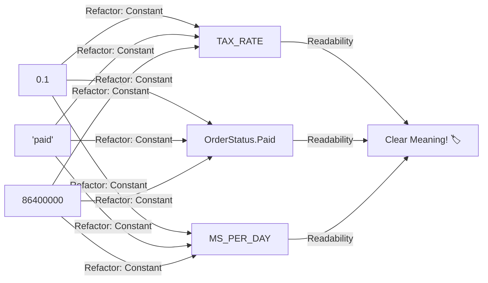
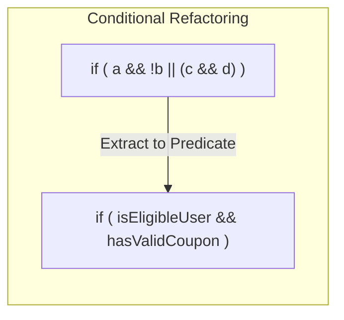

# 第24章：条件式のリファクタ（意図を名前にする）🧾➡️🏷️

### ねらい🎯






* 複雑な `if` を「日本語で読める」状態にする📖✨
* 条件の“意味”を **名前** にして、読み間違い・直し間違いを減らす🛡️💡
* ついでにテストもしやすくする🧪💖

---

### 今日の主役🌟：このタイプの `if` あるある😵‍💫

* `!`（否定）が多くて脳がバグる🌀
* `&&` と `||` が混ざって、優先順位が分からない😇
* 同じ条件があちこちに出てくる（コピペ臭）👃💦
* 条件の中に「つい処理」を混ぜちゃう（副作用）⚠️

---

### ビフォー👉：読めない条件式の例😵‍💫💥

```ts
type User = {
  id: string;
  isMember: boolean;
  age: number;
  country: "JP" | "US" | "KR" | "OTHER";
  studentId?: string | null;
  banned?: boolean;
};

type Coupon = {
  code: string;
  percent: number; // 0〜100
  expiresAt: Date;
  disabled?: boolean;
  minSubtotal?: number;
};

type Cart = {
  subtotal: number;
  containsDigitalOnly: boolean;
};

export function calcDiscountPercent(
  user: User | null,
  coupon: Coupon | null,
  cart: Cart,
  now: Date = new Date(),
): number {
  if (
    user &&
    !user.banned &&
    cart.subtotal > 0 &&
    (!cart.containsDigitalOnly || user.isMember) &&
    ((
      coupon &&
      !coupon.disabled &&
      coupon.expiresAt.getTime() > now.getTime() &&
      cart.subtotal >= (coupon.minSubtotal ?? 0)
    ) ||
      (user.isMember && user.age >= 18 && user.country !== "KR") ||
      (!!user.studentId && user.country === "JP" && user.age < 26))
  ) {
    if (coupon && !coupon.disabled) return coupon.percent;
    if (user.country === "JP" && user.studentId) return 10;
    return 5;
  }

  return 0;
}
```

「動くけど…読むのがつらい」やつ〜！🥲💦
しかも条件の中にルールが混ざってて、直すの怖い…🫠

---

## ゴールの形🏁：`if` が文章みたいに読める💖

### アフター✨（意図を名前にして、否定を減らす）

```ts
type User = {
  id: string;
  isMember: boolean;
  age: number;
  country: "JP" | "US" | "KR" | "OTHER";
  studentId?: string | null;
  banned?: boolean;
};

type Coupon = {
  code: string;
  percent: number;
  expiresAt: Date;
  disabled?: boolean;
  minSubtotal?: number;
};

type Cart = {
  subtotal: number;
  containsDigitalOnly: boolean;
};

export function calcDiscountPercent(
  user: User | null,
  coupon: Coupon | null,
  cart: Cart,
  now: Date = new Date(),
): number {
  if (!user) return 0;
  if (isBannedUser(user)) return 0;
  if (!hasPaidItems(cart)) return 0;
  if (!canCheckoutThisCart(user, cart)) return 0;

  const rule = decideDiscountRule(user, coupon, cart, now);
  return discountPercentByRule(rule, coupon);
}

function isBannedUser(user: User): boolean {
  return user.banned === true;
}

function hasPaidItems(cart: Cart): boolean {
  return cart.subtotal > 0;
}

function canCheckoutThisCart(user: User, cart: Cart): boolean {
  const needsMemberForDigitalOnly = cart.containsDigitalOnly;
  return !needsMemberForDigitalOnly || user.isMember;
}

type DiscountRule = "Coupon" | "JapaneseStudent" | "MemberAdult" | "None";

function decideDiscountRule(
  user: User,
  coupon: Coupon | null,
  cart: Cart,
  now: Date,
): DiscountRule {
  if (hasValidCoupon(coupon, cart, now)) return "Coupon";
  if (isJapaneseStudent(user)) return "JapaneseStudent";
  if (isMemberAdult(user)) return "MemberAdult";
  return "None";
}

function hasValidCoupon(coupon: Coupon | null, cart: Cart, now: Date): boolean {
  if (!coupon) return false;
  if (coupon.disabled === true) return false;
  if (coupon.expiresAt.getTime() <= now.getTime()) return false;

  const minSubtotal = coupon.minSubtotal ?? 0;
  return cart.subtotal >= minSubtotal;
}

function isJapaneseStudent(user: User): boolean {
  return user.country === "JP" && user.age < 26 && Boolean(user.studentId);
}

function isMemberAdult(user: User): boolean {
  return user.isMember && user.age >= 18 && user.country !== "KR";
}

function discountPercentByRule(rule: DiscountRule, coupon: Coupon | null): number {
  switch (rule) {
    case "Coupon":
      return coupon ? coupon.percent : 0;
    case "JapaneseStudent":
      return 10;
    case "MemberAdult":
      return 5;
    case "None":
      return 0;
  }
}
```

### 何が良くなった？😍

* `if` が **「落とす理由」から順に読める**（ガード節）🚦✨
* 条件の中身が **名前** になってるから意味が分かる🏷️💡
* ルール（割引の種類）が **文字列Union** で見える化されてる🧷✅
* テストしやすい（小さな関数が増えた）🧪🎀

---

## 手順（小さく刻む）👣🛟

「一気に完成形へ」じゃなくて、こう刻むと安全だよ〜🙆‍♀️💕

### Step 0: まず“守り”を置く🛡️

* 既存の挙動を固定するテストを **最低3つ** 置く🧪

  * クーポンOK → クーポンの%
  * 日本学生 → 10%
  * 何も該当なし → 0%

### Step 1: 条件を “部品” に分ける🧩

いきなり関数化しないで、まずは **変数（boolean）に分ける**のが超安全✨

例：

* `const hasUser = user !== null`
* `const isNotBanned = user && !user.banned`
* `const hasValidCoupon = ...`

### Step 2: “意味がある塊”を関数にする✂️📦

* `hasValidCoupon(...)`
* `isJapaneseStudent(...)`
* `canCheckoutThisCart(...)`
  みたいに、「読んだ瞬間わかる名前」にする🏷️🌸

### Step 3: 否定を減らす（超重要）❗️

* `!isNotBanned` みたいな二重否定は避ける🙅‍♀️
* `isBannedUser` / `canCheckout` みたいに **ポジティブ or ストレート**にする✨

### Step 4: `||` の塊は “ルール” にする🎛️

`(A) || (B) || (C)` は「どれか満たしたらOK」のルール集合だよね？
→ `decideDiscountRule(...)` みたいに“ルール判定”へ引っ越し🚚💨

### Step 5: 動作確認✅

* テスト🧪
* 型チェック🧷
* 実行して目視👀
* 差分が説明できるか📝

---

## ミニ講座💡：De Morgan（ド・モルガン）で否定を整理🧹✨

否定が絡んでグチャるときは、これで整うこと多いよ〜🧠✨

* `!(A || B)` → `!A && !B`
* `!(A && B)` → `!A || !B`

例：
「会員じゃない **かつ** デジタル限定」みたいな条件が出たら、
読みやすい形に変形できるかチェックしてね👀✨

---

## “やっちゃダメ”注意ポイント⚠️🧨

### 1) 条件の中に副作用を入れない🙅‍♀️

```ts
if (user && saveLog(user)) { ... } // こういうのは地雷💣
```

条件判定は「見るだけ」にしておくと事故らない🛟✨

### 2) 時刻・乱数みたいな“ブレるもの”は引数で渡す⏰

`new Date()` を関数の奥で呼ぶとテストが不安定になりやすい🥲
例みたいに `now` を渡すと安定するよ🧪💕

### 3) “名前”は仕様書📄✨

`isValid` とか `check` とか曖昧なのは、未来の自分が泣く😭
「何が」「どんな条件で」trueになるかが伝わる名前が最強🏷️🌈

---

## ミニ課題✍️🌟（3問）

### 課題1：まずは変数で分解してみよう🧩

次の条件を、boolean変数4〜6個に分けてね💡

```ts
if (user && !user.banned && (isHoliday || user.isMember) && !(cart.subtotal <= 0)) {
  // ...
}
```

### 課題2：否定を減らそう🚦

`!(cart.subtotal <= 0)` を読みやすくしてみよう✨
（ヒント：シンプルな不等号へ🔁）

### 課題3：ルール判定を関数へ✂️📦

`(A) || (B) || (C)` を `decideXxxRule()` にして、戻り値を Union 型にしてみよう🧷✅

---

## AI活用ポイント🤖✨（お願い方＋チェック観点✅）

### 1) 条件の“意味”に名前をつけてもらう🏷️

お願い例：

* 「この条件式を、意味のある boolean 変数に分解して。変数名は英語で、コメントに日本語の意味もつけて✍️」

チェック観点✅

* 変数名が **曖昧じゃない**（`flag`/`ok`/`valid` だけ みたいなのはNG）🙅‍♀️
* 1変数がデカすぎない（“1つの意図”になってる）👀

### 2) De Morgan 変形の候補を出してもらう🧠

お願い例：

* 「この条件式、否定が多いので De Morgan で読みやすい形に変形して候補を2案出して✨」

チェック観点✅

* 変形後の意味が変わってない（テストで守る🧪）

### 3) テストケースを列挙してもらう🧪

お願い例：

* 「`decideDiscountRule` のテストケースを、境界値（年齢・期限・金額）を意識して10個出して📋」

チェック観点✅

* “境界”（例：`expiresAt == now`、`subtotal == minSubtotal`）が入ってるか🧷

---

## 2026-01時点のツール小ネタ🧰✨

* TypeScript の最新リリースとして `v5.9.3` が公開されているよ📌 ([GitHub][1])
* ESLint は `v10.0.0-rc.1` がリリースノートとして出てるよ（RCなので移行は慎重に🧯） ([ESLint][2])
* Prettier は `3.8.0` のブログが出てるよ🧼✨ ([prettier.io][3])
* Vitest は `v4.0.18` がリリースとして見えてるよ🧪✨（βも並走中） ([GitHub][4])

---

## まとめ🧁✨

* 条件式は「意味を名前にする」と一気に読める🏷️📖
* 否定は減らす（できればガード節で早期return）🚦✨
* `||` の集合は「ルール判定」に分離して、Union型で見える化🧷✅
* テスト🧪＋小さく刻む👣で、安全に進めよう🛟💖

[1]: https://github.com/microsoft/typescript/releases "Releases · microsoft/TypeScript · GitHub"
[2]: https://eslint.org/blog/2026/01/eslint-v10.0.0-rc.1-released/?utm_source=chatgpt.com "ESLint v10.0.0-rc.1 released"
[3]: https://prettier.io/blog/2026/01/14/3.8.0?utm_source=chatgpt.com "Prettier 3.8: Support for Angular v21.1"
[4]: https://github.com/vitest-dev/vitest/releases "Releases · vitest-dev/vitest · GitHub"
