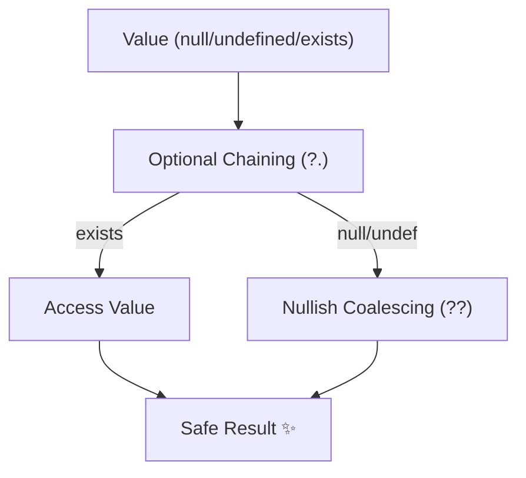

# 第31章：null/undefined整理②（安全な書き方）🛟🧷

### ねらい🎯

* `null/undefined` が混ざっても**落ちない**書き方を身につける🧯✨
* 「とりあえず `!`」を卒業して、**安全に読みやすく**直せるようになる🎓🧷
* “デフォルト値”と“異常扱い”を使い分けて、仕様ブレを減らす🧭💡

> 参考：現行の最新は TypeScript 5.9 系（npm / 公式Downloadページで “currently 5.9”）で、6.0 は 7.0 への橋渡しとして案内されています。([TypeScript][1])

---

### 今日のゴール✅

この章が終わったら、次ができるようになるよ🌸

* `?.` と `??` を使って、**安全アクセス＋デフォルト**が書ける🧷🛟
* 「無いなら無いでOK」なのか「無いのはエラー」なのかを**コードで表現**できる🚦✨
* 配列・辞書・オプショナルプロパティ周りの “うっかりundefined” を減らせる🧺🧹

---




## まず覚える！安全な3点セット🧰✨


### ① オプショナルチェーン `?.`（無いならそこで止まる）⛔️➡️🫧


* `a?.b` / `a?.[0]` / `a?.()` みたいに書けるよ🙂
* `a` が `null/undefined` なら、**例外を投げずに `undefined` になる**🛟
  ([MDN Web Docs][2])

---

### ② Null合体 `??`（“0”や“空文字”は尊重する）🫶🔢

* 左が `null` または `undefined` のときだけ右を使うよ🧷
* `||` と違って、`0` や `""` を「無い」扱いしないのがポイント✨
  ([MDN Web Docs][3])

---

### ③ ガード節（早期return）🚦✨

「無いなら進まない」を最初に書いて、ネストも事故も減らす💪

* 例：`if (user == null) return ...;`（`null` と `undefined` 両方をまとめて判定できるよ）🧠

---

## パターン集（コピペしてOK）📚💕

### パターンA：安全アクセスだけしたい（落ちたくない）🧷

```ts
const city = user?.address?.city; // string | undefined
```

* “無ければ undefined” が自然な場面で強い🫧

---

### パターンB：安全アクセス＋デフォルト値（UI表示でよく使う）🖼️✨

```ts
const displayName = user?.profile?.nickname ?? "ゲスト";
```

* `nickname = ""`（空文字）を「本人が空にした」扱いしたいなら `??` が正解👌

---

### パターンC：`||` を `??` に直して “0事故” を防ぐ🔧🛟


**ビフォー（地味にバグる）**😵

```ts
const timeoutMs = config.timeoutMs || 3000; // timeoutMs=0 が潰れる
```

**アフター（仕様どおり）**😊

```ts
const timeoutMs = config.timeoutMs ?? 3000;
```

* `||` は「falsy（0/""/false）」も右に行くから注意⚠️
  ([MDN Web Docs][3])

---

### パターンD：デフォルト値を“代入”したい `??=`（設定系に便利）🧰✨

```ts
type Options = { retries?: number | null };

function normalize(o: Options) {
  o.retries ??= 3;   // null/undefined のときだけ 3 を入れる
  return o;
}
```

([MDN Web Docs][4])

---

### パターンE：「無いのはエラー」なら、最初に止める🚨


「無いのに進める」より、**分かりやすいエラー**にする方が安全なことも多いよ🧯

```ts
function requireUser(user: { id: string } | null | undefined) {
  if (user == null) {
    throw new Error("user is required");
  }
  return user; // ここから user は必ず存在
}
```

---

### パターンF：`!`（non-null assertion）は“最後の手段”にする🙅‍♀️


```ts
user!.profile!.nickname! // ← これ、実行時は普通に落ちる可能性ある😭
```

* `!` は「型だけ黙らせる」ので、事故が**実行時に来る**😱
* まずは **ガード節**か **`?.` `??`** で直すのが基本🧷

---

## 例題：落ちやすいコードを安全化しよう🛠️💕

### お題：クーポン割引を表示したい🎟️✨

「ユーザーにクーポンがあれば割引率を、無ければ 0% を出したい」

**ビフォー（落ちる＆バグりやすい）**💥

```ts
type Coupon = { discountPercent?: number | null };
type User = { coupons?: Coupon[] | null };

export function getDiscountPercent(user: User | null) {
  const first = user!.coupons![0];          // 💥 user/coupons が無いと落ちる
  return first.discountPercent || 0;        // 😵 0% が “無い” 扱いになる
}
```

**アフター（落ちない＆仕様どおり）**🛟✨

```ts
type Coupon = { discountPercent?: number | null };
type User = { coupons?: Coupon[] | null };

export function getDiscountPercent(user: User | null): number {
  const first = user?.coupons?.at(0);              // 無ければ undefined
  return first?.discountPercent ?? 0;              // null/undefined だけ 0
}
```

ここが超大事ポイント💡

* 「クーポンが無ければ 0%」＝**正常系のデフォルト**だから `?? 0` が自然🌸
* 「絶対クーポンが必要」な仕様なら、上のパターンEみたいに **throw** を選ぶ方が安全🚨

---

## “無い”をどう扱う？ミニ方針（迷ったらこれ）🧭✨


### 1) 表示・UI：無いならそれっぽく埋める🖼️

* `?? "未設定"` / `?? 0` / `?? []` が多いよ😊

### 2) ビジネスルール：無いなら止める🚨

* 期待してる入力が無いなら、早めに **throw** / **return** で止める
* バグの位置が分かりやすくなる🧯

---

## tsconfigで “うっかりundefined” を早めに潰す🧷👮‍♀️

### 特に効く3つ⚡（プロジェクトが許すならON推奨）

* `strictNullChecks`：`null/undefined` をちゃんと型で扱う🧷
* `noUncheckedIndexedAccess`：`arr[i]` や `obj[key]` に `| undefined` を足してくれる（取りこぼし減る）🛟
* `exactOptionalPropertyTypes`：`x?: T` と `x?: T | undefined` を区別してくれて、曖昧さが減る🎯

公式のフラグ説明（TSConfig / compiler options）にも載ってるよ📘([TypeScript][5])

---

## 手順（小さく刻む）👣🛟


1. **落ちる場所を特定**（例：`Cannot read properties of undefined`）🔍
2. その場所に「無いならどうする？」を決める🧭

   * デフォルトにする？（`??`）
   * そこで終了？（ガード節）
   * エラーにする？（throw）
3. **`!` を外して**、`?.` / `??` / ガード節で置き換える🧷✨
4. 型チェック＆テストで確認✅🧪
5. “同じ悩み”が他にもないか検索して、同パターンでまとめて直す🔎🧹

---

## ミニ課題✍️🌸（15〜25分）

### 課題1：`||` を `??` に直して仕様バグを消す🧯

次のコードを、`0` や `""` が潰れないように直してね🙂

```ts
export function normalize(input: { retries?: number; label?: string }) {
  const retries = input.retries || 3;
  const label = input.label || "default";
  return { retries, label };
}
```

---

### 課題2：ガード節でネストを減らす🚦✨

```ts
export function getFirstTag(user?: { tags?: string[] }) {
  if (user) {
    if (user.tags) {
      if (user.tags.length > 0) {
        return user.tags[0];
      }
    }
  }
  return "no-tag";
}
```

* “早期return” でスッキリさせてね👣✨

---

### 課題3：`!` を卒業する🎓🧷

```ts
type Profile = { nickname?: string | null };
export function hello(p?: Profile) {
  return "Hi " + p!.nickname!.toUpperCase();
}
```

* 落ちない形にして、`nickname` が無い時は `"Hi guest"` にしてみよう😊

---

## AI活用ポイント🤖✅（お願い方＋チェック観点）

### 便利なお願い方（そのまま投げてOK）📝

* 「この関数、`null/undefined` で落ちる可能性を列挙して、**安全化パターンを3案**ください。`!` は使わないで」🤖🛟
* 「`||` を使ってるデフォルト設定を、`??` に直すべき箇所がある？理由も」🤖🔍
* 「このコードをガード節でリファクタして。**挙動は変えない**で、差分は小さく」🤖👣

### AIの提案を採用する前のチェック✅

* `0` / `""` / `false` の意味が潰れてない？🔢🫧
* “無い”を `throw` にすべき仕様じゃない？🚨
* `?.` の結果が `undefined` になって、その後で落ちない？（`toUpperCase()` とか）💥
* 型がちゃんと絞れてる？（`if (x == null) return;` の後は `x` が非null）🧷✨

---

## まとめ🧁✨

* **落ちない基本形**は `?.` ＋ `??` ＋ ガード節🚦🛟
* デフォルトにするか、止めるか、エラーにするかを**先に決める**と迷わない🧭
* `||` は便利だけど “0/空文字” を潰すので、デフォルト戦略は `??` が安心🫶([MDN Web Docs][3])

[1]: https://www.typescriptlang.org/download/?utm_source=chatgpt.com "How to set up TypeScript"
[2]: https://developer.mozilla.org/en-US/docs/Web/JavaScript/Reference/Operators/Optional_chaining?utm_source=chatgpt.com "Optional chaining (?.) - JavaScript - MDN Web Docs - Mozilla"
[3]: https://developer.mozilla.org/en-US/docs/Web/JavaScript/Reference/Operators/Nullish_coalescing?utm_source=chatgpt.com "Nullish coalescing operator (??) - JavaScript - MDN Web Docs"
[4]: https://developer.mozilla.org/en-US/docs/Web/JavaScript/Reference/Operators/Nullish_coalescing_assignment?utm_source=chatgpt.com "Nullish coalescing assignment (??=) - JavaScript | MDN"
[5]: https://www.typescriptlang.org/tsconfig/?utm_source=chatgpt.com "TSConfig Reference - Docs on every TSConfig option"
