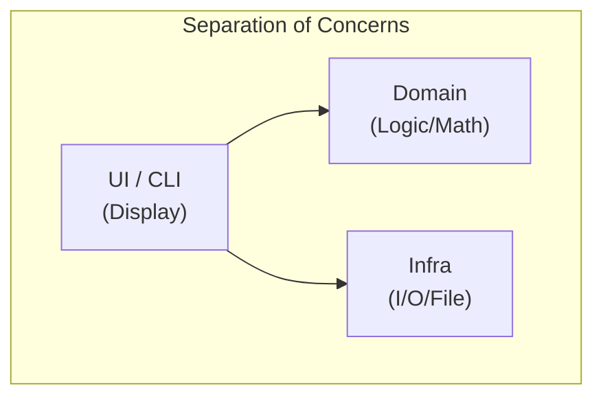
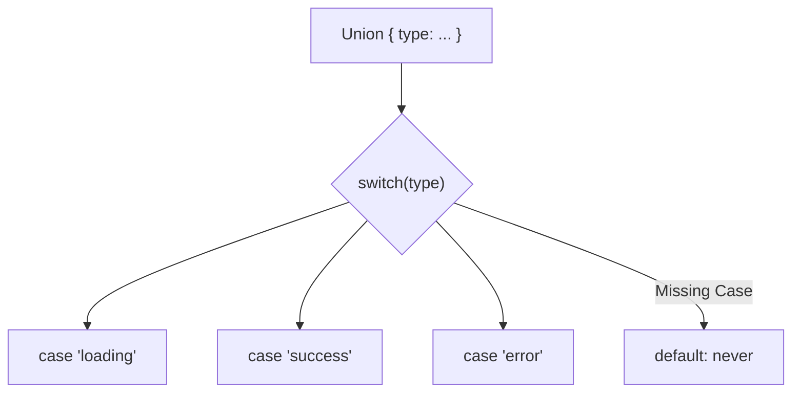

# 第36章：判別可能Union（switchの取りこぼし防止）🧷✅

## ねらい🎯

* 「分岐の抜け」を**コンパイルエラー**で止められるようになる✅
* `switch` で **型の絞り込み（narrowing）**が効く気持ちよさを体験する😆✨
* 「ありえない状態」を型で作れなくして、バグの芽をつむ🌱🛡️

---

## 今日のキーワード🧩

* **判別可能Union（Discriminated Union）**：共通のタグ（例：`type` / `kind`）で区別できるUnion型🧷
* **網羅性チェック（exhaustiveness check）**：分岐漏れがあったらコンパイルで落とす仕組み✅
* **`never`**：ここに来るのは「ありえない」＝来たら分岐漏れ💥 ([TypeScript][1])
* **`satisfies`**：型を“満たしてるか”だけチェックして、値の情報はできるだけ保つ✨ ([Zenn][2])

---

## まず結論💡：こう書けると勝ち🏆

「タグで分ける」＋「最後に `never` で止める」
これで **ケース追加漏れ**が即バレするよ👀✅ ([TypeScript][1])

---

## ビフォー：よくある「取りこぼし地雷」💣😵

`status` が文字列で、必要なプロパティが「なんとなく optional」になってるパターン。
こうなると **ありえない状態**が作れちゃう…🥲

```typescript
// ❌ ビフォー：状態とデータがふわっとしてる
type ApiResponse = {
  status: "loading" | "success" | "error";
  data?: { userName: string };
  errorMessage?: string;
};

function render(res: ApiResponse): string {
  switch (res.status) {
    case "loading":
      return "Loading... ⏳";
    case "success":
      // ここ、dataが無い可能性が残る（実行時クラッシュの匂い👃）
      return `Hello, ${res.data!.userName} 👋`;
    // 😱 "error" を書き忘れても、普通にビルド通っちゃうことがある…
  }

  return "???";
}
```

---

## アフター：判別可能Unionで「ありえない状態」を消す🧷✨






ポイントはこれ👇

* 全パターンに共通タグ（ここでは `type`）を持たせる🏷️
* タグごとに「必要なプロパティ」を固定する📌
* `switch` の最後で `never` を使って **網羅性チェック**する✅ ([TypeScript][1])

```typescript
// ✅ アフター：判別可能Union（Discriminated Union）
type ApiResponse =
  | { type: "loading" }
  | { type: "success"; data: { userName: string } }
  | { type: "error"; errorMessage: string };

// 便利：neverチェック用の小さな関数🧯
function assertNever(x: never): never {
  throw new Error(`Unexpected object: ${JSON.stringify(x)}`);
}

function render(res: ApiResponse): string {
  switch (res.type) {
    case "loading":
      return "Loading... ⏳";

    case "success":
      // ✅ ここでは res.data が必ずある！（型が絞れてる🧷）
      return `Hello, ${res.data.userName} 👋`;

    case "error":
      return `Error: ${res.errorMessage} 💥`;

    default:
      // ✅ ここに来たら「分岐漏れ」＝コンパイルで怒られる😤
      return assertNever(res);
  }
}
```

この「switchでタグを見ると、中の型が自動で絞られる」動きが判別可能Unionの強みだよ🧷🔍 ([TypeScript][3])

---

## 取りこぼしがどう防げるの？👀✅（体験してみよう）

たとえば `ApiResponse` に新しい状態を追加したとする👇

```typescript
type ApiResponse =
  | { type: "loading" }
  | { type: "success"; data: { userName: string } }
  | { type: "error"; errorMessage: string }
  | { type: "maintenance"; until: string }; // 🆕追加
```

この瞬間、`render()` の `default: assertNever(res)` が効いて、
「`maintenance` の case が無いよ！」ってコンパイルで止まる✅🧷
（＝本番で「未対応のまま」出荷しにくくなる🚚💨） ([TypeScript][1])

---

## `satisfies` でスマートに網羅性チェックする方法✨🪄

「関数を作りたくないな〜」って時の書き方。
`default` で `satisfies never` を使って **型だけ**で止める感じ💡 ([Zenn][2])

```typescript
function render(res: ApiResponse): string {
  switch (res.type) {
    case "loading":
      return "Loading... ⏳";
    case "success":
      return `Hello, ${res.data.userName} 👋`;
    case "error":
      return `Error: ${res.errorMessage} 💥`;
    default: {
      // ✅ ここが never じゃないとコンパイルエラーになる
      const _exhaustiveCheck = res satisfies never;
      return _exhaustiveCheck;
    }
  }
}
```

---

## さらに安全に：Lintで「default禁止（ただし例外あり）」👮‍♀️✅

チーム開発だと、`default` を雑に書いて「取りこぼし隠し」しがち😇💦
そこで ESLint の **`@typescript-eslint/switch-exhaustiveness-check`** を使うと、
Unionに対する `switch` の網羅性をチェックしてくれるよ✅ ([blog.dennisokeeffe.com][4])

（※ルールの細かい挙動は設定次第だけど、「分岐漏れをLintでも早期発見」できるのが嬉しい✨）

---

## 手順（小さく刻む）👣🛟

### 1) 「状態」を列挙する📝

* 例：`loading / success / error` みたいに、まず言葉で出す🗣️✨

### 2) タグ名を決める🏷️

* よくある：`type` / `kind` / `status`
* おすすめは **`type` or `kind`**（「種類」感が強い）👍

### 3) Union型を作る🧷

* 各ケースに必要なプロパティを「必須」にする📌

### 4) 分岐はタグで `switch` する🔀

* `switch (res.type)` みたいに書く

### 5) 最後に網羅性チェックを入れる✅

* `assertNever(res)` か `satisfies never` のどっちかでOK🙆‍♀️

### 6) ケースを1個増やして「エラーが出る」体験👀

* ここ、めちゃ大事！「守りが効いてる感」が出る💪✨

---

## ミニ課題✍️🌸

### 課題A：ケース追加でコンパイルエラーを出してみよう👀

1. `ApiResponse` に `{ type: "maintenance"; until: string }` を追加🆕
2. `render()` がコンパイルエラーになるのを確認✅
3. `case "maintenance":` を足して直す🔧✨

### 課題B：別テーマで作ってみよう🎮🍔

どれか1つ選んで判別可能Union化してね👇

* 注文状態：`created / paid / shipped / canceled` 📦
* 画面状態：`idle / submitting / success / failure` 🖥️
* 認証状態：`guest / user / admin` 🔐

---

## AI活用ポイント🤖✅（お願い方＋チェック観点）

### お願い方の例📝

* 「この状態遷移に必要な `type` の候補を出して」🏷️
* 「判別可能Unionに直して、`switch` を網羅性チェック付きにして」🧷✅
* 「新しいケースを追加した時に、どこが壊れるかも教えて」👀

### チェック観点✅

* タグが **リテラル型**（`"success"` みたいに固定）になってる？🏷️
* `default` が「雑な握りつぶし」になってない？😇
* `never` チェックが効いて「追加漏れが止まる」状態？🛡️

---

## よくあるつまづき🧯💦

* **タグがバラバラ**（`kind` と `type` が混在）→ 統一しよう🏷️
* **`default` で何でも返しちゃう** → 取りこぼしが隠れる🙈
* **optional地獄**（`data?` だらけ）→ 判別可能Unionで必須に寄せる📌
* **外部入力は型だけじゃ守れない** → 入口でバリデーション（型ガード等）も考える🧱

---

## まとめ🧁✨

* 判別可能Unionは「状態」をきれいに表現して、**ありえない状態を消す**🧷
* `switch`＋`never` で **分岐漏れがコンパイルで止まる**✅ ([TypeScript][1])
* `satisfies never` を使うと、よりスッキリ書けることもあるよ🪄 ([Zenn][2])

[1]: https://www.typescriptlang.org/docs/handbook/unions-and-intersections.html?utm_source=chatgpt.com "Handbook - Unions and Intersection Types"
[2]: https://zenn.dev/nkzn/articles/exhaustive-check-with-satisfies?utm_source=chatgpt.com "TypeScriptのexhaustiveness checkをsatisfiesで簡単に書く"
[3]: https://www.typescriptlang.org/docs/handbook/2/narrowing.html?utm_source=chatgpt.com "Documentation - Narrowing"
[4]: https://blog.dennisokeeffe.com/blog/2022-08-25-discriminated-unions-in-typescript?utm_source=chatgpt.com "Discriminated Unions In Typescript - Dennis O'Keeffe"
