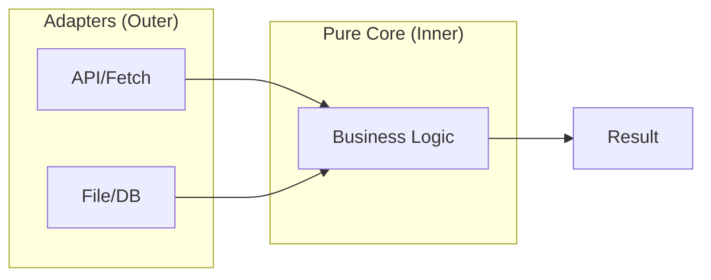
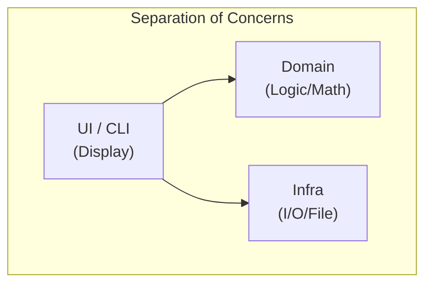

# 第37章：関心の分離（SoC）入門：混ぜないだけで勝てる🎭✨

### ねらい🎯

* 「ごちゃ混ぜコード」を見つけられるようになる👀💡
* **表示（UI）／計算（ロジック）／保存（I/O）**を分けるコツを体に覚えさせる🧩✨
* 分けた結果、「直しやすい・テストしやすい」形に近づける🧪🛟

---

## 1. SoCってなに？🤔🎭








**SoC（Separation of Concerns＝関心の分離）**は、ざっくり言うと👇

* 1つの場所に「別の種類の仕事」を混ぜない🙅‍♀️
* それぞれの仕事を、**担当ごとに置き場所を分ける**📦📦📦

ここでいう「仕事（関心）」の例はこんな感じ👇

* 画面に出す（console/log、UI表示）🖥️🗣️
* 計算する（料金計算、判定、ルール）🧮📏
* 保存する／通信する（ファイル、DB、API）💾🌐

混ざるとどうなる？😵‍💫
→ ちょっと直しただけで、**別のところが壊れる**＆**テストが面倒**＆**読むのもしんどい**…の三重苦になりがち💥

---

## 2. 「混ざってる」サイン👃💦（超よくある）

次が出たら「SoCの出番」かも👇

* 1つの関数に **console.log / fetch / fs** がいっぱいある🌀
* ルール（税率・送料・割引）と表示文言が同じ場所にいる🧷💬
* 例外処理やログが、計算の真ん中をぐちゃぐちゃにしてる😵
* 「テストしたいのに、毎回ファイル読んだりAPI叩いたりしないと無理」🧪🚫

---

## 3. 例題：全部盛り1ファイル地獄から脱出🧟‍♀️➡️🧚‍♀️

### Before（ごちゃ混ぜ）😵‍💫


* 読み込み（I/O）💾
* 計算（ロジック）🧮
* 表示（UI）🖥️
  ぜんぶ一緒！

```ts
// placeOrder.ts（Before）
import { readFile, writeFile } from "node:fs/promises";

type Item = { name: string; price: number; qty: number };
type Order = { userId: string; isMember: boolean; items: Item[] };

const TAX_RATE = 0.1;

async function main() {
  const json = await readFile("order.json", "utf-8"); // I/O
  const order = JSON.parse(json) as Order;            // 変換

  // バリデーションっぽい何か（中途半端）
  if (!order.items?.length) {
    console.log("カートが空だよ🥲"); // UI
    return;
  }

  // 計算（ビジネスルール）と UI が混ざり始める…
  let subtotal = 0;
  for (const item of order.items) {
    subtotal += item.price * item.qty;
  }

  const shipping = subtotal >= 5000 ? 0 : 500; // 送料ルール
  const discount = order.isMember ? Math.floor(subtotal * 0.05) : 0; // 会員割引
  const taxed = Math.floor((subtotal - discount) * TAX_RATE);
  const total = subtotal - discount + taxed + shipping;

  console.log("🧾 注文内容"); // UI
  for (const item of order.items) {
    console.log(`- ${item.name} x${item.qty} = ${item.price * item.qty}円`);
  }
  console.log(`小計: ${subtotal}円`);
  console.log(`割引: -${discount}円`);
  console.log(`税: ${taxed}円`);
  console.log(`送料: ${shipping}円`);
  console.log(`合計: ${total}円 🎉`);

  const receipt =
    `User: ${order.userId}\n` +
    `Subtotal: ${subtotal}\nDiscount: ${discount}\nTax: ${taxed}\nShipping: ${shipping}\nTotal: ${total}\n`;

  await writeFile("receipt.txt", receipt, "utf-8"); // I/O
  console.log("receipt.txt を保存したよ📄💾"); // UI
}

main().catch((e) => {
  console.error("失敗したよ😭", e); // UI
});
```

この状態のつらさ😇

* 計算だけテストしたいのに、ファイルやconsoleが絡む🧪💥
* 表示を変えたいだけなのに、計算部分に触れて壊しやすい🫠
* 保存先変えたいだけなのに、mainの真ん中を編集する羽目😵

---

## 4. After：3つに分ける📦✨（表示／計算／保存）


基本の分け方はこれ👇

* **domain（計算・ルール）** 🧠🧮
* **infra（保存・読み込み）** 💾🔌
* **ui（表示・入口）** 🖥️🚪

フォルダ例📁✨

```txt
src/
  domain/
    pricing.ts
  infra/
    orderFileStore.ts
  ui/
    cli.ts
```

### 4.1 domain：計算は「純粋に」🧠🧮


ポイントはこれ👇
**console / fs / 日付 / 乱数**みたいな“外の世界”を触らない🙅‍♀️🌍

```ts
// src/domain/pricing.ts
export type Item = { name: string; price: number; qty: number };
export type PricingInput = { isMember: boolean; items: Item[] };

export type PricingBreakdown = {
  subtotal: number;
  discount: number;
  tax: number;
  shipping: number;
  total: number;
};

const TAX_RATE = 0.1;

export function calcSubtotal(items: Item[]): number {
  return items.reduce((sum, it) => sum + it.price * it.qty, 0);
}

export function calcShipping(subtotal: number): number {
  return subtotal >= 5000 ? 0 : 500;
}

export function calcDiscount(subtotal: number, isMember: boolean): number {
  return isMember ? Math.floor(subtotal * 0.05) : 0;
}

export function calcTax(amountAfterDiscount: number): number {
  return Math.floor(amountAfterDiscount * TAX_RATE);
}

export function calcTotal(input: PricingInput): PricingBreakdown {
  const subtotal = calcSubtotal(input.items);
  const discount = calcDiscount(subtotal, input.isMember);
  const afterDiscount = subtotal - discount;
  const tax = calcTax(afterDiscount);
  const shipping = calcShipping(subtotal);
  const total = afterDiscount + tax + shipping;

  return { subtotal, discount, tax, shipping, total };
}
```

### 4.2 infra：ファイルの読み書きだけ💾📄

I/O はここに隔離〜！🚧✨

```ts
// src/infra/orderFileStore.ts
import { readFile, writeFile } from "node:fs/promises";
import type { Item } from "../domain/pricing";

export type Order = { userId: string; isMember: boolean; items: Item[] };

export async function loadOrder(path: string): Promise<Order> {
  const json = await readFile(path, "utf-8");
  return JSON.parse(json) as Order;
}

export async function saveReceipt(path: string, receipt: string): Promise<void> {
  await writeFile(path, receipt, "utf-8");
}
```

### 4.3 ui：入口（引数・表示）だけ🖥️🚪

ここは「組み立て担当」🧩✨
（読んで→計算して→表示して→保存して、を順番に呼ぶ）

```ts
// src/ui/cli.ts
import { calcTotal } from "../domain/pricing";
import { loadOrder, saveReceipt } from "../infra/orderFileStore";

function formatReceipt(userId: string, r: ReturnType<typeof calcTotal>): string {
  return [
    `User: ${userId}`,
    `Subtotal: ${r.subtotal}`,
    `Discount: ${r.discount}`,
    `Tax: ${r.tax}`,
    `Shipping: ${r.shipping}`,
    `Total: ${r.total}`,
    "",
  ].join("\n");
}

export async function run() {
  const order = await loadOrder("order.json");

  if (!order.items?.length) {
    console.log("カートが空だよ🥲");
    return;
  }

  const result = calcTotal({ isMember: order.isMember, items: order.items });

  console.log("🧾 注文内容");
  for (const item of order.items) {
    console.log(`- ${item.name} x${item.qty} = ${item.price * item.qty}円`);
  }
  console.log(`合計: ${result.total}円 🎉`);

  const receipt = formatReceipt(order.userId, result);
  await saveReceipt("receipt.txt", receipt);
  console.log("receipt.txt を保存したよ📄💾");
}

// node から実行する想定
run().catch((e) => console.error("失敗したよ😭", e));
```

---

## 5. 何がうれしいの？🥳✨（SoCのご褒美）

### ✅ 「計算だけ」テストが超ラクになる🧪


domain が純粋になったので、I/Oなしでテストできる🎉
（最近のTSプロジェクトでは Vitest を使う流れもかなり定番だよ〜📌）([Vitest][1])

```ts
// src/domain/pricing.test.ts
import { describe, it, expect } from "vitest";
import { calcTotal } from "./pricing";

describe("calcTotal", () => {
  it("会員なら5%割引、送料は条件で変わる🚚", () => {
    const r = calcTotal({
      isMember: true,
      items: [
        { name: "A", price: 1000, qty: 2 }, // 2000
        { name: "B", price: 1500, qty: 1 }, // 1500
      ],
    });

    expect(r.subtotal).toBe(3500);
    expect(r.discount).toBe(Math.floor(3500 * 0.05));
    expect(r.shipping).toBe(500); // 5000未満
    expect(r.total).toBe(r.subtotal - r.discount + r.tax + r.shipping);
  });
});
```

### ✅ 変更が安全になる🛟

* 表示だけ変える：uiだけ触ればOK🖥️
* ルール変える：domainだけ触ればOK🧮
* 保存先変える：infraだけ触ればOK💾

---

## 6. 手順（小さく刻む）👣✨


「いきなり分割」じゃなくて、こう刻むと安全だよ〜🧷

1. **関心ごとにマーカーを付ける**🏷️

   * UI（console/表示文言）
   * I/O（fs/fetch/DB）
   * ルール（税・割引・送料）
2. **計算の塊をExtractして domain に移す**✂️📦

   * まずは `calcSubtotal` みたいな小さい関数から
3. **ui は “呼ぶだけ” に薄くする**🧅
4. **I/O を infra に移す**💾➡️📁
5. **domain にテストを1本だけ足す**🥚🧪

   * 「この章の目的は分離」なので、テストは最小でOK！

---

## 7. ミニ課題✍️🌸（15〜25分）

### 課題A：3色マーカー分け🖍️🟦🟩🟥

次のコードを見て、コメントで色分けしてね👇

* 🟦UI（表示）
* 🟩I/O（保存・通信）
* 🟥ロジック（計算・判定）

```ts
function checkout() {
  const items = JSON.parse(localStorage.getItem("cart") ?? "[]");
  let sum = 0;
  for (const it of items) sum += it.price * it.qty;

  if (sum >= 3000) console.log("送料無料🎉");
  fetch("/api/order", { method: "POST", body: JSON.stringify({ items }) });

  return sum * 1.1;
}
```

### 課題B：分割して3ファイルにする📁✨

* 🟥 `calcTotal(items)` を `domain/` へ
* 🟩 `save/load` を `infra/` へ
* 🟦 `checkout` の “順番に呼ぶだけ” を `ui/` へ

---

## 8. AI活用ポイント🤖💞（お願い方＋チェック観点✅）

### 8.1 お願い方テンプレ📝

* 「このファイルを、**表示/UI・計算/ルール・保存/I/O**に分類して、行番号つきでタグ付けして」🏷️
* 「**ロジックを純粋関数にする**前提で、抽出候補の関数名を3案ずつ出して」✂️
* 「分割後に、**依存関係が ui → domain / infra だけ**になってるか確認して」🔍

### 8.2 AIの提案を採用する前のチェック✅

* domain に **console / fs / fetch / Date / Math.random** が混ざってない？🙅‍♀️
* 「計算だけの関数」は **引数→戻り値だけ**で完結してる？🧮➡️📦
* ui は “組み立て係” になってて、ルールが紛れ込んでない？🧩
* 変更差分が「説明できるサイズ」？👣

※ ちなみに最近のTypeScriptは **5.9** が公式に案内されていて、プロジェクト初期化やモジュール周りも継続的に更新されてるよ📌([TypeScript][2])
※ ESLint は v9 で **flat config がデフォルト**になって以降、この形式が前提の情報が増えてるよ（設定ファイルの形が変わって混乱しやすいポイント！）🧯([ESLint][3])

---

## 9. まとめ🧷✨（今日の持ち帰り）

* SoCは「設計のすごい技」じゃなくて、**混ぜない習慣**🎭
* **domain（計算）を純粋に**すると、テストも変更もめっちゃ楽になる🧪🎉
* ui と infra を薄くするほど、壊れにくい🛟✨

[1]: https://vitest.dev/guide/features?utm_source=chatgpt.com "Features | Guide"
[2]: https://www.typescriptlang.org/docs/handbook/release-notes/typescript-5-9.html?utm_source=chatgpt.com "Documentation - TypeScript 5.9"
[3]: https://eslint.org/blog/2025/03/flat-config-extends-define-config-global-ignores/?utm_source=chatgpt.com "Evolving flat config with extends"
