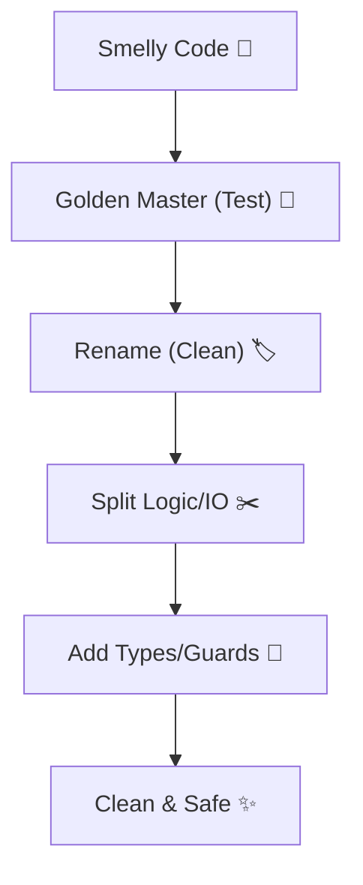
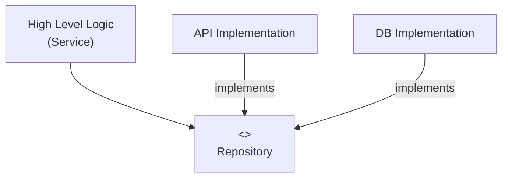

# 第39章：interfaceで差し替え可能に（DIPの超入口）🔌🧩

## ねらい🎯

* 「実装にベッタリ依存」してるコードを、**interface（約束）経由**にして差し替え可能にする✨
* テストで **DB/APIなし**でも動かせるようにする🧪🛟
* 「DIP（依存性逆転の原則）」を**超やさしく**体験する🌱

---

## 今日のキーワード🗝️

* **DIP**：上位（やりたいこと）が下位（道具の詳細）に直接依存しない🧠
* **interface**：必要な機能だけを表す「約束」📜
* **差し替え**：本番はAPI、テストは偽物（Fake/Mock）にする🔁
* **DI（依存性注入）**：差し替えを実現する具体テク（constructorで受け取るのが定番）📦

DIPの一言イメージはこれ👇
「やりたいこと（上位）は、道具のメーカー型番（実装）じゃなくて、**“機能の約束（interface）”**に話しかけよう」💬✨
（DIPの説明としてよくこう整理されます）([Strapi][1])

---

## まず困る例😵（実装に直結してると…）

* `new ApiUserRepository()` がクラスの中にある
* `fetch()` がロジックの中に出てくる
* テストしたいのに **ネットワークが必要** → 遅い・不安定・再現しにくい🌧️

---

## ビフォー：実装にベタ依存コード🧱💦

```ts
// ApiUserRepository.ts（低レイヤ：詳細）
export class ApiUserRepository {
  async getById(id: string) {
    const res = await fetch(`https://example.com/users/${id}`);
    if (!res.ok) return null;
    return (await res.json()) as { id: string; name: string };
  }
}

// UserService.ts（高レイヤ：やりたいこと）
import { ApiUserRepository } from "./ApiUserRepository";

export class UserService {
  private repo = new ApiUserRepository(); // ←ここが“直結”ポイント😵

  async getDisplayName(userId: string) {
    const user = await this.repo.getById(userId);
    return user ? user.name.trim() : "Unknown";
  }
}
```

この状態だと👇

* テストで `fetch` が飛ぶ（外部に引っ張られる）📡
* 後から `DB版` にしたいときも `UserService` を直すことになりがち🔧

---

## アフター：interfaceを挟んで差し替え可能に✨








### 1) 「必要なことだけ」をinterfaceにする📜

ポイント：**上位が欲しい機能**だけを書く（下位の都合は持ち込まない）🎈

```ts
// UserRepository.ts（約束）
export type User = { id: string; name: string };

export interface UserRepository {
  getById(id: string): Promise<User | null>;
}
```

### 2) 上位（UserService）はinterfaceだけを見る👀✨

```ts
// UserService.ts（高レイヤ：やりたいこと）
import type { UserRepository } from "./UserRepository";

export class UserService {
  constructor(private readonly repo: UserRepository) {} // ←DI（注入）📦✨

  async getDisplayName(userId: string) {
    const user = await this.repo.getById(userId);
    return user ? user.name.trim() : "Unknown";
  }
}
```

### 3) 下位（API版）はinterfaceを“実装”する🔧

```ts
// ApiUserRepository.ts（低レイヤ：詳細）
import type { User, UserRepository } from "./UserRepository";

export class ApiUserRepository implements UserRepository {
  constructor(private readonly baseUrl: string) {}

  async getById(id: string): Promise<User | null> {
    const res = await fetch(`${this.baseUrl}/users/${id}`);
    if (!res.ok) return null;
    return (await res.json()) as User;
  }
}
```

### 4) “組み立てる場所”で本番の実装を選ぶ🧩

この「組み立て場所」をよく **Composition Root**（合成の根っこ）って呼びます🌳✨

```ts
// main.ts（組み立て）
import { UserService } from "./UserService";
import { ApiUserRepository } from "./ApiUserRepository";

const repo = new ApiUserRepository("https://example.com");
const service = new UserService(repo);

console.log(await service.getDisplayName("123"));
```

---

## これで何が嬉しいの？🎁✨

* `UserService` は **API/DB/ファイル**などの詳細を知らない🙈
* 実装を差し替えても `UserService` はそのまま🧠✨
* テストでは **偽物Repo** を渡せばOK🛟

---

## テスト：Fake（偽物）でサクッと検証🧪🌸

### Fake実装（インメモリ）

```ts
import type { User, UserRepository } from "./UserRepository";

export class InMemoryUserRepository implements UserRepository {
  constructor(private readonly users: Map<string, User>) {}

  async getById(id: string): Promise<User | null> {
    return this.users.get(id) ?? null;
  }
}
```

### Vitestでテスト（外部なしで安定）✅

Vitestは `vi` でモック機能も提供しています([Vitest][2])（今回は分かりやすくFakeで！）

```ts
import { describe, it, expect } from "vitest";
import { UserService } from "./UserService";
import { InMemoryUserRepository } from "./InMemoryUserRepository";

describe("UserService", () => {
  it("ユーザーがいないときは Unknown", async () => {
    const repo = new InMemoryUserRepository(new Map());
    const service = new UserService(repo);

    await expect(service.getDisplayName("nope")).resolves.toBe("Unknown");
  });

  it("名前の前後空白を trim する", async () => {
    const repo = new InMemoryUserRepository(
      new Map([["1", { id: "1", name: "  Alice  " }]])
    );
    const service = new UserService(repo);

    await expect(service.getDisplayName("1")).resolves.toBe("Alice");
  });
});
```

---

## “interface合ってる？”を強めにチェックする小ワザ🧷✨（satisfies）

「オブジェクトでFakeを書きたい！」とき、`satisfies` が便利です🎀
（`satisfies` は “型を満たしてるか検査しつつ、値の型を潰しすぎない” 演算子です）([TypeScript][3])

```ts
import type { UserRepository } from "./UserRepository";

const fakeRepo = {
  async getById(id: string) {
    if (id === "1") return { id: "1", name: "Alice" };
    return null;
  },
} satisfies UserRepository;
```

これを `new UserService(fakeRepo)` って渡せます👌✨

---

## 手順まとめ（迷子防止）👣🧭

1. **直結してる依存**を見つける（`new`、`fetch`、`fs`、DB呼び出し）🔍
2. 上位が本当に必要な操作だけを **interface化**📜
3. 上位は **interface型**を受け取る（constructor注入）📦
4. 下位は `implements` して詳細を担当🔧
5. 組み立てる場所で「今日はどれを使う？」を決める🧩

---

## ミニ課題✍️💖（3つ）

### 課題1：Loggerを差し替えできるようにしてみよう🪵✨

* `ConsoleLogger` に直結してるコードを
* `Logger` interface にして
* テストでは `MemoryLogger`（配列に溜める）に差し替え📦🧪

### 課題2：Repositoryのメソッド粒度を見直そう🔧

* `getById` だけで足りる？
* `save` が必要？
* 「上位が欲しい操作」だけに絞れてる？🎯

### 課題3：差し替えの応用（Decorator）🎀

* `CachingUserRepository` を作って
* 中で本物Repoを呼びつつ、キャッシュしたら最強🧊✨
  （これもinterfaceがあるから簡単に挟める！）

---

## AI活用ポイント🤖✨（お願い方＋チェック観点✅）

### お願い方（例）💬

* 「このクラスが直接依存してる外部I/Oを列挙して、差し替えポイントを提案して」🔍
* 「この処理に必要な最小のinterfaceを提案して（メソッド名と戻り値も）」📜
* 「Fake実装とテストケース（正常/異常/境界）を作って」🧪

### チェック観点✅（AIの提案を採用する前に！）

* interfaceが **大きすぎない？**（“何でも屋”になってない？）🧯
* 上位が `Api...` や `Db...` を import してない？🙅‍♀️
* テストが **ネットワーク/DBなし**で動く？🛟
* “組み立て場所”に依存の選択が集まってる？🧩

---

## ちょい最新メモ📰✨（2026っぽい現場感）

* TypeScriptは 5.7/5.8/5.9 とリリースノートが続いていて、型チェックの改善がどんどん入っています([TypeScript][4])
* Node.js 側も LTS の世代が進むので、I/O周り（fetchやモジュール解決）を“詳細”として隔離しておくと移行がラクになりやすいです🔁([Node.js][5])

---

## この章のゴール🏁✨

`UserService` が **「UserRepositoryという約束」だけ**に依存して、
本番はAPI、テストはFakeに **スッと差し替え**できたら大成功〜！🎉🔌

[1]: https://strapi.io/blog/solid-design-principles-javascript-typescript-guide?utm_source=chatgpt.com "SOLID Design Principles Guide for JavaScript and TypeScript"
[2]: https://vitest.dev/guide/mocking?utm_source=chatgpt.com "Mocking | Guide"
[3]: https://www.typescriptlang.org/docs/handbook/release-notes/typescript-4-9.html?utm_source=chatgpt.com "Documentation - TypeScript 4.9"
[4]: https://www.typescriptlang.org/docs/handbook/release-notes/typescript-5-7.html?utm_source=chatgpt.com "Documentation - TypeScript 5.7"
[5]: https://nodejs.org/en/about/previous-releases?utm_source=chatgpt.com "Node.js Releases"
