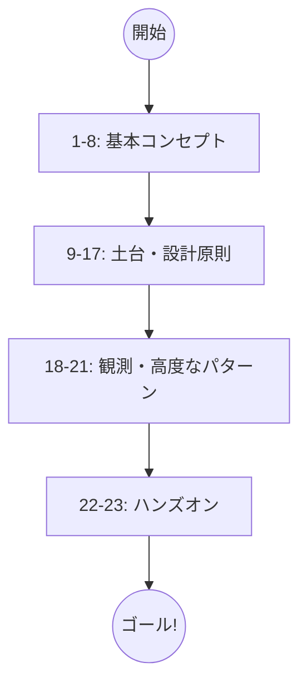

### Saga学習ロードマップ 🗺️🚀

---

## 第1章：Sagaって何のため？まず“困りごと”から入る🌱😵

* **ゴール**：Sagaが必要になる状況をイメージできる
* **内容**：分散処理＝失敗が普通／「全部まとめて成功」が難しい理由
* **ミニ演習**：ECの「注文→決済→在庫→配送」を紙に書く📝
* **AI活用**：似た事例を3つ出してもらう（旅行予約/ポイント付与/サブスク等）🤖✨

## 第2章：失敗パターン図鑑（何が壊れる？）💥📚

* **ゴール**：部分成功が生む事故を知る
* **内容**：二重課金／在庫だけ減る／配送だけ作られる…😱
* **ミニ演習**：事故を「ユーザー被害」「会社被害」「復旧難度」で分類📊
* **AI活用**：事故の優先順位（対応すべき順）を提案させる🤖

## 第3章：トランザクションの限界と“分割”の考え方🧱🔪

* **ゴール**：「DBのトランザクション」だけで守れない範囲を理解
* **内容**：同一DB内は強い／外部APIや別DBを跨ぐと難しい
* **ミニ演習**：どこまでを同一トランザクションにできるか線引きする✍️
* **AI活用**：境界候補（サービス/DB/外部）を整理させる🤖

## 第4章：Sagaの超ざっくり定義（進む＋戻す）🧩🔁

* **ゴール**：Saga＝「一連のステップ」＋「補償」のセットと理解
* **内容**：成功フロー／失敗時の補償フロー
* **ミニ演習**：各ステップに「逆操作（補償）」を1行で書く📝
* **AI活用**：補償案を複数出して比較（返金/無効化/クーポン等）🤖

## 第5章：Sagaの2方式を知る（Orchestration / Choreography）🧑‍✈️💃

* **ゴール**：2方式の違いを“会話できるレベル”で説明できる
* **内容**：司令塔方式 vs イベント自律方式（メリデメざっくり）
* **ミニ演習**：初心者はどっちが理解しやすい？理由つきで選ぶ🙂
* **AI活用**：メリデメ表を作らせる📋🤖

## 第6章：方式の選び方（初心者が迷わない判断軸）🧭✨

* **ゴール**：自分の案件で“まずどっち”を選べる
* **内容**：規模／チーム人数／運用力／変更頻度で判断
* **ミニ演習**：自分の想定アプリに当てはめて方式決定🧐
* **AI活用**：要件を投げて「おすすめ方式＋理由」を出させる🤖

## 第7章：用語と境界をそろえる（ミニDDD風の準備）📖🧼

* **ゴール**：「注文」「決済」など言葉のブレで迷子にならない
* **内容**：責務分離（SoC）／境界（モジュール/サービス）の置き方
* **ミニ演習**：用語集（ミニ辞書）を作る📚
* **AI活用**：紛らわしい言い回しを列挙して注意点化🤖

## 第8章：補償の基本（“逆操作”ではなく“帳尻合わせ”）🙅‍♀️🧾

* **ゴール**：補償＝“元に戻す”以外もあると理解
* **内容**：返金／取消／無効化／差額調整／代替措置
* **ミニ演習**：「在庫を戻す」以外の補償を3案考える💡
* **AI活用**：補償の候補を「ユーザー体験が良い順」に並べ替え🤖

---

# ここから“壊れないSaga”の土台ゾーン🛡️✨

## 第9章：冪等性の超入門（同じのが2回来る世界）🔁😇

* **ゴール**：「同じ要求が複数回」が普通だと受け入れる
* **内容**：リトライ／重複メッセージ／ネットワーク不安定
* **ミニ演習**：二重実行されると困る操作を洗い出す📝
* **AI活用**：冪等が必要な操作を例で増やしてもらう🤖

## 第10章：Sagaでの冪等性（冪等キーと二重補償防止）🔑🛡️

* **ゴール**：Saga特有の「二重補償」「二重遷移」を防げる
* **内容**：冪等キー設計／重複排除／“補償も冪等”にする
* **ミニ演習**：キーの候補（UUID/業務キー）を比較して選ぶ🔍
* **AI活用**：キー設計案のレビュー（衝突/漏れ/再試行時）を頼む🤖

## 第11章：状態機械（State Machine）入門（状態と遷移を見える化）⚙️🧠

* **ゴール**：Sagaを“状態の変化”として整理できる
* **内容**：状態（Pending/Completed/Compensating…）／遷移／ガード条件
* **ミニ演習**：状態遷移表を作る（紙でもOK）📋✍️
* **AI活用**：状態一覧と遷移候補を生成してもらう🤖

## 第12章：状態機械をC#に落とす（設計をコードにする）🧑‍💻✨

* **ゴール**：状態と遷移を“コードで事故らない形”にできる
* **内容**：状態の表現（enum/クラス）／遷移チェック／不正遷移の防止
* **ミニ演習**：「禁止遷移を例外 or Resultで返す」方針を決める🧯
* **AI活用**：状態遷移の判定ロジックを“読みやすく整形”させる🤖

## 第13章：メッセージの基礎（CommandとEventの違い）📨🎯

* **ゴール**：「お願い」と「事実」を混ぜない
* **内容**：Command＝依頼／Event＝起きた事実（過去形）
* **ミニ演習**：「OrderPaid」「ReserveInventory」などを分類クイズ🎲😊
* **AI活用**：命名案（英語/日本語）を提案してもらう🤖

## 第14章：メッセージの落とし穴（順序・重複・遅延）🕳️😵‍💫

* **ゴール**：現実のメッセージングで起きる“ズレ”を理解
* **内容**：順不同／遅延到着／重複／一部欠落（想定するだけで強い）
* **ミニ演習**：ズレが起きた時の対策（無視/保留/再要求）を決める🧠
* **AI活用**：想定事故と対策のチェックリストを作らせる🤖✅

## 第15章：エラー設計の基本（業務エラー vs インフラエラー）🚧📌

* **ゴール**：例外を“仕様”として扱う感覚を持つ
* **内容**：分類／責任／境界での変換（ドメインはドメインとして）
* **ミニ演習**：エラーを3分類して、返し方（UI/API）方針を決める📝
* **AI活用**：エラー一覧の棚卸し（漏れチェック）🤖

## 第16章：リトライ戦略（いつ再試行？いつ補償？いつ止める？）⏳🧯

* **ゴール**：自動復旧と補償の切り替え条件を作れる
* **内容**：リトライ回数／指数バックオフ感覚／致命的エラーは即補償
* **ミニ演習**：失敗ケースごとの方針表（Retry / Compensate / Halt）📋
* **AI活用**：方針表の矛盾（補償ループ等）をレビューさせる🤖

## 第17章：タイムアウトと人間の介入（運用に渡す設計）👩‍💼⏰

* **ゴール**：「永遠に待つ」をやめて運用可能にする
* **内容**：タイムアウト／手動承認／再実行ボタン／保留状態
* **ミニ演習**：「30分決済未完了ならキャンセル」などルール設計🕒✅
* **AI活用**：運用フロー（誰が何を見て判断？）を文章化させる🤖

---

# ここから“取りこぼさない”＆“追跡できる”ゾーン📦🔎

## 第18章：Outboxの考え方（DB更新と送信のズレ問題）📦😬

* **ゴール**：Outboxが解く“ズレ”の問題を説明できる
* **内容**：DB更新は成功したのにイベント送信が失敗…を防ぐ
* **ミニ演習**：Outboxに書くべき項目を列挙（Id/Type/Payload/Status…）🧾
* **AI活用**：Outbox項目の不足チェック🤖✅

## 第19章：Outbox実装（テーブル＋送信ワーカー＋重複対策）🔧💾

* **ゴール**：Outboxを“最低限の形”で実装できるイメージを持つ
* **内容**：送信ワーカー／送信済み管理／再送／重複送信への備え
* **ミニ演習**：Outboxの状態（New/Sent/Failed）を設計📋
* **AI活用**：実装手順を“タスク分解”させる（ToDoリスト化）🤖🗂️

## 第20章：観測の最低ライン（ログ＋CorrelationId）🧾🔗

* **ゴール**：Sagaの“いま何してる？”を追える
* **内容**：CorrelationId／重要イベントログ／失敗理由を残す
* **ミニ演習**：「必ず残すログ項目」チェックリスト作り✅
* **AI活用**：ログ文言を読みやすく整える（過不足チェック）🤖

## 第21章：観測の発展（メトリクス＆トレースの感覚）📈🧵

* **ゴール**：遅延・失敗率を数字で見て改善できる
* **内容**：回数／成功率／レイテンシ／ボトルネック把握
* **ミニ演習**：見たい指標トップ5を決める🏆
* **AI活用**：指標→原因仮説→打ち手のセットを出させる🤖

---

# ここからハンズオン（作って体で覚える）🧪💻✨

## 第22章：ハンズオン① ミニSagaを作る（OrchestrationでGO）🧑‍✈️🎮

* **ゴール**：ローカルで“進む→失敗→補償”を体験
* **内容（例）**：注文→決済（擬似）→在庫（擬似）→補償（返金/在庫戻し）
* **環境**：Windows＋Visual Studio（必要ならVS Codeでも開ける）💻
* **ミニ演習**：意図的に失敗させて補償が走るのを確認🔁✅
* **AI活用**：DTO/エンドポイント/クラス分割をAIにたたき台作らせる🤖

## 第23章：ハンズオン② 実戦化（重複・リトライ・Outbox・テストで仕上げ）🛡️🧪

* **ゴール**：現実の“ズレ”に耐える最低ラインを入れる
* **内容**：重複リクエスト／再試行／二重補償防止／Outbox統合／簡単な統合テスト
* **ミニ演習**：「同じ要求2回」「イベント順不同」「送信失敗→再送」を再現して耐える✅😆
* **AI活用**：テスト観点の洗い出し、シナリオ表の作成、レビュー支援🤖📋

---

## おまけ（運用しやすい進め方）😊🗺️

* **まず理解**：1〜8章（世界観）🌍
* **壊れない土台**：9〜17章（冪等・状態・エラー・運用）🛡️
* **取りこぼさない＆追える**：18〜21章（Outbox・観測）📦🔎
* **体で覚える**：22〜23章（ハンズオン）🎮✨

