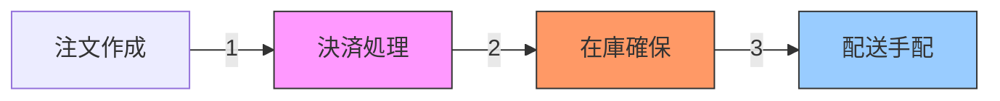
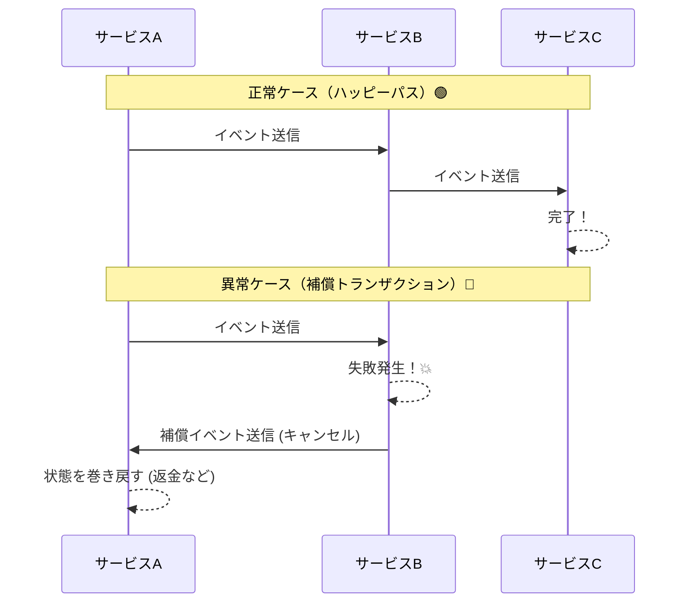

# 第01章：Sagaって何のため？まず“困りごと”から入る🌱😵


## 1. 今日のゴール🎯✨

この章を読み終わったら、こんな状態になってればOKです😊

* 「Sagaって、**何が困ってるときに必要なの？**」がイメージできる🌟
* 「分散処理って、**失敗が起きるのが普通**なんだ…」って腹落ちする😵‍💫
* 「全部まとめて1回のトランザクションで守る」が難しい理由が分かる🧱🚧

---

### ECの注文フローにおける「分散」の例 🛍️


でも現実は…途中でコケることが普通に起きる😇💥

---

## 3. 分散処理って、なんで失敗が普通なの？🌪️📡


単体アプリ＋単一DBなら、DBトランザクションで「全部成功 or 全部ロールバック」がやりやすいです🧘‍♀️✨

でも、サービスが分かれてる（＝分散してる）と、世界が変わる😵

### 3.1 サービスごとにDBが別だと、ACIDを“またげない”🧱

マイクロサービス系では「**サービスごとに専用DB**」がよくあります。すると、単一DBのようにACIDをそのまま適用するのが難しくなります。([Microsoft Learn][1])

### 3.2 通信には“気まぐれ”がある📞💫

* ネットワークが一瞬切れる📡💥
* 相手サービスが一時的に落ちる🛑
* タイムアウトする⏰
* でも相手は処理を終えてた（最悪パターン）😱
* リトライしたら二重実行になった🔁💥

つまり、**「失敗しない前提」で組むと事故る**ってことです😵‍💫

---

## 4. “部分成功”って何がヤバいの？😱📚


途中まで成功して、途中で失敗する＝**部分成功**。

EC例だと、こんな事故が起きます👇

* 決済だけ成功して、注文が失敗 → **お金だけ取られる**💸😱
* 在庫だけ減って、決済が失敗 → **在庫消失**📦💨
* 配送だけ作られて、注文がない → **謎の荷物**🚚❓

このへんが「Sagaが必要になる入り口」です🌱
（次章で事故図鑑をたっぷりやるよ📚💥）

---

## 5. 「じゃあ全部まとめてトランザクションにすれば？」が難しい理由🧩🚧


よくある素朴な発想👇
「注文→決済→在庫→配送を、**1つの巨大トランザクション**にできないの？」

でも、分散システムではそれが難しいことが多いです。

* DBが別々だと、単純なACIDトランザクションでまとめられない([Microsoft Learn][1])
* 2フェーズコミット（2PC）みたいな方式もあるけど、**DB-per-service**のような形だと現実的に使えない/選べないことがある([AWS ドキュメント][2])

だから「別のやり方で、整合性を保とうね」ってなるのがSagaです🌿

---

### Sagaの基本的な仕組み 🔁




Microsoftの説明でも、Sagaは「複数サービスにまたがる取引を調整し、失敗時は補償で巻き戻す」考え方、とされています。([Microsoft Learn][1])

> ポイント🍀：Sagaは「ぜんぶ一瞬で元通り」じゃなくて、**ビジネス的に整合する状態に戻す**感じになりやすいよ🧾


> （“元に戻す以外”は後の章でしっかり✨）

---

## 7. ミニ演習：ECの流れを“紙に書く”📝😊

紙でもメモ帳でもOK！3分でやってみよ〜✍️✨

### 手順🎬

1. 横に4つ箱を書く

   * 注文📝 → 決済💳 → 在庫📦 → 配送🚚
2. 各箱の下に「失敗したら何が残る？」を書く😵‍💫
3. さらにその下に「残ったものをどう帳尻合わせする？」を書く🧾✨

   * 例：決済が成功してたら返金…など💸

### できあがりイメージ（例）📌

* 決済まで成功 → 在庫で失敗

  * 残る：決済OK💳
  * 帳尻：返金💸（または与信取消など）

この演習をやると、「部分成功が怖い理由」が一気に見えるようになります👀✨

---

## 8. “雰囲気だけ”体験ミニコード（ConsoleでOK）🎮💻


ここではSagaの実装じゃなく、**「途中失敗→補償が必要」**を体感する用です😊
（本格実装は後半のハンズオンでやるよ🛠️✨）

```csharp
using System;

public static class Program
{
    public static void Main()
    {
        Console.WriteLine("=== ECの注文フロー（超ミニ） ===");

        var paymentSucceeded = false;
        var inventoryReserved = false;

        try
        {
            CreateOrder();

            paymentSucceeded = Pay();
            if (!paymentSucceeded) throw new Exception("決済失敗");

            inventoryReserved = ReserveInventory();
            if (!inventoryReserved) throw new Exception("在庫確保失敗");

            CreateShipment();

            Console.WriteLine("🎉 全部成功！注文完了！");
        }
        catch (Exception ex)
        {
            Console.WriteLine($"💥 途中で失敗: {ex.Message}");

            // ここが「補償（帳尻合わせ）」のイメージ
            if (inventoryReserved)
            {
                ReleaseInventory();
            }
            if (paymentSucceeded)
            {
                Refund();
            }

            CancelOrder();
            Console.WriteLine("🧾 補償が走って、整合する状態に戻した（つもり）");
        }
    }

    static void CreateOrder() => Console.WriteLine("📝 注文作成");
    static bool Pay()
    {
        Console.WriteLine("💳 決済");
        return true; // わざと成功に固定
    }
    static bool ReserveInventory()
    {
        Console.WriteLine("📦 在庫確保");
        return Random.Shared.Next(0, 2) == 0; // 50%で失敗
    }
    static void CreateShipment() => Console.WriteLine("🚚 配送作成");

    static void Refund() => Console.WriteLine("💸 返金（補償）");
    static void ReleaseInventory() => Console.WriteLine("📦 在庫戻し（補償）");
    static void CancelOrder() => Console.WriteLine("🗑️ 注文キャンセル（補償）");
}
```

👀 観察ポイント

* 途中で「在庫確保失敗」が起きたとき、**決済はもう成功してる**💳
* だから補償（返金など）が必要になる💸
* こういう「途中まで進んだ現実」を扱うのがSagaの世界🌍✨

---

## 9. AI活用：似た事例を3つ出してもらう🤖✨

「Sagaが必要な状況」を増やすと理解が爆速になります🚀

### そのまま投げてOKプロンプト例🪄

* 「EC以外で、注文→複数ステップ→途中失敗がありえる例を3つ出して。各ステップも書いて！」
* 「途中で失敗したときに起きる“部分成功の事故”を10個出して。ユーザー被害と会社被害も分けて！」
* 「“補償”のアイデアを、ユーザー体験が良い順に並べて提案して！」

👉 返ってきた答えは、次章（失敗パターン図鑑💥📚）で使えるネタになります😊

---

## 10. 理解チェック（超かんたん）✅😊

Q1：分散処理だと、なぜ「全部まとめて成功」が難しくなる？🤔
A：サービスやDBが分かれていて、単一DBのACIDトランザクションのノリで守れないから。さらに通信・タイムアウト・リトライで失敗が普通に起きるから。([Microsoft Learn][1])

Q2：Sagaの基本アイデアは？🌿
A：「ローカルトランザクションの列＋失敗時の補償」。各ステップは自分のDB内で完了し、次へはメッセージ/イベントでつなぎ、失敗したら補償で帳尻合わせする。([Microsoft Learn][1])

---

## 11. まとめ🧁✨

* 分散処理は「失敗するのが普通」😇
* 一番こわいのは「部分成功」😱
* だからSagaは「進む＋戻す（補償）」で整合性を守る🧩🔁([Microsoft Learn][1])
* 2PCが選べない/難しい状況での有力な考え方として整理されているよ📌([AWS ドキュメント][2])

---

## 参考メモ（仕様の新しさチェック用）🗓️✨

この教材で扱うC#/.NETの前提として、2026年1月時点では **.NET 10（LTS）** が最新のメジャーで、2026-01-13に10.0.2が出ています。([dotnet.microsoft.com][3])

[1]: https://learn.microsoft.com/en-us/azure/architecture/patterns/saga "Saga Design Pattern - Azure Architecture Center | Microsoft Learn"
[2]: https://docs.aws.amazon.com/prescriptive-guidance/latest/cloud-design-patterns/saga-choreography.html "Saga choreography pattern - AWS Prescriptive Guidance"
[3]: https://dotnet.microsoft.com/en-us/platform/support/policy/dotnet-core ".NET and .NET Core official support policy | .NET"
