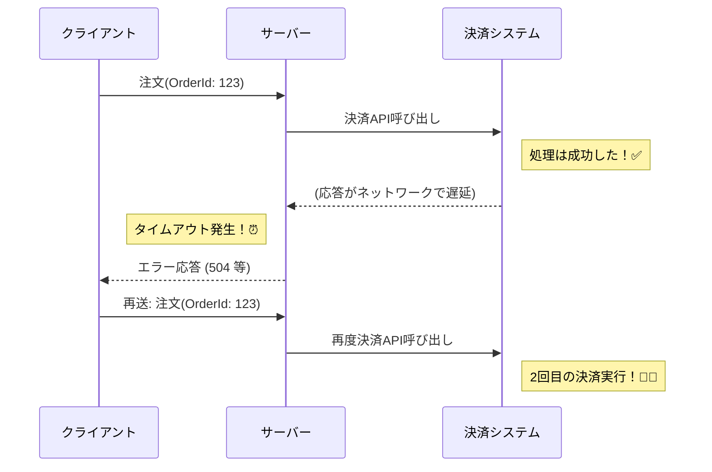

# 第02章：失敗パターン図鑑（何が壊れる？）💥📚


## ねらい🎯✨

* 「部分成功」が生む事故を、具体例でイメージできるようになる😊
* 事故を **「ユーザー被害」「会社被害」「復旧難度」** で分類して、優先順位がつけられるようになる📊
* 「なんで起きるの？」の“だいたいの原因”が言えるようになる🕵️‍♀️🔍

---

# まず最初に：分散あるある3点セット😇🧨

## ① “少なくとも1回”が普通で、重複が来ることがある🔁📨

イベントやメッセージの世界は、届け漏れを避けるために **重複受信** が起きやすいんだよ〜💦 ([Microsoft Learn][1])

## ② “順番どおり”は期待しないほうが安全🌀⏱️

メッセージは **到着順が保証されない** ことがあるよ（作られた順＝受け取る順、とは限らない）😵‍💫 ([Microsoft Learn][2])

## ③ 「DB更新」できたのに「通知（イベント送信）」が落ちる…は起きる📦😬

“保存”と“送信”が別々に成功/失敗するズレが、事故の温床になりがち😱（だから後で Outbox みたいな話が出るよ） ([Microsoft Learn][3])

---

### 理想と現実のギャップ 🛒
```mermaid
graph TD
    subgraph Ideal [理想: 1つの塊 (Atomic)]
        T[トランザクション] --> S[全部成功]
        T --> F[全部失敗]
    end
    subgraph Reality [現実: バラバラ (Distributed)]
        O[注文] -.-> P[決済]
        P -.-> St[在庫]
        St -.-> Sh[配送]
        style P fill:#f9f,stroke-dasharray: 5 5
        style St fill:#f96,stroke-dasharray: 5 5
        style Sh fill:#9cf,stroke-dasharray: 5 5
    end
    Reality -- "どこかでエラー" --> Part[部分成功 / 整合性崩壊 💥]
```
 ---

# 失敗パターン図鑑🧾✨（事故カード形式で覚えよう）

> 見方：
> **事故名** → **どうなる？** → **よくある原因** → **被害** → **現場の応急処置**🧯

---

## 1) 二重課金💸💸😱

**どうなる？**
同じ注文で決済が2回通ってしまう…！

**よくある原因**

* ユーザーが「戻る→再送」した
* タイムアウトして「失敗したと思って再試行」した（でも実は成功してた）⏱️
* 同じメッセージが重複で来た🔁 ([Microsoft Learn][1])

**被害**

* ユーザー：お金が余計に引かれる😡
* 会社：返金対応・CS炎上・信用ダメージ🔥

**応急処置**

* 返金を最優先で案内＆自動化の検討（あとで“補償”で扱うよ）🧾

---

## 2) 決済だけ成功（注文が無い）👻💳

**どうなる？**
カードは引かれたのに、注文履歴に出てこない…😨

**よくある原因**

* 決済成功後に、注文保存が落ちた
* 注文保存はできたけど、フロントへの返答が落ちてユーザーが再送した（状態がぐちゃぐちゃ）😵‍💫

**被害**

* ユーザー：不安MAX😢
* 会社：返金/調査コスト増、信用低下

**応急処置**

* 「決済ID」で追跡できる導線を用意（問い合わせ窓口の型も大事）📞🧾

---

## 3) 在庫だけ減る📦⬇️😭

**どうなる？**
注文失敗なのに在庫が引かれて、売れなくなる…！

**よくある原因**

* 在庫確保のあとで決済が失敗
* 補償（在庫戻し）が失敗 or 未実行
* メッセージ順番が前後して処理がズレた🌀 ([Microsoft Learn][2])

**被害**

* ユーザー：買えない・欠品が増える😢
* 会社：機会損失、在庫整合の修正地獄🧹

**応急処置**

* 在庫の「確保（予約）」と「確定（引当）」を分ける発想が助けになることが多い💡

---

## 4) 配送だけ作られる🚚📦😱

**どうなる？**
お金払ってないのに配送が走る、またはキャンセルなのに発送される…！

**よくある原因**

* 配送作成が先に行われた（順序のズレ）🌀
* 決済失敗後の「配送キャンセル（補償）」が失敗
* 外部配送APIが「成功したのにタイムアウト」した⏱️

**被害**

* ユーザー：混乱（届いたけど請求は？）
* 会社：送料・商品ロス、返品対応コスト爆増💥

**応急処置**

* “出荷確定”の前に、状態チェック（あとで状態機械で扱うよ）✅

---

## 5) タイムアウトしたけど成功してた⏱️✅（地味に最凶）

**どうなる？**
「失敗した！」と思って再試行したら、実は最初の処理は成功してて…二重実行へ💀

**よくある原因**

* ネットワーク遅延
* 外部APIが遅い
* 呼び出し元のタイムアウト設定が短すぎる

**被害**

* 二重課金 / 二重予約 / 二重配送…色々の根っこ😱

**応急処置**

* “結果照会”できる仕組み（注文状態の照会、決済照会）を用意すると強い📌

---

## 6) 途中で止まって「迷子の取引」になる🧟‍♀️🧾

**どうなる？**
決済済み？在庫確保済み？配送は？…誰にも分からない😵‍💫

**よくある原因**

* 状態を記録していない
* ログが薄い
* 関連ID（相関ID）が無くて追跡できない🔍

**被害**

* ユーザー：いつまで待てばいいの？😢
* 会社：調査が人力、復旧が遅い

**応急処置**

* とにかく「今どの状態？」を1つの場所で見える化（あとで観測の章でやるよ）🧾✨

---

## 7) 補償が失敗して“戻しきれない”🙅‍♀️🧾

**どうなる？**
失敗したので戻そうとしたけど、戻す処理がまた失敗…終わらない😱

**よくある原因**

* 補償が外部API依存（混雑や障害で失敗）
* 補償が「元に戻す」以外の選択肢を持ってない
* 補償のリトライで副作用が出る（戻しが二重に走る）🔁

**被害**

* ユーザー：返金されない、状態が変😢
* 会社：事故が長期化、運用地獄

**応急処置**

* 補償にも“安全に再試行できる設計”が必要（冪等の章につながるよ）🔁🛡️

---

## 8) 「保存は成功」なのに「イベント通知が飛ばない」📦✉️❌

**どうなる？**
注文は作られたのに、次のサービスが動かない（在庫が確保されない等）😨

**よくある原因**

* DB更新とイベント送信が別タイミングで、送信だけ落ちた📉
  （このズレを減らす代表例が Transactional Outbox） ([Microsoft Learn][3])

**被害**

* ユーザー：注文が進まない
* 会社：リカバリが難しい（どこから再開？）

**応急処置**

* 「未送信イベント」を再送できる仕組みがあると救われる🙏

---

# ミニ演習①：事故を3つの軸で分類しよう📊✨

## 分類の3軸（1〜5点でOK）📝

* **ユーザー被害**：お金・時間・不安・迷惑の大きさ😢
* **会社被害**：損失・工数・炎上・法務/監査リスク🔥
* **復旧難度**：直せる？追える？自動化できる？🧯

### 点数のつけ方（超ざっくりでOK）😊

* 1点：軽い（すぐ直る/影響小）
* 3点：まあ痛い（対応必要）
* 5点：致命的（信用やお金に直撃）💀

---

## ワーク用の表（書いて埋めよう）✍️📋

| 事故         | ユーザー被害 | 会社被害 | 復旧難度 | メモ（なにが起きた？） |
| ---------- | -----: | ---: | ---: | ----------- |
| 二重課金💸💸   |        |      |      |             |
| 在庫だけ減る📦⬇️ |        |      |      |             |
| 配送だけ作られる🚚 |        |      |      |             |
| 迷子の取引🧟‍♀️ |        |      |      |             |

---

## 優先度の出し方（簡単版）🏁

おすすめはこれ👇（ユーザー被害を重めに見る）

* **優先度 = ユーザー被害×2 + 会社被害 + 復旧難度** 🧮✨

例：二重課金（5,5,3）なら → 5×2+5+3=18点🔥（最優先！）

---

# ミニ演習②：対応すべき順を決めよう👑✨

## 優先されがちな“事故トップ3”の傾向📌

1. **お金がズレる（課金/返金/請求）** 💸
2. **勝手に現物が動く（配送/出荷/権限付与）** 🚚🎫
3. **状態が追えない（迷子）** 🧟‍♀️🔍

理由：ユーザー体験と信用が一撃で崩れやすいから😢

---

# C#ミニ観察：なぜ二重実行が起きるの？👀🔁

下の例は「タイムアウト→再送」で二重課金しやすい流れの雰囲気（超ミニ）だよ💡
※わざと雑にしてるよ（“危険な形”の見本）⚠️

```csharp
// 危険な例：シンプルだけど、再送や重複で事故りやすい😱
app.MapPost("/checkout", async (CheckoutRequest req) =>
{
    // ①決済
    var paymentId = await PayAsync(req.OrderId, req.Amount); // タイムアウトしても、向こうは成功してるかも…⏱️✅

    // ②在庫確保
    await ReserveInventoryAsync(req.OrderId);

    // ③配送作成
    await CreateShipmentAsync(req.OrderId);

    return Results.Ok(new { req.OrderId, paymentId });
});
```

### タイムアウトによる二重実行の仕組み ⏱️🔁


この「重複が来る」「順番がズレる」前提があるから、後の章で

* 冪等（同じのが来ても一回分にする）🔁🛡️
* 状態管理（今どこ？）⚙️
* Outbox（保存と送信のズレを潰す）📦
  に進んでいくよ😊

---

# AI活用🤖✨：事故の優先順位を“相談”してみよう

## そのままコピペでOK📋💖

### ① 事故の洗い出し（追加の事故も出してもらう）🧠

* 「注文→決済→在庫→配送で起きる“部分成功の事故”を10個、短い説明つきで出して」

### ② 事故を3軸で採点（あなたの表をレビュー）✅

* 「次の事故一覧を、ユーザー被害/会社被害/復旧難度(1〜5)で採点して。理由も1行で：…（あなたの事故リスト）」

### ③ “最初に守るべきもの”を決める👑

* 「この事故一覧を、最初に対策すべき順に並べて。『なぜその順？』を初心者にも分かる言葉で説明して」

---

# まとめ🧁✨

* 分散の世界は **重複🔁・順不同🌀・ズレ📦** が起きやすい
* 事故は「お金💸」「現物🚚」「追えない🧟‍♀️」が特にヤバい
* まずは事故を **分類→点数化→優先順位** できるようになれば強い📊💪

---

## 参考（考え方の裏取り）📚🔗

* Saga と補償の基本的な考え方（分散で失敗したら補償で整合を取る） ([Microsoft Learn][4])
* 重複受信（at-least-once）や順不同が起きる前提 ([Microsoft Learn][1])
* 保存と送信のズレ対策としての Transactional Outbox ([Microsoft Learn][3])

[1]: https://learn.microsoft.com/en-us/azure/architecture/serverless/event-hubs-functions/resilient-design?utm_source=chatgpt.com "Resilient design guidance for Event Hubs and Functions"
[2]: https://learn.microsoft.com/en-us/azure/architecture/patterns/competing-consumers?utm_source=chatgpt.com "Competing Consumers pattern - Azure Architecture Center"
[3]: https://learn.microsoft.com/en-us/azure/architecture/databases/guide/transactional-outbox-cosmos?utm_source=chatgpt.com "Transactional Outbox pattern with Azure Cosmos DB"
[4]: https://learn.microsoft.com/en-us/azure/architecture/patterns/saga?utm_source=chatgpt.com "Saga Design Pattern - Azure Architecture Center"
