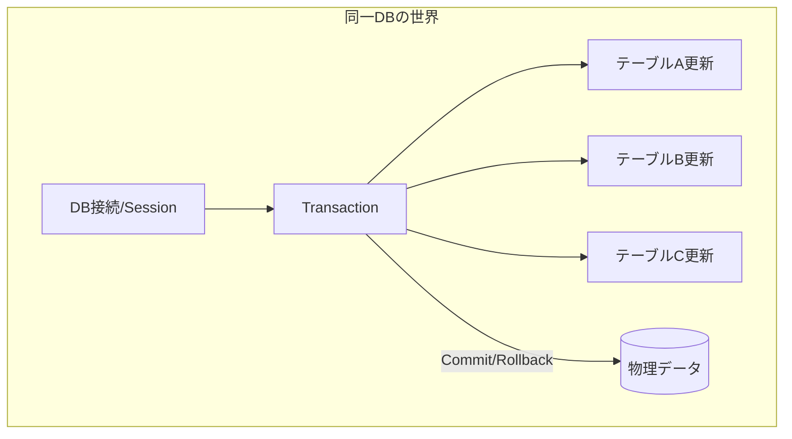
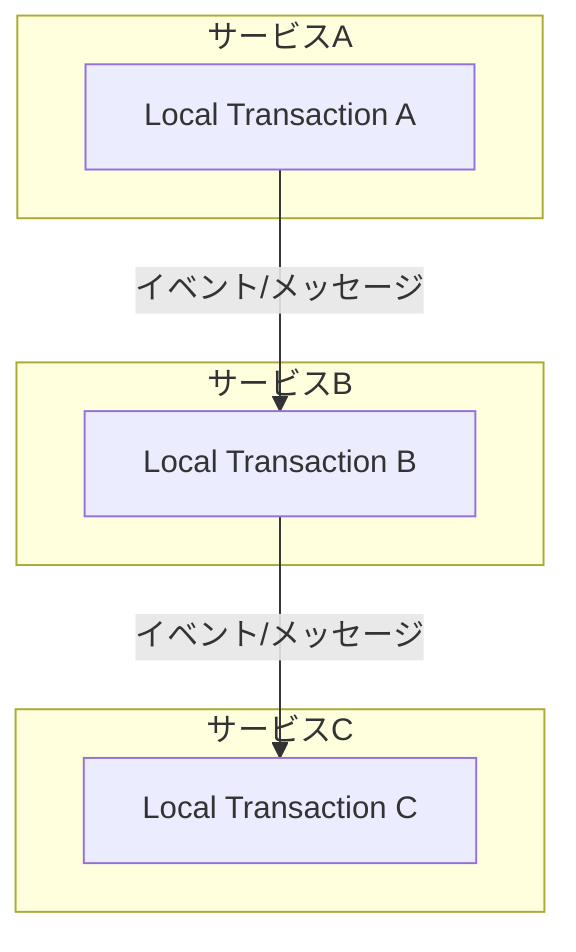

# 第03章：トランザクションの限界と“分割”の考え方🧱🔪


## この章のゴール🎯✨

* 「DBのトランザクションが強い範囲」と「守れない範囲」を分けて説明できる🙂
* “跨いだ瞬間に事故りやすいポイント”を見つけて、線引きできる🧠✍️
* Sagaの前提になる「小さく区切って前に進む」発想をつかむ🚶‍♀️➡️

---

# 3-1. まずDBトランザクションって何が嬉しいの？💾🛡️

DBのトランザクションは、ざっくり言うと…

* ✅ 全部成功したら **コミット**（保存して確定）
* ❌ どこかで失敗したら **ロールバック**（最初から無かったことにする）

っていう「全部 or 0」の魔法🪄✨

たとえば「注文を作る」時に

1. 注文テーブルにINSERT
2. 注文明細テーブルにINSERT
3. 在庫引当テーブルにINSERT
   この3つを **1セットで確定**したいよね😊

ここでトランザクションを使うと、途中でコケても“中途半端なゴミ”が残りにくい🧹✨

---

# 3-2. DBトランザクションが“めちゃ強い”範囲💪🔥


### DBトランザクションが責任を持つ範囲 🛡️

 ---

# 3-3. でも…“外”に出た瞬間、急に弱くなる😵‍💫🌪️


DBの外（別DB、外部API、別サービス、メール送信、決済、配送…）に出ると、DBはこう言います👇

> 「それ、私の管轄外です🙅‍♀️」

## 典型例：注文→決済→在庫→配送🛒💳📦🚚

* 注文DBに保存✅（トランザクションOK）
* 決済サービスにHTTPで課金要求📡
* 在庫サービスに引当要求📡
* 配送サービスに伝票作成📡

ここで問題になるのがこれ👇😱

* DBロールバックしても、**課金は戻らない**（勝手に元に戻らない）💳💥
* 在庫引当が成功したあとに別のところが失敗すると、**在庫だけ減ったまま**📦😵
* 配送だけ作られてしまうと、**謎の荷物が生まれる**📮👻

つまり…

## ✅ DBトランザクションで戻せるのは「DBの中の変更」だけ


## ❌ 外部に起きた副作用（課金・発送・通知）は戻せないことが多い

---

# 3-4. 「じゃあ全部まとめてトランザクションにすれば良くない？」の罠🕳️😇

ここで一度は思うやつ👇

> 「決済も在庫も配送も、全部まとめてトランザクションで守れば勝ちでは？😎」

理屈としては「分散トランザクション（2PC）」という考えがあって、複数のリソースをまとめて“全部 or 0”にしようとします🧩🔗
ADO.NET / System.Transactions には `TransactionScope` があり、条件が揃うと“分散”に昇格（プロモーション）することがあります📌✨ ([Microsoft Learn][1])

でも現実には、ここがキツい…😭

## 分散トランザクションがつらい理由😵‍💫


* 🧷 参加できるリソースが限られる（HTTP APIは基本ムリ）
* 🧨 構成・運用が重い（環境依存・権限・ネットワーク設定が絡みやすい）
* 🐢 遅くなりやすい（全員の合意を待つので）
* 🧱 サービス同士が“強く結合”してしまう（変更に弱くなる）

なので、いまどきの分散システムでは **「跨がない設計」に寄せる**のが主流になりやすいです🙂✨
（跨ぐなら“補償”＝Sagaが必要になる、って流れだね🔁）

---

# 3-5. じゃあどうする？答えは「分割」🧱🔪✨

ここで今日のテーマ！

## 発想の切り替え🔄

### トランザクションを分割してつなぐ 🔪➡️




## ✅ 1サービス（1DB）ごとに “ローカルトランザクション” で確定する

## ✅ サービス間は「メッセージ」や「状態」でつなぐ

## ✅ 失敗したら“補償”（後で帳尻合わせ）をする

これがSagaの出番になる理由だよ🧩🔁💡

---

# 3-6. “線引き”のコツ：どこで区切る？🧭✍️

ミニルールを置くと迷いにくいよ😊

## ルール①：DBの中で完結するものは、トランザクションで守る🛡️


* 注文作成（注文＋明細＋初期状態）✅
* 支払い状態の更新✅
* Outboxにイベントを書く✅（※あとで出るやつ📦）

## ルール②：ネットワークを跨ぐものは「別世界」扱い📡🌍

* 決済API呼び出し
* 在庫サービス
* 配送サービス
* メール送信
  → ここは **失敗も遅延も重複も起きる前提**で設計する😇

## ルール③：長時間トランザクションは避ける⏳🙅‍♀️


外部待ち（決済の応答待ち等）をトランザクションで抱えると、ロックが長引いて詰まりがち😵‍💫🔒

---

# 3-7. ミニ演習①：DB内トランザクションの強さを体感💪🧪

## やること🎮

「注文作成中に例外を投げたら、DBに何も残らない」を確認するよ🙂

### サンプル（イメージ）🧩

```csharp
using System.Transactions;

public void CreateOrderAllOrNothing()
{
    using var scope = new TransactionScope(
        TransactionScopeOption.Required,
        new TransactionOptions { IsolationLevel = IsolationLevel.ReadCommitted },
        TransactionScopeAsyncFlowOption.Enabled);

    // ① 注文INSERT
    InsertOrder();

    // ② 明細INSERT
    InsertOrderItems();

    // ③ わざと失敗💥
    throw new Exception("途中で落ちた！");

    // scope.Complete(); ←ここに到達しないのでロールバックされる
}
```

`TransactionScope` は `Complete()` に到達しないとコミットされず、例外などで抜けるとロールバックされます🧯✨ ([Microsoft Learn][1])
`async/await` を混ぜるなら `TransactionScopeAsyncFlowOption.Enabled` が大事だよ🧵✨ ([Microsoft Learn][2])

✅ 観察ポイント👀

* 例外で落ちた後、注文も明細も「0件」になってる？
* “中途半端”が残ってない？🧹✨

---

# 3-8. ミニ演習②：DBの外に出た瞬間の“戻せなさ”を体感😱🧪

次は「DB保存→外部っぽい処理→失敗」をやるよ📡💥

```csharp
public void CreateOrderThenCallPayment()
{
    // ① DB保存（ここは守れる）
    SaveOrderToDb(); // ここでコミットされたとする✅

    // ② 外部決済っぽい処理（戻せない代表）
    CallPaymentApi(); // 成功したと仮定💳✨

    // ③ そのあとで落ちる💥
    throw new Exception("配送サービスが落ちた！");
}
```

✅ 何が起きる？😵‍💫

* 注文はDBに残る
* 決済は成功してる（想定）
* でも配送は作れてない

こういう“ねじれ”がSagaの世界で起きる事故だよ😱🌀

---

# 3-9. AI活用：境界（線引き）候補を一緒に整理🤖🧠

“境界決め”は最初ほんと難しいから、AIにたたき台を出させるのが超おすすめ😊✨

## そのまま投げてOKなプロンプト例📝💬

* 「ECの『注文・決済・在庫・配送』を、サービス境界（分け方）案を3パターン出して。各案のメリデメも。」
* 「この処理フローで、DBトランザクションで守れる部分と、守れない部分を色分けして説明して。」
* 「失敗しやすいポイントを列挙して、Sagaで補償が必要な箇所に印をつけて。」
* 「“絶対に同時に確定したいもの”と、“後で帳尻合わせでもよいもの”を分類して。」

AIの答えは **採点じゃなくて下書き**として使うと最高だよ✏️😊
（最後は人間が“運用できる形”に整える👩‍💻✨）

---

# 3-10. まとめ🧁✨

* DBトランザクションは **同じDB内**ではめちゃ強い💪💾
* でも外部APIや別サービスに出ると、**戻せない副作用**が出てくる😵‍💫📡
* だから「跨がない」ように **分割**して、失敗時は **補償（Saga）**で帳尻合わせする🔁🧩
* この“線引き”ができると、Sagaの理解が一気にラクになるよ😊🌸

---

# ちょい確認クイズ🎓✅

1. DBトランザクションで確実に戻せるのはどこ？（DB内 / 外部API / メール送信）📩
2. 「注文DB保存→決済成功→在庫失敗」になったら、DBロールバックだけで解決できる？🤔
3. “跨がない設計”にすると嬉しいことを2つ言ってみよ🙂✨

---

[1]: https://learn.microsoft.com/en-us/dotnet/api/system.transactions.transactionscope?view=net-10.0&utm_source=chatgpt.com "TransactionScope Class (System.Transactions)"
[2]: https://learn.microsoft.com/en-us/dotnet/api/system.transactions.transactionscopeasyncflowoption?view=net-10.0&utm_source=chatgpt.com "TransactionScopeAsyncFlowOpti..."
